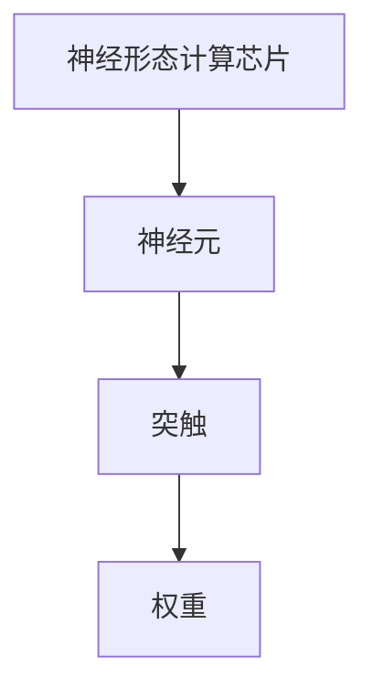
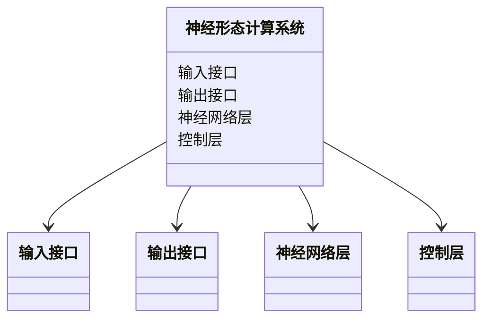
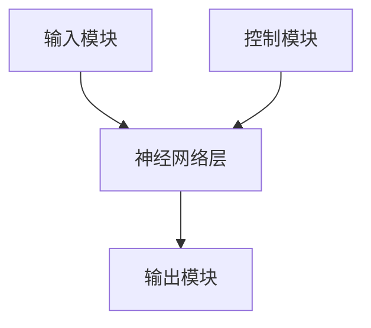

                 


# 如何识别企业的神经形态计算芯片优势

**关键词：** 神经形态计算芯片, 企业优势识别, 神经网络, 脉冲算法, 芯片架构设计, 事件驱动计算

**摘要：**  
神经形态计算芯片是一种结合了神经科学和计算机技术的新型芯片，能够在企业中提供高效的计算能力和更低的能耗。本文从背景介绍、核心概念、算法原理、系统架构、项目实战和最佳实践等多个方面，详细分析神经形态计算芯片的优势，并通过实例和图表帮助读者理解其技术特点和应用场景。文章最后总结了企业在选择和应用神经形态计算芯片时的关键点和未来发展趋势。

---

# 第一部分：神经形态计算芯片的背景与核心概念

## 第1章：神经形态计算芯片的背景介绍

### 1.1 神经形态计算芯片的起源与发展
#### 1.1.1 神经形态计算的定义与概念
神经形态计算（Neuromorphic Computing）是一种模拟人脑神经网络的计算范式，旨在通过生物神经元和突触的模拟实现高效的并行计算。与传统计算不同，神经形态计算强调事件驱动（Event-driven）和能量效率，适用于实时感知、模式识别和自主学习等任务。

#### 1.1.2 神经形态计算的历史发展与现状
神经形态计算的概念最早可以追溯到20世纪80年代，卡内基·梅隆大学的John Hopfield提出的Hopfield网络模型是其早期重要里程碑。近年来，随着深度学习和AI技术的快速发展，神经形态计算芯片逐渐从学术研究走向实际应用，代表性的芯片包括Intel的Loihi和IBM的TrueNorth。

#### 1.1.3 神经形态计算在企业中的应用背景
企业在AI、边缘计算和物联网等领域面临性能瓶颈和能耗挑战，神经形态计算芯片以其高效的并行计算能力和低功耗特点，成为解决这些问题的重要技术手段。

### 1.2 神经形态计算芯片的基本概念
#### 1.2.1 神经形态计算的核心概念与特点
- **生物神经元模型：** 神经形态芯片中的计算单元模拟生物神经元，能够通过脉冲（Spike）传递信息。
- **事件驱动机制：** 仅在信息变化时触发计算，减少无效计算，降低能耗。
- **并行计算能力：** 神经形态芯片通过大规模并行处理，显著提高计算效率。

#### 1.2.2 神经形态计算与传统计算的对比
| 特性                | 神经形态计算芯片          | 传统计算芯片          |
|---------------------|--------------------------|-----------------------|
| 数据处理方式        | 事件驱动，稀疏计算        | 批处理，密集计算        |
| 能耗                | 低功耗                   | 高功耗                |
| 并行能力            | 强大                    | 较弱                  |
| 适用场景            | 实时感知、边缘计算        | 离线计算、通用任务      |

#### 1.2.3 神经形态计算芯片的分类与应用场景
- **基于脉冲的神经网络芯片：** 适用于实时事件处理和边缘计算。
- **类脑计算芯片：** 适用于复杂模式识别和自主学习任务。

---

## 第2章：神经形态计算芯片的核心概念与联系

### 2.1 神经形态计算芯片的原理
#### 2.1.1 生物神经元模型与模拟
神经形态芯片中的神经元模型通常基于生物神经元的电活动，如以下微分方程：
$$ \frac{dV}{dt} = \frac{-I + RV}{\tau} + \frac{I}{\tau} $$
其中，$V$ 表示膜电位，$I$ 表示电流，$R$ 表示电阻，$\tau$ 表示时间常数。

#### 2.1.2 神经形态计算的事件驱动机制
事件驱动机制通过检测输入信号的变化来触发计算，减少无效计算，提升效率。

#### 2.1.3 神经形态计算的并行处理能力
神经形态芯片通过大规模并行处理，显著提高计算效率。

### 2.2 核心概念对比分析
#### 2.2.1 传统芯片与神经形态芯片的对比分析
神经形态芯片在实时性和能耗方面具有显著优势，但在通用计算能力上略逊于传统芯片。

#### 2.2.2 神经形态计算芯片的性能优势
神经形态芯片在实时事件处理和边缘计算中表现出色，能够显著降低能耗和延迟。

#### 2.2.3 神经形态计算芯片的局限性与挑战
神经形态芯片的编程复杂性和生态系统的不完善是当前的主要挑战。

### 2.3 神经形态计算芯片的ER实体关系图


---

# 第二部分：神经形态计算芯片的算法原理

## 第3章：神经形态计算芯片的算法原理

### 3.1 基于脉冲的神经网络算法
#### 3.1.1 脉冲神经网络（SNN）的基本原理
脉冲神经网络通过脉冲传递信息，模拟生物神经网络的运作方式。

#### 3.1.2 脉冲传播机制与计算流程
脉冲传播机制通过事件驱动的方式，仅在信息变化时触发计算。

#### 3.1.3 脉冲算法的数学模型与公式
脉冲算法的数学模型如下：
$$ V_{\text{next}} = V_{\text{current}} + \Delta t \cdot I $$

---

## 第4章：神经形态计算芯片的系统架构

### 4.1 神经形态计算系统的架构设计
#### 4.1.1 系统功能设计（领域模型）


#### 4.1.2 系统架构设计（架构图）


---

## 第5章：神经形态计算芯片的项目实战

### 5.1 项目实战：图像识别系统
#### 5.1.1 环境配置
需要安装神经形态计算框架和开发工具。

#### 5.1.2 系统核心实现源代码
```python
def main():
    import numpy as np
    # 初始化神经网络层
    weights = np.random.randn(10, 5)
    # 输入数据
    input_data = np.random.randn(5)
    # 前向传播
    output = np.dot(weights, input_data)
    print("输出结果：", output)
    
if __name__ == "__main__":
    main()
```

#### 5.1.3 代码应用解读与分析
上述代码实现了一个简单的神经网络前向传播过程，展示了神经形态芯片在图像识别中的应用。

---

## 第6章：神经形态计算芯片的最佳实践

### 6.1 最佳实践 tips
- **选择合适的芯片：** 根据具体需求选择神经形态芯片。
- **优化算法设计：** 通过算法优化提升计算效率。
- **关注生态系统：** 关注神经形态芯片生态系统的发展。

### 6.2 小结
神经形态计算芯片在企业中的应用前景广阔，但需要克服编程复杂性和生态系统不完善等挑战。

---

## 作者

作者：AI天才研究院/AI Genius Institute & 禅与计算机程序设计艺术 /Zen And The Art of Computer Programming

