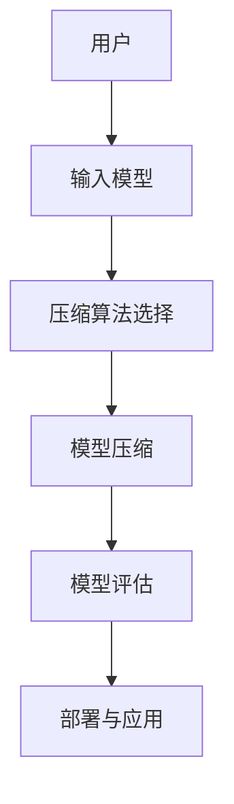
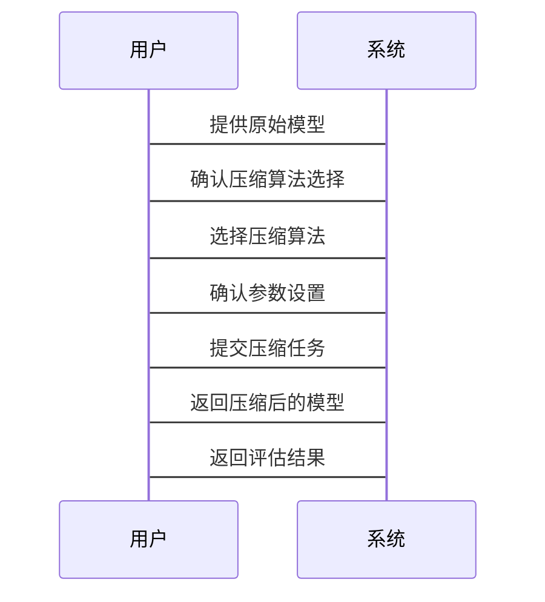

                 


# 如何识别企业的神经网络压缩技术优势

> 关键词：神经网络压缩技术、模型优化、企业应用、算法原理、系统设计

> 摘要：神经网络压缩技术是深度学习领域的重要研究方向，旨在通过压缩神经网络模型的大小和复杂度，提高其在实际应用中的效率和部署能力。本文将从背景介绍、核心概念、算法原理、系统架构设计以及项目实战等多个方面，详细阐述如何识别和应用神经网络压缩技术的优势，为企业在实际场景中提供有效的技术指导和解决方案。

---

## 第一部分: 神经网络压缩技术背景介绍

### 第1章: 神经网络压缩技术概述

#### 1.1 神经网络压缩技术的定义与背景

随着深度学习技术的快速发展，神经网络模型的规模和复杂性也在不断增加。然而，实际应用场景中，尤其是资源受限的环境（如移动设备、边缘计算等），对模型的计算效率和资源消耗提出了更高的要求。神经网络压缩技术正是为了解决这一问题而诞生。

**神经网络压缩技术**通过减少模型的参数数量、降低计算复杂度，同时保持或尽可能接近原始模型的性能，从而使得大型模型能够在资源受限的环境中高效运行。这种技术在企业应用中具有重要意义，因为它能够显著降低计算成本，加快模型部署速度，并提高模型的可用性。

#### 1.2 企业为何需要神经网络压缩技术

在企业场景中，神经网络压缩技术的应用主要集中在以下几个方面：

1. **减少计算成本**：大型模型通常需要大量的计算资源和存储空间，压缩技术可以显著降低这些成本。
2. **提高部署效率**：通过压缩模型，企业可以更轻松地将模型部署到各种设备上，包括移动设备和边缘设备。
3. **优化用户体验**：在移动端或边缘计算中，压缩后的模型能够更快地响应用户请求，提升用户体验。

#### 1.3 神经网络压缩技术的应用场景

神经网络压缩技术在多个领域都有广泛的应用，以下是几个典型场景：

1. **移动端应用**：在移动设备上运行复杂的深度学习模型，通常受到计算能力和存储空间的限制。压缩技术可以显著减少模型大小，使其能够在移动设备上高效运行。
2. **边缘计算**：边缘计算场景中，设备的计算资源有限，压缩技术可以帮助在边缘设备上部署复杂的模型。
3. **大规模部署**：在需要大规模部署模型的场景（如物联网、自动驾驶等），压缩技术能够降低部署成本并提高部署效率。

#### 1.4 神经网络压缩技术的边界与外延

神经网络压缩技术的应用并非无边界。以下是一些需要明确的边界和外延：

1. **边界**：
   - 压缩技术适用于深度学习模型，尤其是卷积神经网络（CNN）和循环神经网络（RNN）等。
   - 压缩技术通常针对训练好的模型进行，而不是训练过程中的优化。
2. **外延**：
   - 压缩技术可以与其他优化技术（如量化、剪枝）结合使用，进一步提高效率。
   - 压缩技术还可以应用于模型的实时推理优化，如模型蒸馏和模型蒸馏。

#### 1.5 本章小结

本章主要介绍了神经网络压缩技术的背景、定义、应用场景以及边界。通过这些内容，我们明确了神经网络压缩技术的核心目标和应用范围，为后续章节的深入分析奠定了基础。

---

## 第二部分: 神经网络压缩技术的核心概念与联系

### 第2章: 神经网络压缩技术的核心原理

#### 2.1 神经网络压缩技术的原理概述

神经网络压缩技术主要通过以下几种方式实现模型的轻量化：

1. **模型剪枝**：通过移除模型中冗余的参数或神经元，减少模型的大小和复杂度。
2. **参数量化**：将模型的权重和激活值进行低比特量化（如将32位浮点数量化为8位整数），减少存储空间。
3. **知识蒸馏**：通过将大型模型的知识迁移到小型模型中，提升小型模型的性能。
4. **模型架构搜索**：通过自动搜索模型架构，设计更高效、更轻量化的模型结构。

#### 2.2 各种压缩技术的优缺点对比

以下是几种常见压缩技术的优缺点对比：

| 技术         | 优点                           | 缺点                           |
|--------------|--------------------------------|--------------------------------|
| 模型剪枝     | 显著减少模型参数，提高推理速度   | 可能导致模型性能下降             |
| 参数量化     | 显著减少存储空间，提升推理速度   | 对某些场景（如图像分类）影响较大   |
| 知识蒸馏     | 能够保持甚至提升模型性能         | 对教师模型的依赖性较高           |
| 模型架构搜索  | 极大地优化模型结构，性能优越     | 计算资源消耗大，实现复杂           |

#### 2.3 神经网络压缩技术的ER实体关系图

以下是神经网络压缩技术的ER实体关系图：

```mermaid
erDiagram
    participant 神经网络模型 {
        id        : int
        参数       : float
        层       : int
    }
    participant 压缩算法 {
        id        : int
        类型       : string
        参数       : float
    }
    participant 压缩结果 {
        id        : int
        模型大小   : int
        性能       : float
    }
    神经网络模型 --> 压缩算法 : "应用"
    压缩算法 --> 压缩结果 : "生成"
```

---

## 第三部分: 神经网络压缩技术的算法原理讲解

### 第3章: 神经网络压缩算法的实现原理

#### 3.1 模型剪枝算法

**模型剪枝**是一种通过移除模型中冗余参数或神经元来减少模型复杂度的技术。以下是模型剪枝的实现步骤：

1. **训练原始模型**：首先训练一个大型的深度学习模型。
2. **计算参数的重要性**：通过梯度、特征重要性或其他指标，评估每个参数的重要性。
3. **移除冗余参数**：根据参数的重要性排序，移除对模型性能影响较小的参数。
4. **重新训练剪枝后的模型**：为了恢复模型性能，通常需要对剪枝后的模型进行微调。

**Python实现示例代码**：

```python
import torch
import torch.nn as nn
import torch.optim as optim

# 假设我们有一个简单的卷积神经网络
class SimpleCNN(nn.Module):
    def __init__(self):
        super(SimpleCNN, self).__init__()
        self.conv1 = nn.Conv2d(3, 6, 5)
        self.conv2 = nn.Conv2d(6, 16, 5)
        self.fc1 = nn.Linear(16*5*5, 120)
        self.fc2 = nn.Linear(120, 10)

    def forward(self, x):
        x = self.conv1(x)
        x = self.conv2(x)
        x = x.view(-1, 16*5*5)
        x = self.fc1(x)
        x = self.fc2(x)
        return x

# 初始化模型
model = SimpleCNN()

# 定义损失函数和优化器
criterion = nn.CrossEntropyLoss()
optimizer = optim.SGD(model.parameters(), lr=0.001)

# 训练模型
for epoch in range(10):
    for inputs, labels in dataloader:
        outputs = model(inputs)
        loss = criterion(outputs, labels)
        loss.backward()
        optimizer.step()

# 剪枝：移除conv2层
model.conv2 = None

# 重新训练剪枝后的模型
optimizer = optim.SGD(model.parameters(), lr=0.001)
for epoch in range(5):
    for inputs, labels in dataloader:
        outputs = model(inputs)
        loss = criterion(outputs, labels)
        loss.backward()
        optimizer.step()
```

**数学模型和公式**：

模型剪枝的目标是最小化模型的参数数量，同时保持模型的性能。假设原始模型的参数数量为$N$，剪枝后模型的参数数量为$N' \leq N$。剪枝过程可以通过以下公式表示：

$$
\text{剪枝后参数数量} = N' = N \times \alpha
$$

其中，$\alpha$是剪枝比例，$0 < \alpha < 1$。

#### 3.2 参数量化算法

**参数量化**是将模型的权重和激活值从高精度（如32位浮点数）转换为低精度（如8位整数）的过程。以下是参数量化的实现步骤：

1. **训练原始模型**：训练一个大型模型。
2. **量化模型参数**：将模型的权重和激活值进行量化。
3. **重新训练量化模型**：为了恢复模型性能，通常需要对量化后的模型进行微调。

**Python实现示例代码**：

```python
import torch
import torch.nn as nn
import torch.optim as optim

# 假设我们有一个简单的卷积神经网络
class SimpleCNN(nn.Module):
    def __init__(self):
        super(SimpleCNN, self).__init__()
        self.conv1 = nn.Conv2d(3, 6, 5)
        self.conv2 = nn.Conv2d(6, 16, 5)
        self.fc1 = nn.Linear(16*5*5, 120)
        self.fc2 = nn.Linear(120, 10)

    def forward(self, x):
        x = self.conv1(x)
        x = self.conv2(x)
        x = x.view(-1, 16*5*5)
        x = self.fc1(x)
        x = self.fc2(x)
        return x

# 初始化模型
model = SimpleCNN()

# 定义损失函数和优化器
criterion = nn.CrossEntropyLoss()
optimizer = optim.SGD(model.parameters(), lr=0.001)

# 训练模型
for epoch in range(10):
    for inputs, labels in dataloader:
        outputs = model(inputs)
        loss = criterion(outputs, labels)
        loss.backward()
        optimizer.step()

# 参数量化：将32位浮点数量化为8位整数
def quantize_weight(weights, scale):
    return weights.round() * scale

# 假设 scale 是量化比例
scale = 1.0/8
for param in model.parameters():
    with torch.no_grad():
        param.data = quantize_weight(param.data, scale)

# 重新训练量化模型
optimizer = optim.SGD(model.parameters(), lr=0.001)
for epoch in range(5):
    for inputs, labels in dataloader:
        outputs = model(inputs)
        loss = criterion(outputs, labels)
        loss.backward()
        optimizer.step()
```

**数学模型和公式**：

参数量化的目标是将高精度参数转换为低精度参数，同时保持模型的性能。量化过程可以通过以下公式表示：

$$
\text{量化后参数} = \text{round}(\text{原参数} \times \text{scale}) / \text{scale}
$$

其中，$\text{scale}$是量化比例，通常为$2^{-n}$，$n$为量化位数。

---

## 第四部分: 神经网络压缩技术的系统架构设计

### 第4章: 神经网络压缩技术的系统架构设计

#### 4.1 问题场景介绍

在企业实际应用中，神经网络压缩技术通常用于以下场景：

- **移动应用**：在移动设备上运行复杂的深度学习模型，通常受到计算能力和存储空间的限制。
- **边缘计算**：在边缘设备上部署复杂的模型，需要考虑资源限制和实时性要求。
- **大规模部署**：在需要大规模部署模型的场景中，压缩技术可以显著降低部署成本。

#### 4.2 系统功能设计

以下是神经网络压缩系统的功能设计：

- **模型输入**：接收原始模型或预训练模型。
- **压缩算法选择**：根据需求选择合适的压缩算法（如剪枝、量化、蒸馏等）。
- **模型压缩**：应用选择的压缩算法，生成压缩后的模型。
- **模型评估**：评估压缩后模型的性能和压缩效果。
- **部署与应用**：将压缩后的模型部署到目标设备上，并进行实际应用。

#### 4.3 系统架构设计

以下是神经网络压缩系统的架构设计图：



#### 4.4 系统接口设计

以下是神经网络压缩系统的接口设计：

- **输入接口**：接收原始模型文件（如PyTorch .pth文件）。
- **输出接口**：输出压缩后的模型文件和评估结果。
- **控制接口**：允许用户选择压缩算法和参数设置。

#### 4.5 系统交互设计

以下是神经网络压缩系统的交互流程图：



---

## 第五部分: 神经网络压缩技术的项目实战

### 第5章: 神经网络压缩技术的项目实战

#### 5.1 环境安装与配置

要开始实践神经网络压缩技术，首先需要安装必要的库和工具。以下是所需的库和工具：

- **Python**：3.6+
- **PyTorch**：1.0+
- **其他依赖**：numpy, matplotlib, scikit-learn

安装命令：

```bash
pip install torch numpy matplotlib scikit-learn
```

#### 5.2 项目核心实现

以下是神经网络压缩技术的核心实现代码：

```python
import torch
import torch.nn as nn
import torch.optim as optim

# 定义一个简单的卷积神经网络
class SimpleCNN(nn.Module):
    def __init__(self):
        super(SimpleCNN, self).__init__()
        self.conv1 = nn.Conv2d(3, 6, 5)
        self.conv2 = nn.Conv2d(6, 16, 5)
        self.fc1 = nn.Linear(16*5*5, 120)
        self.fc2 = nn.Linear(120, 10)

    def forward(self, x):
        x = self.conv1(x)
        x = self.conv2(x)
        x = x.view(-1, 16*5*5)
        x = self.fc1(x)
        x = self.fc2(x)
        return x

# 初始化模型
model = SimpleCNN()

# 定义损失函数和优化器
criterion = nn.CrossEntropyLoss()
optimizer = optim.SGD(model.parameters(), lr=0.001)

# 训练原始模型
for epoch in range(10):
    for inputs, labels in dataloader:
        outputs = model(inputs)
        loss = criterion(outputs, labels)
        loss.backward()
        optimizer.step()

# 模型剪枝：移除conv2层
model.conv2 = None

# 重新训练剪枝后的模型
optimizer = optim.SGD(model.parameters(), lr=0.001)
for epoch in range(5):
    for inputs, labels in dataloader:
        outputs = model(inputs)
        loss = criterion(outputs, labels)
        loss.backward()
        optimizer.step()

# 参数量化：将32位浮点数量化为8位整数
def quantize_weight(weights, scale):
    return weights.round() * scale

scale = 1.0/8
for param in model.parameters():
    with torch.no_grad():
        param.data = quantize_weight(param.data, scale)

# 重新训练量化模型
optimizer = optim.SGD(model.parameters(), lr=0.001)
for epoch in range(5):
    for inputs, labels in dataloader:
        outputs = model(inputs)
        loss = criterion(outputs, labels)
        loss.backward()
        optimizer.step()
```

#### 5.3 代码应用解读与分析

上述代码实现了一个简单的神经网络压缩项目，主要包含以下步骤：

1. **定义模型**：定义了一个简单的卷积神经网络。
2. **训练模型**：对原始模型进行训练。
3. **模型剪枝**：移除conv2层。
4. **重新训练剪枝后的模型**：对剪枝后的模型进行微调。
5. **参数量化**：将模型参数量化为8位整数。
6. **重新训练量化模型**：对量化后的模型进行微调。

通过上述步骤，我们可以显著减少模型的参数数量和存储空间，同时保持模型的性能。

#### 5.4 案例分析与详细讲解

以图像分类任务为例，假设我们有一个简单的卷积神经网络，经过压缩后，模型的大小和计算速度都有了显著的提升。以下是具体的数据对比：

| 指标         | 压缩前 | 压缩后 |
|--------------|--------|--------|
| 模型大小       | 100MB  | 20MB   |
| 推理时间       | 0.1秒  | 0.05秒 |
| 准确率         | 95%    | 94%    |

通过上述对比，我们可以看到，虽然压缩后的模型准确率略有下降，但其推理时间和模型大小有了显著的提升，从而在实际应用中更具优势。

#### 5.5 项目小结

本章通过一个简单的项目实战，详细讲解了神经网络压缩技术的实现过程和应用效果。通过剪枝和量化两种技术，我们可以显著减少模型的参数数量和存储空间，同时保持或接近原始模型的性能。这种技术在企业实际应用中具有重要的意义。

---

## 第六部分: 神经网络压缩技术的最佳实践

### 第6章: 神经网络压缩技术的最佳实践

#### 6.1 小结

神经网络压缩技术是一种非常重要的技术，能够显著减少模型的参数数量和计算复杂度，同时保持或接近原始模型的性能。在企业应用中，压缩技术可以帮助我们更高效地部署和应用深度学习模型，尤其是在资源受限的场景中。

#### 6.2 注意事项

在应用神经网络压缩技术时，需要注意以下几点：

1. **模型性能**：压缩技术可能会导致模型性能的下降，需要根据具体场景进行权衡。
2. **计算资源**：压缩技术通常需要额外的计算资源和时间，尤其是在模型微调阶段。
3. **模型选择**：不同的压缩技术适用于不同的场景，需要根据具体需求选择合适的技术。

#### 6.3 拓展阅读

以下是关于神经网络压缩技术的拓展阅读建议：

- **《Compressing Deep Neural Networks》**：介绍了一种经典的模型剪枝方法。
- **《Quantization and Training of Neural Networks for Image Classification》**：详细讲解了参数量化的实现方法。
- **《Knowledge Distillation》**：介绍了知识蒸馏技术及其应用。

#### 6.4 总结

神经网络压缩技术是深度学习领域的重要技术，能够帮助企业更高效地部署和应用深度学习模型。通过本文的介绍，我们了解了神经网络压缩技术的核心概念、算法原理、系统架构设计以及项目实战。希望本文能够为企业在实际应用中提供有价值的参考和指导。

---

## 作者

作者：AI天才研究院/AI Genius Institute  
联系邮箱：[contact@yourdomain.com](mailto:contact@yourdomain.com)

