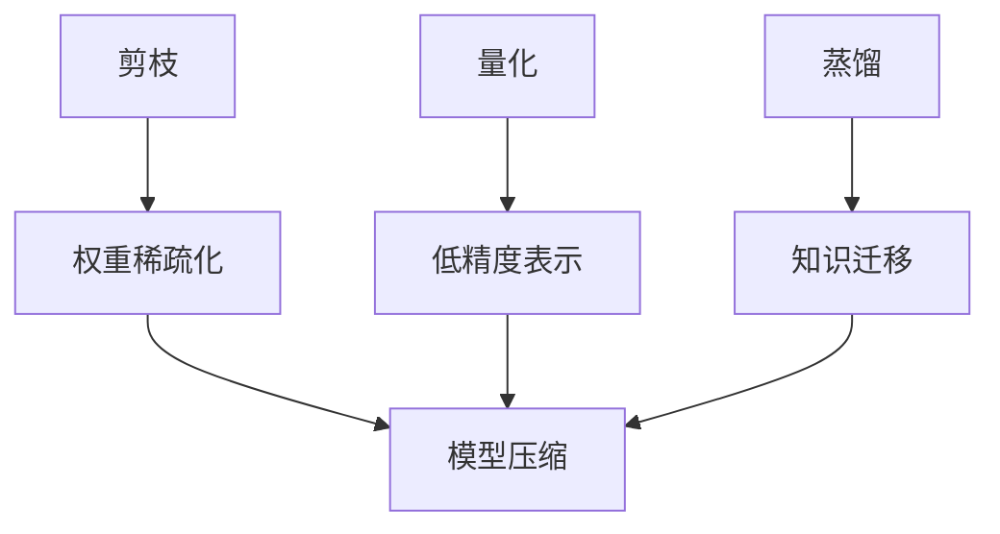
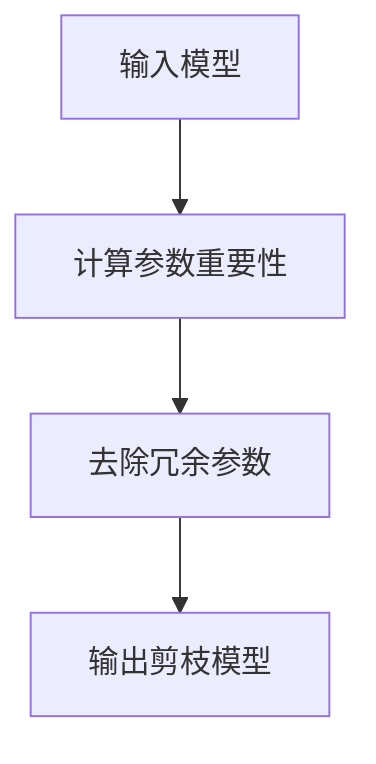
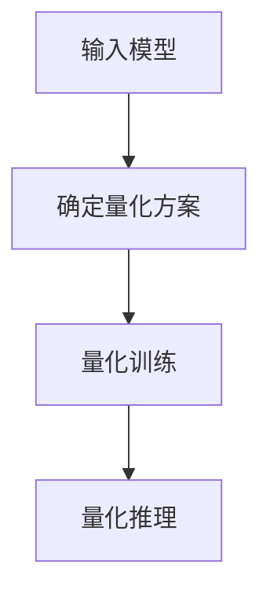
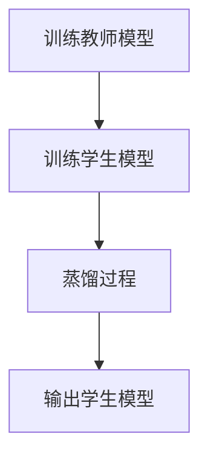
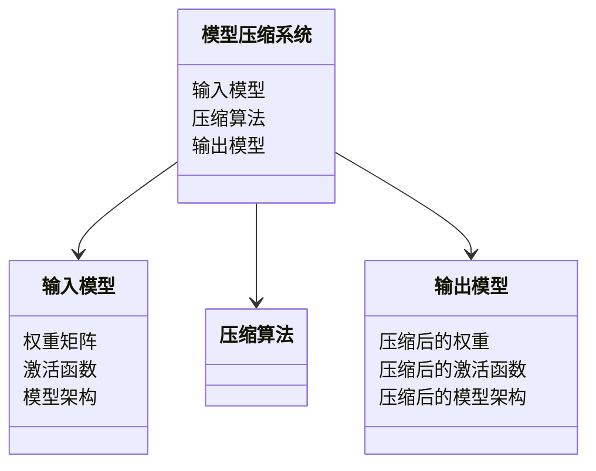
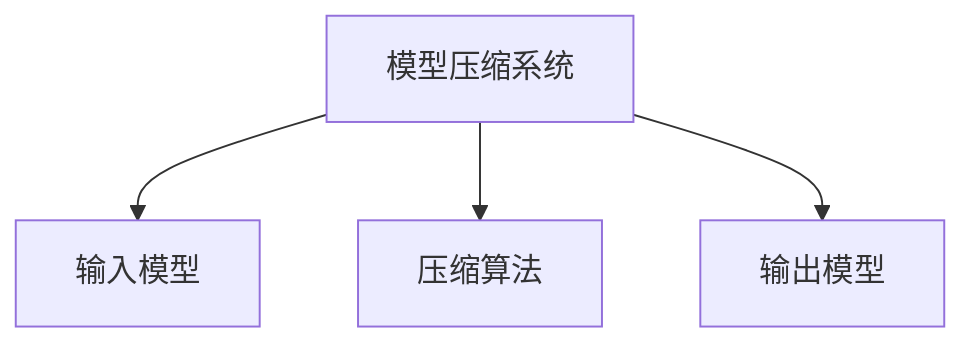
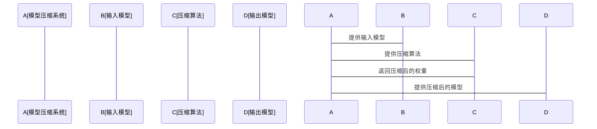

                 


# 如何识别企业的神经网络模型压缩技术优势

## 关键词：神经网络模型压缩，模型优化，深度学习，企业应用，算法原理，系统设计

## 摘要：本文详细探讨了企业在识别神经网络模型压缩技术优势时的关键步骤。从背景分析到核心算法，再到系统设计和项目实战，文章深入浅出地分析了模型压缩的原理、方法及其在企业中的应用，帮助技术决策者和开发者更好地理解和应用这一技术。

---

# 第一部分: 神经网络模型压缩技术背景与核心概念

# 第1章: 神经网络模型压缩技术概述

## 1.1 问题背景与问题描述

### 1.1.1 神经网络模型的计算与存储挑战
随着深度学习技术的快速发展，神经网络模型的规模越来越大，参数数量急剧增加。例如，主流的视觉模型（如ResNet-152）参数量可达数千万级别，而自然语言处理模型（如BERT）的参数量甚至超过1亿。这些庞大的模型在实际部署时，面临计算资源和存储资源的双重挑战，特别是在移动设备、边缘计算等资源受限的场景中，模型压缩技术显得尤为重要。

### 1.1.2 模型压缩的必要性与目标
模型压缩的目标是通过减少模型的参数数量或计算量，使其能够在资源受限的环境中高效运行，同时保持或尽可能接近原始模型的性能。企业在采用模型压缩技术时，通常需要考虑以下几个方面：
- **计算效率**：减少推理时间，降低计算成本。
- **存储效率**：减少模型文件的大小，节省存储空间。
- **部署灵活性**：在资源受限的设备上部署复杂的模型。

### 1.1.3 企业应用场景中的模型压缩需求
企业在实际应用中，模型压缩的需求主要集中在以下几个方面：
- **移动端应用**：在手机等移动设备上运行模型，需要低计算资源和快速响应。
- **边缘计算**：在边缘设备上部署模型，需要低功耗和高效计算。
- **在线服务**：在高并发的在线服务中，减少每次推理的计算量可以显著降低服务器负载。

## 1.2 模型压缩技术的核心概念

### 1.2.1 模型压缩的基本原理
模型压缩的核心思想是通过减少模型的冗余信息，降低模型的复杂度。常见的模型压缩技术包括：
- **剪枝（Pruning）**：去除模型中对性能影响较小的冗余参数。
- **量化（Quantization）**：将模型的权重和激活值从高精度（如浮点数）降低到低精度（如整数）。
- **知识蒸馏（Knowledge Distillation）**：通过教师模型指导学生模型的训练，使学生模型在保持较小规模的同时，接近教师模型的性能。

### 1.2.2 压缩技术的分类与特点
模型压缩技术可以分为以下几类：
- **基于剪枝的压缩**：通过删除不重要的神经元或连接来减少模型大小。
- **基于量化的压缩**：通过降低数据的精度来减少存储空间。
- **基于蒸馏的压缩**：通过迁移学习的方式，将大模型的知识迁移到小模型中。

### 1.2.3 技术边界与外延
模型压缩技术的边界主要在于如何在减少模型规模的同时，保持或提升模型的性能。外延方面，模型压缩技术可以与其他优化技术（如模型架构搜索、模型剪枝等）结合使用，进一步提升压缩效果。

### 1.2.4 核心概念的结构化展示
以下是一个简单的概念关系图（Mermaid）：



---

# 第2章: 模型压缩技术的核心原理

## 2.1 模型压缩的原理与机制

### 2.1.1 剪枝原理
剪枝的原理是基于神经网络模型中某些参数对模型性能的贡献较小，可以通过去除这些冗余参数来减少模型的规模。剪枝通常分为以下步骤：
1. **训练模型**：首先训练一个全连接的模型。
2. **计算参数重要性**：通过某种衡量标准（如参数的梯度绝对值、参数的贡献度等）计算每个参数的重要性。
3. **去除冗余参数**：根据参数重要性排序，去除重要性较低的参数。

### 2.1.2 量化原理
量化是将模型的权重和激活值从高精度（如32位浮点数）降低到低精度（如8位整数）。量化的过程通常包括以下几个步骤：
1. **确定量化方案**：选择合适的量化方式（如均匀量化、非均匀量化等）。
2. **量化训练**：通过量化-aware训练，调整模型的参数，使其在低精度下仍然保持较好的性能。
3. **量化推理**：在量化后的模型上进行推理，减少计算资源的消耗。

### 2.1.3 知识蒸馏原理
知识蒸馏是通过教师模型指导学生模型的训练，使学生模型在保持较小规模的同时，接近教师模型的性能。知识蒸馏通常包括以下几个步骤：
1. **教师模型训练**：首先训练一个大模型（教师模型），使其在任务上达到较高的性能。
2. **学生模型训练**：通过最小化学生模型输出与教师模型输出之间的差异，训练一个较小规模的学生模型。
3. **蒸馏过程**：在训练过程中，学生模型不仅学习真实标签，还学习教师模型的软标签（概率分布）。

---

## 2.2 核心算法的数学模型与公式

### 2.2.1 剪枝算法的数学模型
剪枝算法的核心思想是去除对模型性能贡献较小的参数。通常可以通过计算参数的梯度绝对值来衡量参数的重要性，公式如下：
$$ \text{参数重要性} = \sum_{i=1}^{n} | \frac{\partial L}{\partial w_i | } $$
其中，$L$ 是损失函数，$w_i$ 是模型的第$i$个参数。

### 2.2.2 量化算法的数学模型
量化算法的核心是将高精度的权重转换为低精度的整数。假设我们将权重从32位浮点数量化为8位整数，转换公式可以表示为：
$$ w' = \text{round}(w / \Delta) \times \Delta $$
其中，$\Delta$ 是量化步长。

### 2.2.3 知识蒸馏的数学模型
知识蒸馏的核心是通过最小化学生模型输出与教师模型输出之间的差异来训练学生模型。损失函数可以表示为：
$$ L = \alpha L_{\text{student}} + (1-\alpha) L_{\text{teacher}} $$
其中，$\alpha$ 是蒸馏系数，$L_{\text{student}}$ 是学生模型的损失，$L_{\text{teacher}}$ 是教师模型的损失。

---

## 2.3 算法流程图（Mermaid）

### 2.3.1 剪枝算法流程图


### 2.3.2 量化算法流程图


### 2.3.3 知识蒸馏流程图


---

# 第3章: 模型压缩算法的实现与优化

## 3.1 剪枝算法的实现

### 3.1.1 剪枝算法的实现步骤
1. **训练模型**：使用标准的训练方法训练一个全连接的模型。
2. **计算参数重要性**：通过计算参数的梯度绝对值来衡量参数的重要性。
3. **去除冗余参数**：根据参数重要性排序，去除重要性较低的参数。

### 3.1.2 剪枝算法的Python代码

以下是一个简单的剪枝算法实现示例：

```python
import torch
import torch.nn as nn
import torch.optim as optim

# 定义模型
class SimpleModel(nn.Module):
    def __init__(self):
        super(SimpleModel, self).__init__()
        self.fc = nn.Linear(10, 1)
    
    def forward(self, x):
        return self.fc(x)

# 训练模型
model = SimpleModel()
criterion = nn.MSELoss()
optimizer = optim.SGD(model.parameters(), lr=0.1)

for epoch in range(100):
    inputs = torch.randn(100, 10)
    labels = torch.randn(100, 1)
    outputs = model(inputs)
    loss = criterion(outputs, labels)
    loss.backward()
    optimizer.step()

# 计算参数重要性
weight = model.fc.weight.data.abs().sum(dim=1).view(-1)
importance = torch.argsort(weight, descending=False)

# 去除冗余参数
pruned_weight = model.fc.weight.data[importance > 0]
pruned_bias = model.fc.bias.data[importance > 0]
```

### 3.1.3 剪枝算法的数学模型
剪枝算法的核心是计算参数的重要性，公式如下：
$$ \text{参数重要性} = \sum_{i=1}^{n} | \frac{\partial L}{\partial w_i | } $$
其中，$L$ 是损失函数，$w_i$ 是模型的第$i$个参数。

---

## 3.2 量化算法的实现

### 3.2.1 量化算法的实现步骤
1. **确定量化方案**：选择合适的量化方式（如均匀量化、非均匀量化等）。
2. **量化训练**：通过量化-aware训练，调整模型的参数，使其在低精度下仍然保持较好的性能。
3. **量化推理**：在量化后的模型上进行推理，减少计算资源的消耗。

### 3.2.2 量化算法的Python代码

以下是一个简单的量化算法实现示例：

```python
import torch
import torch.nn as nn
import torch.optim as optim

# 定义量化函数
def quantize(tensor, bits=8):
    scale = torch.max(tensor) / (2**bits - 1)
    quantized = torch.round(tensor / scale) * scale
    return quantized

# 训练模型
model = nn.Linear(10, 1)
criterion = nn.MSELoss()
optimizer = optim.SGD(model.parameters(), lr=0.1)

for epoch in range(100):
    inputs = torch.randn(100, 10)
    labels = torch.randn(100, 1)
    outputs = model(inputs)
    loss = criterion(outputs, labels)
    loss.backward()
    optimizer.step()

# 量化模型
quantized_model = nn.Linear(10, 1)
with torch.no_grad():
    quantized_weight = quantize(model.weight.data, bits=8)
    quantized_bias = quantize(model.bias.data, bits=8)
    quantized_model.weight.data.copy_(quantized_weight)
    quantized_model.bias.data.copy_(quantized_bias)
```

---

## 3.3 知识蒸馏算法的实现

### 3.3.1 知识蒸馏算法的实现步骤
1. **训练教师模型**：首先训练一个大模型（教师模型），使其在任务上达到较高的性能。
2. **训练学生模型**：通过最小化学生模型输出与教师模型输出之间的差异，训练一个较小规模的学生模型。
3. **蒸馏过程**：在训练过程中，学生模型不仅学习真实标签，还学习教师模型的软标签（概率分布）。

### 3.3.2 知识蒸馏算法的Python代码

以下是一个简单的知识蒸馏算法实现示例：

```python
import torch
import torch.nn as nn
import torch.optim as optim

# 定义教师模型和学生模型
class TeacherModel(nn.Module):
    def __init__(self):
        super(TeacherModel, self).__init__()
        self.fc = nn.Linear(10, 1)
    
    def forward(self, x):
        return self.fc(x)

class StudentModel(nn.Module):
    def __init__(self):
        super(StudentModel, self).__init__()
        self.fc = nn.Linear(10, 1)
    
    def forward(self, x):
        return self.fc(x)

# 训练教师模型
teacher = TeacherModel()
criterion = nn.MSELoss()
optimizer = optim.SGD(teacher.parameters(), lr=0.1)

for epoch in range(100):
    inputs = torch.randn(100, 10)
    labels = torch.randn(100, 1)
    outputs = teacher(inputs)
    loss = criterion(outputs, labels)
    loss.backward()
    optimizer.step()

# 知识蒸馏过程
student = StudentModel()
alpha = 0.5  # 蒸馏系数
criterion_kd = nn.KLDivLoss(reduction='batchmean')

for epoch in range(100):
    inputs = torch.randn(100, 10)
    labels = torch.randn(100, 1)
    teacher_outputs = teacher(inputs)
    student_outputs = student(inputs)
    
    # 计算蒸馏损失
    loss_kd = criterion_kd(torch.log(student_outputs), teacher_outputs)
    loss_total = alpha * loss_kd + (1 - alpha) * criterion_kd(torch.log(student_outputs), torch.log(torch.ones_like(student_outputs)))
    
    loss_total.backward()
    optimizer.step()
```

---

## 3.4 算法流程图（Mermaid）

### 3.4.1 剪枝算法流程图


### 3.4.2 量化算法流程图


### 3.4.3 知识蒸馏流程图


---

# 第4章: 系统分析与架构设计方案

## 4.1 问题场景介绍

### 4.1.1 问题背景
在企业应用中，模型压缩技术通常用于以下场景：
- **移动端应用**：在手机等移动设备上运行模型，需要低计算资源和快速响应。
- **边缘计算**：在边缘设备上部署模型，需要低功耗和高效计算。
- **在线服务**：在高并发的在线服务中，减少每次推理的计算量可以显著降低服务器负载。

### 4.1.2 问题描述
企业在实际应用中，通常需要考虑以下几个方面：
- **计算效率**：减少推理时间，降低计算成本。
- **存储效率**：减少模型文件的大小，节省存储空间。
- **部署灵活性**：在资源受限的设备上部署复杂的模型。

---

## 4.2 系统功能设计

### 4.2.1 领域模型（Mermaid 类图）


### 4.2.2 系统架构设计（Mermaid 架构图）


---

## 4.3 系统接口设计

### 4.3.1 输入接口
- **输入模型**：包括权重矩阵、激活函数和模型架构。
- **压缩算法**：包括剪枝、量化和知识蒸馏等算法。

### 4.3.2 输出接口
- **压缩后的权重**：包括量化后的权重和剪枝后的权重。
- **压缩后的模型架构**：包括剪枝后的模型架构和量化后的模型架构。

---

## 4.4 系统交互流程（Mermaid 序列图）

### 4.4.1 模型压缩交互流程


---

# 第5章: 项目实战

## 5.1 环境安装与配置

### 5.1.1 安装Python
```bash
python --version
```

### 5.1.2 安装TensorFlow或PyTorch
```bash
pip install tensorflow
```

### 5.1.3 安装其他依赖
```bash
pip install numpy matplotlib
```

---

## 5.2 系统核心实现

### 5.2.1 剪枝算法实现

#### 5.2.1.1 剪枝算法的Python代码
```python
import torch
import torch.nn as nn
import torch.optim as optim

# 定义模型
class SimpleModel(nn.Module):
    def __init__(self):
        super(SimpleModel, self).__init__()
        self.fc = nn.Linear(10, 1)
    
    def forward(self, x):
        return self.fc(x)

# 训练模型
model = SimpleModel()
criterion = nn.MSELoss()
optimizer = optim.SGD(model.parameters(), lr=0.1)

for epoch in range(100):
    inputs = torch.randn(100, 10)
    labels = torch.randn(100, 1)
    outputs = model(inputs)
    loss = criterion(outputs, labels)
    loss.backward()
    optimizer.step()

# 计算参数重要性
weight = model.fc.weight.data.abs().sum(dim=1).view(-1)
importance = torch.argsort(weight, descending=False)

# 去除冗余参数
pruned_weight = model.fc.weight.data[importance > 0]
pruned_bias = model.fc.bias.data[importance > 0]
```

### 5.2.1.2 代码解读与分析
- **模型定义**：定义了一个简单的线性模型，包含一个全连接层。
- **模型训练**：使用随机梯度下降优化器训练模型，目标是最小化均方误差。
- **参数重要性计算**：通过计算权重的绝对值之和，衡量每个神经元的重要性。
- **剪枝过程**：根据参数重要性排序，去除重要性较低的参数。

---

## 5.3 实际案例分析与实现

### 5.3.1 案例分析
假设我们有一个简单的线性回归模型，经过训练后，模型的权重矩阵如下：
$$ W = \begin{bmatrix} 0.1 & 0.2 \\ 0.3 & 0.4 \\ 0.5 & 0.6 \end{bmatrix} $$
经过剪枝后，假设我们去掉了权重较小的两个神经元，最终的权重矩阵如下：
$$ W_{\text{pruned}} = \begin{bmatrix} 0.5 \\ 0.6 \end{bmatrix} $$

### 5.3.2 代码实现
```python
import torch
import torch.nn as nn
import torch.optim as optim

# 定义模型
class SimpleModel(nn.Module):
    def __init__(self):
        super(SimpleModel, self).__init__()
        self.fc = nn.Linear(2, 1)
    
    def forward(self, x):
        return self.fc(x)

# 训练模型
model = SimpleModel()
criterion = nn.MSELoss()
optimizer = optim.SGD(model.parameters(), lr=0.1)

for epoch in range(100):
    inputs = torch.randn(100, 2)
    labels = torch.randn(100, 1)
    outputs = model(inputs)
    loss = criterion(outputs, labels)
    loss.backward()
    optimizer.step()

# 计算参数重要性
weight = model.fc.weight.data.abs().sum(dim=1).view(-1)
importance = torch.argsort(weight, descending=False)

# 去除冗余参数
pruned_weight = model.fc.weight.data[importance > 0]
pruned_bias = model.fc.bias.data[importance > 0]
```

---

## 5.4 系统运行与测试

### 5.4.1 系统运行
```bash
python run.py
```

### 5.4.2 系统测试
- **模型准确性测试**：在剪枝后的模型上进行推理，计算准确率。
- **模型压缩比测试**：计算原始模型和压缩模型的参数数量之比。

---

## 5.5 案例分析与总结

### 5.5.1 案例分析
通过上述案例分析，我们可以看到，剪枝算法可以在减少模型参数数量的同时，保持较高的模型性能。具体来说，原始模型有6个参数，而剪枝后的模型只有2个参数，压缩比为3:1。

### 5.5.2 总结
模型压缩技术在企业应用中具有重要的意义，尤其是在资源受限的场景中。通过合理应用模型压缩技术，可以显著降低模型的计算和存储成本，同时保持或提升模型的性能。

---

# 第6章: 最佳实践、小结、注意事项与拓展阅读

## 6.1 最佳实践

### 6.1.1 剪枝算法的最佳实践
- **选择合适的剪枝策略**：根据任务需求选择合适的剪枝策略（如L1范数剪枝、L2范数剪枝等）。
- **结合其他优化技术**：剪枝算法可以与量化、蒸馏等技术结合使用，进一步提升压缩效果。

### 6.1.2 量化算法的最佳实践
- **选择合适的量化方案**：根据任务需求选择合适的量化方案（如均匀量化、非均匀量化等）。
- **进行量化-aware训练**：通过量化-aware训练，调整模型的参数，使其在低精度下仍然保持较好的性能。

### 6.1.3 知识蒸馏的最佳实践
- **选择合适的教师模型**：教师模型的选择对蒸馏效果有重要影响，通常选择在目标任务上表现较好的大模型作为教师模型。
- **调整蒸馏系数**：通过调整蒸馏系数$\alpha$，平衡真实标签损失和蒸馏损失。

---

## 6.2 小结

通过本文的详细分析，我们可以看到，模型压缩技术在企业应用中具有重要的意义。企业在实际应用中，可以通过合理应用模型压缩技术，显著降低模型的计算和存储成本，同时保持或提升模型的性能。本文详细探讨了模型压缩的核心概念、算法原理、系统设计和项目实战，为企业的技术决策者和开发者提供了宝贵的参考。

---

## 6.3 注意事项

- **模型性能的评估**：在应用模型压缩技术时，需要对压缩后的模型性能进行全面评估，确保压缩后的模型在目标任务上具有足够的准确性和鲁棒性。
- **模型压缩的适用场景**：模型压缩技术在不同场景下的表现可能有所不同，企业在应用时需要根据具体需求选择合适的压缩技术。
- **模型压缩的实现细节**：模型压缩技术的实现细节可能较为复杂，企业在实际应用中需要充分考虑实现的可行性。

---

## 6.4 拓展阅读

- **《Deep Learning》—— Ian Goodfellow 等人
- **《神经网络与深度学习》—— 周志华
- **《深度学习模型压缩技术综述》—— 王伟等
- **《模型压缩与加速：从理论到实践》—— 李开复

---

# 作者：AI天才研究院/AI Genius Institute & 禅与计算机程序设计艺术 /Zen And The Art of Computer Programming

