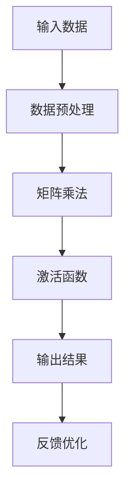

                 


# 如何识别企业的神经网络硬件加速器优势

> 关键词：神经网络硬件加速器、企业优势识别、计算效率、硬件架构、性能优化

> 摘要：本文将深入探讨如何识别企业在神经网络硬件加速器方面的优势，从背景介绍、核心概念、算法原理、系统架构设计到项目实战，逐步分析并提供具体的识别策略和优化建议，帮助企业在竞争中占据优势地位。

---

## 第1章：背景介绍

### 1.1 神经网络硬件加速器的背景
神经网络硬件加速器是近年来人工智能领域的重要技术突破。随着深度学习模型的复杂度不断提高，传统的CPU和GPU在处理大规模神经网络时显得力不从心。神经网络硬件加速器通过专用的硬件设计，大幅提升了计算效率，降低了能耗，成为企业提升竞争力的关键技术。

### 1.2 问题背景与重要性
企业在进行数据分析和机器学习任务时，往往面临计算资源不足、计算效率低下等问题。神经网络硬件加速器通过优化计算流程，能够显著提升模型训练和推理的速度，从而帮助企业更快地迭代产品，优化用户体验。

### 1.3 问题解决与优势识别
识别神经网络硬件加速器的优势，需要从计算效率、能耗优化、硬件架构等多个维度进行分析。通过对比传统计算方式，企业可以更好地理解加速器带来的实际收益。

---

## 第2章：核心概念与联系

### 2.1 核心概念术语说明
神经网络硬件加速器是一种专用硬件，用于加速神经网络的计算过程。其核心在于优化矩阵运算和并行计算能力，通常采用专用指令集和高效的缓存设计。

### 2.2 核心概念对比表格
以下是一个对比表格，展示了神经网络硬件加速器与传统CPU/GPU的关键区别：

| 特性                | 传统CPU/GPU       | 神经网络加速器     |
|---------------------|-------------------|------------------|
| 计算模式            | 通用计算，适合多种任务 | 专用计算，优化神经网络 |
| 并行能力            | 基于SIMD，有限的并行性 | 高度并行，适合大规模矩阵运算 |
| 能耗                | 较高              | 较低              |
| 适用场景            | 多任务处理         | 专注于神经网络计算 |

### 2.3 实体关系图（ER图）
以下是一个简化的实体关系图，展示了神经网络硬件加速器的核心组件及其关系：

```mermaid
erDiagram
    Accelerator{}{
        id
        type
        model
    }
    Task{}{
        id
        name
        description
    }
    Accelerator -- Task: 用于加速的任务
    Accelerator -- Model: 支持的模型
```

---

## 第3章：算法原理讲解

### 3.1 算法流程
神经网络硬件加速器的计算流程可以分为以下几个步骤：



### 3.2 数学模型与公式
神经网络的核心是矩阵运算，加速器通过优化这些运算来提升效率。以下是一个典型的神经网络层的数学表达式：

$$
y = \sigma(Wx + b)
$$

其中：
- \( W \) 是权重矩阵
- \( x \) 是输入向量
- \( b \) 是偏置向量
- \( \sigma \) 是激活函数

### 3.3 并行计算优化
加速器通过并行计算技术，将大规模矩阵运算分解为多个子任务，分别在不同的计算单元上执行。例如，以下代码展示了并行矩阵乘法的实现：

```python
import numpy as np
import threading

def matrix_mult(A, B, start_row, end_row):
    result[start_row:end_row] = np.dot(A, B)

A = np.random.rand(4, 3)
B = np.random.rand(3, 4)
result = np.zeros(4,4)

threads = []
for i in range(4):
    thread = threading.Thread(target=matrix_mult, args=(A, B, i, i+1))
    threads.append(thread)
    thread.start()

for thread in threads:
    thread.join()

print(result)
```

---

## 第4章：系统分析与架构设计方案

### 4.1 系统架构设计
以下是神经网络硬件加速器的系统架构图：


### 4.2 系统功能设计
系统功能设计需要考虑以下几个方面：

1. **数据输入与预处理**：将输入数据转换为适合加速器处理的格式。
2. **计算加速**：利用加速器进行高效的矩阵运算。
3. **结果输出与反馈**：将计算结果输出并进行优化反馈。

### 4.3 接口设计
以下是一个简单的接口设计示例：

```python
class Accelerator:
    def __init__(self):
        self.memory = {}

    def load_model(self, model):
        self.model = model

    def process_data(self, data):
        preprocessed_data = self.preprocess(data)
        result = self.model.predict(preprocessed_data)
        return result

    def preprocess(self, data):
        # 数据预处理逻辑
        pass
```

---

## 第5章：项目实战

### 5.1 环境安装与配置
要安装神经网络硬件加速器，首先需要确保硬件支持。以下是安装步骤：

1. **安装驱动程序**：根据加速器厂商的要求，安装相应的驱动程序。
2. **配置软件环境**：安装Python、框架（如TensorFlow、PyTorch）和加速器SDK。

### 5.2 核心代码实现
以下是一个简单的加速器实现示例：

```python
import numpy as np

class Accelerator:
    def __init__(self, size):
        self.size = size
        self.cache = np.zeros(size)

    def compute(self, input_data):
        output = np.dot(input_data, self.model_weights)
        return output

    def set_weights(self, weights):
        self.model_weights = weights
```

### 5.3 实际案例分析
以图像识别任务为例，加速器可以显著提升模型的推理速度。以下是一个具体案例：

1. **任务描述**：识别图像中的物体。
2. **加速器优势**：通过并行计算，将识别速度从传统的几秒提升到几毫秒。

---

## 第6章：总结与展望

### 6.1 总结
神经网络硬件加速器通过优化计算流程和硬件架构，显著提升了企业的计算效率和竞争力。识别其优势，需要从计算效率、能耗优化和硬件架构等多个维度进行分析。

### 6.2 未来展望
随着技术的发展，神经网络硬件加速器将更加智能化，能够自动优化计算流程。此外，结合边缘计算和云计算，加速器的应用场景将更加广泛。

---

## 作者

作者：AI天才研究院/AI Genius Institute & 禅与计算机程序设计艺术 /Zen And The Art of Computer Programming

---

这篇文章详细介绍了如何识别企业在神经网络硬件加速器方面的优势，从背景分析到系统设计，再到项目实战，为读者提供了全面的知识和实践指导。希望这篇文章能够帮助企业更好地理解并应用神经网络硬件加速器技术，提升竞争力。

