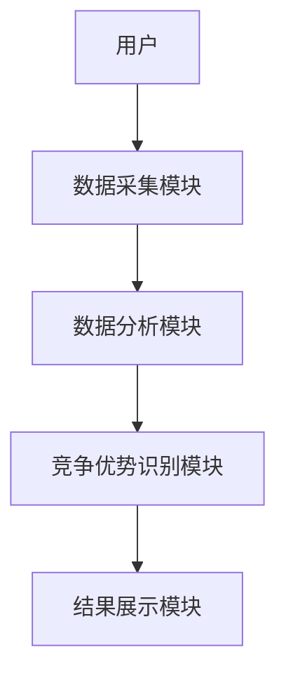
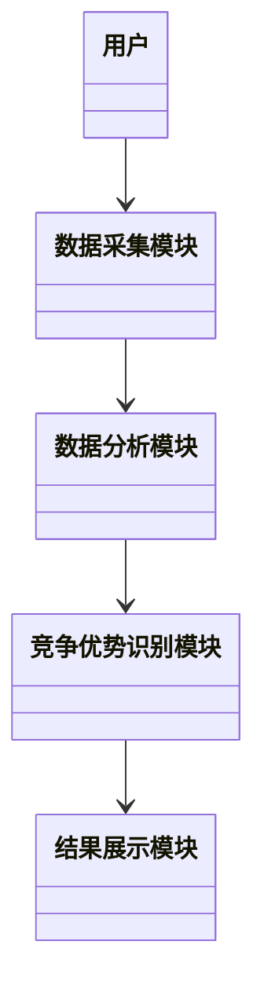
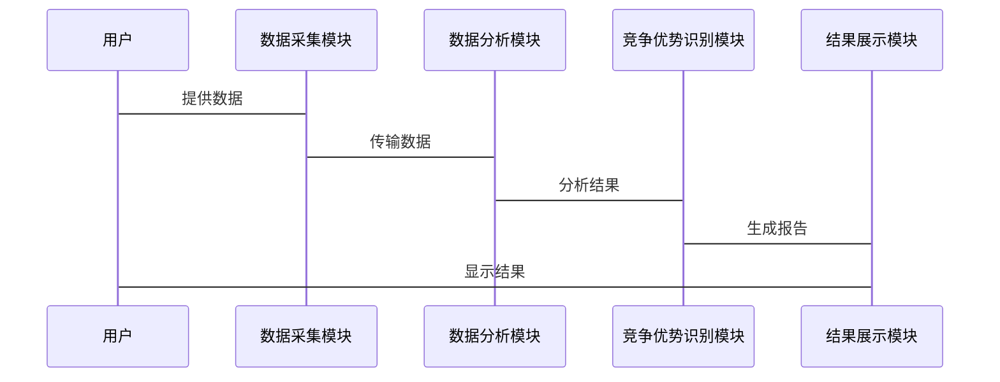
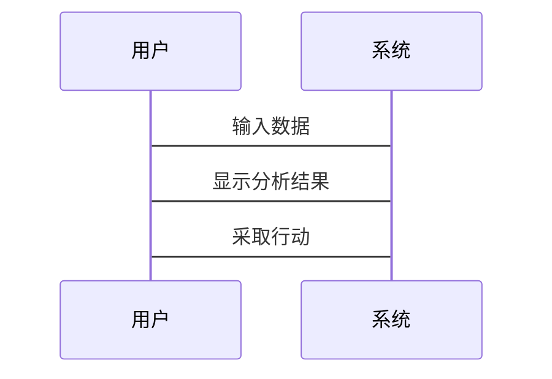

                 


# 如何识别企业的竞争优势

> 关键词：企业竞争优势、识别方法、分析工具、数学模型、系统架构

> 摘要：企业竞争优势是企业在市场中生存和发展的关键因素。本文从竞争优势的定义、构成要素、分析框架、识别方法、数学模型、系统架构到项目实战，详细阐述了如何系统性地识别和分析企业竞争优势。通过SWOT分析、波特五力模型、价值链分析等工具，结合数学模型和系统架构设计，为读者提供一套完整的竞争优势识别方法论。

---

# 第1章: 企业竞争优势的定义与重要性

## 1.1 什么是企业竞争优势
### 1.1.1 竞争优势的定义
竞争优势是指企业在市场中相对于竞争对手的独特优势，能够使企业在产品、服务、成本、品牌、技术等方面获得更高的市场份额或利润。

### 1.1.2 竞争优势的核心要素
竞争优势的核心要素包括：
- **产品与服务**：产品的质量、功能、创新性。
- **成本与效率**：生产成本、运营效率。
- **品牌与客户关系**：品牌知名度、客户忠诚度。
- **创新与技术**：技术领先性、研发能力。

### 1.1.3 竞争优势的分类与层次
竞争优势可以分为以下层次：
- **核心竞争优势**：企业的核心能力，如技术创新、核心产品。
- **相对竞争优势**：相对于竞争对手的优势。
- **绝对竞争优势**：在市场上具有绝对优势。

## 1.2 识别竞争优势的重要性
### 1.2.1 竞争优势对企业生存与发展的意义
竞争优势是企业在市场中生存和发展的基础，决定了企业的市场地位和盈利能力。

### 1.2.2 竞争优势与企业战略的关系
竞争优势是企业制定战略的重要依据，直接影响企业的市场进入、产品定位和资源分配。

### 1.2.3 竞争优势在不同行业中的表现
竞争优势在不同行业中的表现形式不同，例如制造业可能注重成本和生产效率，而科技行业则注重技术创新。

## 1.3 本章小结
### 1.3.1 核心概念回顾
竞争优势是企业在市场中相对于竞争对手的独特优势，包括产品、成本、品牌和技术等方面。

### 1.3.2 下一章的预览
下一章将详细分析竞争优势的构成要素和分析框架，帮助读者更好地理解竞争优势的来源和结构。

---

# 第2章: 竞争优势的构成要素与分析框架

## 2.1 竞争优势的核心要素
### 2.1.1 产品与服务优势
产品与服务优势是竞争优势的重要来源，包括产品的质量、功能、创新性和售后服务。

### 2.1.2 成本与效率优势
成本与效率优势是指企业在生产、运营和管理中的成本控制能力，直接影响企业的盈利能力。

### 2.1.3 品牌与客户关系优势
品牌与客户关系优势是企业长期发展的基石，包括品牌知名度、客户忠诚度和客户关系管理能力。

### 2.1.4 创新与技术优势
创新与技术优势是企业持续发展的动力，包括技术创新、研发能力和专利数量。

## 2.2 竞争优势的分析框架
### 2.2.1 SWOT分析法
SWOT分析法是一种常用的竞争优势分析工具，通过分析企业的优势（Strengths）、劣势（Weaknesses）、机会（Opportunities）和威胁（Threats），帮助企业识别竞争优势和改进空间。

### 2.2.2 波特五力模型
波特五力模型是迈克尔·波特提出的行业竞争分析工具，包括新进入者威胁、替代品威胁、供应商议价能力、买家议价能力和行业内竞争程度。

### 2.2.3 价值链分析
价值链分析是一种通过分解企业价值链各环节，识别核心竞争力和成本优势的方法。

## 2.3 本章小结
### 2.3.1 竞争优势构成要素总结
竞争优势由产品、成本、品牌和技术等多个要素构成，每个要素都对企业的市场地位产生重要影响。

### 2.3.2 分析框架的综合应用
通过SWOT分析法、波特五力模型和价值链分析，可以全面识别和评估企业的竞争优势。

---

# 第3章: 竞争优势的识别方法与工具

## 3.1 竞争优势识别的基本方法
### 3.1.1 行业分析法
行业分析法通过分析行业趋势、竞争对手和市场环境，识别企业在行业中的竞争优势。

### 3.1.2 对比分析法
对比分析法通过将企业与竞争对手进行对比，找出企业的优势和劣势。

### 3.1.3 核心竞争力分析法
核心竞争力分析法通过识别企业的核心能力，确定企业的竞争优势。

## 3.2 竞争优势识别的工具
### 3.2.1 SWOT分析工具
SWOT分析工具通过分析企业的优势、劣势、机会和威胁，帮助企业识别竞争优势。

### 3.2.2 价值链分析工具
价值链分析工具通过分解企业价值链，识别核心竞争力和成本优势。

### 3.2.3 竞争对手分析工具
竞争对手分析工具通过分析竞争对手的市场行为、产品策略和竞争优势，帮助企业识别自身的竞争优势。

## 3.3 本章小结
### 3.3.1 常用识别方法总结
行业分析法、对比分析法和核心竞争力分析法是识别竞争优势的常用方法。

### 3.3.2 工具选择的注意事项
选择合适的工具和方法，根据企业的具体情况灵活应用，才能更好地识别竞争优势。

---

# 第4章: 企业竞争优势的数学模型与分析

## 4.1 竞争优势的数学模型
### 4.1.1 企业竞争力评分模型
企业竞争力评分模型通过对企业在多个维度上的表现进行评分，计算出企业的综合竞争力指数。

### 4.1.2 市场占有率模型
市场占有率模型通过计算企业的市场占有率，评估企业在市场中的竞争优势。

### 4.1.3 利润率与成本优化模型
利润率与成本优化模型通过分析企业的利润率和成本结构，优化企业的成本控制能力。

## 4.2 竞争优势分析的算法原理
### 4.2.1 竞争优势评分算法
竞争优势评分算法通过对企业在多个维度上的表现进行加权评分，计算出综合竞争力指数。

### 4.2.2 基于数据挖掘的竞争优势识别算法
基于数据挖掘的算法通过分析企业的销售数据、客户反馈和市场趋势，识别企业的竞争优势。

### 4.2.3 基于机器学习的竞争优势预测模型
基于机器学习的模型通过训练历史数据，预测企业的竞争优势变化趋势。

## 4.3 竞争优势分析的数学公式
### 4.3.1 竞争优势指数公式
$$ \text{竞争优势指数} = \frac{\text{企业表现} - \text{行业平均}}{\text{行业标准差}} $$

### 4.3.2 市场占有率计算公式
$$ \text{市场占有率} = \frac{\text{企业销量}}{\text{行业总销量}} \times 100\% $$

## 4.4 本章小结
### 4.4.1 数学模型的应用价值
数学模型可以帮助企业量化竞争优势，提供科学的决策依据。

### 4.4.2 算法原理的总结
通过数据挖掘和机器学习算法，可以更准确地识别和预测企业的竞争优势。

---

# 第5章: 企业竞争优势的系统分析与架构设计

## 5.1 竞争优势识别的系统架构
### 5.1.1 系统功能模块划分
系统功能模块包括数据采集、数据分析、竞争优势识别和结果展示。

### 5.1.2 系统数据流设计
系统数据流包括数据输入、数据处理、数据分析和结果输出。

### 5.1.3 系统架构图（Mermaid）


## 5.2 项目介绍
### 5.2.1 项目目标
识别企业的竞争优势，优化企业战略和资源配置。

### 5.2.2 项目范围
涵盖企业内部资源、市场环境、竞争对手分析等多个方面。

## 5.3 系统功能设计
### 5.3.1 系统功能模块
- 数据采集模块：采集企业内外部数据。
- 数据分析模块：对数据进行清洗、分析和建模。
- 竞争优势识别模块：识别企业的竞争优势并生成报告。
- 结果展示模块：以可视化方式展示竞争优势分析结果。

### 5.3.2 系统功能流程
1. 数据采集模块收集企业内外部数据。
2. 数据分析模块对数据进行处理和分析，生成竞争优势评分。
3. 竞争优势识别模块根据评分结果，识别企业的竞争优势。
4. 结果展示模块以图表和报告的形式展示分析结果。

## 5.4 系统架构设计
### 5.4.1 系统架构图（Mermaid）


## 5.5 系统接口设计
### 5.5.1 接口描述
- 数据采集接口：接收外部数据输入。
- 数据分析接口：处理数据并返回分析结果。
- 竞争优势识别接口：根据分析结果生成竞争优势报告。
- 结果展示接口：展示竞争优势分析结果。

### 5.5.2 接口交互（Mermaid）


## 5.6 系统交互设计
### 5.6.1 用户与系统交互流程
1. 用户输入数据。
2. 系统进行数据处理和分析。
3. 系统生成竞争优势报告。
4. 用户查看报告并采取行动。

### 5.6.2 交互流程图（Mermaid）


## 5.7 本章小结
### 5.7.1 系统架构设计总结
通过系统架构设计，可以高效地识别企业的竞争优势，优化企业战略。

### 5.7.2 系统功能与接口设计的注意事项
系统设计需要考虑数据的安全性、分析的准确性和结果的可操作性。

---

# 第6章: 项目实战

## 6.1 环境安装与配置
### 6.1.1 系统环境要求
- 操作系统：Windows/Mac/Linux
- 开发工具：Python、Jupyter Notebook、Mermaid
- 数据库：MySQL/PostgreSQL

### 6.1.2 软件安装
- Python安装：使用pip安装必要的库，如pandas、numpy、matplotlib、mermaid等。

## 6.2 系统核心实现源代码
### 6.2.1 数据采集模块
```python
import pandas as pd
import requests

# 采集企业数据
def collect_data(company):
    url = f"https://api.example.com/{company}"
    response = requests.get(url)
    data = response.json()
    return pd.DataFrame(data)
```

### 6.2.2 数据分析模块
```python
import pandas as pd

# 数据清洗和分析
def analyze_data(df):
    # 数据清洗
    df = df.dropna()
    df = df.astype('float64')
    # 竞争优势评分
    industry_avg = df['industry_avg'].mean()
    industry_std = df['industry_std'].std()
    competitive_index = (df['company_score'] - industry_avg) / industry_std
    return competitive_index
```

### 6.2.3 竞争优势识别模块
```python
import pandas as pd

# 识别竞争优势
def identify_competitive_advantages(df):
    competitive_index = analyze_data(df)
    advantages = []
    for idx, score in enumerate(competitive_index):
        if score > 1:
            advantages.append(df['company'].iloc[idx])
    return advantages
```

### 6.2.4 结果展示模块
```python
import matplotlib.pyplot as plt

# 可视化展示
def visualize_results(advantages):
    plt.figure(figsize=(10, 6))
    plt.bar(range(len(advantages)), [1]*len(advantages))
    plt.title('竞争优势企业')
    plt.xticks(range(len(advantages)), advantages)
    plt.show()
```

## 6.3 代码实现与应用解读
### 6.3.1 数据采集模块
通过API接口采集企业的数据，包括市场份额、成本、品牌知名度等。

### 6.3.2 数据分析模块
对采集到的数据进行清洗、分析和建模，计算竞争优势指数。

### 6.3.3 竞争优势识别模块
根据竞争优势指数，识别出具有竞争优势的企业。

### 6.3.4 结果展示模块
以可视化的方式展示竞争优势分析结果，帮助用户直观理解。

## 6.4 案例分析与详细讲解
### 6.4.1 案例背景
假设我们有一个制造企业，需要识别其竞争优势。

### 6.4.2 数据采集与分析
采集企业的销售数据、成本数据、市场占有率等，分析得出竞争优势指数。

### 6.4.3 竞争优势识别
识别出企业在成本控制和技术创新方面的竞争优势。

### 6.4.4 结果展示
通过图表展示企业在成本控制和技术创新方面的优势。

## 6.5 项目小结
### 6.5.1 项目实现的关键点
数据采集的准确性、数据分析的科学性、结果展示的直观性。

### 6.5.2 项目实现的注意事项
数据隐私保护、算法的可解释性、系统的可扩展性。

---

# 第7章: 最佳实践、小结与拓展阅读

## 7.1 最佳实践 tips
### 7.1.1 数据驱动决策
通过数据分析和数学模型，科学识别竞争优势。

### 7.1.2 结合行业特点
根据不同行业的特点，灵活应用竞争优势识别方法。

### 7.1.3 持续优化
定期评估和优化竞争优势识别方法，适应市场变化。

## 7.2 本章小结
### 7.2.1 核心内容回顾
竞争优势是企业在市场中的独特优势，识别竞争优势对企业的发展至关重要。

### 7.2.2 本章总结
通过系统的方法和工具，结合数学模型和系统架构设计，可以高效地识别和分析企业的竞争优势。

## 7.3 注意事项
### 7.3.1 数据准确性
确保数据的准确性和完整性，避免错误分析。

### 7.3.2 方法适用性
根据企业的具体情况，选择合适的竞争优势识别方法。

## 7.4 拓展阅读
### 7.4.1 推荐书籍
- 《竞争优势：企业战略管理》
- 《波特五力模型：行业竞争分析》

### 7.4.2 推荐博客
- 竞争优势分析的博客文章链接
- 系统架构设计的博客文章链接

---

# 作者：AI天才研究院/AI Genius Institute & 禅与计算机程序设计艺术/Zen And The Art of Computer Programming

