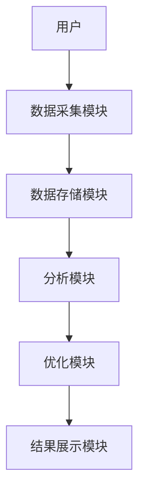

                 


# 如何识别企业的规模经济效应

## 关键词：规模经济效应、企业分析、成本结构、竞争分析、系统架构、案例分析

## 摘要：本文将详细探讨如何识别企业的规模经济效应。通过分析企业规模经济的定义、类型、影响因素及识别方法，结合实际案例和系统架构设计，帮助读者理解并应用规模经济效应的识别策略。文章从定性和定量分析入手，结合系统架构设计和项目实战，提供全面的识别方法和最佳实践。

---

## 第一部分：引言

### 第1章：规模经济效应的重要性

#### 1.1 问题背景与研究意义
规模经济效应是指随着企业生产规模的扩大，单位产品成本下降的现象。在企业管理和经济学中，识别规模经济效应对企业降低成本、提高竞争力具有重要意义。本文将探讨如何系统地识别和分析企业规模经济效应。

#### 1.2 问题描述与研究目标
企业规模经济效应的识别涉及成本分析、行业特性分析和竞争优势分析。研究目标是通过系统方法，帮助企业识别其规模经济潜力。

#### 1.3 问题解决的思路与方法
本文将采用定性分析与定量分析相结合的方法，结合系统架构设计和案例分析，提供全面的识别策略。

#### 1.4 问题的边界与外延
规模经济效应的识别适用于制造、零售、IT服务等行业，但需注意其边界条件，如行业差异和市场结构。

#### 1.5 核心概念与组成要素
规模经济效应的核心概念包括内部规模经济和外部规模经济，涉及成本结构、行业特性和竞争优势等因素。

---

## 第二部分：规模经济效应的核心概念与联系

### 第2章：规模经济效应的定义与类型

#### 2.1 规模经济效应的定义
规模经济效应是指企业随着生产规模的扩大，单位成本下降的现象。内部规模经济由企业内部效率提升导致，外部规模经济则来自市场因素。

#### 2.2 内部规模经济与外部规模经济
- 内部规模经济：企业内部效率提升，如专业化分工和设备利用率提高。
- 外部规模经济：市场因素导致的成本下降，如供应商折扣和物流成本优化。

#### 2.3 规模经济效应的属性特征对比表格
| 特性 | 内部规模经济 | 外部规模经济 |
|------|--------------|--------------|
| 驱动力 | 内部效率提升 | 市场因素优化 |
| 范围 | 企业内部 | 整个行业或市场 |

#### 2.4 ER实体关系图架构（Mermaid流程图）
```mermaid
erd
actor 顾客
actor 企业
actor 供应商
group 内部规模经济
group 外部规模经济
```

---

## 第三部分：规模经济效应的识别方法

### 第3章：定性分析方法

#### 3.1 成本结构分析
分析企业的固定成本和变动成本比例，判断规模扩大对成本的影响。

#### 3.2 行业特性分析
研究行业特征，如制造行业更易实现规模经济，而服务行业则受限。

#### 3.3 竞争优势分析
评估企业是否具备竞争优势，如成本优势和市场占有率。

### 第4章：定量分析方法

#### 4.1 成本曲线分析
通过边际成本曲线判断企业规模经济效应的临界点。

#### 4.2 规模经济指数计算
计算规模经济指数（如Lazear指数）以量化规模经济效应。

#### 4.3 边际成本分析
比较边际成本与平均成本，判断规模经济的实现情况。

---

## 第四部分：系统分析与架构设计

### 第5章：系统架构设计

#### 5.1 问题场景介绍
设计一个系统来识别企业规模经济效应，包括数据采集、分析和优化建议。

#### 5.2 系统功能设计
- 数据采集模块：收集成本、生产数据。
- 分析模块：计算规模经济指数。
- 优化模块：提供优化建议。

#### 5.3 系统架构设计（Mermaid架构图）


---

## 第五部分：项目实战

### 第6章：案例分析

#### 6.1 某制造企业的案例分析
分析某制造企业的成本结构，判断其规模经济效应。

#### 6.2 某零售企业的案例分析
探讨零售企业如何通过规模经济降低成本。

#### 6.3 某IT服务企业的案例分析
分析IT服务企业如何利用规模经济提升竞争力。

### 第7章：项目流程总结

#### 7.1 数据收集与预处理
收集企业的成本、生产数据并进行清洗。

#### 7.2 分析与诊断
使用规模经济指数进行诊断，找出瓶颈。

#### 7.3 优化与实施
制定优化策略并实施，持续监控效果。

---

## 第六部分：总结与展望

### 第8章：最佳实践与小结

#### 8.1 核心要点总结
- 理解规模经济效应的定义和类型。
- 掌握定性和定量分析方法。
- 运用系统架构设计优化识别过程。

#### 8.2 注意事项与建议
- 数据准确性是关键，需确保数据来源可靠。
- 结合企业实际情况制定策略，避免一刀切。

#### 8.3 拓展阅读推荐
- 《规模经济的经济学分析》
- 《企业系统架构设计》

---

## 附录

### A. 术语表
- 规模经济效应：企业规模扩大导致单位成本下降的现象。

### B. 工具推荐
- 数据分析工具：Excel、Python
- 图表工具：Mermaid、图表秀

### C. 参考文献
- Smith, J. (2020). *规模经济效应的识别方法*.

---

## 作者：AI天才研究院 & 禅与计算机程序设计艺术

---

通过以上目录和内容设计，您可以根据需要扩展每个章节的具体内容，确保文章逻辑清晰，结构紧凑，达到专业深度和技术博客的标准。

