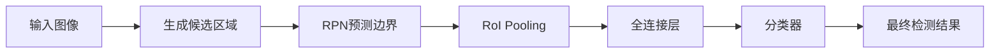
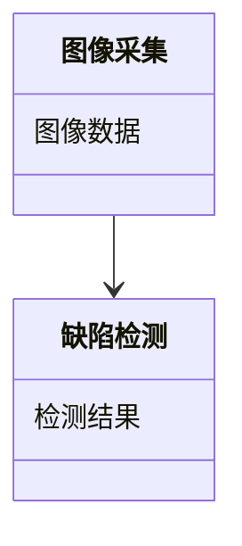
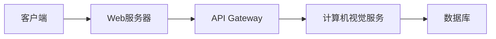
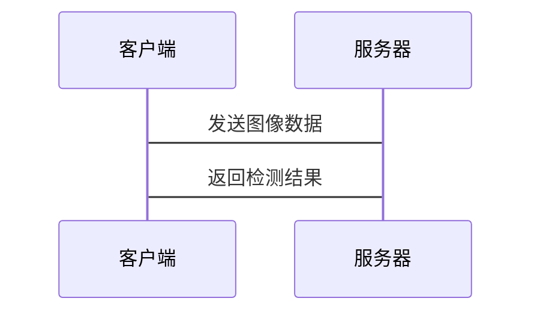

                 


# 如何识别企业的计算机视觉技术优势

## 关键词：
计算机视觉，企业技术优势，算法原理，系统架构，项目实战，技术应用

## 摘要：
本文详细探讨了如何识别企业中的计算机视觉技术优势，涵盖了技术背景、核心概念、算法原理、系统架构、项目实战及最佳实践。通过实际案例分析，帮助读者理解如何在企业中有效应用计算机视觉技术，提升企业竞争力。

## 第1章：计算机视觉技术概述

### 1.1 计算机视觉的基本概念

#### 1.1.1 计算机视觉的定义与核心概念
计算机视觉（Computer Vision）是研究如何让计算机“看”懂图像或视频的技术，主要通过模拟人类视觉系统来处理和理解视觉信息。其核心概念包括图像处理、目标检测、图像分割和场景理解。

#### 1.1.2 计算机视觉的主要技术背景
随着深度学习的发展，计算机视觉技术取得了显著进步，尤其是在物体检测、图像分割和目标识别方面。这些技术广泛应用于医疗、金融、制造和交通等领域。

#### 1.1.3 企业中的计算机视觉技术应用场景
在企业中，计算机视觉技术可应用于产品质量检测、智能安防、物流优化和用户行为分析等方面，帮助企业提高效率、降低成本并提升用户体验。

---

## 第2章：计算机视觉的核心概念与技术

### 2.1 图像处理基础

#### 2.1.1 图像的获取与表示
图像可以通过摄像头或扫描仪获取，通常以像素矩阵表示。每个像素的值表示颜色和亮度信息。

#### 2.1.2 常见图像处理算法
| 技术 | 描述 | 优缺点 |
|------|------|--------|
| 坍缩 | 减少图像尺寸 | 显著降低空间复杂度 |
| 二值化 | 将图像转换为黑白 | 简化数据，便于后续处理 |
| 颜色空间转换 | 转换为HSV或RGB | 便于分析颜色特征 |

### 2.2 目标检测与识别

#### 2.2.1 目标检测技术
目标检测旨在识别图像中的物体并确定其位置。常用算法包括Faster R-CNN和YOLO，后者以其高效性著称。

#### 2.2.2 识别算法的优缺点对比
| 技术 | 优点 | 缺点 |
|------|------|------|
| YOLO | 高效实时 | 较低的精度 |
| Faster R-CNN | 高精度 | 较低的效率 |

### 2.3 图像分割与场景理解

#### 2.3.1 图像分割技术
图像分割将图像划分为多个区域，每个区域具有相似的特征。常用技术包括基于区域的分割和基于深度学习的分割。

#### 2.3.2 场景理解的应用
场景理解帮助计算机理解图像中的场景结构，应用于自动驾驶、机器人导航等领域。

---

## 第3章：计算机视觉算法原理

### 3.1 卷积神经网络（CNN）

#### 3.1.1 CNN的基本结构
CNN由卷积层、池化层和全连接层组成，用于提取图像特征。

#### 3.1.2 卷积操作的数学模型
卷积操作可以表示为：
$$ (I * K)(i, j) = \sum_{k=-s}^{s} \sum_{l=-t}^{t} I(i+k, j+l) \cdot K(k, l) $$
其中，\( I \) 是输入图像，\( K \) 是卷积核，\( s \) 和 \( t \) 是卷积核的尺寸。

### 3.2 Faster R-CNN算法

#### 3.2.1 算法流程图


#### 3.2.2 代码实现示例
```python
import torch
import torch.nn as nn

# 定义卷积层
conv_layer = nn.Conv2d(in_channels=3, out_channels=6, kernel_size=3, stride=1, padding=0)
# 前向传播
output = conv_layer(input_tensor)
```

---

## 第4章：系统分析与架构设计

### 4.1 项目介绍

#### 4.1.1 项目目标
本项目旨在开发一个基于计算机视觉的缺陷检测系统，用于自动检测生产过程中的产品缺陷。

### 4.2 系统功能设计

#### 4.2.1 领域模型设计（Mermaid类图）


### 4.3 系统架构设计

#### 4.3.1 架构图（Mermaid架构图）


### 4.4 接口设计与交互

#### 4.4.1 交互序列图


---

## 第5章：项目实战

### 5.1 环境安装与配置

#### 5.1.1 开发环境搭建
安装Python、TensorFlow和OpenCV等依赖库。

### 5.2 核心代码实现

#### 5.2.1 代码示例与解读
```python
import cv2

# 读取图像
image = cv2.imread('input.jpg')
# 转换为灰度图
gray = cv2.cvtColor(image, cv2.COLOR_BGR2GRAY)
# 保存结果
cv2.imwrite('output.jpg', gray)
```

### 5.3 实际案例分析

#### 5.3.1 案例分析与总结
通过实际案例分析，总结在项目实施过程中遇到的问题及解决方案，强调算法优化和系统设计的重要性。

---

## 第6章：最佳实践与总结

### 6.1 最佳实践

#### 6.1.1 技术选择与优化
根据具体需求选择合适的算法，如使用轻量级模型优化实时性。

#### 6.1.2 项目实施中的注意事项
注重数据质量，确保数据多样性和代表性，避免过拟合。

### 6.2 小结与展望

#### 6.2.1 本书总结
本文详细介绍了如何识别和利用企业的计算机视觉技术优势，从理论到实践，为读者提供了全面的指导。

---

## 作者

作者：AI天才研究院 & 禅与计算机程序设计艺术

