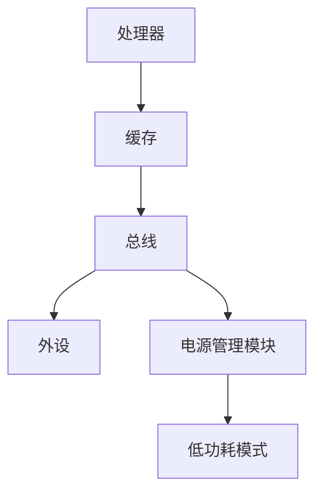
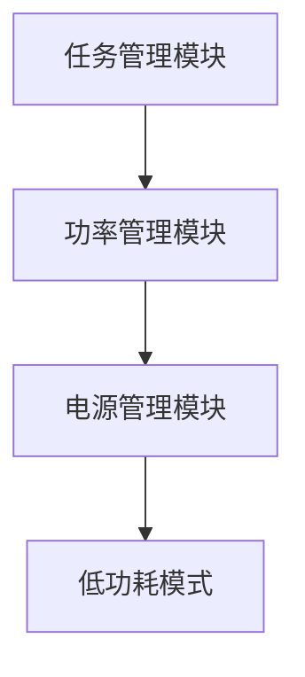
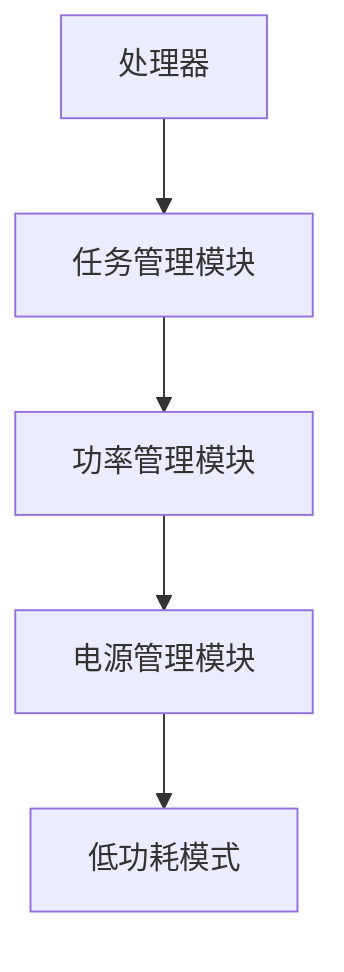

                 


```markdown
# 如何识别企业的边缘AI芯片低功耗设计优势

## 关键词：边缘AI芯片，低功耗设计，动态电压频率调节，漏电优化，系统架构

## 摘要：  
边缘AI芯片的低功耗设计是当前技术领域的热门话题，尤其是在边缘计算快速发展的背景下，如何识别和优化边缘AI芯片的低功耗设计优势成为企业技术决策的关键。本文将从边缘AI芯片的基本概念入手，深入探讨低功耗设计的核心原理、算法实现、系统架构，并结合实际项目案例，为企业技术团队提供一套全面的低功耗设计识别和优化方案。

---

## 第一部分: 边缘AI芯片低功耗设计背景与概念

## 第1章: 边缘AI芯片的基本概念

### 1.1 边缘计算与AI芯片的结合

#### 1.1.1 边缘计算的定义与特点
边缘计算是一种分布式计算范式，数据在靠近数据源的设备上进行处理，减少对云端的依赖。其特点包括低延迟、高实时性、本地化数据处理和高效带宽利用。

#### 1.1.2 AI芯片在边缘计算中的作用
AI芯片（如GPU、TPU、NPU）在边缘计算中用于加速机器学习模型的推理和训练，提升边缘设备的智能决策能力。

#### 1.1.3 边缘AI芯片的典型应用场景
- 智能摄像头：实时视频分析和目标检测。
- 工业自动化：设备状态监测和预测性维护。
- 智能音箱：语音识别和自然语言处理。
- 智慧城市：环境监测和数据处理。

### 1.2 低功耗设计的重要性

#### 1.2.1 功耗对边缘AI芯片性能的影响
- 高功耗会导致设备发热，影响设备稳定性。
- 过高的功耗会增加能源成本，尤其在物联网设备中。
- 电池供电设备（如移动终端）需要低功耗设计以延长续航时间。

#### 1.2.2 低功耗设计的核心目标
- 最小化芯片在运行过程中的能量消耗。
- 在保证性能的前提下，优化功耗，延长设备续航。
- 降低设备的散热需求，提升设备的可靠性。

#### 1.2.3 边缘AI芯片的功耗优化策略
- 硬件级优化：采用低功耗工艺和电路设计。
- 软件级优化：动态调整工作频率和电压。
- 系统级优化：结合任务负载动态调整功耗。

### 1.3 边缘AI芯片的市场与发展

#### 1.3.1 边缘AI芯片的市场现状
- 市场需求快速增长，尤其是AI推理芯片。
- 主流厂商包括英伟达、Google（TPU）、寒武纪、地平线等。

#### 1.3.2 主流边缘AI芯片厂商分析
| 厂商   | 芯片系列       | 核心特点                   |
|--------|----------------|---------------------------|
| 英伟达  | Jetson系列     | 高性能、广泛应用于边缘设备 |
| Google | TPU            | 专为机器学习设计，性能卓越 |
| 寒武纪  | MLU系列        | 高能效比，适合边缘部署     |
| 地平线  | 微安系列        | 低功耗、高能效             |

#### 1.3.3 未来边缘AI芯片的发展趋势
- 芯片制程工艺的不断进步（如5nm、3nm）。
- 更高的能效比（每瓦性能）。
- AI指令集的优化和专用硬件加速。

---

## 第2章: 低功耗设计的核心概念与原理

### 2.1 低功耗设计的基本原理

#### 2.1.1 动态电压频率调整技术
动态电压频率调整（DVFS）是一种通过动态调节芯片的工作电压和频率来优化功耗的技术。在低负载情况下，降低电压和频率以减少功耗；在高负载情况下，提高电压和频率以保证性能。

#### 2.1.2 漏电优化技术
漏电优化技术通过改进电路设计、使用低漏电工艺和材料，减少静态漏电（ leakage power ）。

#### 2.1.3 睡眠模式与唤醒机制
芯片在空闲状态下进入低功耗模式（如睡眠模式），并在需要时快速唤醒，减少不必要的功耗。

### 2.2 低功耗设计的关键技术对比

#### 2.2.1 动态电压频率调整技术对比表
| 技术特点          | 优点                          | 缺点                          |
|-------------------|-------------------------------|-------------------------------|
| 动态调节电压       | 节能效果显著，适合动态任务负载 | 调制过程可能引入额外功耗     |
| 动态调节频率       | 提高能效比，适合低负载场景     | 高负载时性能可能受限         |

#### 2.2.2 漏电优化技术对比表
| 技术特点          | 优点                          | 缺点                          |
|-------------------|-------------------------------|-------------------------------|
| 电路优化          | 显著降低静态漏电               | 设计复杂度增加               |
| 材料优化          | 提高材料质量，减少漏电          | 成本增加                      |

#### 2.2.3 睡眠模式与唤醒机制对比表
| 技术特点          | 优点                          | 缺点                          |
|-------------------|-------------------------------|-------------------------------|
| 睡眠模式           | 节能效果显著                   | 唤醒时间较长，影响实时性       |
| 快速唤醒机制       | 实时性高                       | 唤醒过程可能消耗额外功耗       |

### 2.3 低功耗设计的系统架构

#### 2.3.1 边缘AI芯片系统架构图


### 2.4 低功耗设计的实现流程
1. 确定任务负载需求。
2. 根据任务负载动态调整电压和频率。
3. 在空闲状态下进入低功耗模式。
4. 监测任务负载变化，及时唤醒芯片。

### 2.5 本章小结
本章介绍了低功耗设计的核心原理和关键技术，包括动态电压频率调整、漏电优化和睡眠模式等。通过对比分析，帮助读者理解不同技术的特点和适用场景。

---

## 第3章: 低功耗设计的算法原理

### 3.1 动态电压频率调节算法

#### 3.1.1 动态电压频率调节的原理
动态电压频率调节（DVFS）通过调整芯片的工作电压和频率来优化功耗。在低负载时降低电压和频率，减少功耗；在高负载时提高电压和频率，保证性能。

#### 3.1.2 动态电压频率调节的实现流程
1. 监测当前任务负载。
2. 根据负载动态调整电压和频率。
3. 记录功耗变化，优化调整策略。

#### 3.1.3 动态电压频率调节的数学模型
动态电压频率调节的数学模型如下：
$$ P = k \cdot V^2 \cdot f $$
其中，\( P \) 是功耗，\( V \) 是电压，\( f \) 是频率，\( k \) 是比例常数。

#### 3.1.4 动态电压频率调节的代码实现
```python
import time

def dvfs_adjustment(current_load):
    if current_load < 50:
        # 降低电压和频率
        voltage = 0.8  # 降低电压
        frequency = 800  # 降低频率
    else:
        # 提高电压和频率
        voltage = 1.2  # 提高电压
        frequency = 1200  # 提高频率
    return voltage, frequency

# 示例代码
current_load = 60
voltage, frequency = dvfs_adjustment(current_load)
print(f"电压：{voltage}V，频率：{frequency}MHz")
```

### 3.2 漏电优化算法

#### 3.2.1 漏电优化算法的原理
漏电优化算法通过改进电路设计和使用低漏电材料，减少静态漏电。具体方法包括电路布局优化、材料选择和工艺改进。

#### 3.2.2 漏电优化算法的实现流程
1. 设计低漏电电路。
2. 选择低漏电材料。
3. 优化制造工艺。

#### 3.2.3 漏电优化算法的数学模型
漏电优化算法的数学模型如下：
$$ P_{leak} = k \cdot (V_{dd})^2 \cdot t_{leak} $$
其中，\( P_{leak} \) 是漏电功耗，\( V_{dd} \) 是电源电压，\( t_{leak} \) 是漏电时间，\( k \) 是比例常数。

### 3.3 睡眠模式与唤醒机制

#### 3.3.1 睡眠模式的原理
睡眠模式是一种低功耗模式，芯片在空闲状态下进入睡眠模式，减少功耗。

#### 3.3.2 唤醒机制的实现流程
1. 检测到任务请求。
2. 唤醒芯片。
3. 恢复正常工作状态。

#### 3.3.3 唤醒机制的数学模型
唤醒机制的数学模型如下：
$$ T_{wake} = t_{detect} + t_{restore} $$
其中，\( T_{wake} \) 是唤醒时间，\( t_{detect} \) 是检测时间，\( t_{restore} \) 是恢复时间。

### 3.4 本章小结
本章详细介绍了低功耗设计中的动态电压频率调节、漏电优化和睡眠模式等算法原理，并通过数学模型和代码实现进行了深入分析。

---

## 第4章: 低功耗设计的系统架构与实现

### 4.1 系统功能设计

#### 4.1.1 系统功能模块
- 任务管理模块：负责任务的分配和调度。
- 功率管理模块：负责动态调整电压和频率。
- 电源管理模块：负责管理电源状态和低功耗模式。

#### 4.1.2 系统功能流程图


### 4.2 系统架构设计

#### 4.2.1 系统架构图


### 4.3 系统接口设计

#### 4.3.1 系统接口
- 处理器与任务管理模块的接口。
- 功率管理模块与电源管理模块的接口。
- 电源管理模块与低功耗模式的接口。

#### 4.3.2 接口交互流程图


### 4.4 本章小结
本章介绍了低功耗设计的系统架构与实现，包括功能模块、架构图和接口设计等内容。

---

## 第5章: 项目实战

### 5.1 环境安装

#### 5.1.1 开发环境
- 操作系统：Linux
- 开发工具：Python、Git、Make

#### 5.1.2 硬件环境
- 边缘AI芯片：NVIDIA Jetson Nano
- 开发板：Raspberry Pi

### 5.2 系统核心实现

#### 5.2.1 核心代码实现
```python
import RPi.GPIO as GPIO
import time

# 设置GPIO模式
GPIO.setmode(GPIO.BCM)
GPIO.setwarnings(False)

# 定义唤醒引脚
WAKEUP_PIN = 18

# 唤醒函数
def wake_up():
    GPIO.output(WAKEUP_PIN, GPIO.HIGH)
    time.sleep(0.1)
    GPIO.output(WAKEUP_PIN, GPIO.LOW)

# 睡眠函数
def go_to_sleep():
    GPIO.output(WAKEUP_PIN, GPIO.LOW)
    time.sleep(0.1)

# 示例代码
if __name__ == "__main__":
    wake_up()
    time.sleep(2)
    go_to_sleep()
```

#### 5.2.2 代码解读与分析
- 代码实现了GPIO引脚的控制，用于芯片的唤醒和睡眠。
- 使用GPIO引脚控制唤醒信号，通过高低电平变化实现芯片的唤醒和睡眠。

### 5.3 实际案例分析

#### 5.3.1 案例背景
某工业自动化设备需要在边缘环境中运行AI推理任务，要求低功耗设计以延长设备续航时间。

#### 5.3.2 案例实现
1. 使用NVIDIA Jetson Nano作为边缘AI芯片。
2. 实现动态电压频率调节算法，优化功耗。
3. 在空闲状态下进入低功耗模式，延长设备续航时间。

### 5.4 详细讲解剖析

#### 5.4.1 动态电压频率调节的优化
通过动态调整电压和频率，根据任务负载优化功耗。

#### 5.4.2 睡眠模式的实现
在空闲状态下进入低功耗模式，减少不必要的功耗。

### 5.5 本章小结
本章通过实际案例分析，详细讲解了低功耗设计的项目实战，包括环境安装、核心代码实现和案例分析等内容。

---

## 第6章: 总结与展望

### 6.1 本章总结
本文从边缘AI芯片的基本概念入手，深入探讨了低功耗设计的核心原理、算法实现和系统架构，并结合实际项目案例，为企业技术团队提供了一套全面的低功耗设计识别和优化方案。

### 6.2 未来展望
未来，边缘AI芯片的低功耗设计将更加注重能效比的提升和算法的优化。随着技术的进步，低功耗设计将在更多领域得到广泛应用。

---

## 作者：AI天才研究院/AI Genius Institute & 禅与计算机程序设计艺术 /Zen And The Art of Computer Programming
```

