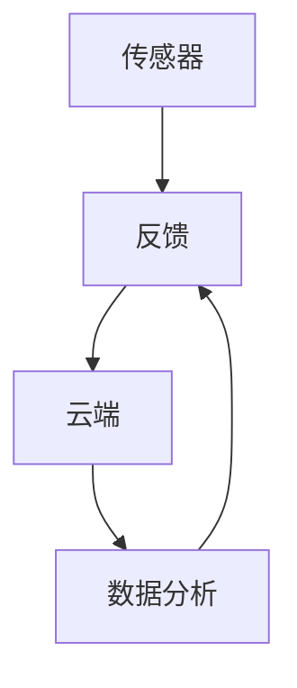
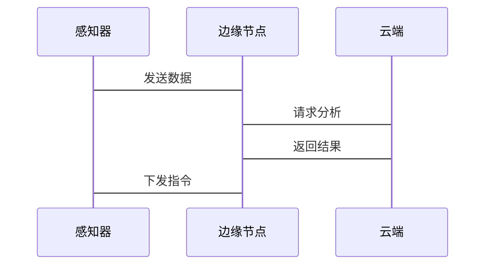

                 


# 如何识别企业的边缘AI芯片低延迟设计优势

## 关键词：
边缘AI芯片，低延迟设计，实时数据处理，任务调度算法，资源优化，边缘计算

## 摘要：
边缘AI芯片在企业中的应用越来越广泛，低延迟设计是其核心优势之一。本文将详细探讨如何识别和理解边缘AI芯片的低延迟设计优势，包括其在实时数据处理、任务调度、资源优化等方面的技术实现。通过分析系统架构和算法原理，结合实际案例和项目实战，帮助读者掌握边缘AI芯片低延迟设计的关键点，并提供最佳实践和总结。

---

## 第1章：边缘AI芯片与低延迟设计背景

### 1.1 边缘计算与AI芯片的背景

#### 1.1.1 边缘计算的定义与发展
边缘计算是一种分布式计算范式，数据在靠近数据源的地方进行处理，而非传回云端。随着物联网（IoT）和5G技术的发展，边缘计算的应用场景迅速扩展。

- **边缘计算的定义**：边缘计算是在靠近数据源的位置进行数据处理和存储的技术。
- **边缘计算的发展**：随着物联网和5G技术的普及，边缘计算在工业、医疗、交通等领域得到广泛应用。

#### 1.1.2 AI芯片在边缘计算中的作用
AI芯片（如GPU、TPU、NPU）专为加速AI任务设计，适合边缘环境下的实时数据处理和推理。

- **AI芯片的优势**：高计算效率、低功耗、适合边缘部署。
- **AI芯片的挑战**：硬件复杂度高、开发成本高、边缘环境限制。

#### 1.1.3 企业应用中的低延迟需求
企业在边缘AI应用中，对实时响应和低延迟处理的需求日益增长。

- **低延迟的重要性**：减少数据传输延迟，提升实时决策能力。
- **企业应用场景**：智能制造、实时监控、自动驾驶等领域。

### 1.2 边缘AI芯片的低延迟优势

#### 1.2.1 低延迟设计的核心概念
低延迟设计旨在减少数据处理和传输的时间，提升实时性。

- **实时性**：数据处理在最短时间完成，满足实时需求。
- **资源优化**：通过高效算法和硬件优化，降低资源消耗。

#### 1.2.2 边缘计算中的延迟挑战
边缘环境中，带宽受限、计算资源有限，如何优化延迟是一个关键问题。

- **带宽限制**：边缘设备通常带宽有限，数据传输延迟高。
- **计算资源**：边缘设备的计算资源有限，如何高效利用是挑战。

#### 1.2.3 低延迟对业务的影响
低延迟设计能够提升企业业务效率，增强用户体验。

- **业务效率提升**：快速响应，减少错误。
- **用户体验优化**：实时反馈，提升满意度。

---

## 第2章：低延迟设计的核心技术

### 2.1 实时数据处理

#### 2.1.1 实时数据处理的重要性
实时数据处理是边缘AI芯片的核心功能之一，能够快速响应业务需求。

- **实时处理的必要性**：在边缘环境中，实时数据处理能够快速做出决策，避免数据传输延迟。
- **边缘AI芯片的优势**：高性能计算能力和本地数据处理能力。

#### 2.1.2 边缘AI芯片在实时处理中的优势
边缘AI芯片通过本地计算和高效算法，实现快速数据处理。

- **本地计算**：减少数据传输延迟，提升处理速度。
- **高效算法**：优化算法结构，降低计算时间。

### 2.2 资源优化与性能提升

#### 2.2.1 资源分配策略
合理分配计算资源，提升系统性能。

- **资源分配原则**：根据任务优先级分配资源。
- **资源优化技术**：动态资源分配、负载均衡。

#### 2.2.2 性能优化技术
通过硬件加速和算法优化，提升计算性能。

- **硬件加速**：利用AI芯片加速计算，降低处理时间。
- **算法优化**：采用高效算法，减少计算复杂度。

### 2.3 并行计算与任务调度

#### 2.3.1 并行计算原理
并行计算通过同时处理多个任务，提升计算效率。

- **并行计算的定义**：将任务分解为多个子任务，同时执行。
- **并行计算的优势**：提升计算速度，降低延迟。

#### 2.3.2 任务调度算法
任务调度算法决定了任务在多核处理器上的分配和执行顺序。

- **调度算法的选择**：根据任务特性选择合适算法。
- **调度算法的优化**：减少任务切换时间，提升系统吞吐量。

---

## 第3章：低延迟设计的系统架构

### 3.1 系统架构概述

#### 3.1.1 边缘AI芯片的系统架构
边缘AI芯片通常采用分布式架构，包括传感器、边缘节点和云端协同工作。

- **分布式架构**：传感器、边缘节点和云端协同，实现数据处理和决策。
- **边缘节点功能**：数据采集、处理、存储和传输。

#### 3.1.2 系统架构的优缺点
- **优点**：高实时性、低延迟、资源利用率高。
- **缺点**：架构复杂、维护成本高。

### 3.2 系统组件与交互

#### 3.2.1 系统组件功能与关系
- **传感器**：数据采集。
- **边缘节点**：数据处理和存储。
- **云端**：数据备份和分析。

#### 3.2.2 组件间的交互流程
数据从传感器传送到边缘节点处理，再传输到云端进行深度分析。

- **数据流**：传感器 → 边缘节点 → 云端。
- **反馈机制**：云端分析结果传回边缘节点，指导实时决策。

---

## 第4章：算法原理与实现

### 4.1 低延迟任务调度算法

#### 4.1.1 任务调度算法原理
任务调度算法通过合理分配任务，减少处理时间，降低延迟。

- **任务调度算法分类**：静态调度和动态调度。
- **动态调度的优势**：适应负载变化，优化资源利用率。

#### 4.1.2 任务调度的实现
采用动态调度算法，根据实时负载调整任务分配。

- **动态调度实现步骤**：
  1. 监测系统负载。
  2. 根据负载情况调整任务分配。
  3. 实时反馈调度结果。

#### 4.1.3 代码示例

```python
import time

def dynamic_task_scheduling(tasks, cores):
    # 监测系统负载
    load = get_system_load()
    # 根据负载调整任务分配
    if load > 70:
        # 增加任务分配到更多核心
        return redistribute_tasks(tasks, cores + 2)
    else:
        # 保持当前任务分配
        return assign_tasks(tasks, cores)

# 示例使用
tasks = ["task1", "task2", "task3", "task4"]
cores = 4
result = dynamic_task_scheduling(tasks, cores)
print("调度结果：", result)
```

### 4.2 数据压缩与传输优化

#### 4.2.1 数据压缩算法
数据压缩算法通过减少数据量，降低传输延迟。

- **压缩算法选择**：根据数据类型选择合适算法，如JPEG压缩图像数据。

#### 4.2.2 传输优化技术
优化数据传输协议和路径，减少网络延迟。

- **传输协议选择**：使用低延迟协议，如UDP。
- **路径优化**：动态选择最优传输路径。

---

## 第5章：系统分析与架构设计

### 5.1 边缘AI系统的系统架构设计

#### 5.1.1 系统架构设计概述
边缘AI系统的架构设计需要综合考虑实时性、资源利用率和可扩展性。

- **系统架构选择**：基于业务需求选择合适的架构。
- **架构设计原则**：模块化设计、可扩展性、高可用性。

#### 5.1.2 系统组件设计

##### 5.1.2.1 传感器模块
- **功能**：采集实时数据。
- **设计**：采用高灵敏度传感器，确保数据准确性。

##### 5.1.2.2 边缘节点模块
- **功能**：数据处理、存储和传输。
- **设计**：采用高效算法，优化计算性能。

##### 5.1.2.3 云端模块
- **功能**：数据备份、分析和决策。
- **设计**：采用分布式存储和高效分析算法。

### 5.2 系统架构图



### 5.3 系统接口设计

- **传感器接口**：采集数据并发送到边缘节点。
- **边缘节点接口**：接收数据，处理后传送到云端。
- **云端接口**：接收数据，分析后反馈结果。

### 5.4 系统交互流程图



---

## 第6章：项目实战与案例分析

### 6.1 项目实战

#### 6.1.1 环境安装
- **硬件环境**：边缘节点、传感器、云端服务器。
- **软件环境**：操作系统、AI框架（如TensorFlow、Keras）。

#### 6.1.2 核心实现
- **任务调度算法实现**：动态调整任务分配。
- **数据压缩与传输优化**：采用高效压缩算法和低延迟传输协议。

#### 6.1.3 代码实现

```python
import tensorflow as tf
from tensorflow.keras import layers

# 数据压缩示例
def compress_image(image):
    # 假设image是numpy数组
    compressed_image = tf.image.compress_jpeg(image, quality=75)
    return compressed_image

# 任务调度示例
def schedule_tasks(tasks, available_cores):
    # 根据任务类型分配核心
    if len(tasks) <= available_cores:
        return tasks[:available_cores]
    else:
        return tasks[:available_cores] + [task for task in tasks[available_cores:] if task.priority > 0.7]

# 示例使用
image = ...  # 加载图像
compressed_image = compress_image(image)
print("压缩后的图像大小：", compressed_image.numpy().shape)

tasks = ["classify", "detect", "segment"]
available_cores = 4
scheduled_tasks = schedule_tasks(tasks, available_cores)
print("调度结果：", scheduled_tasks)
```

---

## 第7章：总结与展望

### 7.1 总结

#### 7.1.1 低延迟设计的核心要点
- **实时性**：确保数据处理和反馈的实时性。
- **资源优化**：合理分配和利用计算资源。
- **算法优化**：采用高效算法，降低计算时间。

#### 7.1.2 项目实战的收获
- **代码实现**：掌握了任务调度和数据压缩的实现方法。
- **系统设计**：理解了边缘AI系统的架构设计和交互流程。

### 7.2 展望

#### 7.2.1 未来研究方向
- **更高效的算法**：探索新的任务调度算法，进一步降低延迟。
- **更智能的系统架构**：研究自适应系统架构，动态调整资源分配。

#### 7.2.2 提升边缘AI芯片性能的建议
- **硬件优化**：开发更高效的AI芯片，提升计算性能。
- **软件优化**：优化算法和系统架构，提升资源利用率。

### 7.3 最佳实践Tips

- **硬件选择**：根据业务需求选择合适的AI芯片。
- **算法优化**：采用高效的算法，减少计算时间。
- **系统设计**：合理设计系统架构，确保高可用性和可扩展性。

### 7.4 小结

通过本文的学习，读者可以深入了解边缘AI芯片的低延迟设计优势，掌握其实现方法和系统架构设计，为实际项目提供参考和指导。

---

## 作者信息

作者：AI天才研究院/AI Genius Institute & 禅与计算机程序设计艺术 /Zen And The Art of Computer Programming

---

这篇文章全面介绍了如何识别和理解企业的边缘AI芯片低延迟设计优势，通过理论分析、算法实现和项目实战，帮助读者掌握相关技术，并提供了实用的建议和总结。希望对您在边缘AI芯片的设计与优化中有所帮助！

