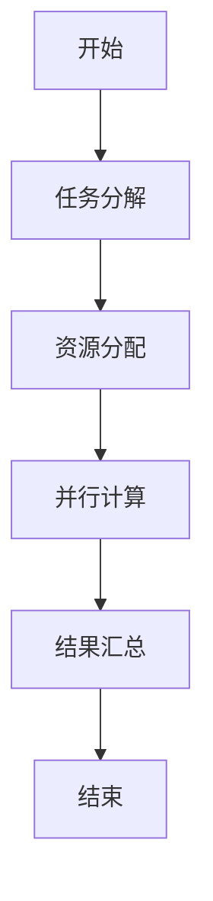
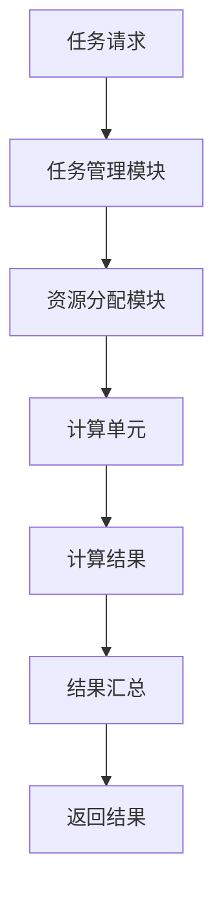

                 


# 如何识别企业的边缘AI芯片异构计算优势

> **关键词**：边缘计算、AI芯片、异构计算、性能优化、算法加速  
> **摘要**：本文深入探讨了边缘AI芯片异构计算的优势，通过分析其核心原理、算法优化、系统架构设计和实际项目案例，帮助企业识别和利用边缘AI芯片的异构计算优势，提升计算效率和性能。

---

## 第1章: 边缘AI芯片与异构计算的背景介绍

### 1.1 问题背景与挑战

#### 1.1.1 边缘计算的兴起与需求
边缘计算是一种分布式计算范式，将数据处理从云端移到靠近数据源的边缘设备。随着物联网（IoT）和人工智能（AI）的快速发展，边缘计算的需求日益增长。边缘设备需要实时处理数据，减少延迟，同时降低对云端的依赖。

#### 1.1.2 AI芯片的多样化发展
AI芯片是专为AI任务设计的硬件，包括GPU、TPU、NPU等。不同芯片在计算能力、功耗和应用场景上有显著差异。边缘AI芯片需要在功耗、性能和成本之间找到平衡。

#### 1.1.3 异构计算的核心优势
异构计算结合多种计算单元（如CPU、GPU、TPU）的优势，通过任务分解和协同工作，显著提升计算效率。边缘AI芯片通过异构计算，可以在有限的资源下实现高性能计算。

### 1.2 问题描述与解决方案

#### 1.2.1 边缘AI芯片的性能瓶颈
边缘设备的计算能力有限，传统单核芯片难以满足复杂的AI任务需求。边缘AI芯片需要高性能、低功耗和高能效。

#### 1.2.2 异构计算的应用场景
异构计算适用于边缘设备中的图像识别、语音处理、实时分析等任务。通过任务分解和协同计算，异构计算可以提高边缘设备的处理能力。

#### 1.2.3 解决边缘计算性能问题的关键技术
异构计算通过优化任务分配和资源利用，显著提升边缘设备的计算效率。通过结合多种计算单元，异构计算能够充分利用不同芯片的优势。

### 1.3 边缘计算的边界与外延

#### 1.3.1 边缘计算的定义与范围
边缘计算是指在靠近数据源的地方进行数据处理和分析，范围包括边缘设备、边缘服务器和边缘云。

#### 1.3.2 异构计算的边界条件
异构计算的边界包括计算任务的分解、计算单元的协同和资源的动态分配。

#### 1.3.3 边缘AI芯片的外延特征
边缘AI芯片的外延特征包括高性能、低功耗、高能效和多核异构架构。

### 1.4 核心概念与结构

#### 1.4.1 核心概念的定义与属性
- **边缘计算**：分布式计算范式，数据处理靠近数据源。
- **AI芯片**：专为AI任务设计的硬件。
- **异构计算**：结合多种计算单元的优势，提升计算效率。

#### 1.4.2 核心概念的结构化模型
边缘AI芯片异构计算的结构化模型包括数据源、边缘设备、计算单元和协同机制。

#### 1.4.3 核心要素的ER实体关系图

```mermaid
erDiagram
   设备 : 设备类型、设备ID、计算能力
    计算单元 : 单元类型、单元ID、性能参数
    任务 : 任务ID、任务类型、资源需求
    边缘计算 : 计算ID、计算类型、计算结果
    1.设备 --> 1.计算单元
    1.设备 --> 1.任务
    1.计算单元 --> 1.任务
    1.计算单元 --> 1.边缘计算
    1.任务 --> 1.边缘计算
```

---

## 第2章: 边缘AI芯片异构计算的核心原理

### 2.1 异构计算的原理与机制

#### 2.1.1 异构计算的基本原理
异构计算通过任务分解，将计算任务分配给最适合的计算单元（如CPU、GPU、NPU），并协同完成任务。

#### 2.1.2 多种计算单元的协同工作
异构计算利用不同计算单元的优势，通过任务分配和资源管理，提升整体计算效率。

#### 2.1.3 异构计算的优化策略
优化策略包括任务分解、资源分配和负载均衡，确保计算任务高效完成。

### 2.2 异构计算的核心算法

#### 2.2.1 算法加速的原理
通过并行计算和任务分解，算法加速利用异构计算的优势，提高处理速度。

#### 2.2.2 算法加速的数学模型
$$ \text{加速比} = \frac{\text{单核处理时间}}{\text{异构处理时间}} $$

#### 2.2.3 算法加速的流程图



### 2.3 异构计算的数学模型与公式

#### 2.3.1 算法优化的数学模型
$$ \text{性能} = \frac{\text{任务量}}{\text{处理速度}} $$

#### 2.3.2 算法优化的数学推导
通过数学推导，证明异构计算在特定任务中的性能提升。

#### 2.3.3 算法性能的评估公式
$$ \text{性能提升} = \frac{\text{异构处理时间}}{\text{单核处理时间}} $$

### 2.4 异构计算的系统架构

#### 2.4.1 系统架构的组成与功能
异构计算系统包括任务管理模块、资源分配模块和协同计算模块。

#### 2.4.2 系统架构的优化设计
优化设计包括动态任务分配和资源调度，确保系统高效运行。

#### 2.4.3 系统架构的交互流程图



---

## 第3章: 边缘AI芯片异构计算的性能优化

### 3.1 性能优化的策略与方法

#### 3.1.1 算法优化策略
通过算法优化，减少计算复杂度，提升处理速度。

#### 3.1.2 硬件优化策略
优化硬件架构，提升计算单元的性能和能效。

#### 3.1.3 软硬件协同优化策略
通过软硬件协同设计，充分发挥异构计算的优势。

### 3.2 性能优化的数学模型

#### 3.2.1 算法优化的数学模型
$$ \text{优化后性能} = \text{原始性能} \times \text{优化因子} $$

#### 3.2.2 硬件优化的数学模型
$$ \text{性能提升} = \frac{\text{原始处理时间}}{\text{优化后处理时间}} $$

#### 3.2.3 协同优化的数学模型
$$ \text{协同性能} = \text{CPU性能} + \text{GPU性能} + \text{NPU性能} $$

### 3.3 性能优化的系统架构设计

#### 3.3.1 优化策略的系统架构
优化策略包括动态任务分配和资源调度，确保系统高效运行。

#### 3.3.2 优化策略的交互流程图


---

## 第4章: 边缘AI芯片异构计算的算法加速

### 4.1 算法加速的原理与方法

#### 4.1.1 算法加速的原理
通过并行计算和任务分解，算法加速利用异构计算的优势，提高处理速度。

#### 4.1.2 算法加速的数学模型
$$ \text{加速比} = \frac{\text{单核处理时间}}{\text{异构处理时间}} $$

#### 4.1.3 算法加速的流程图


### 4.2 算法加速的系统架构

#### 4.2.1 算法加速的系统架构设计
系统架构包括任务管理模块、资源分配模块和协同计算模块。

#### 4.2.2 算法加速的交互流程图


---

## 第5章: 边缘AI芯片异构计算的系统架构设计

### 5.1 系统架构的组成与功能

#### 5.1.1 系统架构的组成
异构计算系统包括任务管理模块、资源分配模块和协同计算模块。

#### 5.1.2 系统架构的功能模块
功能模块包括任务管理、资源分配和协同计算。

### 5.2 系统架构的优化设计

#### 5.2.1 系统架构的优化策略
优化策略包括动态任务分配和资源调度，确保系统高效运行。

#### 5.2.2 系统架构的优化流程图


---

## 第6章: 边缘AI芯片异构计算的项目实战

### 6.1 项目环境搭建

#### 6.1.1 环境搭建步骤
1. 安装必要的软件和库。
2. 配置硬件资源。
3. 下载和编译代码。

#### 6.1.2 环境搭建的注意事项
确保硬件和软件兼容，避免环境配置错误。

### 6.2 系统核心实现

#### 6.2.1 核心代码实现
```python
def main():
    # 任务分解
    tasks = decompose_tasks()
    # 资源分配
    resources = allocate_resources(tasks)
    # 并行计算
    results = parallel_execute(resources)
    # 结果汇总
    aggregated_results = aggregate_results(results)
    return aggregated_results
```

#### 6.2.2 代码实现的注意事项
确保任务分解和资源分配的逻辑正确，避免资源冲突和计算错误。

### 6.3 实际案例分析

#### 6.3.1 案例分析
分析一个实际案例，展示异构计算在边缘AI芯片中的应用。

#### 6.3.2 案例分析的结果
通过案例分析，验证异构计算的优势和实际效果。

### 6.4 项目小结

#### 6.4.1 项目总结
总结项目实施过程中的经验和教训。

#### 6.4.2 项目成果
展示项目成果，包括性能提升和效率优化。

---

## 第7章: 边缘AI芯片异构计算的最佳实践与小结

### 7.1 最佳实践

#### 7.1.1 系统设计建议
建议在系统设计中充分考虑任务分解和资源分配。

#### 7.1.2 算法优化建议
建议在算法优化中充分考虑异构计算的优势。

#### 7.1.3 环境配置建议
建议在环境配置中充分考虑硬件和软件的兼容性。

### 7.2 小结

#### 7.2.1 核心内容回顾
回顾本文的核心内容，包括背景介绍、核心原理、性能优化和项目实战。

#### 7.2.2 未来发展方向
展望未来，异构计算在边缘AI芯片中的应用前景广阔。

---

## 附录

### 附录A: 参考文献
- 文献1：边缘计算的发展与应用
- 文献2：异构计算的核心技术
- 文献3：AI芯片的优化策略

### 附录B: 工具推荐
- 工具1：边缘计算开发工具
- 工具2：异构计算优化工具
- 工具3：AI芯片开发框架

---

## 作者：AI天才研究院/AI Genius Institute & 禅与计算机程序设计艺术 /Zen And The Art of Computer Programming

