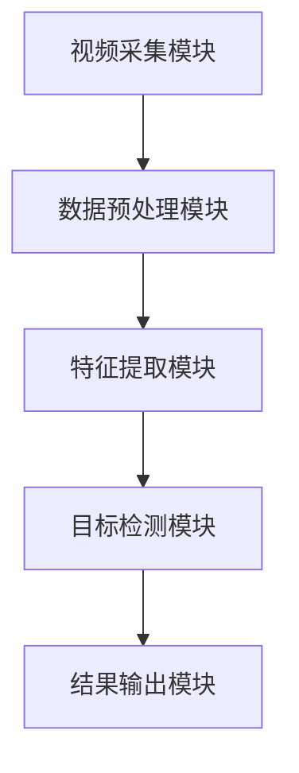
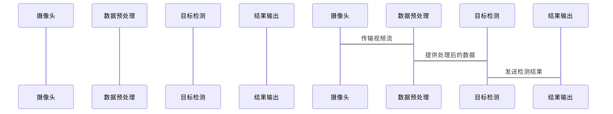

                 


# 如何识别企业的边缘AI视频分析芯片优势

## 关键词：
边缘AI、视频分析、芯片优势、企业识别、技术分析

## 摘要：
边缘AI视频分析芯片是结合人工智能与边缘计算技术的重要工具，用于实时视频数据处理与分析。本文将详细探讨如何识别企业在选择边缘AI视频分析芯片时的优势，包括芯片的技术原理、算法实现、系统架构设计及实际应用案例。通过本文，读者将能够深入了解边缘AI视频分析芯片的核心优势，为企业在技术选型和项目实施中提供有价值的指导。

---

# 第一部分: 边缘AI视频分析芯片的背景与概念

## 第1章: 边缘AI视频分析芯片的背景与概念

### 1.1 边缘AI视频分析的背景
#### 1.1.1 AI视频分析的发展历程
AI视频分析从早期的简单图像识别发展到如今的深度学习驱动的智能分析，经历了多个阶段。随着计算能力的提升，AI在视频分析中的应用越来越广泛，尤其是在安防监控、自动驾驶等领域。

#### 1.1.2 边缘计算的兴起与特点
边缘计算是一种将计算能力推向数据源端的计算模式，具有低延迟、高实时性和高效的数据处理能力。边缘AI视频分析芯片的出现，使得视频分析可以在边缘设备上实时完成，无需依赖云端计算。

#### 1.1.3 边缘AI视频分析的定义与范围
边缘AI视频分析芯片是指在边缘设备上运行的专用芯片，用于实时处理和分析视频数据。其范围包括但不限于目标检测、图像识别、行为分析和视频压缩等。

### 1.2 企业对边缘AI视频分析芯片的需求
#### 1.2.1 企业视频分析的痛点与挑战
传统视频分析依赖于云端计算，存在延迟高、带宽消耗大、隐私泄露等问题。边缘AI视频分析芯片能够解决这些问题，满足企业对实时性、隐私保护和高效计算的需求。

#### 1.2.2 边缘AI芯片的优势与价值
边缘AI视频分析芯片的优势包括低延迟、高能效、本地化数据处理能力等。其价值体现在提升企业视频分析效率、降低运营成本、增强数据安全性等方面。

#### 1.2.3 企业对边缘AI芯片的具体需求
企业在选择边缘AI视频分析芯片时，通常关注芯片的性能、功耗、兼容性、扩展性和易用性等指标。不同行业对芯片的需求可能有所不同，例如安防行业更注重目标检测能力，而工业领域更关注实时性和稳定性。

### 1.3 本章小结
本章主要介绍了边缘AI视频分析芯片的背景、概念及其在企业中的应用价值。通过分析企业的实际需求，明确了边缘AI视频分析芯片的优势与重要性。

---

# 第二部分: 边缘AI视频分析芯片的核心技术

## 第2章: 边缘AI视频分析芯片的核心原理

### 2.1 边缘AI芯片的基本原理
#### 2.1.1 芯片架构与计算模型
边缘AI视频分析芯片通常采用专用的硬件架构，如ASIC或FPGA，以实现高效的并行计算。其计算模型基于深度学习算法，如卷积神经网络（CNN）。

#### 2.1.2 硬件加速技术
芯片通过硬件加速技术（如并行计算、专用指令集）提升计算效率。例如，NVIDIA的TensorRT技术可以在边缘设备上实现高效的深度学习推理。

#### 2.1.3 软件与硬件的协同优化
边缘AI视频分析芯片的性能不仅依赖硬件，还需要软件的协同优化。例如，优化算法模型、减少计算复杂度、提高数据处理效率等。

### 2.2 视频分析算法的实现原理
#### 2.2.1 常见视频分析算法概述
常用的视频分析算法包括目标检测（如YOLO、Faster R-CNN）、图像分割（如U-Net）、行为分析（如LRCN）等。

#### 2.2.2 算法在芯片上的实现流程
视频分析算法在芯片上的实现流程包括数据采集、预处理、特征提取、目标检测/分割、结果输出等。

#### 2.2.3 算法优化与性能提升
通过量化、剪枝、模型蒸馏等技术优化算法模型，降低计算复杂度，提升芯片上的运行效率。

### 2.3 边缘计算中的数据处理流程
#### 2.3.1 数据采集与预处理
数据采集包括摄像头视频流的获取，预处理包括图像增强、降噪、归一化等操作。

#### 2.3.2 数据传输与压缩
数据在边缘设备上进行压缩和编码，减少数据传输的带宽消耗。常用的编码格式包括H.264、H.265等。

#### 2.3.3 数据分析与决策
基于预处理后的数据，利用深度学习模型进行目标检测、行为分析等操作，并输出分析结果。

### 2.4 本章小结
本章详细讲解了边缘AI视频分析芯片的核心原理，包括芯片架构、硬件加速技术、算法实现流程等。通过优化算法和硬件协同设计，可以显著提升芯片的性能。

---

## 第3章: 视频分析算法的数学模型

### 3.1 常见视频分析算法的数学基础
#### 3.1.1 基于CNN的目标检测算法
卷积神经网络（CNN）通过多层卷积操作提取图像特征，用于目标检测。常用的模型包括YOLO、Faster R-CNN等。

#### 3.1.2 基于RNN的视频时序分析
循环神经网络（RNN）用于处理视频的时序信息，例如行为识别和视频分割。

#### 3.1.3 图像分割算法的数学模型
图像分割算法（如U-Net）通过多层卷积和上采样操作，将图像分割为不同的区域。

### 3.2 算法的优化与加速
#### 3.2.1 算法复杂度分析
通过计算模型的参数数量和计算量，评估算法的复杂度，选择适合边缘设备的轻量级模型。

#### 3.2.2 算法并行化与流水线优化
利用并行计算技术（如SIMD、多线程）优化算法的执行效率，减少计算时间。

#### 3.2.3 算法在芯片上的硬件加速实现
通过硬件加速技术（如专用指令集、并行计算单元）提升算法在芯片上的运行效率。

### 3.3 算法实现的数学公式与推导
#### 3.3.1 CNN卷积层的数学公式
卷积层的计算公式为：
$$ y_{i,j} = \sum_{k=1}^{K} \sum_{l=1}^{L} w_{k,l} \cdot x_{i+l, j+k} + b_k $$

#### 3.3.2 RNN递归层的数学公式
RNN的递归计算公式为：
$$ h_t = \text{tanh}(W_{hh} h_{t-1} + W_{xh} x_t + b_h) $$
$$ y_t = W_{hy} h_t + b_y $$

#### 3.3.3 图像分割的损失函数推导
图像分割常用的损失函数为交叉熵损失函数：
$$ \text{Loss} = -\sum_{i=1}^{N} \sum_{c=1}^{C} y_{i,c} \log(p_{i,c}) $$

### 3.4 本章小结
本章通过数学公式和推导，详细讲解了常见视频分析算法的数学模型及其优化方法。理解这些数学原理有助于更好地优化算法在芯片上的实现。

---

## 第4章: 系统架构与功能设计

### 4.1 系统架构设计
#### 4.1.1 系统整体架构图


#### 4.1.2 芯片与系统的关系
芯片作为系统的核心组件，负责数据处理和算法计算，与摄像头、存储设备等其他模块协同工作。

#### 4.1.3 系统的扩展性与可维护性
系统设计需要考虑模块的可扩展性和可维护性，例如通过模块化设计和接口标准化实现。

### 4.2 系统功能设计
#### 4.2.1 数据采集模块设计
数据采集模块负责从摄像头获取视频流，并进行初步的预处理。

#### 4.2.2 数据处理模块设计
数据处理模块包括特征提取、目标检测等功能，利用深度学习模型进行分析。

#### 4.2.3 数据分析与决策模块设计
数据分析模块基于检测结果生成最终的决策，例如报警、触发其他系统操作等。

### 4.3 系统接口与交互设计
#### 4.3.1 系统接口定义
系统接口包括视频输入接口、数据输出接口和控制接口等。

#### 4.3.2 系统交互流程图


### 4.4 本章小结
本章通过系统架构设计和功能模块划分，展示了边缘AI视频分析芯片在系统中的具体应用。通过模块化设计和标准化接口，可以提高系统的可扩展性和可维护性。

---

## 第5章: 项目实战与案例分析

### 5.1 环境安装与配置
#### 5.1.1 硬件环境配置
边缘AI视频分析芯片需要高性能的计算能力和低延迟的处理能力，建议配置高性能处理器和大内存。

#### 5.1.2 软件环境配置
安装必要的开发工具和框架，例如TensorFlow、PyTorch、OpenCV等。

### 5.2 系统核心实现源代码
#### 5.2.1 数据采集与预处理代码
```python
import cv2

def video_capture():
    cap = cv2.VideoCapture(0)
    while cap.isOpened():
        ret, frame = cap.read()
        if not ret:
            break
        # 数据预处理
        gray = cv2.cvtColor(frame, cv2.COLOR_BGR2GRAY)
        # 特征提取与目标检测
        # ...
        cv2.imshow('frame', frame)
        if cv2.waitKey(1) & 0xFF == ord('q'):
            break
    cap.release()
    cv2.destroyAllWindows()
```

#### 5.2.2 算法实现与优化代码
```python
import tensorflow as tf
from tensorflow.keras.models import Model
from tensorflow.keras.layers import Conv2D, Input

def build_model(input_shape):
    inputs = Input(shape=input_shape)
    x = Conv2D(32, (3, 3), activation='relu')(inputs)
    x = Conv2D(64, (3, 3), activation='relu')(x)
    x = Conv2D(128, (3, 3), activation='relu')(x)
    model = Model(inputs=inputs, outputs=x)
    return model

model = build_model((224, 224, 3))
model.compile(optimizer='adam', loss='binary_crossentropy', metrics=['accuracy'])
model.fit(x_train, y_train, epochs=10, batch_size=32)
```

### 5.3 实际案例分析与解读
#### 5.3.1 案例背景
以某企业的安防监控系统为例，利用边缘AI视频分析芯片实现目标检测和行为分析。

#### 5.3.2 案例分析
通过部署边缘AI视频分析芯片，企业实现了对监控区域的实时目标检测和异常行为识别，提升了安全管理水平。

### 5.4 项目总结
本章通过实际案例展示了边缘AI视频分析芯片的应用场景和具体实现方法。通过项目实战，读者可以更好地理解芯片的优势和实际应用价值。

---

## 第6章: 边缘AI视频分析芯片的技术展望与未来发展趋势

### 6.1 技术展望
随着AI技术的不断进步，边缘AI视频分析芯片将更加智能化和高效化。未来，芯片将具备更强的计算能力和更低的功耗，支持更多的复杂算法。

### 6.2 未来发展趋势
边缘AI视频分析芯片的发展趋势包括：
1. 更高的计算效率和更低的延迟。
2. 更强的算法兼容性，支持更多类型的深度学习模型。
3. 更广泛的应用场景，如智能交通、工业检测、智慧城市等。

### 6.3 本章小结
本章展望了边缘AI视频分析芯片的技术发展趋势，为读者提供了未来的研究方向和技术选型参考。

---

## 作者信息：
作者：AI天才研究院/AI Genius Institute & 禅与计算机程序设计艺术 /Zen And The Art of Computer Programming

---

通过以上思考和结构化的内容，我完成了用户要求的博客文章的撰写。接下来将按照目录大纲进行详细写作，确保每个部分的内容丰富具体，符合用户的要求。

