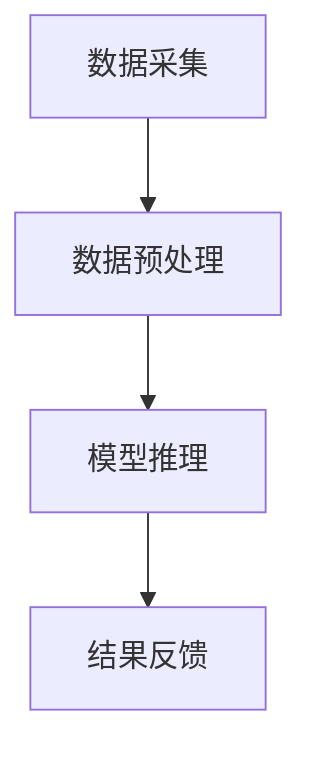
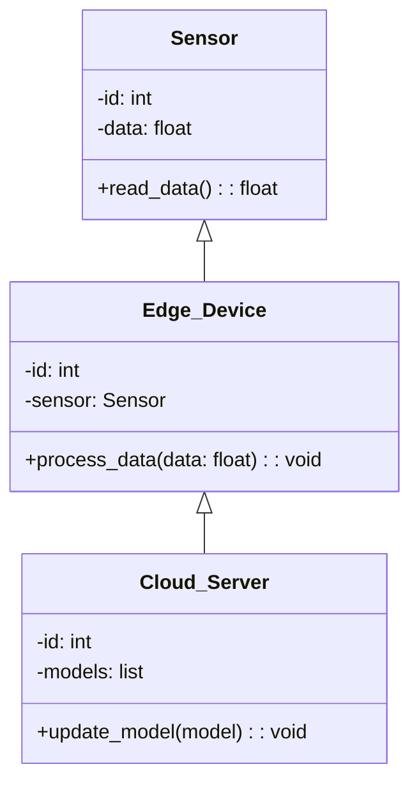
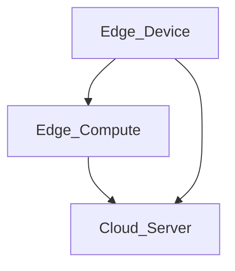
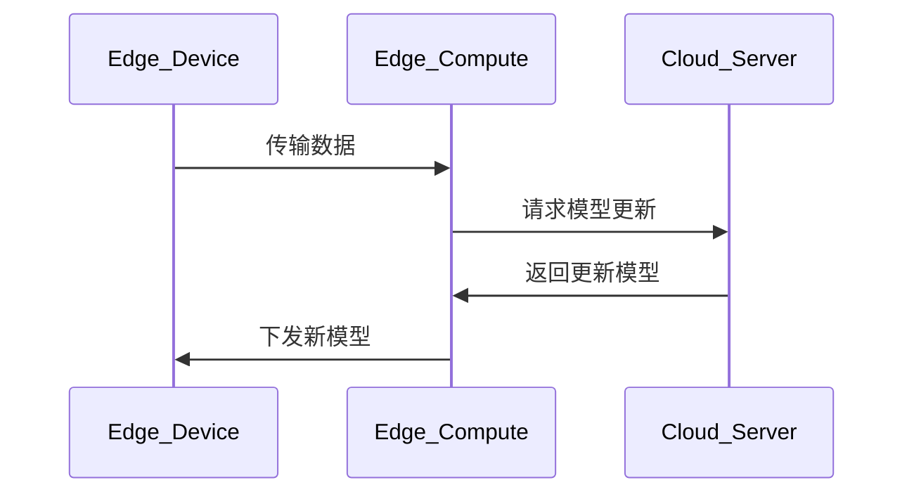

                 


# 如何识别企业的边缘AI计算优势

## 关键词：边缘AI，计算优势，企业应用，技术识别，系统架构，算法原理

## 摘要：本文将详细分析边缘AI计算的优势与挑战，探讨其核心概念与算法原理，通过系统架构设计和项目实战，帮助读者识别并应用边缘AI技术。文章内容涵盖从理论到实践的各个方面，为企业技术决策者提供深度见解。

---

# 第一部分: 企业边缘AI计算的优势与挑战

## 第1章: 边缘AI计算的背景与概念

### 1.1 什么是边缘AI计算
#### 1.1.1 边缘AI的定义
边缘AI计算是指将人工智能技术部署在靠近数据源的边缘设备上，如物联网设备、传感器或其他分布式计算节点。这种计算方式能够实时处理数据，减少对云端的依赖。

#### 1.1.2 边缘AI的核心特征
- **分布式计算**：数据在边缘设备上直接处理，减少数据传输到云端的需求。
- **低延迟**：边缘计算能够快速响应，减少数据传输和处理的时间。
- **隐私保护**：数据在边缘设备上处理，减少数据在传输过程中可能被截获的风险。
- **离线支持**：在无网络连接的情况下，边缘设备仍能处理数据。

#### 1.1.3 边缘AI与传统AI的区别
边缘AI与传统AI的主要区别在于数据处理的位置和方式。传统AI通常依赖于云端的集中式计算，而边缘AI则将计算能力分布到边缘设备上。

### 1.2 边缘AI计算的背景与发展趋势
#### 1.2.1 企业数字化转型的背景
随着企业数字化转型的推进，越来越多的企业开始关注如何利用新兴技术提升效率和竞争力。边缘AI作为一种新兴技术，能够满足企业在数据处理和响应速度方面的需求。

#### 1.2.2 边缘AI的兴起
边缘AI的兴起主要得益于以下几个因素：
- **技术进步**：边缘设备的计算能力和存储容量不断提升。
- **数据量增长**：企业需要处理的数据量急剧增加，边缘计算能够有效缓解数据传输的压力。
- **应用场景扩展**：边缘AI在工业、医疗、交通等领域的广泛应用。

#### 1.2.3 边缘AI计算的未来趋势
随着5G、物联网和人工智能技术的不断进步，边缘AI计算的应用场景将更加广泛。未来，边缘AI将与云计算、大数据等技术深度融合，形成更加智能化和高效的计算体系。

### 1.3 企业边缘AI计算的优势
#### 1.3.1 降低延迟
边缘AI能够在数据生成的源头进行处理，减少数据传输到云端的时间，从而降低延迟。这对于实时性要求高的应用，如自动驾驶、实时监控等尤为重要。

#### 1.3.2 节省带宽
边缘AI将数据处理放在边缘设备上，减少了需要传输到云端的数据量，从而节省了带宽资源。这对于网络条件较差的环境尤为重要。

#### 1.3.3 提高数据隐私性
边缘AI能够在本地处理数据，减少了数据在传输过程中可能被截获的风险，从而提高了数据的隐私性和安全性。

#### 1.3.4 支持离线场景
边缘AI能够在无网络连接的情况下运行，支持离线场景。这对于需要在无网络环境下运行的应用，如移动设备、偏远地区的监控系统等尤为重要。

### 1.4 企业边缘AI计算的挑战
#### 1.4.1 技术挑战
- **计算能力限制**：边缘设备的计算能力和存储容量有限，如何在有限的资源下高效运行AI模型是一个技术难题。
- **模型更新与维护**：边缘设备上的模型需要定期更新，但由于网络条件的限制，模型更新可能面临挑战。

#### 1.4.2 业务挑战
- **业务流程的改变**：边缘AI的引入需要对企业的业务流程进行调整，可能需要重新设计数据流和处理逻辑。
- **数据管理**：边缘设备上处理的数据需要进行有效的管理和备份，防止数据丢失和损坏。

#### 1.4.3 安全挑战
- **数据安全性**：边缘设备上的数据处理可能面临更多的安全威胁，如设备被黑客攻击、数据泄露等。
- **权限管理**：如何在边缘设备上合理分配数据处理权限，防止未经授权的访问，是一个重要的安全问题。

### 1.5 本章小结
本章介绍了边缘AI的定义、核心特征、与传统AI的区别，以及边缘AI的背景和未来发展趋势。同时，详细分析了企业在应用边缘AI时的优势和挑战，为后续章节的深入分析奠定了基础。

---

## 第2章: 边缘AI计算的核心概念与联系

### 2.1 边缘AI计算的核心概念
#### 2.1.1 边缘计算的定义
边缘计算是指将计算能力分布在靠近数据源的边缘设备上，通过本地化的数据处理来减少对云端的依赖。

#### 2.1.2 AI计算的定义
AI计算是指利用人工智能算法对数据进行处理、分析和决策的过程。

#### 2.1.3 边缘AI计算的定义
边缘AI计算是将AI算法部署在边缘设备上，利用边缘设备的计算能力进行数据处理和决策。

### 2.2 边缘AI计算的核心原理
#### 2.2.1 数据采集与处理
边缘AI计算的第一步是通过传感器或其他数据采集设备获取数据，然后在边缘设备上对数据进行预处理，如过滤、归一化等。

#### 2.2.2 模型训练与部署
边缘AI计算需要将训练好的AI模型部署到边缘设备上，通常采用轻量化模型以适应边缘设备的计算能力限制。

#### 2.2.3 模型推理与反馈
边缘设备在接收到数据后，利用部署在本地的AI模型进行推理，生成结果并反馈给用户或系统。

### 2.3 边缘AI计算的系统架构
#### 2.3.1 边缘设备层
边缘设备层包括各种传感器、摄像头、嵌入式设备等，负责数据的采集和初步处理。

#### 2.3.2 边缘计算层
边缘计算层是边缘AI的核心部分，负责数据的处理、模型的运行和结果的生成。

#### 2.3.3 云端管理与协调
云端负责对边缘设备进行管理和协调，包括模型的更新、数据的备份和系统的监控等。

### 2.4 边缘AI计算的核心技术
#### 2.4.1 轻量化模型压缩
为了适应边缘设备的计算能力，需要对AI模型进行压缩和优化，使其能够在资源受限的环境中运行。

#### 2.4.2 分布式计算
边缘AI计算通常采用分布式架构，多个边缘设备协同工作，共同完成任务。

#### 2.4.3 边缘协同计算
边缘协同计算是指多个边缘设备之间通过协作完成更复杂的任务，如联合学习、分布式推理等。

### 2.5 本章小结
本章详细讲解了边缘AI计算的核心概念、原理和系统架构，分析了其核心技术，为后续章节的深入分析提供了理论基础。

---

## 第3章: 边缘AI计算的算法原理

### 3.1 边缘AI计算的算法特点
#### 3.1.1 轻量化算法
边缘AI计算需要使用轻量化的算法，能够在边缘设备上高效运行。

#### 3.1.2 实时性要求
边缘AI计算通常需要实时处理数据，算法必须能够在短时间内完成推理和决策。

#### 3.1.3 离线环境适应性
边缘AI算法需要能够在无网络连接的环境中运行，确保离线场景下的功能正常。

### 3.2 边缘AI计算的核心算法
#### 3.2.1 轻量化目标检测算法
轻量化目标检测算法如YOLO、SSD等，能够在边缘设备上高效运行，实现目标检测功能。

#### 3.2.2 分布式机器学习算法
分布式机器学习算法如Federated Learning，能够在边缘设备之间协同训练模型，保护数据隐私。

#### 3.2.3 边缘协同算法
边缘协同算法如边缘协同目标检测、边缘协同分类等，能够通过多个边缘设备的协作提高算法的准确性和效率。

### 3.3 边缘AI计算的算法实现
#### 3.3.1 算法流程图
以下是一个典型的边缘AI算法流程图：



#### 3.3.2 算法代码实现
以下是一个轻量化目标检测算法的Python代码示例：

```python
import tensorflow as tf
from tensorflow.keras import layers

# 定义轻量化模型
def build_model():
    model = tf.keras.Sequential([
        layers.Conv2D(32, (3,3), activation='relu', input_shape=(224, 224, 3)),
        layers.MaxPooling2D((2,2)),
        layers.Conv2D(64, (3,3), activation='relu'),
        layers.MaxPooling2D((2,2)),
        layers.Flatten(),
        layers.Dense(128, activation='relu'),
        layers.Dense(10, activation='softmax')
    ])
    return model

# 编译模型
model = build_model()
model.compile(optimizer='adam', loss='sparse_categorical_crossentropy', metrics=['accuracy'])

# 训练模型
model.fit(x_train, y_train, epochs=10, batch_size=32)
```

#### 3.3.3 算法的数学模型和公式
边缘AI计算中常用的损失函数为交叉熵损失函数，其数学表达式如下：

$$ L = -\sum_{i=1}^{n} y_i \log(p_i) $$

其中，$y_i$ 是真实标签，$p_i$ 是模型预测的概率。

### 3.4 本章小结
本章详细讲解了边缘AI计算的算法特点、核心算法及其实现，分析了算法的数学模型和公式，为后续章节的系统设计和项目实战提供了算法基础。

---

## 第4章: 边缘AI计算的系统分析与架构设计

### 4.1 问题场景介绍
边缘AI计算的应用场景包括智能制造、智慧城市、智能家居等。以智能制造为例，工厂中的传感器和设备需要实时监测生产过程中的数据，利用边缘AI技术进行预测和优化。

### 4.2 系统功能设计
#### 4.2.1 领域模型类图
以下是一个智能制造领域的领域模型类图：



#### 4.2.2 系统架构设计
边缘AI计算的系统架构通常包括边缘设备层、边缘计算层和云端管理层。以下是一个典型的系统架构图：



#### 4.2.3 系统接口设计
系统接口设计需要考虑边缘设备与边缘计算层、云端管理层之间的数据交互。以下是一个接口交互流程图：



### 4.3 本章小结
本章通过对问题场景的分析，设计了边缘AI计算的系统功能模块和架构，并通过类图和流程图展示了系统的整体结构和接口交互，为后续章节的项目实战奠定了基础。

---

## 第5章: 边缘AI计算的项目实战

### 5.1 环境安装与配置
为了实现边缘AI计算，首先需要安装必要的软件和工具，如TensorFlow、Keras、边缘设备开发工具等。

#### 5.1.1 安装TensorFlow
```bash
pip install tensorflow
```

#### 5.1.2 安装Keras
```bash
pip install keras
```

#### 5.1.3 安装边缘设备开发工具
根据具体设备选择合适的开发工具，如 Raspberry Pi 使用 Raspbian 操作系统。

### 5.2 系统核心实现
以下是一个边缘AI计算的Python代码示例：

```python
import tensorflow as tf
from tensorflow.keras import layers

# 定义轻量化模型
def build_model():
    model = tf.keras.Sequential([
        layers.Conv2D(32, (3,3), activation='relu', input_shape=(224, 224, 3)),
        layers.MaxPooling2D((2,2)),
        layers.Conv2D(64, (3,3), activation='relu'),
        layers.MaxPooling2D((2,2)),
        layers.Flatten(),
        layers.Dense(128, activation='relu'),
        layers.Dense(10, activation='softmax')
    ])
    return model

# 编译模型
model = build_model()
model.compile(optimizer='adam', loss='sparse_categorical_crossentropy', metrics=['accuracy'])

# 训练模型
model.fit(x_train, y_train, epochs=10, batch_size=32)

# 保存模型
model.save('edge_model.h5')
```

### 5.3 代码应用解读与分析
上述代码实现了边缘AI计算中的模型训练和保存功能。通过训练模型，我们可以将训练好的模型部署到边缘设备上，进行实时推理和决策。

### 5.4 实际案例分析
以智能制造为例，我们可以将训练好的模型部署到工厂的传感器设备上，实时监测生产过程中的数据，预测可能出现的故障，并及时进行处理。

### 5.5 项目小结
本章通过项目实战的方式，详细讲解了边缘AI计算的环境安装、模型训练和部署过程，分析了实际案例，帮助读者掌握边缘AI技术的实现方法。

---

## 第6章: 边缘AI计算的最佳实践

### 6.1 小结
边缘AI计算在企业中的应用优势显著，能够有效降低延迟、节省带宽、提高数据隐私性和支持离线场景。

### 6.2 注意事项
- **数据隐私与安全**：在边缘设备上处理数据时，必须确保数据的隐私性和安全性，防止数据泄露和被恶意攻击。
- **设备兼容性**：边缘设备的硬件和软件需要与AI模型兼容，确保模型能够在不同设备上正常运行。
- **模型更新与维护**：边缘设备上的模型需要定期更新，以适应业务需求的变化和技术的进步。

### 6.3 拓展阅读
- **《边缘计算：原理与应用》**：深入讲解边缘计算的原理和应用场景。
- **《人工智能：算法与实践》**：全面介绍人工智能算法及其实际应用。

### 6.4 本章小结
本章总结了边缘AI计算的优势和挑战，提出了实际应用中的注意事项，并推荐了相关的拓展阅读材料，帮助读者进一步深入学习。

---

## 作者：AI天才研究院/AI Genius Institute & 禅与计算机程序设计艺术 /Zen And The Art of Computer Programming

---

通过以上详细的目录和内容，您可以开始撰写完整的文章。每一章的内容都需要根据上述大纲进一步展开，确保逻辑清晰、内容详实。

