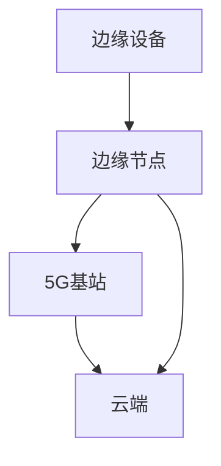

                 


# 如何识别企业的边缘计算5G优化优势

> 关键词：边缘计算，5G优化，企业应用，技术优势，优化策略

> 摘要：本文旨在探讨如何识别企业在边缘计算和5G优化中的优势。通过分析边缘计算和5G技术的核心概念、原理、算法及系统架构，结合实际应用场景和项目案例，帮助企业在数字化转型中更好地利用边缘计算和5G优化技术，提升竞争力。

---

# 第一部分：边缘计算与5G优化的背景与概念

# 第1章：边缘计算与5G优化概述

## 1.1 边缘计算的基本概念

### 1.1.1 边缘计算的定义

边缘计算是指将计算能力从云端扩展到网络边缘，实现数据的实时处理和响应。其核心思想是将数据处理逻辑从中心服务器移动到靠近数据源的位置，减少数据传输延迟，提高响应速度。

### 1.1.2 边缘计算的起源与发展

边缘计算的概念起源于20世纪90年代的分布式计算，随着物联网（IoT）和5G技术的发展，边缘计算逐渐成为企业数字化转型的重要技术。

### 1.1.3 边缘计算的核心特征

- **分布式计算**：数据在靠近数据源的位置进行处理。
- **低延迟**：减少数据传输到云端的时间，提高实时性。
- **高带宽**：支持大带宽数据传输，满足5G需求。
- **安全性**：边缘设备通常具有更高的安全性，保护数据隐私。

## 1.2 5G技术的基本概念

### 1.2.1 5G技术的定义

5G技术是第五代移动通信技术，具有高速度、低延迟、大规模连接和高可靠性等特点。

### 1.2.2 5G技术的核心优势

- **高速度**：数据传输速度是4G的10倍以上。
- **低延迟**：满足实时应用需求，如工业自动化和自动驾驶。
- **大规模连接**：支持海量设备连接，适用于物联网场景。
- **高可靠性**：确保关键业务的稳定运行。

### 1.2.3 5G技术的应用场景

- **工业自动化**：实现生产线的实时监控和优化。
- **智慧城市**：支持智能交通、环境监测等应用。
- **远程医疗**：实现远程手术和患者数据实时传输。
- **虚拟现实（VR）/增强现实（AR）**：提供沉浸式体验。

## 1.3 边缘计算与5G优化的关系

### 1.3.1 边缘计算与5G技术的结合

边缘计算与5G技术的结合能够充分发挥5G的高带宽和低延迟优势，同时利用边缘计算的分布式处理能力，提升整体系统的性能。

### 1.3.2 5G优化在边缘计算中的作用

- **提升数据传输效率**：通过5G技术优化数据传输路径，减少延迟。
- **增强边缘设备的连接能力**：支持更多的边缘设备接入，扩大覆盖范围。
- **提高系统的可靠性**：通过5G的高可靠性保障边缘计算系统的稳定性。

### 1.3.3 边缘计算与5G优化的协同效应

边缘计算与5G优化的协同效应体现在以下方面：

1. **实时性提升**：边缘计算结合5G的低延迟特性，实现数据的实时处理。
2. **带宽优化**：5G的大带宽支持边缘计算中的数据传输需求。
3. **扩展性增强**：边缘计算的分布式架构与5G的大规模连接能力相结合，支持更多设备接入。

## 1.4 本章小结

本章通过介绍边缘计算和5G技术的基本概念、核心优势及应用场景，为后续内容奠定了基础，帮助读者理解边缘计算与5G优化的重要性和必要性。

---

# 第二部分：边缘计算与5G优化的核心概念与联系

# 第2章：边缘计算与5G优化的核心原理

## 2.1 边缘计算的原理

### 2.1.1 边缘计算的体系结构

边缘计算的体系结构通常包括以下组件：

- **边缘设备**：如传感器、摄像头等，负责数据的采集和初步处理。
- **边缘节点**：如网关、边缘服务器，负责数据的接收、处理和转发。
- **云端**：负责全局数据的管理和分析。

### 2.1.2 边缘计算的数据处理流程

1. 数据采集：边缘设备收集数据。
2. 数据处理：边缘节点对数据进行清洗、转换和分析。
3. 数据传输：将处理后的数据传输到云端或直接反馈给边缘设备。
4. 数据存储与分析：云端对数据进行存储、分析和挖掘。

### 2.1.3 边缘计算的计算模型

边缘计算的计算模型主要包括以下几种：

1. **移动计算模型**：数据在移动过程中进行处理。
2. **分布式计算模型**：数据在多个边缘节点上进行分布式处理。
3. **边缘智能模型**：结合人工智能技术，实现边缘设备的智能决策。

## 2.2 5G优化的原理

### 2.2.1 5G网络切片技术

5G网络切片技术将物理网络划分为多个虚拟网络，每个虚拟网络独立运行，互不影响，适用于不同的应用场景。

### 2.2.2 5G的多接入边缘计算（MEC）

多接入边缘计算（MEC）是5G技术的重要组成部分，将计算能力部署在靠近用户或设备的边缘位置，减少数据传输延迟，提高处理效率。

### 2.2.3 5G的低时延与高带宽特性

5G的低时延和高带宽特性使其成为边缘计算的理想选择，能够满足实时性和大规模数据传输的需求。

## 2.3 边缘计算与5G优化的结合原理

### 2.3.1 边缘计算与5G网络的协同工作

边缘计算与5G网络协同工作的主要流程如下：

1. 数据采集：边缘设备收集数据。
2. 数据传输：通过5G网络将数据传输到边缘节点。
3. 数据处理：边缘节点对数据进行处理，并将结果反馈给边缘设备或云端。
4. 数据存储与分析：云端对数据进行长期存储和深度分析。

### 2.3.2 5G优化在边缘计算中的具体实现

1. **网络切片**：通过5G网络切片技术，为不同的边缘计算应用分配独立的网络资源，确保服务质量。
2. **边缘计算节点部署**：在5G基站附近部署边缘计算节点，减少数据传输距离，提高处理速度。
3. **MEC技术应用**：利用MEC技术将计算能力下沉到网络边缘，支持本地化的数据处理和应用。

### 2.3.3 边缘计算与5G优化的整合优势

- **降低延迟**：通过5G优化，边缘计算能够实现更快速的数据传输和处理。
- **提高带宽利用率**：5G的高带宽和边缘计算的分布式处理能力相结合，提高网络资源利用率。
- **增强系统扩展性**：5G的大规模连接能力支持更多的边缘设备接入，扩展系统的覆盖范围。

## 2.4 核心概念对比表

| **概念**       | **边缘计算**                     | **5G优化**                     |
|----------------|---------------------------------|---------------------------------|
| **核心优势**   | 低延迟、高带宽、分布式处理       | 高带宽、低延迟、大规模连接       |
| **应用场景**   | 工业自动化、智能交通、智能家居     | 智慧城市、远程医疗、虚拟现实     |
| **技术特点**   | 分布式架构、边缘设备处理          | 网络切片、MEC、低时延             |
| **结合优势**   | 提高实时性、扩展性、可靠性         | 优化数据传输、提升系统性能         |

---

# 第三部分：边缘计算与5G优化的算法原理

# 第3章：边缘计算的算法原理

## 3.1 边缘计算中的数据处理算法

### 3.1.1 数据清洗算法

数据清洗算法用于去除噪声数据，提高数据质量。常用的方法包括：

- **异常值检测**：通过统计方法或机器学习算法识别异常值。
- **数据归一化**：将数据转换到相同的范围内，便于后续处理。

### 3.1.2 数据转换算法

数据转换算法用于将原始数据转换为适合分析的形式，例如：

- **特征提取**：提取数据中的关键特征，降低数据维度。
- **数据格式转换**：将数据从一种格式转换为另一种格式，如从文本转换为数值。

### 3.1.3 数据分析算法

数据分析算法用于从数据中提取有用的信息，例如：

- **聚类分析**：将相似的数据点分组，发现数据中的潜在模式。
- **回归分析**：预测数据的趋势和关系。

## 3.2 5G优化中的网络切片算法

### 3.2.1 网络切片的实现流程

1. **需求分析**：根据业务需求确定需要的网络切片类型。
2. **资源分配**：为每个网络切片分配独立的网络资源。
3. **切片管理**：对网络切片进行监控和管理，确保服务质量。

### 3.2.2 网络切片的优化算法

- **负载均衡**：根据网络负载动态调整切片资源分配，避免某些切片过载。
- **自适应调整**：根据网络状态和业务需求，实时调整切片参数。

## 3.3 边缘计算与5G优化的协同算法

### 3.3.1 边缘计算与5G切片协同流程

1. **数据采集**：边缘设备采集数据。
2. **切片选择**：根据数据类型和业务需求选择合适的切片。
3. **数据传输**：通过选定的切片将数据传输到边缘节点。
4. **数据处理**：边缘节点对数据进行处理，并将结果反馈给边缘设备或云端。

### 3.3.2 基于MEC的边缘计算优化算法

- **MEC资源分配**：根据当前网络负载和业务需求动态分配MEC资源。
- **MEC任务调度**：优化任务调度策略，提高处理效率。

---

# 第四部分：边缘计算与5G优化的数学模型与公式

# 第4章：边缘计算的数学模型

## 4.1 边缘计算中的数据处理模型

### 4.1.1 数据清洗模型

数据清洗模型用于去除异常值和噪声数据，其数学表达式如下：

$$
\text{清洗后数据} = \{x_i | x_i \in [a, b], i = 1, 2, \dots, n\}
$$

其中，$a$ 和 $b$ 是数据的最小和最大值，$n$ 是数据点的数量。

### 4.1.2 数据转换模型

数据转换模型用于将原始数据转换为适合分析的形式，例如：

$$
y_i = f(x_i)
$$

其中，$f(x_i)$ 是数据转换函数。

## 4.2 边缘计算中的任务调度模型

任务调度模型用于优化边缘节点的任务分配，减少处理延迟。其数学表达式如下：

$$
\text{目标函数} = \min_{x} \sum_{i=1}^{n} t_i x_i
$$

其中，$t_i$ 是任务$i$的处理时间，$x_i$ 是任务$i$分配到边缘节点$j$的标志变量（$x_i = 1$表示分配，$x_i = 0$表示不分配）。

---

# 第五部分：边缘计算与5G优化的系统分析与架构设计方案

# 第5章：系统分析与架构设计方案

## 5.1 企业边缘计算与5G优化的系统架构

### 5.1.1 系统功能模块

- **数据采集模块**：负责采集边缘设备的数据。
- **数据处理模块**：对数据进行清洗、转换和分析。
- **网络切片管理模块**：管理5G网络切片的分配和优化。
- **MEC资源管理模块**：优化MEC资源的分配和调度。

### 5.1.2 系统架构图



### 5.1.3 系统接口设计

- **边缘设备与边缘节点接口**：数据采集和传输接口。
- **边缘节点与5G基站接口**：网络切片管理和资源分配接口。
- **边缘节点与云端接口**：数据存储和分析接口。

## 5.2 项目实战：边缘计算与5G优化的应用案例

### 5.2.1 项目背景

某智能制造企业希望通过边缘计算和5G优化技术实现生产线的实时监控和优化。

### 5.2.2 项目需求

- 实时监控生产线设备的状态。
- 实现设备故障预测和报警。
- 优化生产流程，提高效率。

### 5.2.3 项目实现

#### 环境安装

1. 安装边缘计算框架（如Kubernetes）。
2. 部署5G网络切片。
3. 配置MEC资源。

#### 核心代码实现

```python
import requests
import json

# 数据采集接口
def collect_data():
    response = requests.get('http://edge_node:8080/api/sensors')
    return json.loads(response.text)

# 数据处理函数
def process_data(data):
    processed_data = []
    for item in data:
        if item['value'] > threshold:
            processed_data.append(item)
    return processed_data

# 数据传输接口
def send_data(data):
    requests.post('http://cloud_api:80/api/upload', json=data)

# 主函数
def main():
    data = collect_data()
    processed_data = process_data(data)
    send_data(processed_data)

if __name__ == '__main__':
    main()
```

### 5.2.4 代码解读与分析

- **数据采集**：通过HTTP接口从边缘节点获取传感器数据。
- **数据处理**：根据预设阈值过滤异常数据。
- **数据传输**：将处理后的数据发送到云端。

### 5.2.5 实际案例分析

通过上述代码实现，企业可以实时监控生产线设备状态，实现故障预测和报警，优化生产流程，提高效率。

---

# 第六部分：边缘计算与5G优化的实战技巧与注意事项

# 第6章：最佳实践与注意事项

## 6.1 最佳实践

### 6.1.1 系统设计

- 明确业务需求，合理设计系统架构。
- 选择合适的边缘计算框架和5G优化技术。

### 6.1.2 代码实现

- 确保代码的可读性和可维护性。
- 定期优化代码，提高处理效率。

## 6.2 注意事项

### 6.2.1 安全性

- 加强边缘设备和云端的安全防护，防止数据泄露。
- 定期进行安全漏洞扫描和修复。

### 6.2.2 性能优化

- 合理分配资源，避免资源浪费。
- 定期监控系统性能，及时调整配置。

### 6.2.3 可扩展性

- 设计灵活的架构，便于后续扩展。
- 预留接口，方便未来功能的增加。

## 6.3 拓展阅读

- 《边缘计算：原理与实践》
- 《5G网络技术与应用》
- 《云计算与边缘计算的融合》

---

# 作者：AI天才研究院/AI Genius Institute & 禅与计算机程序设计艺术/Zen And The Art of Computer Programming

---

通过以上目录结构，读者可以系统地学习如何识别企业的边缘计算5G优化优势，从理论到实践，全面掌握相关知识。

