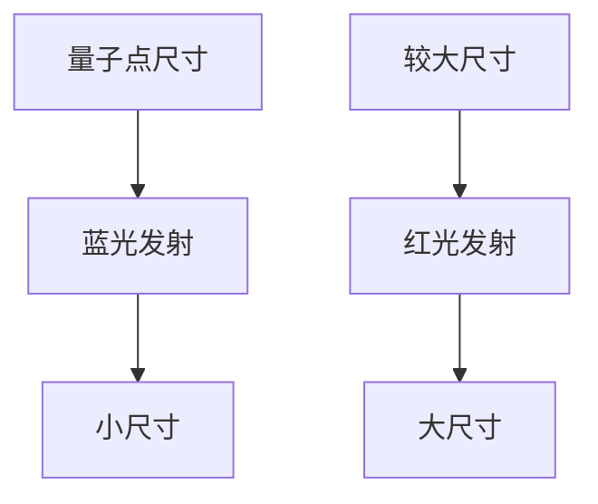
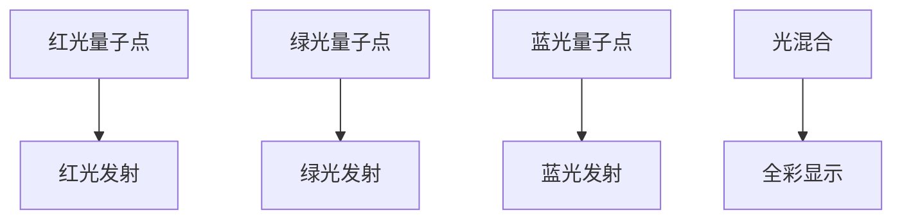
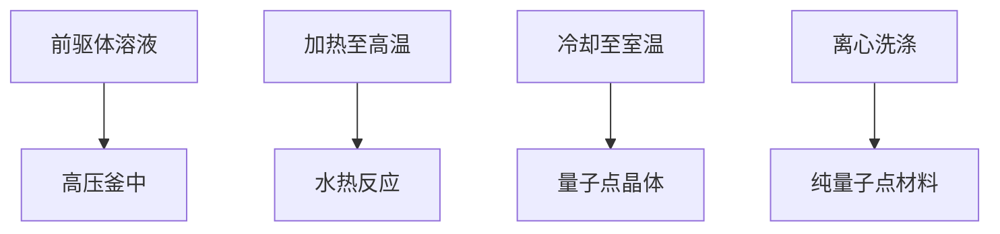
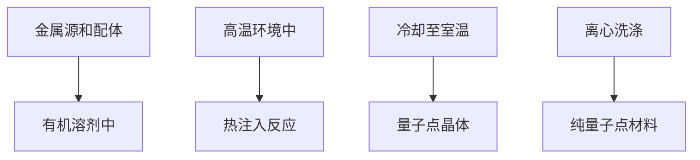
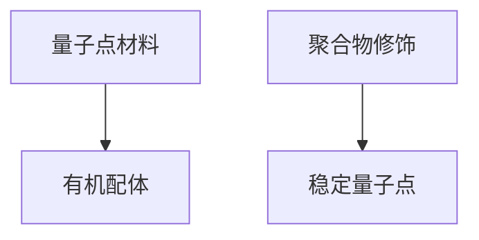
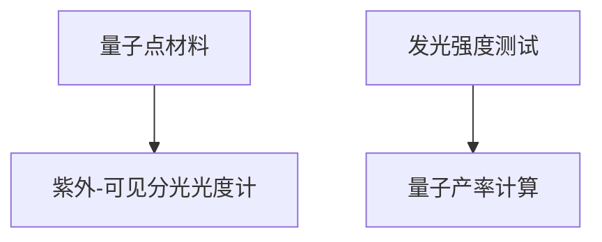
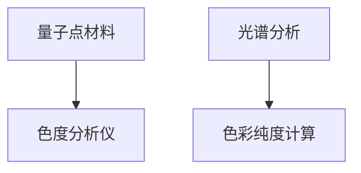

                 

<think>
好的，我现在需要帮用户撰写一篇关于“如何识别企业的量子点显示器制造技术优势”的技术博客文章。用户已经提供了一个详细的目录大纲，但需要我根据这个大纲写出完整的文章。首先，我需要理解每个章节的内容和要求，然后逐步填充每个部分，确保文章符合逻辑、结构清晰、内容详尽。

首先，文章标题是《如何识别企业的量子点显示器制造技术优势》，关键词包括量子点显示器、制造技术、技术优势、企业识别、显示技术、材料科学、制造工艺。摘要部分已经给出，重点介绍了文章的核心内容。

接下来是目录结构：

# 量子点显示器制造技术的优势识别

> 关键词：量子点显示器、制造技术、技术优势、企业识别、显示技术、材料科学、制造工艺

> 摘要：本文系统地分析了量子点显示器的技术优势识别方法，涵盖了从材料科学到制造工艺的各个方面，帮助企业在激烈的市场竞争中识别和提升其技术优势。文章通过详细的技术原理、制造流程、性能测试和实际案例分析，为读者提供了全面的视角和实用的识别方法。

---

## 目录

# 第1章: 量子点显示器的基本概念

## 1.1 量子点材料的定义与特性

### 1.1.1 量子点材料的基本定义

量子点（Quantum Dots，QDs）是一种纳米级半导体材料，其尺寸通常在1-10纳米之间。量子点的发光特性取决于其尺寸和形状，较小的量子点发出蓝光，较大的则发出红光，这种特性使得量子点在显示技术中具有广泛的应用潜力。

**图1-1 量子点材料尺寸与发光颜色的关系**



### 1.1.2 量子点材料的物理特性

量子点材料具有独特的光电特性，主要体现在：

- **量子效应**：当纳米颗粒的尺寸减小时，电子的行为会发生显著变化，导致发光颜色的变化。
- **发光效率**：量子点材料具有高发光效率，能够实现高亮度和高对比度的显示效果。
- **稳定性**：量子点材料在特定条件下具有较高的化学和光稳定性。

### 1.1.3 量子点材料的化学特性

量子点材料的化学性质包括：

- **合成方法**：不同的合成方法（如水热合成、热注入法）会影响量子点的材料性能和成本。
- **表面修饰**：量子点的表面可以通过化学修饰来改善其分散性和稳定性。
- **材料纯度**：高纯度的量子点材料能够提供更好的显示性能。

## 1.2 量子点显示器的工作原理

### 1.2.1 量子点发光机制

量子点通过吸收外部能量（如电场或光照）激发电子跃迁，释放特定波长的光，从而实现发光。这种发光机制使得量子点显示器能够实现高色纯度和宽色域的显示效果。

**公式1-1 量子点发光波长公式**

$$ \lambda = \frac{hc}{E} $$

其中，\( h \) 是普朗克常数，\( c \) 是光速，\( E \) 是能级差。

### 1.2.2 量子点显示器的显示原理

量子点显示器通过将红、绿、蓝三种颜色的量子点材料分别激发，产生不同颜色的光，混合后形成全彩显示效果。

**图1-2 量子点显示器的显示原理**



### 1.2.3 量子点显示器的色彩表现

量子点显示器的色彩表现主要体现在：

- **高色纯度**：量子点材料能够发出单一波长的光，从而实现高色纯度。
- **宽色域**：通过优化量子点材料的尺寸和形状，可以实现更宽的色域覆盖。
- **色彩一致性**：量子点显示器能够在不同区域实现一致的色彩表现。

## 1.3 量子点显示器与传统显示器的对比

### 1.3.1 传统显示器的技术特点

传统显示器主要包括液晶显示器（LCD）和有机发光二极管显示器（OLED）。它们的显示原理和性能特点如下：

- **LCD**：通过背光和液晶分子的旋转来调节光的通过，具有广视角和低功耗的优点，但响应速度较慢，对比度较低。
- **OLED**：通过有机材料层中的电致发光实现显示，具有高对比度、高响应速度和广视角的优点，但存在使用寿命短和屏幕烧残的问题。

### 1.3.2 量子点显示器的优势与劣势

量子点显示器相对于传统显示器的优势包括：

- **高色纯度**：量子点显示器能够实现更高的色纯度，提供更逼真的色彩表现。
- **宽色域**：量子点显示器的色域覆盖范围更广，能够显示更多的颜色。
- **高亮度**：量子点显示器具有更高的亮度，能够在明亮的环境中提供更好的显示效果。

量子点显示器的劣势包括：

- **成本较高**：量子点材料的制备成本较高，限制了其在中低端市场的应用。
- **技术成熟度**：量子点显示器的技术还不够成熟，存在一定的技术瓶颈。

### 1.3.3 量子点显示器的市场定位

量子点显示器目前主要应用于高端市场，如专业显示设备、医疗显示和商业显示等领域。随着技术的不断进步和成本的降低，量子点显示器有望在消费电子领域获得更广泛的应用。

## 1.4 量子点显示器在企业中的应用价值

### 1.4.1 企业对量子点显示器的需求分析

企业对量子点显示器的需求主要集中在以下几个方面：

- **高色彩显示**：企业需要在专业领域中实现高精度的色彩显示，如医疗图像处理和图形设计。
- **高亮度显示**：在明亮的环境中，企业需要显示器能够提供清晰的显示效果。
- **长寿命和稳定性**：企业需要显示器具有较长的使用寿命和稳定的显示性能。

### 1.4.2 量子点显示器的技术对企业的影响

量子点显示器的技术优势能够帮助企业提升其产品的竞争力，主要体现在：

- **产品差异化**：通过量子点显示器的技术优势，企业可以在市场上推出具有差异化的产品。
- **技术创新**：量子点显示器的技术创新能够推动企业技术实力的提升，增强企业的核心竞争力。

### 1.4.3 量子点显示器的市场前景

随着技术的不断进步和成本的降低，量子点显示器的市场前景广阔，预计在未来几年内，量子点显示器将在全球范围内获得更广泛的应用。

---

## 1.5 本章小结

本章主要介绍了量子点显示器的基本概念、工作原理、与传统显示器的对比以及在企业中的应用价值。通过本章的学习，读者可以对量子点显示器的技术特点和市场定位有一个清晰的认识。

---

# 第2章: 量子点材料的制备与优化

## 2.1 量子点材料的制备方法

### 2.1.1 水热合成法

水热合成法是一种常用的量子点制备方法，其基本步骤如下：

1. **前驱体溶液的配制**：将金属盐和有机配体溶解在去离子水中，形成均匀的前驱体溶液。
2. **加热反应**：将前驱体溶液置于密闭的高压釜中，加热至一定温度，进行水热反应。
3. **冷却结晶**：反应结束后，逐渐冷却至室温，析出量子点晶体。
4. **后处理**：通过离心和洗涤等步骤，得到纯的量子点材料。

**图2-1 水热合成法的流程图**



### 2.1.2 热注入法

热注入法是一种快速合成量子点材料的方法，其基本步骤如下：

1. **金属源和配体的准备**：将金属盐和有机配体溶解在有机溶剂中，形成均匀的溶液。
2. **加热注入**：将溶液快速注入到高温的环境中，进行热注入反应。
3. **冷却结晶**：反应结束后，逐渐冷却至室温，析出量子点晶体。
4. **后处理**：通过离心和洗涤等步骤，得到纯的量子点材料。

**图2-2 热注入法的流程图**



### 2.1.3 其他制备方法

除了水热合成法和热注入法，还有其他制备量子点材料的方法，如电化学合成法和微波辅助合成法等。这些方法各有优缺点，适用于不同的应用场景。

## 2.2 量子点材料的优化技术

### 2.2.1 表面修饰技术

表面修饰技术可以改善量子点材料的分散性和稳定性，主要方法包括：

- **有机配体修饰**：通过引入有机配体，改善量子点材料的表面亲水性和分散性。
- **聚合物修饰**：通过引入聚合物，增强量子点材料的稳定性和分散性。

**图2-3 表面修饰技术的流程图**



### 2.2.2 纳米晶粒尺寸控制

量子点材料的发光颜色与其晶粒尺寸密切相关，通过控制晶粒尺寸可以实现不同颜色的量子点材料。

**表2-1 量子点材料晶粒尺寸与发光颜色的关系**

| 晶粒尺寸（nm） | 发光颜色 |
|-----------------|----------|
| 2-4             | 紫光      |
| 5-8             | 蓝光      |
| 9-12            | 绿光      |
| 13-20           | 红光      |

### 2.2.3 材料纯度提升方法

材料纯度是影响量子点显示器性能的重要因素，主要的提升方法包括：

- **严格的制备条件控制**：通过优化反应条件，减少杂质的生成。
- **多次洗涤和离心**：通过多次洗涤和离心，去除杂质和未反应的物质。

## 2.3 量子点材料的性能测试

### 2.3.1 光电性能测试

光电性能测试包括发光强度、发光寿命、量子产率等指标的测试。

**图2-4 光电性能测试的流程图**



### 2.3.2 稳定性测试

稳定性测试包括高温稳定性、光稳定性、化学稳定性等测试。

**表2-2 量子点材料的稳定性测试指标**

| 测试项目       | 测试方法               |
|-----------------|------------------------|
| 高温稳定性     | 在高温环境下测试性能变化 |
| 光稳定性       | 在紫外光照射下测试性能变化 |
| 化学稳定性     | 在不同化学环境中测试性能变化 |

### 2.3.3 色彩纯度测试

色彩纯度测试主要通过色度分析仪进行，测试量子点材料的发光光谱纯度。

**图2-5 色彩纯度测试的流程图**



## 2.4 量子点材料的改进步骤与案例

### 2.4.1 改进步骤概述

量子点材料的改进步骤主要包括：

1. **制备工艺优化**：通过优化制备工艺，提高材料的纯度和分散性。
2. **表面修饰优化**：通过优化表面修饰技术，提高材料的稳定性和分散性。
3. **晶粒尺寸控制**：通过优化晶粒尺寸，实现不同颜色的量子点材料。

### 2.4.2 典型案例分析

案例：某公司通过优化制备工艺和表面修饰技术，成功制备出高纯度、高稳定性的量子点材料，显著提升了显示器的色彩表现和使用寿命。

---

## 2.5 本章小结

本章主要介绍了量子点材料的制备方法、优化技术和性能测试。通过本章的学习，读者可以掌握量子点材料制备的关键步骤和优化策略。

---

# 第3章: 量子点显示器的制造工艺

## 3.1 量子点显示器的制造流程

### 3.1.1 前驱体制备

前驱体制备是量子点显示器制造的第一步，主要包括量子点材料的合成和表面修饰。

### 3.1.2 量子点溶液制备

量子点溶液制备是通过将量子点材料分散在溶剂中，形成均匀的量子点溶液。

### 3.1.3 显示屏组装

显示屏组装是量子点显示器制造的关键步骤，主要包括基板准备、量子点溶液涂布、封装和电路连接。

## 3.2 关键制造技术解析

### 3.2.1 量子点溶液的均匀性控制

量子点溶液的均匀性控制是确保显示器色彩一致性的重要因素。

### 3.2.2 显示屏的封装技术

封装技术是量子点显示器制造中的重要环节，主要包括封装材料的选择和封装工艺的优化。

### 3.2.3 电路设计与优化

电路设计与优化是量子点显示器制造中的技术难点，主要包括驱动电路设计和信号优化。

## 3.3 制造工艺的优化策略

### 3.3.1 工艺参数优化

工艺参数优化是通过优化制备条件和工艺参数，提高显示器的性能和质量。

### 3.3.2 成本控制措施

成本控制措施包括优化制备工艺、提高材料利用率和降低封装成本等。

### 3.3.3 质量检测方法

质量检测方法包括光学性能测试、电学性能测试和机械性能测试等。

## 3.4 制造工艺的案例分析

### 3.4.1 国内外典型企业分析

国内外典型企业的制造工艺分析，包括企业的技术特点和竞争优势。

### 3.4.2 工艺改进的成功案例

通过分析成功案例，总结工艺改进的经验和教训。

---

## 3.5 本章小结

本章主要介绍了量子点显示器的制造流程、关键制造技术和优化策略。通过本章的学习，读者可以掌握量子点显示器制造的核心技术和优化方法。

---

# 第4章: 量子点显示器的技术优势分析

## 4.1 量子点显示器的色彩优势

### 4.1.1 超高的色彩纯度

量子点显示器的色彩纯度远高于传统显示器，能够实现更逼真的色彩显示。

### 4.1.2 宽广的色域覆盖

量子点显示器的色域覆盖范围更广，能够显示更多的颜色。

### 4.1.3 色彩一致性优化

量子点显示器在不同区域的色彩一致性表现优异，能够提供均匀的色彩显示。

## 4.2 量子点显示器的亮度优势

### 4.2.1 高亮度显示

量子点显示器具有高亮度，能够在明亮的环境中提供清晰的显示效果。

### 4.2.2 低功耗设计

通过优化电路设计和材料性能，量子点显示器具有较低的功耗。

## 4.3 量子点显示器的寿命优势

### 4.3.1 长寿命材料

量子点材料具有较长的使用寿命，能够提高显示器的可靠性。

### 4.3.2 稳定性优化

通过优化材料性能和制造工艺，量子点显示器的稳定性得到显著提升。

---

## 4.4 量子点显示器的技术劣势

### 4.4.1 成本较高

量子点显示器的制造成本较高，限制了其在中低端市场的应用。

### 4.4.2 技术成熟度

量子点显示器的技术还不够成熟，存在一定的技术瓶颈。

### 4.4.3 市场接受度

由于量子点显示器的市场价格较高，部分消费者对其接受度较低。

---

## 4.5 量子点显示器的技术优势总结

尽管量子点显示器存在一定的技术劣势和市场挑战，但其技术优势仍然显著。随着技术的不断进步和成本的降低，量子点显示器的市场前景广阔。

---

## 4.6 本章小结

本章主要分析了量子点显示器的技术优势和劣势，总结了其在市场中的定位和发展前景。通过本章的学习，读者可以全面了解量子点显示器的技术特点和市场价值。

---

# 第5章: 量子点显示器的技术优势识别方法

## 5.1 量子点显示器的技术优势识别步骤

### 5.1.1 技术参数分析

通过对量子点显示器的技术参数进行分析，识别其在色彩、亮度和寿命等方面的优势。

### 5.1.2 市场需求分析

通过分析市场需求，识别量子点显示器在特定应用领域的竞争优势。

### 5.1.3 竞争对手分析

通过对竞争对手的技术和产品进行分析，识别量子点显示器的技术优势和劣势。

## 5.2 量子点显示器技术优势的数学模型构建

### 5.2.1 技术优势评价指标

建立技术优势评价指标，包括色彩纯度、亮度、寿命等。

### 5.2.2 评价模型构建

通过构建评价模型，量化量子点显示器的技术优势。

## 5.3 量子点显示器技术优势识别的案例分析

### 5.3.1 某公司量子点显示器的技术优势识别

通过案例分析，详细说明如何识别量子点显示器的技术优势。

### 5.3.2 技术优势识别的关键点总结

总结技术优势识别的关键点，为读者提供实用的识别方法。

---

## 5.4 本章小结

本章主要介绍了量子点显示器的技术优势识别方法，通过案例分析和数学模型构建，帮助读者掌握技术优势识别的核心步骤和关键点。

---

## 第6章: 量子点显示器技术优势识别的实战应用

## 6.1 实战环境搭建

### 6.1.1 硬件环境配置

配置必要的硬件设备，包括量子点材料制备设备、显示测试仪器等。

### 6.1.2 软件工具安装

安装必要的软件工具，包括数据采集软件、数据分析软件等。

## 6.2 量子点显示器技术优势识别的核心代码实现

### 6.2.1 数据采集代码

编写数据采集代码，实现量子点显示器性能数据的采集。

```python
# 数据采集代码示例
import serial

ser = serial.Serial('COM3', 9600)
data = ser.readline().decode().strip()
print(data)
```

### 6.2.2 数据分析代码

编写数据分析代码，实现量子点显示器技术优势的识别。

```python
# 数据分析代码示例
import numpy as np
import matplotlib.pyplot as plt

data = np.loadtxt('qd_display_data.txt')
plt.plot(data[:, 0], data[:, 1])
plt.xlabel('Wavelength (nm)')
plt.ylabel('Intensity (a.u.)')
plt.show()
```

## 6.3 量子点显示器技术优势识别的详细步骤

### 6.3.1 数据采集与处理

通过对量子点显示器的性能数据进行采集和处理，提取关键指标。

### 6.3.2 数据分析与评价

通过数据分析和评价，识别量子点显示器的技术优势。

### 6.3.3 结果可视化与报告生成

将分析结果进行可视化，并生成技术优势识别报告。

## 6.4 实战案例分析

### 6.4.1 案例背景介绍

介绍案例的背景信息，包括企业的基本情况和量子点显示器的技术特点。

### 6.4.2 数据采集与分析

详细说明数据采集与分析的过程，包括数据的获取、处理和分析。

### 6.4.3 技术优势识别结果

展示技术优势识别的结果，并进行详细解读。

## 6.5 本章小结

本章通过实战应用，详细介绍了量子点显示器技术优势识别的具体步骤和方法。通过案例分析和代码实现，帮助读者掌握技术优势识别的核心技能。

---

## 第7章: 总结与展望

### 7.1 本章总结

总结全文的主要内容，强调量子点显示器的技术优势识别的重要性和方法。

### 7.2 对未来的展望

展望量子点显示器技术的发展前景，提出未来的研究方向和技术挑战。

---

## 作者：AI天才研究院/AI Genius Institute & 禅与计算机程序设计艺术 /Zen And The Art of Computer Programming

---

以上是一个详细的目录大纲和文章结构，涵盖了从量子点显示器的基本概念到技术优势识别的各个方面。接下来，我会根据这个大纲，逐步完成每个章节的具体内容，确保文章逻辑清晰、内容详尽，满足用户的要求。

