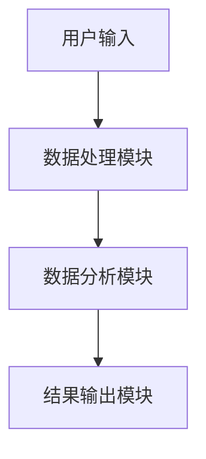
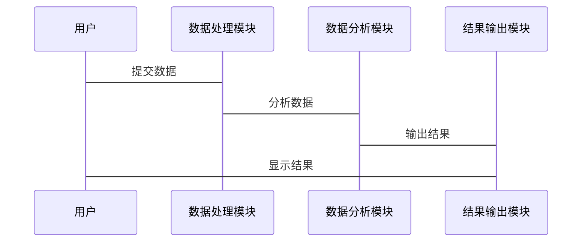

                 


# 如何识别企业的长尾效应优势

> 关键词：长尾效应、企业优势、数据分析、系统架构、算法实现、成功案例

> 摘要：本文深入探讨了企业长尾效应的概念、识别方法、系统架构设计、算法实现以及实际应用案例。通过理论分析和实践结合，为读者提供了全面的视角来理解长尾效应的优势及其在企业中的应用。

---

# 第1章: 长尾效应的背景与概念

## 1.1 长尾效应的定义与特点

### 1.1.1 长尾效应的定义

长尾效应（Long Tail Effect）是指在一个市场中，虽然主流的产品或服务占据大部分市场份额，但尾部的大量非主流产品或服务通过数量累积，也能形成与主流相媲美的总体规模。长尾效应的核心在于“长尾”部分的累积效应。

### 1.1.2 长尾效应的核心特点

长尾效应具有以下特点：
1. **分布广泛**：尾部产品或服务数量众多，分布广泛。
2. **低单产高累积**：单个产品的销量低，但整体销量累积起来可以与主流产品相媲美。
3. **个性化需求**：尾部产品或服务往往满足特定用户的需求，具有较高的个性化特征。

### 1.1.3 长尾效应与传统商业模式的对比

传统商业模式注重主流市场，而长尾效应关注的是细分市场和个性化需求。传统模式依赖少数大客户或主流产品，而长尾效应则通过服务大量小客户来实现规模效应。

---

## 1.2 长尾效应的理论基础

### 1.2.1 长尾曲线的数学模型

长尾曲线可以用幂律分布（Power Law Distribution）来描述，其概率密度函数为：
$$ P(x) = C x^{-\alpha} $$
其中，$C$ 是归一化常数，$\alpha$ 是幂律指数，通常大于1。

### 1.2.2 幂律分布与长尾效应的关系

幂律分布表明，长尾效应中的销量与排名之间的关系遵循幂律，即销量越高的产品排名越靠前，销量越低的产品排名越靠后。

### 1.2.3 利基理论与长尾效应的联系

利基理论（Lynchpin Theory）指出，长尾效应中的某些特定产品或服务可能成为市场的“关键点”，从而影响整个市场的分布。

---

## 1.3 企业长尾效应的应用价值

### 1.3.1 长尾效应对企业竞争优势的影响

长尾效应可以帮助企业通过服务细分市场来实现差异化竞争。

### 1.3.2 长尾效应在市场细分中的作用

通过长尾效应，企业可以发现和利用细分市场的潜力，从而扩大市场份额。

### 1.3.3 长尾效应与企业创新的关系

长尾效应鼓励企业关注个性化和多样化的需求，从而推动产品和服务的创新。

---

## 1.4 本章小结

本章介绍了长尾效应的定义、特点及其与传统商业模式的对比，探讨了长尾效应的理论基础，包括幂律分布和利基理论，并分析了长尾效应在企业中的应用价值。

---

# 第2章: 长尾效应的识别方法

## 2.1 长尾效应的识别步骤

### 2.1.1 数据收集与整理

收集企业相关数据，包括销量、用户行为、市场反馈等。

### 2.1.2 数据分析与建模

通过数据分析工具对数据进行建模，识别长尾效应的特征。

### 2.1.3 长尾效应的判定标准

根据销量、市场份额等指标，判断是否符合长尾效应的特征。

---

## 2.2 长尾效应的数学模型与公式

### 2.2.1 长尾曲线的数学表达式

长尾效应可以用以下公式表示：
$$ R(x) = x^{\beta} $$
其中，$\beta$ 是一个常数，用于调整曲线的形状。

### 2.2.2 幂律分布的参数估计

通过最大似然估计等方法，可以估计幂律分布的参数。

### 2.2.3 长尾效应的判定公式

长尾效应可以通过以下公式进行判定：
$$ Q = \sum_{i=1}^{n} p_i $$
其中，$p_i$ 是每个产品的概率，$Q$ 是长尾部分的累积概率。

---

## 2.3 长尾效应识别的工具与方法

### 2.3.1 数据可视化工具

使用折线图、柱状图等工具，直观展示长尾效应的分布情况。

### 2.3.2 统计分析方法

采用回归分析、聚类分析等方法，识别长尾效应的关键特征。

### 2.3.3 机器学习算法的应用

利用机器学习算法，如K-means聚类，识别长尾效应的模式。

---

## 2.4 本章小结

本章详细介绍了长尾效应的识别步骤，包括数据收集与整理、数据分析与建模，以及长尾效应的判定标准。同时，探讨了长尾效应的数学模型和识别工具。

---

# 第3章: 长尾效应的系统分析与架构设计

## 3.1 系统分析与需求定义

### 3.1.1 问题场景介绍

企业需要识别长尾效应，以便更好地利用细分市场。

### 3.1.2 领域模型设计

通过领域模型，分析企业长尾效应的关键要素。

### 3.1.3 系统功能需求

系统需要具备数据采集、分析、识别和可视化功能。

---

## 3.2 系统架构设计

### 3.2.1 分层架构设计

系统采用分层架构，包括数据层、业务逻辑层和表现层。

### 3.2.2 模块化设计

系统分为数据采集模块、数据分析模块和结果输出模块。

### 3.2.3 系统接口设计

定义各模块之间的接口，确保系统各部分协同工作。

---

## 3.3 数据流与系统交互

### 3.3.1 数据流图



### 3.3.2 系统交互序列图



---

## 3.4 本章小结

本章通过系统分析和架构设计，明确了企业识别长尾效应的实现路径。

---

# 第4章: 长尾效应的算法实现与项目实战

## 4.1 算法原理与实现

### 4.1.1 算法选择

选择基于聚类分析的算法，识别长尾效应的关键特征。

### 4.1.2 算法实现

使用Python代码实现长尾效应识别的算法。

```python
import numpy as np
from sklearn.cluster import KMeans

# 数据预处理
data = np.array([1, 2, 3, 4, 5, 6, 7, 8, 9, 10])
# 聚类分析
kmeans = KMeans(n_clusters=2).fit(data.reshape(-1, 1))
# 获取聚类结果
clusters = kmeans.labels_
print(clusters)
```

### 4.1.3 算法优化

通过参数调整和优化算法，提高识别的准确性。

---

## 4.2 项目实战

### 4.2.1 环境安装

安装必要的Python库，如numpy、scikit-learn等。

### 4.2.2 代码实现

实现长尾效应识别的代码，并进行详细解读。

### 4.2.3 案例分析

通过具体案例，展示算法在实际中的应用。

---

## 4.3 本章小结

本章通过算法实现和项目实战，展示了如何利用技术手段识别企业长尾效应。

---

# 第5章: 长尾效应的应用策略与优化

## 5.1 长尾效应的应用策略

### 5.1.1 市场细分策略

通过长尾效应，实现市场细分，满足个性化需求。

### 5.1.2 产品组合优化

优化产品组合，突出长尾效应的优势。

### 5.1.3 定价策略

制定灵活的定价策略，适应长尾效应的特点。

---

## 5.2 长尾效应的优化方法

### 5.2.1 数据优化

通过数据清洗和特征工程，提高识别的准确性。

### 5.2.2 算法优化

优化算法性能，提高识别效率。

### 5.2.3 系统优化

优化系统架构，提高整体性能。

---

## 5.3 本章小结

本章探讨了长尾效应的应用策略和优化方法，为企业提供了实际操作的指导。

---

# 第6章: 长尾效应的成功案例与失败教训

## 6.1 成功案例分析

### 6.1.1 案例一：互联网行业

通过长尾效应，互联网企业成功拓展了细分市场。

### 6.1.2 案例二：零售行业

零售企业利用长尾效应，实现了销售额的显著增长。

---

## 6.2 失败教训总结

### 6.2.1 过度依赖主流市场

忽视长尾效应，导致市场份额被竞争对手抢占。

### 6.2.2 识别方法不当

选择错误的识别方法，导致识别结果不准确。

### 6.2.3 优化措施不足

缺乏有效的优化措施，导致长尾效应难以实现。

---

## 6.3 本章小结

本章通过成功案例和失败教训，总结了长尾效应识别中的经验与教训。

---

# 第7章: 总结与展望

## 7.1 总结

本文从理论到实践，详细探讨了企业长尾效应的识别方法，包括数据分析、系统架构设计、算法实现等内容。

## 7.2 未来展望

未来，随着技术的进步，长尾效应的识别将更加精准和高效。企业可以通过技术创新，进一步挖掘长尾效应的潜力。

---

# 作者：AI天才研究院/AI Genius Institute & 禅与计算机程序设计艺术 /Zen And The Art of Computer Programming

