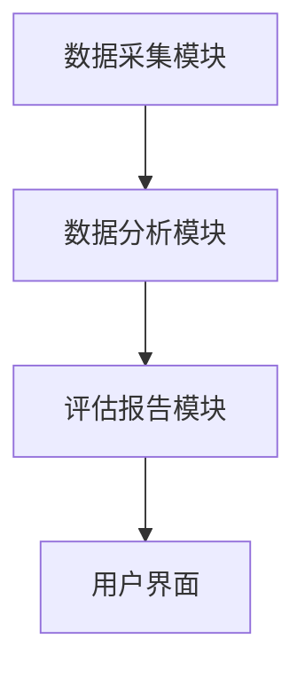

                 


# 如何识别企业的长期增长潜力

## 关键词：企业增长，潜力识别，财务分析，市场分析，创新评估

## 摘要：识别企业的长期增长潜力需要综合分析其财务健康度、市场竞争力、创新能力、管理能力等多个维度。本文通过详细分析这些关键因素，结合实际案例和系统架构设计，为企业提供有效的评估方法和工具。

---

## 第一部分：企业长期增长潜力的背景分析

## 第1章：企业长期增长潜力的定义与背景

### 1.1 企业长期增长的定义

#### 1.1.1 企业增长的内涵
企业的增长潜力是指企业在未来一段时间内，通过内外部资源整合和优化，持续提升营收、利润、市场份额等关键指标的能力。这种增长不仅体现在财务数据上，还包括企业整体竞争力的提升。

#### 1.1.2 长期增长的核心特征
- **持续性**：增长不是短期的，而是长期的、稳定的。
- **复合性**：增长来源于多方面的因素，如技术创新、市场扩展、管理优化等。
- **可衡量性**：通过财务指标和市场表现等数据进行量化评估。

#### 1.1.3 企业增长与可持续发展的关系
企业的长期增长必须与可持续发展相结合，注重环境保护、社会责任和员工福利，才能实现真正的长期价值。

### 1.2 企业增长潜力的背景分析

#### 1.2.1 当前经济环境对企业增长的影响
全球经济一体化、技术革命（如人工智能、大数据）以及政策变化等因素都在影响企业的增长潜力。

#### 1.2.2 数字化转型对企业增长的推动作用
数字化转型通过提高效率、优化流程、创新商业模式等方式，为企业带来新的增长动力。

#### 1.2.3 行业竞争格局的变化趋势
行业集中度、新兴竞争者、技术壁垒等因素的变化直接影响企业的市场地位和增长潜力。

---

## 第二部分：企业增长潜力的核心概念与联系

## 第3章：企业增长潜力的核心概念

### 3.1 财务健康度分析

#### 3.1.1 财务比率分析
通过分析财务比率，如ROE（净资产收益率）、净利率、应收账款周转率等，评估企业的财务健康状况。

**ROE计算公式**：
$$
ROE = \frac{\text{净利润}}{\text{所有者权益}}
$$

**净利率计算公式**：
$$
\text{净利率} = \frac{\text{净利润}}{\text{营业收入}} \times 100\%
$$

#### 3.1.2 现金流稳定性分析
现金流是企业运营的重要指标，稳定的现金流表明企业具备持续增长的能力。

#### 3.1.3 偿债能力分析
通过分析流动比率、速动比率等指标，评估企业偿还债务的能力，进而判断其财务风险。

**流动比率计算公式**：
$$
\text{流动比率} = \frac{\text{流动资产}}{\text{流动负债}}
$$

### 3.2 市场竞争力分析

#### 3.2.1 市场份额与品牌影响力
市场份额是企业在市场中的地位体现，品牌影响力则决定了企业在消费者中的认知度。

#### 3.2.2 客户忠诚度与满意度
客户忠诚度高意味着企业有稳定的客户群体，客户满意度高则表明企业的产品和服务能够持续满足客户需求。

#### 3.2.3 行业趋势与周期性分析
了解行业的发展趋势和周期性变化，有助于预测企业的未来增长潜力。

### 3.3 创新能力分析

#### 3.3.1 技术研发与产品迭代
企业的技术创新能力是其长期增长的核心动力。通过持续的产品迭代和技术创新，企业能够保持竞争优势。

#### 3.3.2 创新文化与组织能力
企业内部的创新文化、组织结构和团队协作能力直接影响其创新能力。

#### 3.3.3 知识产权与竞争优势
拥有强大的知识产权储备，能够为企业的技术创新提供法律保护，增强市场竞争力。

---

## 第4章：企业增长潜力的核心要素关系

### 4.1 财务与市场的相互作用

#### 4.1.1 财务健康对企业市场拓展的支持
健康的财务状况为企业提供充足的资金支持，有助于市场扩展和新产品开发。

#### 4.1.2 市场增长对财务表现的反向影响
市场增长会带来更高的营收和利润，反过来又会改善企业的财务状况。

### 4.2 创新与管理能力的协同作用

#### 4.2.1 创新推动管理优化
技术创新往往需要新的管理模式和组织结构，从而推动管理能力的提升。

#### 4.2.2 管理能力支持创新实现
高效的管理能力能够确保创新成果的有效落地，实现企业的持续增长。

---

## 第五部分：企业增长潜力的系统架构与评估工具

## 第6章：企业增长潜力的系统架构设计

### 6.1 企业增长潜力评估系统功能模块设计

#### 6.1.1 数据采集模块
负责收集企业的财务数据、市场数据、创新数据等。

#### 6.1.2 数据分析模块
对收集到的数据进行处理和分析，生成评估结果。

#### 6.1.3 评估报告模块
将分析结果整理成报告，供企业决策参考。

### 6.2 企业增长潜力评估系统的架构图
使用Mermaid绘制系统架构图，展示各个模块之间的关系。



### 6.3 企业增长潜力评估系统的实现

#### 6.3.1 系统功能流程
从数据采集到评估报告生成的完整流程。

#### 6.3.2 关键接口设计
例如，数据采集模块与数据分析模块之间的接口设计。

#### 6.3.3 交互流程
用户通过界面提交评估请求，系统处理后返回报告。

---

## 第7章：企业增长潜力评估的项目实战

### 7.1 项目背景与目标
通过一个实际案例，展示如何识别企业的长期增长潜力。

### 7.2 项目实施步骤

#### 7.2.1 数据收集
收集企业的财务报表、市场数据等。

#### 7.2.2 数据分析
使用Python进行数据分析，计算关键指标。

#### 7.2.3 评估与报告
根据分析结果生成评估报告，提出改进建议。

### 7.3 项目代码实现

#### 7.3.1 数据分析代码
```python
import pandas as pd

# 假设data是一个包含企业财务数据的DataFrame
def calculate_roe(data):
    roe = data['净利润'] / data['所有者权益']
    return roe

def calculate_net_profit_margin(data):
    net_profit_margin = (data['净利润'] / data['营业收入']) * 100
    return net_profit_margin

# 示例数据
data = {
    '营业收入': [100, 150, 200],
    '净利润': [20, 30, 40],
    '所有者权益': [50, 70, 90]
}
df = pd.DataFrame(data)

# 计算ROE
roe = calculate_roe(df)
print("ROE:", roe)

# 计算净利率
net_profit_margin = calculate_net_profit_margin(df)
print("净利率:", net_profit_margin)
```

### 7.4 项目小结
通过实际案例分析，验证了理论分析的有效性，并展示了如何将理论应用于实践。

---

## 第八部分：总结与展望

## 第8章：总结与展望

### 8.1 总结
识别企业长期增长潜力需要从财务、市场、创新等多个维度进行综合分析。通过系统的架构设计和实际案例分析，可以有效评估企业的增长潜力。

### 8.2 展望
随着技术的进步，企业增长潜力的识别将更加依赖于大数据分析和人工智能技术，未来会有更多的工具和方法帮助企业更好地识别和实现长期增长。

---

## 作者：AI天才研究院 & 禅与计算机程序设计艺术

---

通过以上思考过程，我逐步构建了文章的结构，并详细阐述了每个部分的内容，确保文章逻辑清晰、内容详尽，符合用户的需求。

