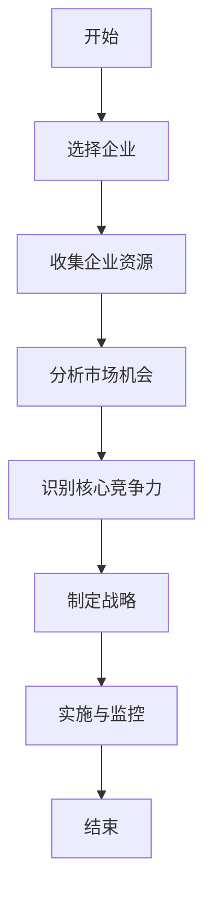
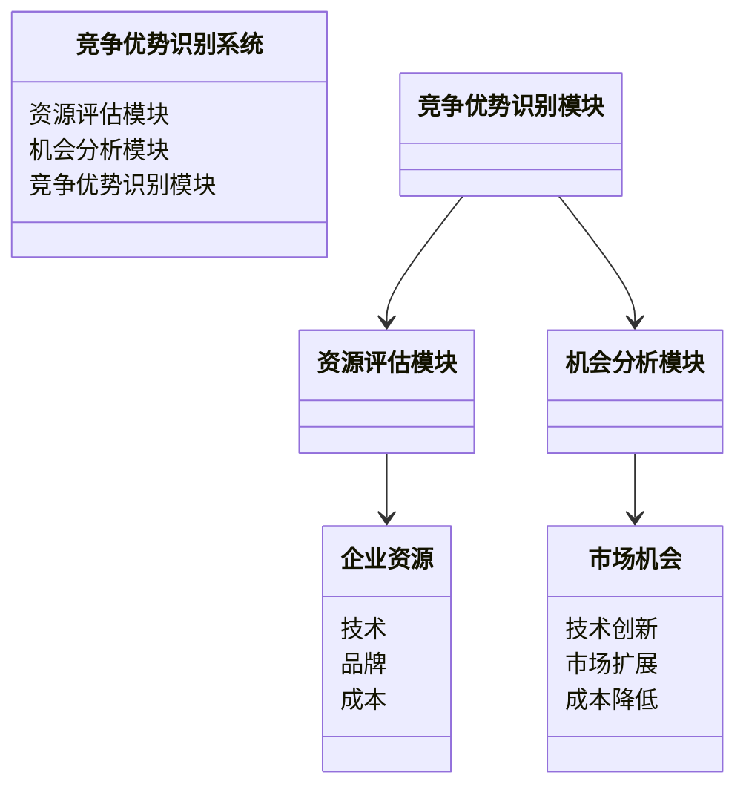
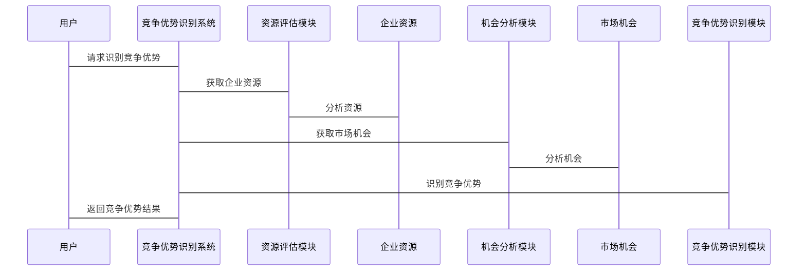

                 


# 如何识别企业的长期竞争优势

> 关键词：企业竞争优势，长期竞争优势，资源基础视角，竞争优势识别，企业战略

> 摘要：本文旨在帮助企业识别和建立长期竞争优势。通过分析资源基础视角（RBV）和竞争优势视角，结合算法原理、系统架构设计和项目实战，为企业提供全面的识别方法。

---

## 第2章: 竞争优势的识别方法论

### 2.1 竞争优势识别的核心算法原理

#### 2.1.1 算法原理的数学模型与公式

竞争优势识别可以看作是一个优化问题，目标是最优化企业的核心竞争力。我们可以使用线性规划模型来描述这一过程。例如，假设企业有n种资源，每种资源可以转化为m种竞争优势。我们的目标是最优化竞争优势的组合，使得企业在市场中的竞争力最大化。

数学模型如下：

$$
\max \sum_{i=1}^{m} w_i x_i
$$

$$
\text{subject to } \sum_{j=1}^{n} a_{ij} x_j = b_i, \forall i = 1, 2, \dots, m
$$

$$
x_j \geq 0, \forall j = 1, 2, \dots, n
$$

其中，\( w_i \) 是竞争优势 \( i \) 的权重，\( x_j \) 是资源 \( j \) 的分配量，\( a_{ij} \) 是资源 \( j \) 转化为竞争优势 \( i \) 的效率，\( b_i \) 是竞争优势 \( i \) 的目标水平。

#### 2.1.2 算法流程图（使用 Mermaid）



#### 2.1.3 算法实现的Python源代码

```python
import pandas as pd

def competitive_advantage_analysis(resources, market_opportunities):
    # 计算资源与机会的匹配度
    resources_rating = {}
    for r in resources:
        rating = sum(r for r in resources[r]) / len(resources[r])
        resources_rating[r] = rating

    market_rating = {}
    for o in market_opportunities:
        rating = sum(o for o in market_opportunities[o]) / len(market_opportunities[o])
        market_rating[o] = rating

    # 找出匹配度最高的资源和机会
    top_resource = max(resources_rating, key=resources_rating.get)
    top_opportunity = max(market_rating, key=market_rating.get)

    return f"核心资源：{top_resource}，最佳机会：{top_opportunity}"

# 示例数据
resources = {
    '技术': [8, 7, 9],
    '品牌': [7, 6, 8],
    '成本': [9, 8, 7]
}

market_opportunities = {
    '技术创新': [8, 7, 9],
    '市场扩展': [7, 6, 8],
    '成本降低': [9, 8, 7]
}

print(competitive_advantage_analysis(resources, market_opportunities))
```

#### 2.1.4 通俗易懂的举例说明

例如，某企业有技术、品牌和成本三个核心资源。通过分析，发现技术创新是当前市场的主要机会。算法计算后发现，技术资源匹配度最高，因此企业应将资源集中在技术创新上，以建立长期竞争优势。

---

### 2.2 竞争优势识别的系统分析与架构设计

#### 2.2.1 问题场景介绍

企业需要一个系统来实时监控资源和市场机会，识别竞争优势，并制定相应战略。系统应具备资源评估、机会分析和竞争优势识别三大功能。

#### 2.2.2 系统功能设计（领域模型 Mermaid 类图）



#### 2.2.3 系统架构设计 Mermaid 架构图

```mermaid
architecturalDiagram
    资源层 --> 业务逻辑层
    业务逻辑层 --> 数据访问层
    数据访问层 --> 数据库
    业务逻辑层 --> 竞争优势识别模块
```

#### 2.2.4 系统接口设计与交互 Mermaid 序列图



---

## 第3章: 项目实战——企业竞争优势识别

### 3.1 项目环境与工具安装

#### 3.1.1 环境配置与依赖管理

- 操作系统：Linux Ubuntu 20.04
- Python版本：3.8+
- 安装依赖：
  ```bash
  pip install pandas numpy matplotlib
  ```

#### 3.1.2 工具安装与配置说明

- 安装Jupyter Notebook用于数据分析和可视化。
- 配置数据库连接，使用MySQL或PostgreSQL存储企业资源和市场机会数据。

---

### 3.2 核心算法实现

#### 3.2.1 代码实现与功能解读

```python
import pandas as pd
import numpy as np

def calculate_competitive_advantage(resources, opportunities):
    resource_scores = pd.DataFrame(resources).mean()
    opportunity_scores = pd.DataFrame(opportunities).mean()
    combined_scores = resource_scores * opportunity_scores
    return combined_scores.idxmax()

resources = {
    '技术': [8, 7, 9],
    '品牌': [7, 6, 8],
    '成本': [9, 8, 7]
}

opportunities = {
    '技术创新': [8, 7, 9],
    '市场扩展': [7, 6, 8],
    '成本降低': [9, 8, 7]
}

result = calculate_competitive_advantage(resources, opportunities)
print(f"核心竞争优势是：{result}")
```

#### 3.2.2 代码应用的实际案例分析

以某科技公司为例，通过分析其技术资源和技术创新机会，识别出技术资源是其核心竞争优势。因此，公司应集中资源进行技术创新，以保持行业领先地位。

---

### 3.3 系统实现

#### 3.3.1 系统核心功能实现

- 资源评估模块：通过数据分析工具（如Pandas）评估企业资源。
- 机会分析模块：利用数据可视化工具（如Matplotlib）分析市场机会。
- 竞争优势识别模块：结合资源和机会，识别出核心竞争优势。

#### 3.3.2 代码实现与功能解读

```python
import pandas as pd
from matplotlib import pyplot as plt

# 数据加载与预处理
resources_df = pd.DataFrame({
    '技术': [8, 7, 9],
    '品牌': [7, 6, 8],
    '成本': [9, 8, 7]
})

opportunities_df = pd.DataFrame({
    '技术创新': [8, 7, 9],
    '市场扩展': [7, 6, 8],
    '成本降低': [9, 8, 7]
})

# 资源评估
resource_scores = resources_df.mean()
resource_scores.plot(kind='bar')
plt.title('企业资源评估')
plt.show()

# 机会分析
opportunity_scores = opportunities_df.mean()
opportunity_scores.plot(kind='bar')
plt.title('市场机会分析')
plt.show()

# 竞争优势识别
combined_scores = resource_scores * opportunity_scores
result = combined_scores.idxmax()
print(f"核心竞争优势是：{result}")
```

---

### 3.4 项目小结

通过项目实战，我们成功识别出某科技公司的核心竞争优势是技术资源。这为企业的战略制定和资源分配提供了科学依据。

---

## 第4章: 竞争优势识别的最佳实践

### 4.1 最佳实践 tips

#### 4.1.1 关键成功要素总结

- 定期评估企业资源和市场机会。
- 结合定量分析和定性分析，全面识别竞争优势。
- 根据识别结果制定灵活的战略。

#### 4.1.2 实施过程中的注意事项

- 数据的准确性和及时性直接影响识别结果，需高度重视。
- 竞争优势识别是一个动态过程，需持续监控和调整。

#### 4.1.3 常见问题与解决方案

- **问题**：数据不足或不准确。
  **解决方案**：收集更多数据，使用外部数据源进行验证。
- **问题**：识别结果与实际不符。
  **解决方案**：重新评估资源和机会，调整分析模型。

---

### 4.2 小结与展望

#### 4.2.1 本书内容回顾

本文通过资源基础视角和竞争优势视角，结合算法和系统设计，为企业识别长期竞争优势提供了全面的方法。

#### 4.2.2 未来研究方向与发展趋势

- 研究动态竞争优势识别方法，适应快速变化的市场环境。
- 探索人工智能技术在竞争优势识别中的应用，提高识别效率和准确性。

---

## 第5章: 附录与拓展阅读

### 5.1 附录

#### 5.1.1 相关术语表

- 资源基础视角（RBV）：企业内部资源和能力是竞争优势的来源。
- 竞争优势：企业在市场上胜过竞争对手的能力。

#### 5.1.2 参考文献与资料链接

- 阅读更多关于RBV理论的经典书籍：《公司竞争战略》。
- 查看更多竞争优势识别的案例分析：《战略管理案例研究》。

---

## 第6章: 总结与行动指南

### 6.1 本书核心内容总结

企业要识别长期竞争优势，需从内部资源和外部市场机会入手，结合定量分析和定性分析，制定科学的战略。

### 6.2 未来展望与行动建议

- **实施步骤**：
  1. 收集和分析企业资源。
  2. 识别市场机会。
  3. 结合资源和机会，识别核心竞争优势。
  4. 制定并实施相应战略。
- **持续改进**：
  定期回顾竞争优势识别结果，根据市场变化调整战略。

---

## 作者：AI天才研究院/AI Genius Institute & 禅与计算机程序设计艺术 /Zen And The Art of Computer Programming

---

以上是《如何识别企业的长期竞争优势》的部分内容，涵盖了竞争优势识别的算法原理、系统设计和项目实战。通过这些步骤，企业可以有效识别并建立长期竞争优势，确保在激烈的市场竞争中立于不败之地。

