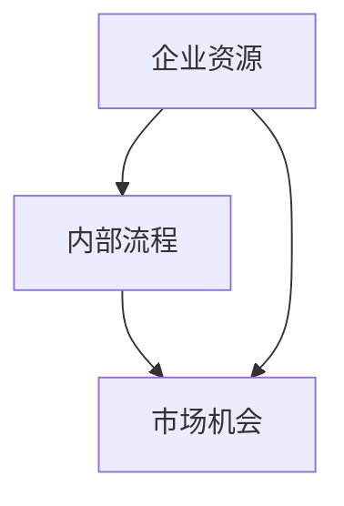
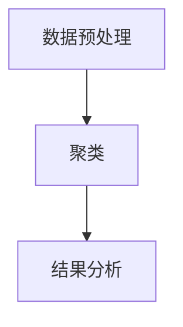
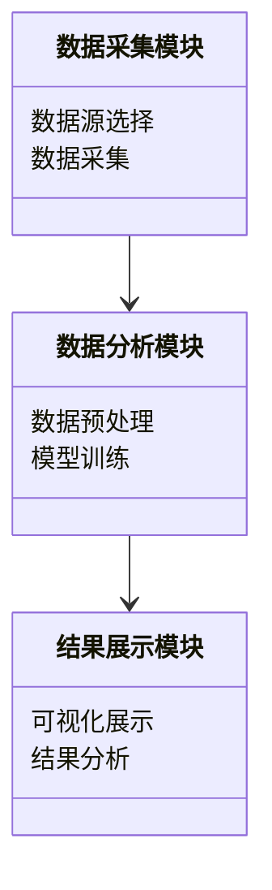
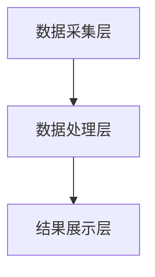
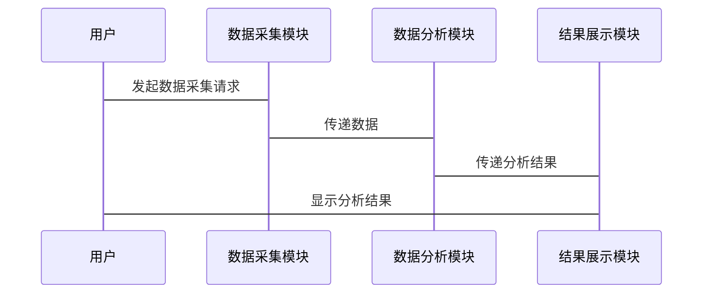

                 


# 如何识别企业的隐藏价值

> 关键词：企业隐藏价值、数据挖掘、机器学习、系统架构、流程优化

> 摘要：识别企业的隐藏价值是提升企业竞争力的重要手段。本文从概念、算法、系统架构等多个角度深入探讨隐藏价值的识别方法，通过实际案例分析和代码实现，帮助读者掌握如何利用技术手段挖掘企业潜在价值。

---

## 第一部分: 企业隐藏价值概述

### 第1章: 企业隐藏价值的概念与背景

#### 1.1 隐藏价值的定义与特征

##### 1.1.1 隐藏价值的定义
隐藏价值指的是企业在日常运营中未被充分识别或利用的潜在资源、机会或效率提升空间。这些价值通常隐藏在企业的数据、流程或市场动态中，需要通过特定的方法和技术进行挖掘。

##### 1.1.2 隐藏价值的核心特征
- **隐藏性**：未被察觉或未被充分利用。
- **可开发性**：通过适当的方法可以转化为实际价值。
- **时效性**：部分隐藏价值可能随市场变化而变化。

##### 1.1.3 隐藏价值与企业绩效的关系
隐藏价值的识别和开发能够显著提升企业的运营效率、市场竞争力和盈利能力。通过挖掘隐藏价值，企业可以优化资源配置、降低成本、提高客户满意度。

#### 1.2 企业隐藏价值的类型

##### 1.2.1 未被开发的资源
- 未充分利用的人才资源。
- 未优化的生产流程。
- 未挖掘的市场机会。

##### 1.2.2 内部流程优化潜力
- 供应链管理中的效率提升空间。
- 人力资源管理中的流程优化。
- 财务管理中的成本节约机会。

##### 1.2.3 市场机会的隐藏性
- 新市场的开拓机会。
- 产品创新的潜力。
- 客户需求的深层挖掘。

#### 1.3 隐藏价值识别的背景与意义

##### 1.3.1 当前企业面临的挑战
- 竞争加剧导致利润空间压缩。
- 数据爆炸时代如何有效利用数据。
- 市场变化迅速要求企业具备快速反应能力。

##### 1.3.2 隐藏价值识别的重要性
- 提升企业的核心竞争力。
- 优化资源配置，降低运营成本。
- 挖掘新的增长点，推动企业创新。

##### 1.3.3 隐藏价值识别的经济价值
- 通过优化内部流程提高效率，降低成本。
- 挖掘潜在市场机会，开拓新业务领域。
- 提高客户满意度，增强客户忠诚度。

#### 1.4 本章小结
本章通过定义和分类企业隐藏价值，分析了其在当前商业环境中的重要性。理解隐藏价值的概念和类型是后续识别和挖掘隐藏价值的基础。

---

## 第二部分: 隐藏价值的核心概念与联系

### 第2章: 隐藏价值的核心概念分析

#### 2.1 隐藏价值的核心要素

##### 2.1.1 企业资源
- 人力资源：员工的知识、技能和潜力。
- 物质资源：设备、场地和资金。
- 信息资源：市场数据、客户反馈和内部数据。

##### 2.1.2 内部流程
- 生产流程：优化生产效率，降低成本。
- 管理流程：优化决策过程，提高效率。
- 供应链管理：优化供应链，确保原材料供应。

##### 2.1.3 市场机会
- 新市场：开拓新地理区域或新客户群体。
- 产品创新：开发新产品或改进现有产品。
- 客户需求：深入理解客户需求，提供个性化服务。

#### 2.2 隐藏价值的属性特征对比

##### 2.2.1 隐藏性对比
| 隐藏价值类型 | 隐藏性表现 |
|----------------|------------|
| 未开发资源     | 未被发现或未被充分利用 |
| 内部流程优化   | 流程效率未被最大化 |
| 市场机会       | 未被识别的市场潜力 |

##### 2.2.2 可开发性对比
| 隐藏价值类型 | 可开发性表现 |
|----------------|------------|
| 未开发资源     | 通过资源重组可开发 |
| 内部流程优化   | 通过流程优化可开发 |
| 市场机会       | 通过市场分析可开发 |

##### 2.2.3 时效性对比
| 隐藏价值类型 | 时效性表现 |
|----------------|------------|
| 未开发资源     | 较长周期 |
| 内部流程优化   | 较短周期 |
| 市场机会       | 短周期或中周期 |

#### 2.3 隐藏价值的ER实体关系图


#### 2.4 本章小结
本章通过分析隐藏价值的核心要素和属性特征，构建了企业资源、内部流程和市场机会之间的关系模型，为后续的识别和挖掘提供了理论基础。

---

## 第三部分: 隐藏价值识别的算法原理

### 第3章: 隐藏价值识别的算法原理

#### 3.1 数据挖掘与机器学习在隐藏价值识别中的应用

##### 3.1.1 数据挖掘的基本概念
数据挖掘是从大量数据中提取隐含的、有用的信息的过程。通过数据挖掘，可以发现数据中的模式、关联和趋势。

##### 3.1.2 机器学习在隐藏价值识别中的作用
机器学习是一种人工智能技术，通过训练模型从数据中学习模式，并用于预测或分类。在隐藏价值识别中，机器学习可以用于预测潜在的市场机会或优化内部流程。

#### 3.2 聚类分析算法

##### 3.2.1 聚类分析的定义
聚类分析是一种无监督学习方法，通过将相似的数据点分组，发现数据中的自然分组结构。

##### 3.2.2 K-means算法
K-means算法是一种常用的聚类算法，通过将数据点分成K个簇，使得簇内的数据点尽可能相似。

##### 3.2.3 聚类分析的数学模型
$$ J = \sum_{i=1}^{k} \sum_{j=1}^{n} (y_{ij})^2 $$
其中，\( y_{ij} \) 是样本点 \( j \) 被分配到簇 \( i \) 的指示变量。

##### 3.2.4 聚类分析的流程图


#### 3.3 分类算法

##### 3.3.1 分类算法的定义
分类是一种监督学习方法，通过训练模型对新的数据点进行分类。

##### 3.3.2 基于决策树的分类算法
决策树是一种直观的分类方法，通过构建树状结构进行分类。

##### 3.3.3 分类算法的数学模型
$$ P(y|X) = \prod_{i=1}^{n} P(x_i|y) P(y) $$

#### 3.4 实例分析与解释

##### 3.4.1 企业内部流程优化的案例
通过聚类分析识别生产流程中的瓶颈环节。

##### 3.4.2 市场机会识别的案例
通过分类算法预测潜在客户的需求。

#### 3.5 本章小结
本章通过介绍数据挖掘和机器学习的基本概念，详细讲解了聚类分析和分类算法的原理和应用，为后续的系统设计和项目实施提供了技术支持。

---

## 第四部分: 系统分析与架构设计方案

### 第4章: 系统分析与架构设计方案

#### 4.1 问题场景介绍

##### 4.1.1 问题背景
企业隐藏价值识别需要构建一个高效的系统，整合企业内外部数据，通过数据分析和机器学习技术识别隐藏价值。

##### 4.1.2 问题描述
设计一个能够识别企业隐藏价值的系统，包括数据采集、数据分析和结果展示三个模块。

#### 4.2 系统功能设计

##### 4.2.1 系统功能模块
- 数据采集模块：采集企业内外部数据。
- 数据分析模块：应用机器学习算法进行分析。
- 结果展示模块：以可视化方式展示分析结果。

##### 4.2.2 功能模块的ER模型


#### 4.3 系统架构设计

##### 4.3.1 系统架构设计
- 分层架构：数据采集层、数据处理层、结果展示层。
- 微服务架构：每个功能模块独立服务化。

##### 4.3.2 系统架构图


#### 4.4 系统接口设计

##### 4.4.1 数据接口
- 数据输入接口：接收企业内外部数据。
- 数据输出接口：输出分析结果。

##### 4.4.2 系统交互流程


#### 4.5 本章小结
本章通过系统分析和架构设计，构建了一个完整的隐藏价值识别系统框架，为后续的系统实现提供了指导。

---

## 第五部分: 项目实战

### 第5章: 项目实战

#### 5.1 环境安装与数据采集

##### 5.1.1 环境安装
- 安装Python和必要的库（如scikit-learn、pandas）。
- 安装Jupyter Notebook用于数据分析。

##### 5.1.2 数据采集
- 从企业内部数据库中提取数据。
- 从公开数据源获取市场数据。

#### 5.2 数据分析与算法实现

##### 5.2.1 数据预处理
- 数据清洗：处理缺失值和异常值。
- 数据转换：将数据转换为适合算法处理的形式。

##### 5.2.2 聚类分析实现
```python
from sklearn.cluster import KMeans
import pandas as pd

# 数据预处理
data = pd.read_csv('data.csv')
data = data.dropna()

# 聚类分析
kmeans = KMeans(n_clusters=3, random_state=0)
clusters = kmeans.fit_predict(data)
```

##### 5.2.3 分类算法实现
```python
from sklearn.tree import DecisionTreeClassifier

# 分类算法
clf = DecisionTreeClassifier()
clf.fit(X_train, y_train)
y_pred = clf.predict(X_test)
```

#### 5.3 实例分析与结果解读

##### 5.3.1 企业内部流程优化的案例
通过聚类分析识别生产流程中的瓶颈环节，优化生产效率。

##### 5.3.2 市场机会识别的案例
通过分类算法预测潜在客户的需求，开拓新市场。

#### 5.4 本章小结
本章通过实际案例展示了隐藏价值识别系统的实现过程，包括环境安装、数据采集、数据分析和结果展示。

---

## 第六部分: 最佳实践与注意事项

### 第6章: 最佳实践与注意事项

#### 6.1 关键点总结

##### 6.1.1 数据质量的重要性
数据的质量直接影响分析结果的准确性。

##### 6.1.2 算法选择的策略
根据具体问题选择合适的算法，避免盲目使用复杂的算法。

##### 6.1.3 系统设计的合理性
系统设计需要考虑可扩展性和可维护性。

#### 6.2 小结
隐藏价值识别是一个系统工程，需要结合数据分析、机器学习和系统设计等多方面的知识。

#### 6.3 注意事项

##### 6.3.1 数据隐私保护
在数据采集和分析过程中，需要注意数据隐私保护。

##### 6.3.2 算法的可解释性
选择可解释的算法，便于结果分析和优化。

##### 6.3.3 系统的稳定性
确保系统的稳定运行，避免因系统故障导致数据丢失。

#### 6.4 未来趋势

##### 6.4.1 人工智能技术的进一步发展
人工智能技术将更加深入地应用于隐藏价值识别。

##### 6.4.2 大数据技术的应用
大数据技术将为企业隐藏价值识别提供更强大的支持。

##### 6.4.3 新技术的应用
如区块链、物联网等新技术将为企业隐藏价值识别带来新的可能性。

#### 6.5 本章小结
本章总结了隐藏价值识别的关键点，提出了注意事项和未来趋势，为读者提供了宝贵的实践经验。

---

## 作者：AI天才研究院/AI Genius Institute & 禅与计算机程序设计艺术 /Zen And The Art of Computer Programming

---

这篇文章从概念、算法、系统架构等多个角度详细探讨了如何识别企业的隐藏价值，并通过实际案例和代码实现展示了技术的应用。希望这篇文章能够为读者提供有价值的见解和实践指导。

