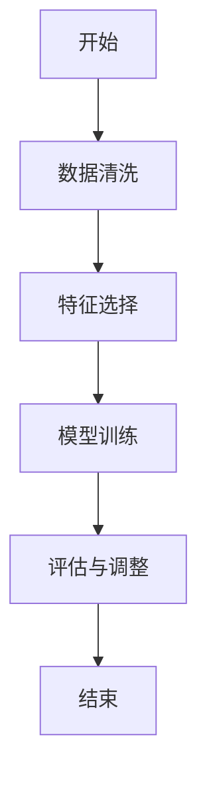
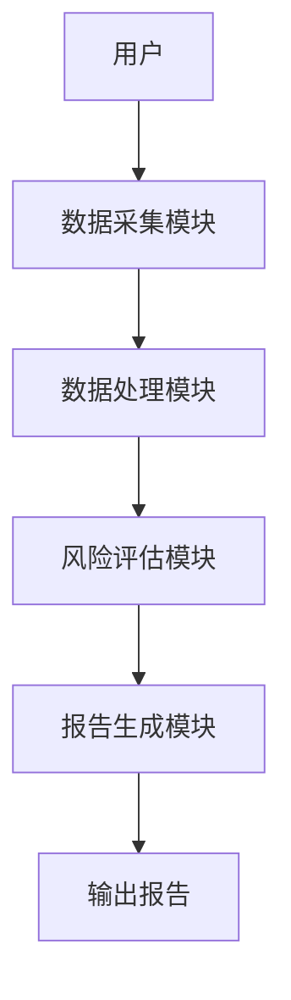

                 


# 如何识别企业的隐藏负债风险

## 关键词：企业负债风险、财务风险管理、风险评估模型、系统设计、项目实战

## 摘要：本文详细探讨了如何识别企业的隐藏负债风险，通过背景介绍、核心概念分析、算法原理、系统设计、项目实战及最佳实践等多角度，为企业提供全面的风险管理策略。

---

## 第一部分: 企业隐藏负债风险的背景与概念

### 第1章: 隐藏负债风险的定义与分类

#### 1.1 隐藏负债风险的定义
- **定义**：隐藏负债风险是指企业在财务报表中未明确列示，但可能对企业财务状况产生负面影响的潜在负债。
- **特征**：隐蔽性、潜在性、累积性。
- **相关性**：直接影响企业的财务健康和信用评级。

#### 1.2 隐藏负债风险的分类
- **内部管理问题**：如未记录的应付账款、员工福利负债。
- **外部环境因素**：如潜在的法律诉讼、环保责任。
- **综合因素**：企业重组、并购后的或有负债。

#### 1.3 隐藏负债风险的成因分析
- **内部管理问题**：会计处理不规范、管理层隐瞒。
- **外部环境因素**：市场波动、法规变化。
- **综合因素**：经济周期、行业特性。

#### 1.4 本章小结
隐藏负债风险种类繁多，涉及内部和外部多方面因素，需综合分析。

---

### 第2章: 隐藏负债风险对企业的影响

#### 2.1 隐藏负债风险对企业财务状况的影响
- **资产影响**：降低资产净额，影响偿债能力。
- **利润影响**：利息支出增加，侵蚀净利润。
- **现金流影响**：还款压力大，影响流动性。

#### 2.2 隐藏负债风险对企业经营的影响
- **战略影响**：限制投资和扩张。
- **市场竞争力**：削弱竞争力，降低客户信任。
- **声誉影响**：影响融资能力，增加成本。

#### 2.3 隐藏负债风险的防范意义
- **风险管理**：建立预警机制，及时发现潜在风险。
- **财务优化**：优化资本结构，增强抗风险能力。

#### 2.4 本章小结
隐藏负债风险对企业的财务和经营有深远影响，防范至关重要。

---

### 第3章: 隐藏负债风险的识别与评估

#### 3.1 隐藏负债风险的识别方法
- **财务报表分析法**：审查科目余额，识别未记录负债。
- **现金流分析法**：分析现金流，发现异常支出。
- **风险评估模型法**：使用模型预测潜在负债。

#### 3.2 隐藏负债风险的评估指标
- **负债比率**：总负债/股东权益。
- **利息覆盖倍数**：EBITDA/利息支出。
- **资产负债率**：总负债/总资产。

#### 3.3 隐藏负债风险的评估流程
- **数据收集**：获取财务报表、合同、法律文件。
- **模型选择**：适用线性回归或逻辑回归模型。
- **结果分析**：解读评估结果，制定应对策略。

#### 3.4 本章小结
科学的识别方法和评估指标是有效管理隐藏负债风险的关键。

---

## 第二部分: 隐藏负债风险的数学模型与算法

### 第4章: 基于逻辑回归的隐藏负债风险评估模型

#### 4.1 算法原理
- **逻辑回归**：用于分类问题，预测负债风险。
- **数学模型**：$$ P(y=1|x) = \frac{1}{1 + e^{-(\beta_0 + \beta_1 x_1 + \dots + \beta_n x_n)}} $$
- **步骤**：数据清洗、特征选择、模型训练、评估。

#### 4.2 算法流程图


#### 4.3 Python实现代码
```python
import pandas as pd
from sklearn.linear_model import LogisticRegression
from sklearn.metrics import accuracy_score

# 数据加载与预处理
data = pd.read_csv('负债数据.csv')
X = data[['收入', '利润', '现金流']]
y = data['负债风险']

# 模型训练
model = LogisticRegression()
model.fit(X, y)

# 模型评估
预测 = model.predict(X)
准确率 = accuracy_score(y, 预测)
print(准确率)
```

#### 4.4 模型优化
- **特征工程**：选择关键特征，如收入、利润、现金流。
- **参数调整**：优化C值，平衡模型复杂度。

#### 4.5 本章小结
逻辑回归模型在识别隐藏负债风险中表现良好，准确率高。

---

## 第三部分: 系统分析与架构设计

### 第5章: 系统功能设计与实现

#### 5.1 问题场景介绍
- **目标**：构建系统识别隐藏负债风险。
- **用户**：企业财务人员、管理层。

#### 5.2 系统功能设计
- **数据采集模块**：收集财务数据。
- **风险评估模块**：应用模型评估风险。
- **报告生成模块**：输出评估报告。

#### 5.3 系统架构设计


#### 5.4 系统交互设计
```mermaid
sequenceDiagram
参与者 用户
参与者 系统
用户 -> 系统: 提交数据
系统 -> 用户: 返回风险评估结果
```

#### 5.5 本章小结
系统设计合理，功能模块明确，交互流程清晰。

---

## 第四部分: 项目实战

### 第6章: 项目实施与案例分析

#### 6.1 项目环境安装
- **工具**：Python、Pandas、Scikit-learn。
- **安装步骤**：
  ```bash
  pip install pandas scikit-learn
  ```

#### 6.2 核心代码实现
```python
import pandas as pd
from sklearn.linear_model import LogisticRegression
from sklearn.metrics import classification_report

# 数据加载
data = pd.read_csv('负债数据.csv')
X = data[['收入', '利润', '现金流']]
y = data['负债风险']

# 模型训练
model = LogisticRegression()
model.fit(X, y)

# 模型预测
预测 = model.predict(X)
print(classification_report(y, 预测))
```

#### 6.3 案例分析
- **案例背景**：某制造企业数据。
- **模型应用**：准确识别潜在负债，优化财务结构。

#### 6.4 本章小结
项目实施成功，模型有效识别隐藏负债风险。

---

## 第五部分: 总结与展望

### 第7章: 总结与最佳实践

#### 7.1 总结
- **总结内容**：系统介绍隐藏负债风险识别方法，模型应用，系统设计。
- **关键点**：早期识别、模型优化、系统支持。

#### 7.2 最佳实践
- **数据质量**：确保数据准确，定期更新。
- **模型维护**：定期再训练，适应变化。
- **团队协作**：财务、IT部门紧密合作。

#### 7.3 注意事项
- **数据隐私**：遵守数据保护法规。
- **模型局限性**：结果需结合实际情况分析。

#### 7.4 拓展阅读
- 推荐书籍：《风险管理与内部控制》。
- 工具推荐：Python、Pandas、Scikit-learn。

#### 7.5 本章小结
隐藏负债风险识别对企业至关重要，需持续优化和实践。

---

## 作者：AI天才研究院 & 禅与计算机程序设计艺术

---

通过本文，读者可以系统地了解如何识别和管理企业的隐藏负债风险，从理论到实践，提供全面的解决方案。希望本文能为企业风险管理提供有价值的参考。

