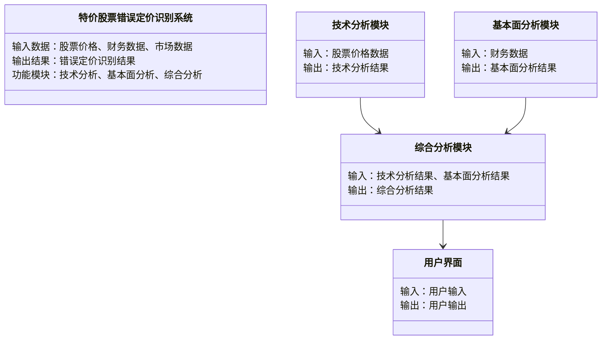
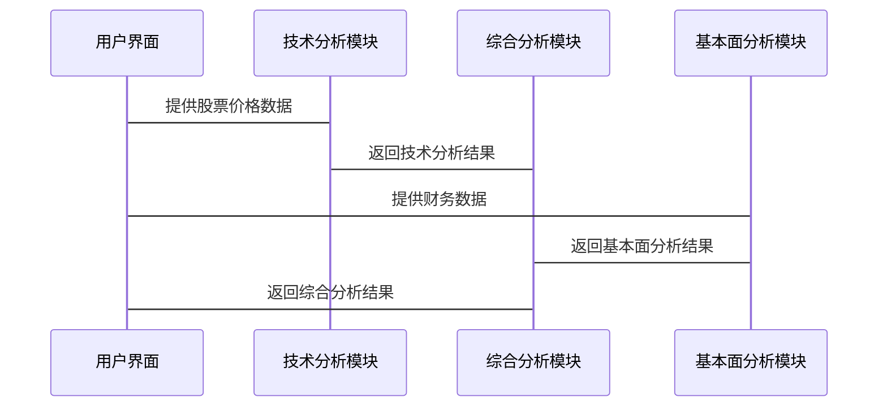

                 


# 如何识别并利用市场对特价股票的错误定价

> 关键词：错误定价、特价股票、市场分析、投资策略、技术分析、基本面分析

> 摘要：本文深入探讨了如何识别市场中特价股票的错误定价，并结合技术分析与基本面分析的方法，为投资者提供有效的投资策略。文章从市场定价的理论基础出发，分析了错误定价的类型与原因，详细介绍了如何通过技术与基本面分析识别错误定价，并结合实际案例与系统架构，为投资者提供了一套完整的操作指南。

---

# 第一部分: 特价股票错误定价的背景与基础

## 第1章: 市场定价与错误定价概述

### 1.1 市场定价的基本原理

#### 1.1.1 有效市场假说的定义与特点
有效市场假说（Efficient Market Hypothesis, EMH）认为，在一个有效的市场中，所有信息都会被迅速反映在资产价格中。市场参与者无法通过分析历史价格信息来获得超额收益。

- **特点**：
  - 价格反映所有可获取信息。
  - 市场参与者理性且行为一致。
  - 价格波动 purely random.

#### 1.1.2 市场定价的合理性与局限性
- **合理性**：
  - 价格反映市场参与者的集体判断。
  - 信息对称性假设下，价格具有合理性。
- **局限性**：
  - 市场参与者可能存在非理性行为。
  - 信息不对称可能导致价格偏差。
  - 短期市场波动可能与长期价值不符。

#### 1.1.3 价格与价值的偏差来源
- **短期波动**：市场情绪、突发事件等。
- **长期偏差**：基本面变化、市场结构问题等。

### 1.2 什么是错误定价

#### 1.2.1 错误定价的定义与分类
- **定义**：市场价格与实际价值之间的偏差。
- **分类**：
  - 价值陷阱：价格低于价值，但长期无法恢复。
  - 市场错估：短期价格偏差，但长期会回归。

#### 1.2.2 市场错估与价值错估的区别
- **市场错估**：
  - 短期价格偏差。
  - 受市场情绪影响。
- **价值错估**：
  - 长期价格偏差。
  - 受基本面变化影响。

#### 1.2.3 错误定价的常见原因
- **信息不对称**：部分参与者掌握更多信息。
- **市场情绪**：非理性行为导致价格偏差。
- **市场结构**：流动性不足或信息传播不畅。

### 1.3 特价股票的定义与特点

#### 1.3.1 特价股票的定义
- **定义**：价格显著低于市场平均水平的股票。

#### 1.3.2 特价股票的特点与分类
- **特点**：
  - 价格低廉。
  - 市场关注度低。
- **分类**：
  - 价值型股票：价格低于内在价值。
  - 垃圾股：基本面差，但价格极低。

#### 1.3.3 特价股票与普通股票的区别
- **区别**：
  - 价值与价格的关系不同。
  - 投资风险不同。

### 1.4 错误定价对投资者的机会

#### 1.4.1 错误定价的潜在利润来源
- **低估股票**：长期持有的超额收益。
- **短期波动**：套利机会。

#### 1.4.2 投资者如何利用市场错误定价
- **价值投资者**：寻找低估股票。
- **短线交易者**：利用短期价格偏差。

#### 1.4.3 错误定价的短期与长期机会
- **短期**：套利机会。
- **长期**：价值回归。

### 1.5 本章小结
错误定价是市场参与者的机会，通过技术与基本面分析，投资者可以识别并利用这些定价偏差。

---

# 第二部分: 错误定价的识别与分析方法

## 第2章: 市场定价的理论基础

### 2.1 有效市场假说的局限性

#### 2.1.1 有效市场假说的定义
- **定义**：市场参与者无法通过分析历史价格信息获得超额收益。

#### 2.1.2 有效市场假说的分类
- **弱有效市场**：仅反映历史价格信息。
- **半强有效市场**：反映所有公开信息。
- **强有效市场**：反映所有公开与非公开信息。

#### 2.1.3 有效市场假说的局限性
- **非理性行为**：市场参与者可能非理性。
- **信息不对称**：部分参与者掌握更多信息。
- **短期波动**：价格可能短期偏离价值。

### 2.2 市场定价与价值评估的关系

#### 2.2.1 市场定价的决定因素
- **市场情绪**：投资者心理。
- **市场参与度**：交易量。
- **市场结构**：流动性、信息传播。

#### 2.2.2 价值评估的基本原理
- **内在价值**：DCF模型、市盈率、市净率等。
- **市场价值**：市场价格反映市场对价值的判断。

#### 2.2.3 市场定价与价值评估的差异
- **差异**：价格反映市场情绪，价值反映基本面。

### 2.3 错误定价的识别标准

#### 2.3.1 错误定价的判断依据
- **价与值的偏差**：市场价格与内在价值的差异。
- **市场参与度**：交易量与价格的关系。
- **时间因素**：短期与长期价格差异。

#### 2.3.2 错误定价的量化指标
- **市盈率（P/E）**：价格与收益的关系。
- **市净率（P/B）**：价格与资产净值的关系。
- **股息率**：收益与股价的关系。

#### 2.3.3 错误定价的动态变化
- **短期**：市场情绪影响。
- **长期**：基本面变化影响。

### 2.4 本章小结
错误定价的识别需要结合市场定价理论与实际市场数据。

---

# 第三部分: 错误定价的类型与案例分析

## 第3章: 错误定价的类型

### 3.1 价值陷阱与市场错估

#### 3.1.1 价值陷阱的定义与特点
- **定义**：价格低于内在价值，但长期无法恢复。
- **特点**：
  - 市场关注度低。
  - 基本面恶化。

#### 3.1.2 市场错估的常见原因
- **市场情绪**：投资者恐慌导致抛售。
- **信息不对称**：部分参与者掌握更多信息。

#### 3.1.3 价值陷阱与市场错估的区别
- **价值陷阱**：长期无法恢复。
- **市场错估**：短期偏差。

### 3.2 市场情绪与行为偏差

#### 3.2.1 市场情绪的影响因素
- **投资者心理**：贪婪与恐惧。
- **市场环境**：经济周期。

#### 3.2.2 行为偏差的常见类型
- **从众心理**：跟随市场潮流。
- **避免损失**：避免亏损导致的非理性决策。

#### 3.2.3 市场情绪与行为偏差对定价的影响
- **影响**：导致价格短期偏离价值。

### 3.3 市场结构与信息不对称

#### 3.3.1 市场结构的多样性
- **流动性**：高流动性市场 vs 低流动性市场。
- **信息传播**：信息集中 vs 分散。

#### 3.3.2 信息不对称的定义与影响
- **定义**：部分参与者掌握更多信息。
- **影响**：导致价格偏差。

#### 3.3.3 信息不对称对错误定价的影响
- **影响**：信息优势者可以利用价格偏差获利。

### 3.4 本章小结
错误定价的类型多样，投资者需要结合市场情绪、行为偏差与市场结构进行综合分析。

---

# 第四部分: 错误定价的分析与利用策略

## 第4章: 市场定价分析方法

### 4.1 技术分析与错误定价识别

#### 4.1.1 技术分析的基本原理
- **定义**：通过分析价格历史走势预测未来价格。
- **工具**：K线图、均线、成交量等。

#### 4.1.2 技术分析在错误定价识别中的应用
- **应用**：
  - 识别超跌股票。
  - 判断短期价格趋势。

#### 4.1.3 技术分析的局限性
- **局限性**：无法预测长期价格走势。

#### 4.1.4 技术分析的案例
- **案例**：某股票长期处于超跌状态，价格低于均线，技术指标显示超卖，可能为价值陷阱。

### 4.2 基本面分析与错误定价识别

#### 4.2.1 基本面分析的基本原理
- **定义**：通过分析公司财务状况、行业地位等判断内在价值。
- **指标**：市盈率、市净率、ROE等。

#### 4.2.2 基本面分析在错误定价识别中的应用
- **应用**：
  - 识别低估股票。
  - 判断公司基本面是否恶化。

#### 4.2.3 基本面分析的局限性
- **局限性**：难以预测突发事件影响。

#### 4.2.4 基本面分析的案例
- **案例**：某公司财务状况良好，市盈率低于行业平均水平，可能为低估股票。

### 4.3 综合分析与错误定价识别

#### 4.3.1 综合分析的定义与特点
- **定义**：结合技术与基本面分析。
- **特点**：全面性、准确性。

#### 4.3.2 综合分析在错误定价识别中的应用
- **应用**：
  - 识别技术与基本面双重低估股票。
  - 判断短期与长期价格走势。

#### 4.3.3 综合分析的优势与挑战
- **优势**：全面性。
- **挑战**：复杂性。

#### 4.3.4 综合分析的案例
- **案例**：某股票技术指标显示超卖，市盈率低于行业平均水平，可能为低估股票。

### 4.4 本章小结
综合分析是识别错误定价的有效方法，需要结合技术与基本面分析。

---

# 第五部分: 错误定价的套利机会与风险控制

## 第5章: 套利机会的识别与利用

### 5.1 套利的基本原理

#### 5.1.1 套利的定义与分类
- **定义**：利用价格差异在不同市场或时间点进行买卖，获利。
- **分类**：
  - 跨市场套利。
  - 跨期套利。
  - 股权套利。

#### 5.1.2 套利的基本原理
- **原理**：利用价格差异获利。
- **条件**：市场效率低下。

#### 5.1.3 套利的常见类型
- **跨市场套利**：利用不同市场的价格差异。
- **跨期套利**：利用不同时间点的价格差异。
- **股权套利**：利用不同股票的价格差异。

### 5.2 套利机会的识别

#### 5.2.1 套利机会的判断标准
- **价差**：不同市场或时间点的价格差异。
- **交易成本**：交易费用是否影响利润。

#### 5.2.2 套利机会的量化指标
- **价差比例**：价格差异与平均价格的比率。
- **交易成本比例**：交易费用与预期利润的比率。

#### 5.2.3 套利机会的动态变化
- **市场效率**：市场越有效，套利机会越少。
- **市场波动**：价格波动越大，套利机会越多。

### 5.3 套利策略的制定

#### 5.3.1 套利策略的制定原则
- **风险控制**：确保交易风险在可接受范围内。
- **交易成本**：确保预期利润大于交易成本。
- **市场效率**：确保市场效率低下。

#### 5.3.2 套利策略的实施步骤
1. **识别套利机会**：发现价格差异。
2. **评估套利风险**：计算交易成本、市场风险。
3. **执行套利交易**：买入低价资产，卖出高价资产。
4. **监控套利交易**：跟踪价格变化，及时平仓。

#### 5.3.3 套利策略的案例
- **案例**：某股票在A市场价格为10元，在B市场价格为9.8元，存在套利机会，买入A市场股票，卖出B市场股票，预期利润为0.2元。

### 5.4 本章小结
套利是利用市场错误定价的机会，需要结合市场效率与交易成本进行综合分析。

---

# 第六部分: 错误定价的系统分析与架构设计

## 第6章: 错误定价的系统分析与架构设计

### 6.1 问题场景介绍

#### 6.1.1 问题背景
- **背景**：投资者如何识别并利用市场对特价股票的错误定价。
- **目标**：设计一个系统，帮助投资者识别错误定价。

### 6.2 系统功能设计

#### 6.2.1 领域模型（Mermaid 类图）


#### 6.2.2 系统架构设计（Mermaid 架构图）
```mermaid
container 错误定价识别系统 {
    技术分析模块
    基本面分析模块
    综合分析模块
    用户界面
}
```

#### 6.2.3 系统接口设计
- **输入接口**：
  - 股票价格数据接口。
  - 财务数据接口。
  - 市场数据接口。
- **输出接口**：
  - 错误定价识别结果接口。
  - 用户界面接口。

#### 6.2.4 系统交互设计（Mermaid 序列图）


### 6.3 项目实战

#### 6.3.1 环境安装
- **工具**：Python、数据分析库（Pandas、NumPy）、可视化库（Matplotlib、Seaborn）。
- **编程语言**：Python。

#### 6.3.2 系统核心实现源代码

```python
import pandas as pd
import numpy as np
import matplotlib.pyplot as plt

# 技术分析函数
def technical_analysis(prices):
    # 计算均线
    ma = prices.rolling(20).mean()
    # 计算MACD
    macd = pd.DataFrame()
    macd['短期EMA'] = prices.ewm(span=12).mean()
    macd['长期EMA'] = prices.ewm(span=26).mean()
    macd['MACD'] = macd['短期EMA'] - macd['长期EMA']
    # 绘制K线图
    plt.figure(figsize=(10,6))
    plt.plot(prices, label='价格')
    plt.plot(ma, label='20日均线')
    plt.legend()
    plt.show()

# 基本面分析函数
def fundamental_analysis(financials):
    # 计算市盈率
    pe = financials['净利润'] / financials['股价']
    # 计算市净率
    pb = financials['净资产'] / financials['股价']
    return pe, pb

# 综合分析函数
def comprehensive_analysis(prices, financials):
    # 技术分析
    technical_analysis(prices)
    # 基本面分析
    pe, pb = fundamental_analysis(financials)
    print(f"市盈率：{pe.mean()}")
    print(f"市净率：{pb.mean()}")
```

#### 6.3.3 代码应用解读与分析
- **技术分析函数**：计算均线和MACD，绘制K线图。
- **基本面分析函数**：计算市盈率和市净率。
- **综合分析函数**：结合技术与基本面分析。

#### 6.3.4 实际案例分析
- **案例**：某公司股票价格数据与财务数据。
- **分析**：技术分析显示超卖，基本面分析显示市盈率低于行业平均水平。

#### 6.3.5 项目小结
通过系统设计与代码实现，投资者可以有效识别市场对特价股票的错误定价。

---

# 第七部分: 错误定价的最佳实践与小结

## 第7章: 最佳实践与小结

### 7.1 投资者的注意事项

#### 7.1.1 风险控制
- **风险管理**：设置止损点。
- **仓位控制**：避免过度集中。

#### 7.1.2 信息获取
- **信息来源**：多渠道获取信息。
- **信息筛选**：分析信息的可靠性。

#### 7.1.3 持续学习
- **知识更新**：关注市场动态。
- **技能提升**：学习新技术与新方法。

### 7.2 本文小结

#### 7.2.1 错误定价的识别与利用
- **识别**：结合技术与基本面分析。
- **利用**：长期投资与短期套利结合。

#### 7.2.2 投资者的注意事项
- **风险管理**：控制风险。
- **信息获取**：多渠道获取信息。
- **持续学习**：提升分析能力。

### 7.3 本文总结
错误定价是市场参与者的机会，投资者需要结合技术与基本面分析，识别并利用这些定价偏差，同时注意风险控制与信息获取。

---

# 作者：AI天才研究院/AI Genius Institute & 禅与计算机程序设计艺术 /Zen And The Art of Computer Programming

---

### 总结
本文通过系统分析与实践，为投资者提供了识别并利用市场对特价股票错误定价的有效方法。从理论基础到实际操作，结合技术与基本面分析，帮助投资者在市场中抓住机会，实现超额收益。

