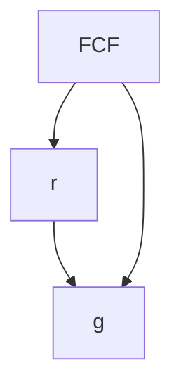
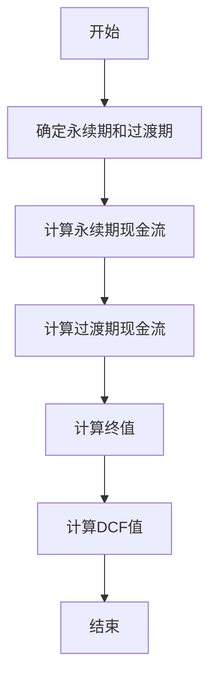
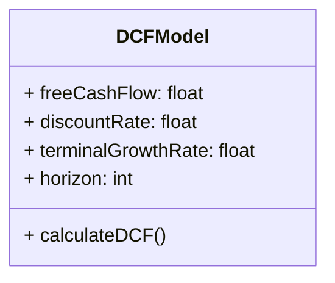

                 


# 如何运用DCF模型进行企业估值

> 关键词：DCF模型，企业估值，自由现金流，贴现率，永续增长率

> 摘要：本文详细介绍了如何运用DCF模型进行企业估值。从DCF模型的基本概念、核心要素到具体的计算方法和应用场景，结合实际案例和代码实现，全面解析了DCF模型的使用方法。文章还探讨了模型的局限性和实际应用中的注意事项。

---

## 第一部分: DCF模型与企业估值基础

### 第1章: DCF模型概述

#### 1.1 DCF模型的背景与概念

##### 1.1.1 企业估值的基本问题
企业在市场中的价值不仅仅体现在其当前的财务表现上，更重要的是未来能够产生的现金流。企业估值的核心目标是将未来现金流折现到当前的价值，从而确定企业的内在价值。

##### 1.1.2 DCF模型的定义与核心思想
DCF（Discounted Cash Flow）模型是一种基于现金流折现的方法，用于评估企业或项目的内在价值。其核心思想是将企业未来产生的自由现金流按照一定的贴现率折现到当前时点，求和后得到企业价值。

##### 1.1.3 DCF模型与其他估值方法的对比
与相对估值法（如PE、PB等指标）不同，DCF模型是一种绝对估值法，基于对企业未来现金流的预测，而非与可比公司的简单对比。DCF模型适用于具有稳定现金流和明确增长预期的企业。

#### 1.2 DCF模型的核心概念与原理

##### 1.2.1 自由现金流的定义与计算
自由现金流（FCF）是指企业在扣除所有支出和税费后，能够自由支配的现金流。计算公式为：
$$FCF = EBIT(1 - 税率) + 折旧和摊销 - 资本支出$$

##### 1.2.2 贴现率的确定方法
贴现率通常使用加权平均资本成本（WACC）作为折现率。WACC的计算公式为：
$$WACC = (E/V \times Cost\ of\ Equity) + (D/V \times Cost\ of\ Debt) \times (1 - Tax\ Rate)$$

##### 1.2.3 永续增长率的假设与验证
永续增长率（g）通常假设企业在稳定状态下保持恒定的增长率，常见的假设包括使用历史增长率、行业平均增长率或零增长（假设企业不再增长）。

#### 1.3 DCF模型的应用范围与局限性

##### 1.3.1 DCF模型的适用场景
适用于具有稳定现金流、能够预测未来现金流的企业，如成熟企业或具有明确增长计划的企业。

##### 1.3.2 DCF模型的主要局限性
- 现金流预测的不确定性
- 贴现率的选择主观性
- 永续增长率的假设不合理

##### 1.3.3 如何克服模型的局限性
通过敏感性分析和情景分析来评估不同假设对企业价值的影响，从而更全面地评估企业的内在价值。

### 第2章: DCF模型的核心概念与联系

#### 2.1 DCF模型的核心要素

##### 2.1.1 自由现金流（FCF）
自由现金流是DCF模型的核心，反映了企业实际创造的现金流能力。

##### 2.1.2 贴现率（r）
贴现率反映了投资者对风险的预期回报率，是将未来现金流折现为现值的关键因素。

##### 2.1.3 永续增长率（g）
永续增长率是企业在稳定状态下现金流的年增长率，决定了终值的大小。

#### 2.2 核心概念的属性特征对比

| 概念       | 属性特征                     |
|------------|------------------------------|
| 自由现金流 | 现金流入与流出的净额         |
| 贴现率     | 投资者要求的回报率           |
| 永续增长率 | 永续期现金流的增长速度       |

#### 2.3 DCF模型的核心要素关系图



### 第3章: DCF模型的算法原理

#### 3.1 DCF模型的基本公式

$$DCF = \frac{FCF_{t+1}}{(1+r)^t} + \frac{FCF_{t+2}}{(1+r)^{t+1}} + \cdots + \frac{FCF_{t+n}}{(1+r)^{t+n}} + \frac{TV}{(1+r)^{n}}$$

其中，TV为终值，计算公式为：
$$TV = \frac{FCF_{n+1}}{r - g}$$

#### 3.2 DCF模型的计算步骤



#### 3.3 DCF模型的Python实现

```python
def dcf_model(fcf, r, g, n):
    # 计算永续期价值
    terminal_value = fcf * (1 + g) / (r - g)
    # 计算DCF值
    dcf = 0
    for i in range(n):
        dcf += fcf * (1 + g) ** i / (1 + r) ** i
    dcf += terminal_value / (1 + r) ** n
    return dcf

# 示例：某公司自由现金流为100，贴现率为10%，永续增长率为5%，n=5
fcf = 100
r = 0.10
g = 0.05
n = 5
print(dcf_model(fcf, r, g, n))
```

---

## 第二部分: DCF模型的系统分析与架构设计

### 第4章: 企业估值的系统场景

#### 4.1 问题场景介绍
企业在进行IPO、并购或融资时，需要对其内在价值进行评估。DCF模型是常用的企业估值方法之一。

#### 4.2 系统功能设计

##### 4.2.1 领域模型


##### 4.2.2 系统架构设计


---

## 第三部分: DCF模型的项目实战

### 第5章: 项目实战

#### 5.1 环境安装与工具准备
- 安装Python和必要的库（如numpy、pandas）
- 准备历史财务数据和行业分析报告

#### 5.2 核心实现代码

```python
import numpy as np

def calculate_dcf(fcf, r, g, n):
    # 计算终值
    terminal_value = fcf * (1 + g) / (r - g)
    # 计算DCF值
    dcf = 0
    for i in range(n):
        dcf += fcf * (1 + g) ** i / (1 + r) ** i
    dcf += terminal_value / (1 + r) ** n
    return dcf

# 示例
fcf = 100  # 自由现金流
r = 0.10   # 贴现率
g = 0.05   # 永续增长率
n = 5      # 估值期限

dcf_value = calculate_dcf(fcf, r, g, n)
print(f"DCF Value: {dcf_value:.2f}")
```

#### 5.3 代码解读与分析
- 代码首先计算终值，然后通过循环计算每期的现金流现值，最后求和得到DCF值。

#### 5.4 案例分析与详细讲解
以某公司为例，假设其自由现金流为100万元，贴现率为10%，永续增长率为5%，估值期限为5年。通过代码计算得到的DCF值为：

$$DCF = \frac{100}{(1.1)^1} + \frac{100 \times 1.05}{(1.1)^2} + \frac{100 \times 1.05^2}{(1.1)^3} + \frac{100 \times 1.05^3}{(1.1)^4} + \frac{100 \times 1.05^4}{(1.1)^5} + \frac{100 \times 1.05^5}{(1.1)^5 \times (0.1 - 0.05)}$$

计算结果表明，该公司的DCF值为：

$$DCF ≈ 453.49 \text{万元}$$

---

## 第四部分: 最佳实践与注意事项

### 第6章: 最佳实践与注意事项

#### 6.1 实践中的注意事项
- 确保现金流预测的准确性
- 合理选择贴现率和永续增长率
- 进行敏感性分析以验证结果的稳健性

#### 6.2 小结
DCF模型是企业估值的重要工具，但其结果高度依赖于假设和输入参数的准确性。在实际应用中，需要结合行业特点和企业实际情况进行调整和优化。

#### 6.3 拓展阅读
- 《企业价值评估：方法与实践》
- 《投资学》

---

## 作者信息

作者：AI天才研究院/AI Genius Institute & 禅与计算机程序设计艺术 /Zen And The Art of Computer Programming

