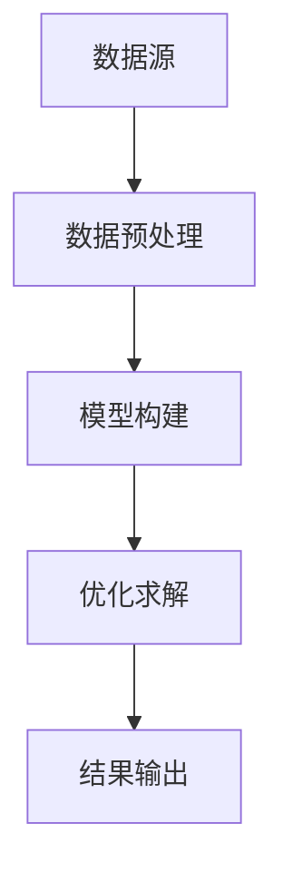
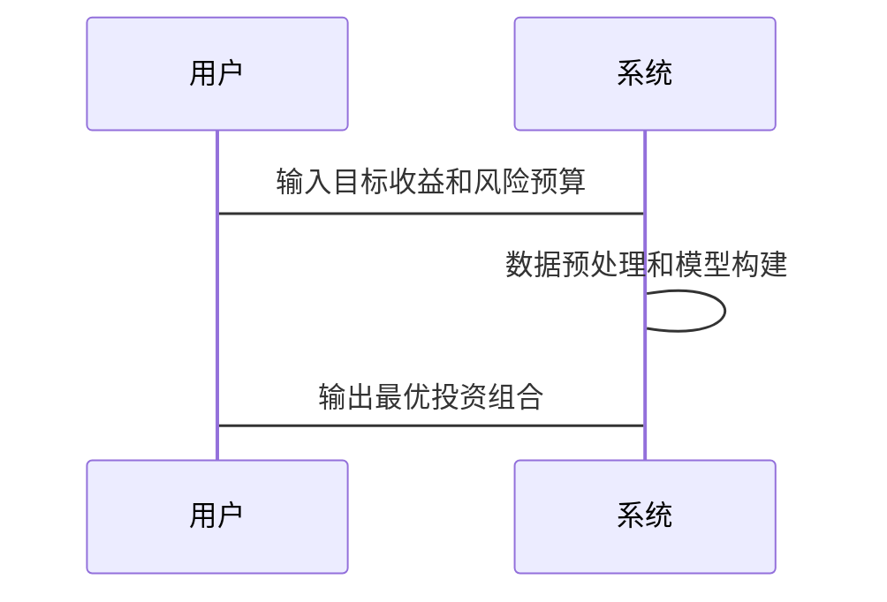

                 

# 《威廉·伯恩斯坦的资产配置型价值投资：科学构建投资组合》

## 关键词：资产配置，价值投资，现代投资组合理论，风险管理，动态再平衡

## 摘要：  
本文深入探讨了威廉·伯恩斯坦的资产配置型价值投资理念，结合现代投资组合理论（MPT）和风险管理原则，科学构建投资组合的方法。文章从理论基础、策略制定、风险管理、系统架构到实际案例，全面分析了如何通过科学的投资组合构建实现长期稳健收益。

---

## 第一部分：引言

### 1.1 投资的基础概念

#### 1.1.1 投资的基本定义  
投资是将资金分配到不同资产类别中，以实现财富增值的过程。资产配置是投资的核心，决定了投资组合的风险、收益和流动性特征。

#### 1.1.2 资产配置的重要性  
资产配置通过分散投资降低风险，同时优化收益。科学的资产配置能够平衡不同资产类别的波动性，实现风险可控下的最大收益。

#### 1.1.3 本书的目标与结构  
本文旨在通过理论与实践结合，指导读者科学构建投资组合。结构包括理论基础、策略制定、风险管理、系统架构和案例分析。

---

## 第二部分：资产配置的理论基础

### 2.1 现代投资组合理论（MPT）

#### 2.1.1 现代投资组合理论的起源  
MPT由哈里·马科维茨提出，强调通过分散投资降低风险，找到最优风险收益组合。

#### 2.1.2 投资组合理论的核心假设  
- 投资者是理性的，追求效用最大化。  
- 资产收益服从正态分布。  
- 市场是有效的，无法通过短期交易获利。

#### 2.1.3 有效前沿的概念  
有效前沿是所有可能的投资组合中，风险最低或收益最高的点构成的曲线，代表最优投资组合。

### 2.2 风险与收益的平衡

#### 2.2.1 风险的定义与分类  
- 系统性风险：市场整体波动。  
- 非系统性风险：特定资产或行业的波动。

#### 2.2.2 收益的来源与类型  
- 股票收益：资本利得和分红。  
- 债券收益：利息收入和本金偿还。

#### 2.2.3 风险-收益权衡  
在投资组合中，收益与风险呈正相关关系。通过资产配置找到最优平衡点。

---

## 第三部分：资产配置的核心策略

### 3.1 股债平衡配置

#### 3.1.1 股票与债券的基本特性  
- 股票：高收益，高波动。  
- 债券：稳定收益，低波动。

#### 3.1.2 股债配置的比例确定  
根据投资者的风险承受能力和投资目标确定配置比例。

#### 3.1.3 股债配置的动态调整  
定期根据市场变化和个人情况调整配置比例。

### 3.2 现代投资组合理论的应用

#### 3.2.1 资产类别选择  
根据相关性选择多样化的资产类别，降低整体风险。

#### 3.2.2 资产权重分配  
使用数学模型计算各资产的最优权重。

#### 3.2.3 组合优化的数学模型  
均值-方差模型用于优化投资组合的风险和收益。

### 3.3 动态再平衡策略

#### 3.3.1 再平衡的定义与目的  
调整投资组合以维持预定的配置比例，应对市场变化。

#### 3.3.2 再平衡的频率选择  
定期（如季度）或不定期调整，确保组合符合目标。

#### 3.3.3 再平衡的执行步骤  
评估当前配置，计算偏差，调整头寸，记录结果。

---

## 第四部分：风险管理与组合优化

### 4.1 风险管理的核心原则

#### 4.1.1 风险的量化方法  
使用VaR、波动率等指标衡量风险。

#### 4.1.2 风险调整后的收益评估  
考虑风险调整后的收益，选择最优组合。

#### 4.1.3 风险预算的制定  
设定最大可承受风险，分配给各资产类别。

### 4.2 优化模型与算法

#### 4.2.1 均值-方差优化的数学模型  
目标函数是最小化风险，约束条件是收益目标和投资比例。

#### 4.2.2 使用拉格朗日乘数法求解优化问题  
通过拉格朗日函数求解最优权重，确保满足约束条件。

#### 4.2.3 算法流程图  
1. 输入资产收益和协方差矩阵。  
2. 设定目标收益和风险预算。  
3. 求解优化问题，得到最优权重。  
4. 输出结果。

---

## 第五部分：系统架构与实现

### 5.1 系统功能设计

#### 5.1.1 数据收集  
收集各资产的历史收益数据。

#### 5.1.2 模型构建  
建立均值-方差优化模型。

#### 5.1.3 优化求解  
使用优化算法计算最优权重。

### 5.2 系统架构图

### 5.3 接口设计

#### 5.3.1 输入接口  
接收用户输入的目标收益和风险预算。

#### 5.3.2 输出接口  
输出最优投资组合和风险收益指标。

### 5.4 交互流程图

---

## 第六部分：项目实战与案例分析

### 6.1 案例分析

#### 6.1.1 股债配置案例  
假设投资者风险承受能力中等，配置60%股票和40%债券，通过动态再平衡应对市场波动。

#### 6.1.2 现代投资组合理论应用案例  
使用均值-方差模型优化投资组合，得到最优权重，降低风险。

### 6.2 结果分析

#### 6.2.1 组合表现  
分析组合的风险收益比，验证理论的有效性。

#### 6.2.2 案例小结  
资产配置是投资成功的关键，科学的方法能实现稳健收益。

---

## 第七部分：总结与展望

### 7.1 内容回顾

#### 7.1.1 理论基础  
现代投资组合理论和风险管理原则。

#### 7.1.2 实践应用  
资产配置策略和动态再平衡方法。

### 7.2 未来展望

#### 7.2.1 新兴趋势  
量化投资、人工智能在资产配置中的应用。

#### 7.2.2 学习建议  
持续学习市场动态和投资理论，提升分析能力。

---

## 作者：AI天才研究院/AI Genius Institute & 禅与计算机程序设计艺术 /Zen And The Art of Computer Programming

