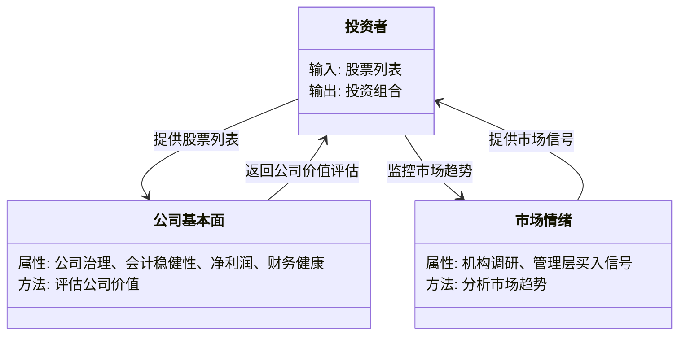
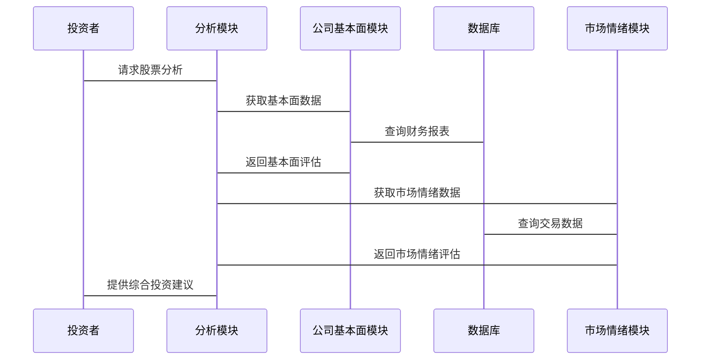

                 


# 威廉·奥尼尔的CAN SLIM：成长与价值的融合

## 关键词：投资策略, 成长与价值, CAN SLIM, 股票筛选, 机构调研, 技术分析

## 摘要：  
威廉·奥尼尔的CAN SLIM策略是一种结合成长与价值投资的股票筛选方法，通过分析公司的基本面、管理层质量、财务健康状况、安全边际以及市场情绪等多维度因素，帮助投资者筛选出具备长期增长潜力且估值合理的优质股票。本文将详细解析CAN SLIM的核心要素，并通过实际案例和数学模型，展示其在投资决策中的应用和优势。

---

## 第一部分：CAN SLIM 投资策略的背景与概述

### 第1章：CAN SLIM 的起源与发展

#### 1.1 投资策略的演变
- 1.1.1 传统投资策略的局限性  
  传统投资策略往往过于依赖技术分析或基本面分析，难以兼顾成长与价值的双重因素。  
- 1.1.2 威廉·奥尼尔的 CAN SLIM 理论提出背景  
  奥尼尔结合了成长投资和价值投资的理念，提出了CAN SLIM策略，旨在筛选出具备成长性且估值合理的股票。  
- 1.1.3 CAN SLIM 在现代投资中的地位与影响  
  CAN SLIM因其科学性和实用性，被广泛应用于机构投资和个人投资中，成为成长与价值投资的桥梁。

---

## 第二部分：CAN SLIM 核心要素的深入分析

### 第2章：C - 公司治理与管理层质量

#### 2.1 公司治理的重要性
- 2.1.1 公司治理的定义与核心要素  
  公司治理涉及董事会结构、管理层决策、股权结构等方面，是企业长期发展的基石。  
- 2.1.2 管理层质量的评估标准  
  管理层应具备专业性、透明度和责任感，能够为股东创造长期价值。  
- 2.1.3 如何通过管理层质量筛选优质公司  
  通过分析管理层的过往业绩和行业口碑，评估其是否具备优秀的企业管理能力。

#### 2.2 管理层质量的分析方法
- 2.2.1 管理层的稳定性与决策能力  
  稳定的管理层能够制定可持续的长期战略，避免因管理层变动导致的企业战略摇摆。  
- 2.2.2 管理层的财务纪律与股东价值创造  
  管理层应具备严格的财务纪律，避免过度扩张和盲目投资，注重股东利益的最大化。  
- 2.2.3 管理层的透明度与沟通能力  
  高透明度的管理层能够及时披露信息，增强投资者的信任感，有助于维护股价稳定。

---

### 第3章：A - 会计稳健性与财务健康

#### 3.1 会计稳健性的定义与重要性
- 3.1.1 会计稳健性的核心概念  
  会计稳健性是指企业在财务报表中真实、准确地反映财务状况，避免虚假和夸大。  
- 3.1.2 会计稳健性对投资决策的影响  
  会计稳健的公司财务透明度高，能够为投资者提供可靠的信息，降低投资风险。  
- 3.1.3 如何通过会计稳健性筛选财务健康的企业  
  分析企业的财务报表，重点关注收入确认、资产减值等关键会计处理是否合理。

#### 3.2 财务报表分析方法
- 3.2.1 利润表分析  
  重点分析营业收入、净利润、毛利率等指标，评估企业的盈利能力和成长性。  
- 3.2.2 资产负债表分析  
  关注资产结构、负债水平和股东权益，评估企业的财务健康状况和偿债能力。  
- 3.2.3 现金流量表分析  
  分析经营活动、投资活动和筹资活动的现金流，评估企业的资金流动性和财务稳定性。

---

### 第4章：N - 净利润与盈利能力

#### 4.1 净利润的定义与意义
- 4.1.1 净利润的计算公式  
  净利润 = 营业收入 - 营业成本 - 税费 - 利息支出  
- 4.1.2 净利润与企业盈利能力的关系  
  净利润是衡量企业盈利能力的核心指标，反映了企业在一定期间内的经营成果。  
- 4.1.3 如何通过净利润评估企业盈利能力  
  分析净利润的增长趋势，结合行业平均水平，评估企业的盈利能力和成长潜力。

#### 4.2 盈利能力分析
- 4.2.1 净利润率  
  净利润率 = 净利润 / 营业收入  
- 4.2.2 营业利润率  
  营业利润率 = 营业利润 / 营业收入  
- 4.2.3 资产回报率  
  资产回报率 = 净利润 / 平均总资产  

---

### 第5章：S - 安全边际与风险控制

#### 5.1 安全边际的定义与作用
- 5.1.1 安全边际的核心概念  
  安全边际是指股票的市场价格低于其内在价值的幅度，用于降低投资风险。  
- 5.1.2 安全边际对投资决策的影响  
  安全边际为投资者提供了缓冲空间，即使市场波动或估值偏差，也能避免重大损失。  
- 5.1.3 如何通过安全边际筛选投资标的  
  计算股票的内在价值，与市场价格进行比较，选择具有足够安全边际的股票。

#### 5.2 风险控制的策略
- 5.2.1 投资组合的风险分散  
  通过投资不同行业、不同规模的股票，降低单一投资的风险。  
- 5.2.2 设置止损点  
  在投资前设定止损点，避免亏损过大。  
- 5.2.3 定期评估与调整投资组合  
  根据市场变化和企业基本面，定期评估投资组合，及时调整持仓结构。

---

### 第6章：L - 机构调研与市场情绪

#### 6.1 机构调研的定义与意义
- 6.1.1 机构调研的核心概念  
  机构调研是指专业投资机构对目标公司进行深入调查，以评估其投资价值。  
- 6.1.2 机构调研对市场情绪的影响  
  机构调研通常会引发市场关注，推动股价上涨。  
- 6.1.3 如何通过机构调研筛选投资标的  
  关注机构调研的频率和方向，选择被机构长期关注的优质公司。

#### 6.2 市场情绪的分析方法
- 6.2.1 市场情绪的指标与测量  
  市场情绪可以通过成交量、波动率、投资者情绪指数等指标进行衡量。  
- 6.2.2 机构动向对股价的影响  
  机构的资金流向通常会反映在成交量和股价波动中，投资者可以通过这些信号判断市场趋势。  
- 6.2.3 如何利用市场情绪进行投资决策  
  在市场情绪高涨时，警惕过高的估值；在市场情绪低落时，寻找被低估的投资机会。

---

### 第7章：I - 内幕交易与管理层买入信号

#### 7.1 内幕交易的定义与影响
- 7.1.1 内幕交易的核心概念  
  内幕交易是指利用未公开信息进行交易，违反了市场公平性。  
- 7.1.2 内幕交易对股价的推动作用  
  内幕交易通常会导致股价异常波动，但其持续性有限。  
- 7.1.3 如何识别管理层买入信号  
  关注管理层增持股份的行为，选择管理层积极买入的公司。

#### 7.2 管理层买入信号的分析
- 7.2.1 管理层增持的含义  
  管理层增持股份表明其对公司前景充满信心，通常被视为积极信号。  
- 7.2.2 管理层买入的时机  
  在公司基本面改善或估值偏低时，管理层买入行为更具参考价值。  
- 7.2.3 管理层买入对股价的预期影响  
  管理层买入通常会提振市场信心，推动股价上涨。

---

## 第三部分：CAN SLIM 投资策略的系统分析与架构设计

### 第8章：CAN SLIM 投资策略的系统架构

#### 8.1 问题场景介绍
- 投资者需要在复杂的市场环境中筛选出具备成长性和估值优势的股票。  
- CAN SLIM策略通过多维度的分析，为投资者提供科学的投资决策支持。

#### 8.2 系统功能设计（领域模型）


#### 8.3 系统架构设计


#### 8.4 系统接口设计
- 输入接口：股票代码、时间范围  
- 输出接口：公司价值评估报告、市场情绪分析报告、投资建议

#### 8.5 系统交互设计


---

## 第四部分：CAN SLIM 投资策略的项目实战

### 第9章：CAN SLIM 投资策略的项目实现

#### 9.1 环境安装
- 安装Python、Pandas、NumPy、Matplotlib等数据分析工具。  
- 安装金融数据API（如Yahoo Finance）。

#### 9.2 核心实现源代码
```python
import pandas as pd
import numpy as np
import matplotlib.pyplot as plt

# 示例代码：计算股票的PEG比率
def calculate_peg_ratio(df, market_cap):
    df['PE'] = df['净利润'] / df['每股收益']
    df['PEG'] = df['PE'] / df['净利润增长率']
    df['PEG'].replace([np.inf, -np.inf], np.nan, inplace=True)
    return df['PEG'].mean()

# 示例代码：绘制股价与均线的对比图
def plot_stock_trend(stock_data, window=50):
    stock_data['SMA'] = stock_data['收盘价'].rolling(window).mean()
    plt.figure(figsize=(12, 6))
    plt.plot(stock_data['日期'], stock_data['收盘价'], label='股价')
    plt.plot(stock_data['日期'], stock_data['SMA'], label='均线')
    plt.title('股价与均线对比图')
    plt.xlabel('日期')
    plt.ylabel('股价')
    plt.legend()
    plt.show()
```

---

## 第五部分：最佳实践与注意事项

### 第10章：最佳实践与小结

#### 10.1 小结
- CAN SLIM策略通过多维度的分析，帮助投资者筛选出具备成长性且估值合理的股票。  
- 投资者应结合市场环境和公司基本面，灵活调整投资策略。

#### 10.2 注意事项
- 投资需谨慎，避免盲目跟风。  
- 定期评估投资组合，及时调整持仓结构。  
- 保持对市场的敏感性，关注行业动态和政策变化。

---

## 结语

威廉·奥尼尔的CAN SLIM策略通过将成长与价值投资相结合，为投资者提供了一种科学的投资方法。通过系统的分析和实际案例的展示，投资者可以更好地理解CAN SLIM的核心要素，并在实际投资中灵活运用这些策略，实现长期稳健的投资收益。

---

## 作者：AI天才研究院/AI Genius Institute & 禅与计算机程序设计艺术 /Zen And The Art of Computer Programming

