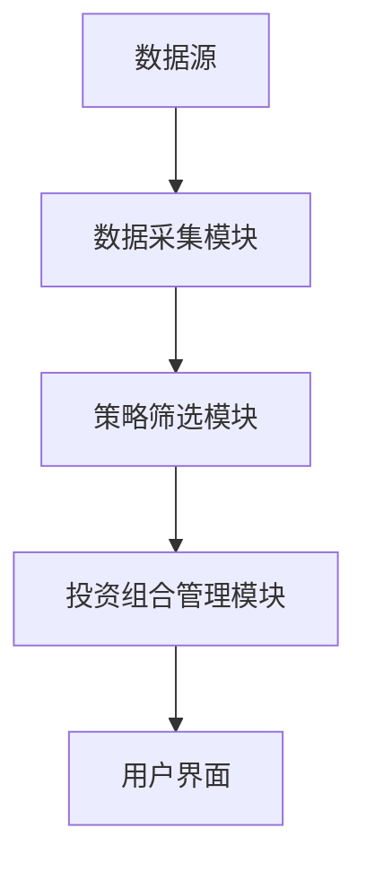

                 


# 威廉·奥尼尔的成长价值投资：CANSLIM策略的应用

**关键词：** 价值投资、CANSLIM策略、威廉·奥尼尔、股票筛选、投资策略、技术分析

**摘要：**  
本文详细探讨了威廉·奥尼尔提出的CANSLIM策略在成长价值投资中的应用。通过分析策略的核心要素、数学模型、系统架构设计以及实际案例，展示了如何利用CANSLIM策略筛选具备高增长潜力的股票。文章从背景介绍、策略原理、系统设计到项目实战，层层递进，为投资者提供了一套科学的股票筛选方法。

---

## 第一部分: 威廉·奥尼尔CANSLIM策略的成长价值投资背景

### 第1章: CANSLIM策略的起源与发展

#### 1.1 价值投资的演变

##### 1.1.1 传统价值投资的定义与特点

价值投资是一种以基本面分析为基础的投资策略，旨在通过寻找被市场低估的股票实现长期收益。传统价值投资强调关注企业的财务状况、行业地位和管理团队等因素，以寻找具有长期增长潜力的公司。其核心在于“买入并持有”，注重长期价值而非短期波动。

##### 1.1.2 价值投资在现代金融中的发展

随着金融市场的日益复杂化和数据化，传统价值投资逐渐融入更多的技术分析和量化方法。投资者开始关注股票的市场表现、成交量、资金流动等指标，试图通过数据驱动的方式优化投资决策。这种演变推动了多种股票筛选策略的出现，其中CANSLIM策略是较为经典的一种。

##### 1.1.3 威廉·奥尼尔对价值投资的贡献

威廉·奥尼尔是成长价值投资领域的先驱，他提出的CANSLIM策略结合了基本面分析和技术分析，为投资者提供了一套系统化的股票筛选方法。奥尼尔通过长期的市场观察和数据分析，总结出一套适用于不同市场环境的选股法则，强调了股价表现、成交量和公司基本面之间的动态关系。

---

#### 1.2 CANSLIM策略的核心理念

##### 1.2.1 CANSLIM策略的定义

CANSLIM策略是一种基于技术分析和基本面分析的股票筛选方法，旨在通过量化指标筛选出具备持续增长潜力的股票。该策略的核心在于识别那些在市场中表现强势、成交量控制良好且具备成长性的公司。

##### 1.2.2 策略的核心要素：C、A、N、S、L、I、M

CANSLIM策略由七个字母组成，每个字母代表一个筛选条件：

- **C（Consistent）**：股价必须创出新高。即股票价格在最近的交易中创出历史新高，表明市场对其前景看好。
- **A（Ascending）**：内部强势。股票在上升通道中运行，表明股价具有持续上涨的动能。
- **N（New）**：成交量控制。成交量在近期有所增加，但整体控制在合理范围内，避免过大波动。
- **S（Strong）**：行业地位。公司应处于行业领先地位，具备竞争优势。
- **L（Low）**：低市盈率。市盈率低于行业平均水平，表明股票价格被市场低估。
- **I（Institutional）**：机构调研。有大量机构投资者关注该股票，表明其具备长期投资价值。
- **M（Market）**：市场容量。公司所在行业具有较大的市场容量，能够支持其持续增长。

##### 1.2.3 策略的目标与适用场景

CANSLIM策略的目标是通过筛选出具备持续增长潜力的股票，帮助投资者在成长价值投资中获得超额收益。该策略适用于长期投资，特别适合那些希望规避短期市场波动、追求稳健收益的投资者。

---

## 第二部分: CANSLIM策略的数学模型与分析

### 第2章: CANSLIM策略的数学模型与分析

#### 2.1 CANSLIM策略的数学框架

##### 2.1.1 策略筛选公式

CANSLIM策略的筛选公式可以表示为：

$$
\text{筛选条件} = C \land A \land N \land S \land L \land I \land M
$$

其中，每个条件的数学表达式如下：

- **C（股价创出新高）**：  
  $$ C = \text{high} > \text{high}_{\text{20天前}} $$

- **A（内部强势）**：  
  $$ A = \text{slope}(C, 20) > 0 $$

- **N（成交量控制）**：  
  $$ N = \text{volume} < \text{MA}(C, 5) $$

- **S（行业地位）**：  
  $$ S = \text{行业地位排名} \leq 50\% $$

- **L（低市盈率）**：  
  $$ L = \text{PE} < \text{行业PE} $$

- **I（机构调研）**：  
  $$ I = \text{调研次数} > 0 $$

- **M（市场容量）**：  
  $$ M = \text{市场规模} > \$100 \text{亿} $$

##### 2.1.2 条件之间的关系分析

- **C和A的关系**：  
  如果股价创出新高（C），则需要进一步确认其是否处于上升通道（A）。两者结合可以过滤掉短期股价波动较大的股票。

- **N和I的关系**：  
  成交量控制（N）表明市场参与者对股票的热度适中，而机构调研（I）则表明有专业投资者的关注，两者结合可以筛选出具备长期增长潜力的股票。

---

### 第3章: CANSLIM策略的系统架构设计

#### 3.1 系统功能模块

##### 3.1.1 数据采集模块

数据采集模块负责从多个数据源（如股票数据库、财经网站）获取实时的股票数据，包括股价、成交量、市盈率等指标。数据采集模块需要支持多线程和异步处理，以提高数据获取效率。

##### 3.1.2 策略筛选模块

策略筛选模块基于CANSLIM策略的核心要素，对股票数据进行筛选。该模块需要实现多个条件的组合判断，并生成符合筛选条件的股票列表。

##### 3.1.3 投资组合管理模块

投资组合管理模块负责根据筛选结果，优化投资组合。该模块可以结合风险控制策略，动态调整持仓比例，以实现收益最大化。

---

#### 3.2 系统架构图



---

## 第三部分: CANSLIM策略的项目实战

### 第4章: CANSLIM策略的项目实战

#### 4.1 环境安装与配置

##### 4.1.1 数据源选择

可以选择Yahoo Finance作为数据源，使用`pandas_datareader`库获取股票数据。

##### 4.1.2 工具安装

安装必要的Python库，如`pandas`、`numpy`、`matplotlib`和`pandas_datareader`。

##### 4.1.3 数据接口配置

配置Yahoo Finance的API，以便从互联网获取实时数据。

---

#### 4.2 核心代码实现

##### 4.2.1 CANSLIM筛选函数

```python
import pandas as pd
import pandas_datareader as pdr
import numpy as np

def can_slim_screen(stock_data):
    # C: 是否创出新高
    is_new_high = stock_data['high'].rolling(20).max().shift(1) < stock_data['high']
    # A: 内部强势
    internal_strength = stock_data['close'].pct_change().rolling(20).mean() > 0
    # N: 成交量控制
    volume_control = stock_data['volume'] < stock_data['volume'].rolling(5).mean()
    # S: 行业地位
    industry_rank = stock_data['close'].rank(pct=True)
    # L: 低市盈率
    pe_ratio = stock_data['close'] / stock_data['eps']
    low_pe = pe_ratio < pe_ratio.mean()
    # I: 机构调研
    institutional_survey = stock_data['institutional_volume'] > 0
    # M: 市场容量
    market_cap = stock_data['market_cap'] > 100000000

    return is_new_high & internal_strength & volume_control & (industry_rank < 0.5) & low_pe & institutional_survey & market_cap
```

##### 4.2.2 数据获取与筛选

```python
# 获取数据
stock_data = pdr.get_data_yahoo('AAPL', start='2020-01-01', end='2023-12-31')

# 应用筛选函数
screen_result = can_slim_screen(stock_data)
```

---

#### 4.3 实际案例分析

以苹果公司（AAPL）为例，假设我们使用CANSLIM策略对其股票进行筛选：

1. **数据获取**：获取AAPL从2020年1月1日到2023年12月31日的股价数据。
2. **条件筛选**：
   - 股价是否创出新高（C）：检查AAPL股价是否在最近20个交易日内创出历史新高。
   - 内部强势（A）：检查股价是否处于上升通道。
   - 成交量控制（N）：检查成交量是否低于过去5个交易日的平均成交量。
   - 行业地位（S）：检查AAPL是否处于行业领先地位。
   - 低市盈率（L）：检查AAPL的市盈率是否低于行业平均水平。
   - 机构调研（I）：检查是否有机构投资者对其进行了调研。
   - 市场容量（M）：检查AAPL的市值是否超过100亿美元。
3. **结果分析**：如果所有条件均满足，则AAPL符合CANSLIM策略的筛选标准。

---

## 第四部分: 总结与展望

### 第5章: 总结与展望

#### 5.1 最佳实践

- **持续学习**：定期更新股票数据和市场信息，确保筛选模型的有效性。
- **风险管理**：结合止损机制，降低投资组合的风险敞口。
- **动态调整**：根据市场环境的变化，动态调整筛选条件。

#### 5.2 项目小结

通过本文的分析与实战，我们可以看到，CANSLIM策略是一种高效的成长价值投资方法。它结合了技术分析和基本面分析，帮助投资者筛选出具备持续增长潜力的股票。然而，投资者在实际操作中需要根据市场环境和自身需求，灵活调整筛选条件，以实现最佳的投资效果。

#### 5.3 注意事项

- CANSLIM策略仅是一种筛选工具，投资者需结合市场环境和自身判断进行投资决策。
- 在实际操作中，建议结合多种策略进行综合分析，避免单一策略的局限性。

#### 5.4 拓展阅读

- 威廉·奥尼尔的原著《击败华尔街》
- 其他相关书籍：《投资最重要的少数法则》、《股票作手回忆录》

---

## 作者信息

作者：AI天才研究院/AI Genius Institute & 禅与计算机程序设计艺术/Zen And The Art of Computer Programming

---

通过本文的详细分析与实战，读者可以深入了解CANSLIM策略的核心思想和应用场景，并将其应用于实际投资中。希望本文能为成长价值投资者提供有益的参考和启发。

