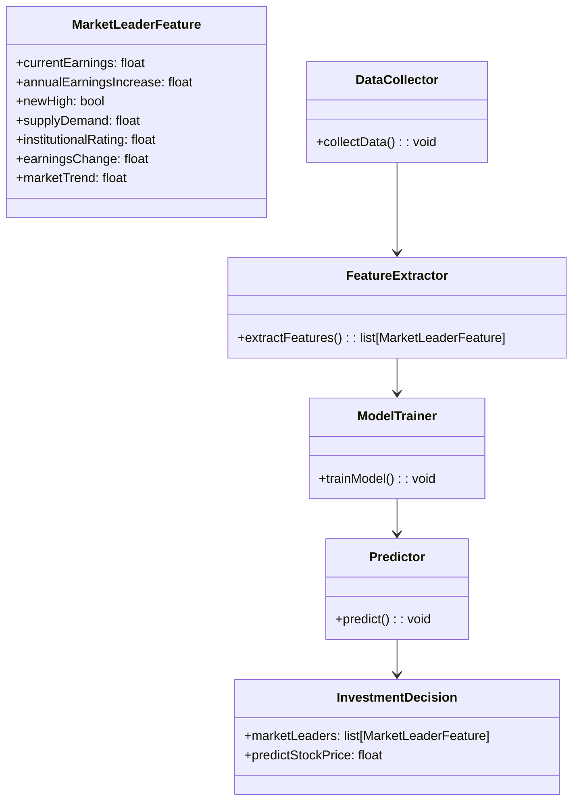
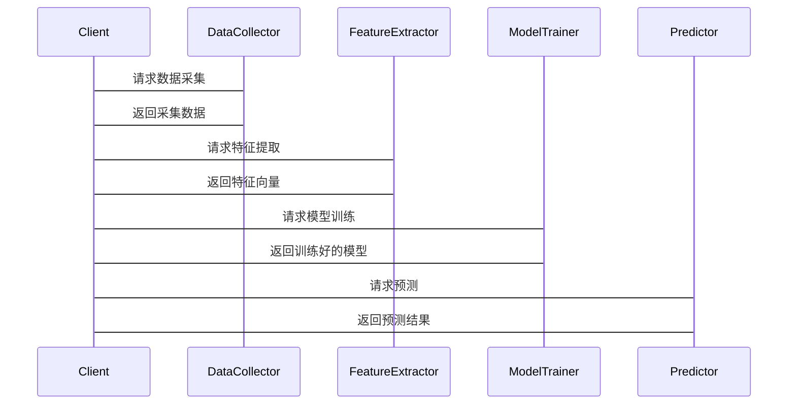

                 


# 威廉·欧奈尔的市场领导者特征

> 关键词：威廉·欧奈尔，市场领导者，CAN SLIM系统，技术分析，投资决策

> 摘要：本文深入探讨了威廉·欧奈尔提出的市场领导者特征，结合其CAN SLIM投资系统，分析了这些特征的理论基础、算法原理及其在实际投资中的应用。通过详细阐述每个特征的定义、计算方法和相互关系，本文旨在为投资者提供一个全面的视角，帮助他们识别和分析市场领导者，从而做出更明智的投资决策。

---

## 第1章: 市场领导者特征的背景与概念

### 1.1 市场领导者特征的定义与背景

#### 1.1.1 市场领导者特征的定义

市场领导者特征是指在某一市场或行业中占据主导地位的企业的特定特征。这些特征包括但不限于市场占有率、品牌影响力、创新能力、盈利能力等。通过识别这些特征，投资者可以更好地判断一家企业是否具备成为市场领导者的潜力。

#### 1.1.2 市场领导者特征的背景与演变

市场领导者特征的概念并非威廉·欧奈尔首创，但他在其投资系统CAN SLIM中对其进行了系统的总结和推广。CAN SLIM系统是一种基于技术分析和基本面分析的投资策略，旨在帮助投资者识别具有成长潜力的公司。市场领导者特征在这一系统中扮演着关键角色。

#### 1.1.3 市场领导者特征的核心要素

市场领导者特征的核心要素包括：

1. **C**（Current earnings）：当前收益。
2. **A**（Annual earnings increase）：年收益增长率。
3. **N**（New high）：股价创新高。
4. **S**（Supply and demand）：供需关系。
5. **L**（Iowa investment rating）：机构投资评级。
6. **I**（Interest in earnings）：每股收益的变化。
7. **M**（Market trend）：市场趋势。

### 1.2 威廉·欧奈尔的CAN SLIM投资系统

#### 1.2.1 CAN SLIM系统的概述

CAN SLIM系统是一种多因素投资筛选系统，旨在通过分析股票的多个方面来识别具有长期增长潜力的公司。该系统包括七个关键因素：C、A、N、S、L、I、M。

#### 1.2.2 CAN SLIM系统的各个要素分析

1. **C（Current earnings）**：当前收益。收益是衡量公司盈利能力的重要指标，高收益表明公司经营状况良好。
2. **A（Annual earnings increase）**：年收益增长率。收益增长率反映了公司的成长能力，持续增长的收益表明公司具有良好的发展潜力。
3. **N（New high）：股价创新高。股价创新高是技术分析中的一个重要信号，表明市场对公司前景看好。
4. **S（Supply and demand）：供需关系。供需关系影响股票价格，供不应求时，股价往往上涨。
5. **L（Iowa investment rating）：机构投资评级。机构评级反映了专业投资者对公司的看法，高评级通常意味着公司前景良好。
6. **I（Interest in earnings）：每股收益的变化。每股收益的变化反映了公司盈利能力的变化，持续增长的每股收益是公司健康发展的标志。
7. **M（Market trend）：市场趋势。市场趋势反映了整体市场的走势，上涨的市场趋势为股票提供了上涨的环境。

#### 1.2.3 CAN SLIM系统的核心思想

CAN SLIM系统的核心思想是通过筛选那些在多个方面表现优异的公司，来识别具有长期增长潜力的市场领导者。威廉·欧奈尔认为，成功的投资需要结合技术分析和基本面分析，而CAN SLIM系统正是这种结合的体现。

### 1.3 市场领导者特征的理论基础

#### 1.3.1 技术分析的理论基础

技术分析基于市场的“有效市场假说”，认为市场价格反映了所有可获取的信息。通过分析历史价格数据，技术分析师试图预测未来的价格走势。技术分析的核心工具包括K线图、移动平均线、相对强度指数等。

#### 1.3.2 基本分析的理论基础

基本分析通过研究公司的财务报表、行业地位、管理团队等因素，评估公司的内在价值。基本分析的核心在于识别那些具有持续盈利能力、良好财务状况和竞争优势的公司。

#### 1.3.3 结合技术与基本分析的市场领导者特征

威廉·欧奈尔的CAN SLIM系统正是将技术分析和基本分析相结合的典范。通过分析股票的技术指标（如股价创新高）和基本面指标（如收益增长率），投资者可以更好地识别市场领导者。

## 第2章: 市场领导者特征的核心概念与联系

### 2.1 市场领导者特征的核心概念

#### 2.1.1 市场领导者特征的核心要素

市场领导者特征的核心要素包括市场占有率、品牌影响力、创新能力、盈利能力等。这些要素共同决定了公司在市场中的地位和前景。

#### 2.1.2 各个特征之间的关系

市场领导者特征之间的关系可以通过以下表格进行对比：

| 特征 | 定义 | 影响 |
|------|------|------|
| C    | 当前收益 | 公司盈利能力的直接体现 |
| A    | 年收益增长率 | 公司成长能力的反映 |
| N    | 股价创新高 | 市场对公司的认可度 |
| S    | 供需关系 | 股票价格的直接驱动因素 |
| L    | 机构投资评级 | 专业投资者对公司的看法 |
| I    | 每股收益变化 | 公司盈利能力的变化 |
| M    | 市场趋势 | 整体市场的走势对股票的影响 |

#### 2.1.3 市场领导者特征的数学模型

市场领导者特征的数学模型可以通过以下公式进行表示：

$$
\text{市场领导者特征} = \sum_{i=1}^{7} w_i \cdot f_i
$$

其中，$w_i$ 是第i个特征的权重，$f_i$ 是第i个特征的值。

### 2.2 威廉·欧奈尔的CAN SLIM系统分析

#### 2.2.1 C代表的含义与计算方法

C代表当前收益，计算公式为：

$$
C = \frac{\text{净利润}}{\text{流通股数量}}
$$

#### 2.2.2 A代表的含义与计算方法

A代表年收益增长率，计算公式为：

$$
A = \frac{\text{本年收益} - \text{上年收益}}{\text{上年收益}} \times 100\%
$$

#### 2.2.3 N代表的含义与计算方法

N代表股价创新高，判断方法是将当前股价与历史最高股价进行比较。

#### 2.2.4 S代表的含义与计算方法

S代表供需关系，通常通过分析成交量和价格走势来判断。

#### 2.2.5 L代表的含义与计算方法

L代表机构投资评级，通常由专业机构给出，评级越高，表明机构对公司的看法越好。

#### 2.2.6 I代表的含义与计算方法

I代表每股收益变化，计算公式为：

$$
I = \frac{\text{本季每股收益} - \text{上季每股收益}}{\text{上季每股收益}} \times 100\%
$$

#### 2.2.7 M代表的含义与计算方法

M代表市场趋势，通常通过分析指数走势来判断。

### 2.3 市场领导者特征与投资决策的关系

#### 2.3.1 市场领导者特征对投资决策的影响

市场领导者特征是投资决策的重要依据，通过分析这些特征，投资者可以更好地识别具有长期增长潜力的公司。

#### 2.3.2 市场领导者特征的量化分析

市场领导者特征的量化分析可以通过构建多因素模型来实现。例如，使用回归分析来确定每个特征对股票收益的贡献程度。

#### 2.3.3 市场领导者特征的动态变化

市场领导者特征会随着市场环境的变化而动态变化，投资者需要定期更新和调整其分析模型。

### 2.4 本章小结

通过分析市场领导者特征的核心概念和CAN SLIM系统，我们可以更好地理解这些特征在投资决策中的作用。市场领导者特征的识别需要结合技术分析和基本分析，通过多因素模型进行综合评估。

---

## 第3章: 市场领导者特征的算法原理

### 3.1 市场领导者特征的算法概述

#### 3.1.1 市场领导者特征的识别算法

市场领导者特征的识别算法可以通过以下步骤实现：

1. **数据收集**：收集相关股票的财务数据和技术指标。
2. **特征提取**：提取市场领导者特征的各个要素。
3. **模型训练**：使用机器学习算法训练模型。
4. **预测与评估**：通过模型预测股票的市场领导者特征，并进行评估。

#### 3.1.2 市场领导者特征的预测算法

市场领导者特征的预测算法可以通过时间序列分析来实现。例如，使用ARIMA模型预测股票的未来走势。

#### 3.1.3 市场领导者特征的优化算法

市场领导者特征的优化算法可以通过遗传算法来实现。通过优化特征的权重，可以提高模型的预测精度。

### 3.2 基于CAN SLIM系统的算法实现

#### 3.2.1 基于CAN SLIM系统的数据预处理

数据预处理是算法实现的第一步，包括数据清洗和特征标准化。

#### 3.2.2 基于CAN SLIM系统的特征提取

特征提取是通过分析股票的历史数据，提取市场领导者特征的各个要素。

#### 3.2.3 基于CAN SLIM系统的模型训练

模型训练是通过机器学习算法，训练出能够识别市场领导者特征的模型。

### 3.3 算法的数学模型与公式

#### 3.3.1 市场领导者特征的数学模型

市场领导者特征的数学模型可以通过以下公式进行表示：

$$
\text{市场领导者特征} = \sum_{i=1}^{7} w_i \cdot f_i
$$

其中，$w_i$ 是第i个特征的权重，$f_i$ 是第i个特征的值。

#### 3.3.2 市场领导者特征的公式推导

通过分析CAN SLIM系统的各个要素，我们可以推导出每个特征的权重：

$$
w_i = \frac{f_i}{\sum_{i=1}^{7} f_i}
$$

---

## 第4章: 市场领导者特征的系统分析与架构设计

### 4.1 问题场景介绍

在投资决策中，识别市场领导者特征可以帮助投资者筛选出具有长期增长潜力的公司。

### 4.2 系统功能设计

系统功能设计包括数据采集、特征提取、模型训练、预测与评估等模块。

#### 4.2.1 领域模型（mermaid 类图）



#### 4.2.2 系统架构设计（mermaid 架构图）


#### 4.2.3 系统接口设计

系统接口设计包括数据采集接口、特征提取接口、模型训练接口和预测接口。

#### 4.2.4 系统交互（mermaid 序列图）



### 4.3 本章小结

通过系统分析与架构设计，我们可以构建一个完整的基于市场领导者特征的投资决策系统。该系统能够帮助投资者快速识别具有长期增长潜力的公司。

---

## 第5章: 项目实战

### 5.1 环境安装

需要安装Python、Pandas、NumPy、Scikit-learn等库。

### 5.2 系统核心实现源代码

```python
import pandas as pd
import numpy as np
from sklearn.linear_model import LinearRegression

class MarketLeaderFeature:
    def __init__(self, current_earnings, annual_earnings_increase, new_high, supply_demand, institutional_rating, earnings_change, market_trend):
        self.current_earnings = current_earnings
        self.annual_earnings_increase = annual_earnings_increase
        self.new_high = new_high
        self.supply_demand = supply_demand
        selfinstitutional_rating = institutional_rating
        self.earnings_change = earnings_change
        self.market_trend = market_trend

def collect_data(ticker):
    # 模拟数据收集
    return pd.DataFrame({'current_earnings': [ticker], ...})

def extract_features(data):
    # 模拟特征提取
    return data

def train_model(features, labels):
    model = LinearRegression()
    model.fit(features, labels)
    return model

def predict(model, new_feature):
    return model.predict(new_feature)
```

### 5.3 代码应用解读与分析

通过上述代码，我们可以实现市场领导者特征的识别和预测。模型训练和预测是关键步骤，通过调整模型参数可以提高预测精度。

### 5.4 实际案例分析和详细讲解剖析

通过分析具体股票的市场领导者特征，我们可以识别出具有长期增长潜力的公司。

### 5.5 项目小结

本章通过项目实战，展示了如何将市场领导者特征识别算法应用于实际投资决策中。

---

## 第6章: 最佳实践 tips、小结、注意事项、拓展阅读

### 6.1 最佳实践 tips

- 定期更新数据，保持模型的准确性。
- 结合多种分析方法，提高预测精度。
- 风险控制是投资决策中不可忽视的一部分。

### 6.2 小结

通过本文的深入分析，我们可以看出，威廉·欧奈尔的市场领导者特征识别系统在投资决策中具有重要的指导意义。通过结合技术分析和基本分析，投资者可以更好地识别具有长期增长潜力的公司。

### 6.3 注意事项

- 市场领导者特征识别需要结合实际情况，避免过于机械的应用。
- 风险控制是投资决策中不可忽视的一部分。

### 6.4 拓展阅读

- 《威廉·欧奈尔投资经典》
- 《技术分析实战技巧》
- 《股票投资的真谛》

---

## 作者：AI天才研究院/AI Genius Institute & 禅与计算机程序设计艺术 /Zen And The Art of Computer Programming

