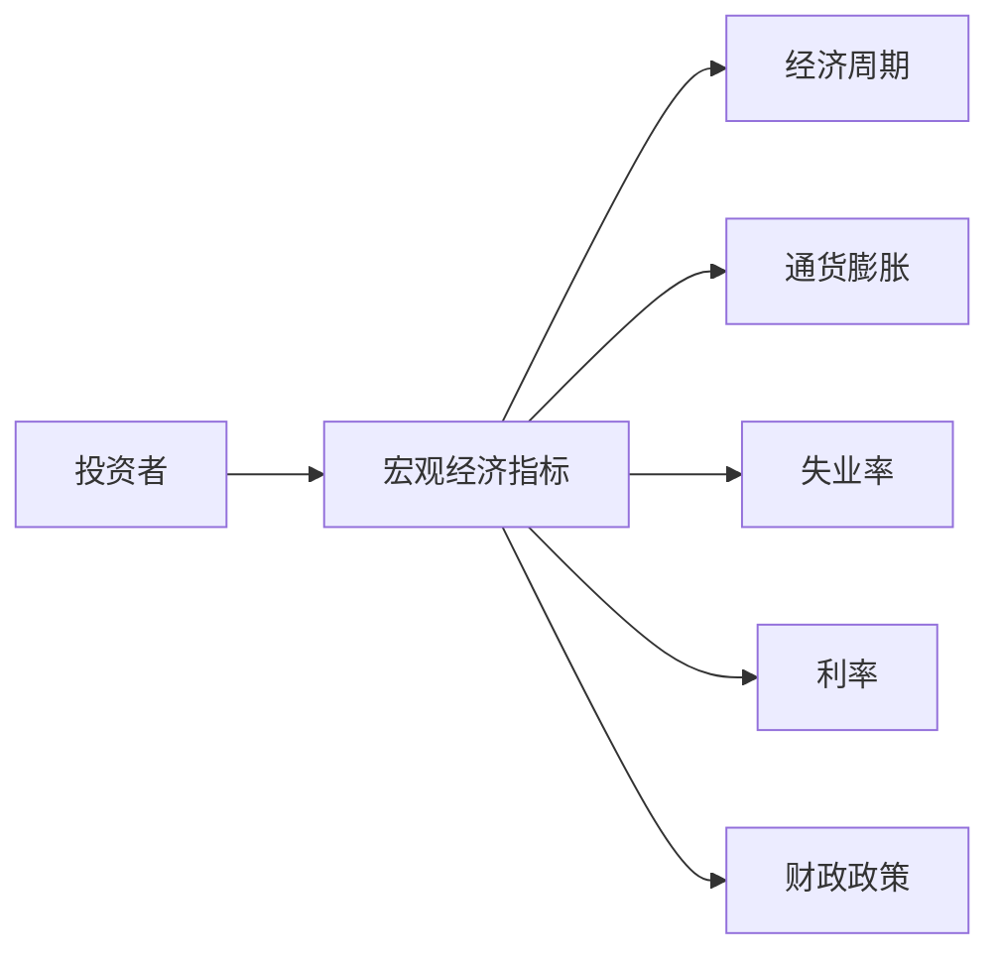
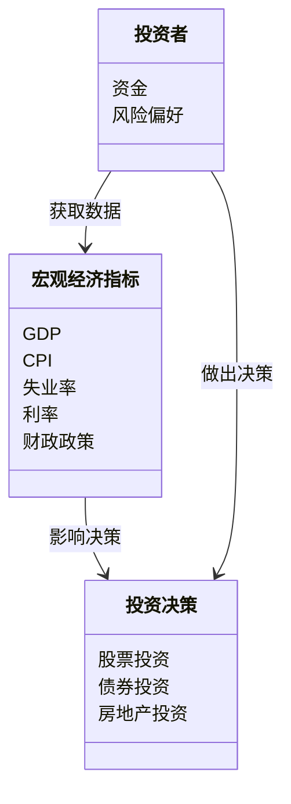

                 


# 宏观经济指标对投资决策的影响

## 关键词：宏观经济指标，投资决策，经济周期，通货膨胀，失业率，利率，财政政策

## 摘要：本文深入探讨宏观经济指标如何影响投资决策，通过分析GDP、CPI、失业率等关键指标，揭示它们在投资分析中的作用。结合数学模型和实际案例，本文为投资者提供科学的投资决策方法。

## 第一部分: 宏观经济指标与投资决策的背景

## 第2章: 宏观经济指标的核心概念与联系

### 2.1 宏观经济指标的核心概念

#### 2.1.1 国民生产总值（GDP）

- 定义与计算方法
- GDP对投资决策的影响
- GDP与其他经济指标的关系

#### 2.1.2 消费者价格指数（CPI）

- CPI的定义与计算
- 通货膨胀对投资的影响
- CPI与货币政策的关系

#### 2.1.3 失业率

- 失业率的分类与计算
- 失业率对消费和投资的影响
- 失业率与经济周期的关系

#### 2.1.4 利率

- 利率的种类与计算
- 利率对投资成本的影响
- 利率与货币政策的关系

#### 2.1.5 财政政策与政府支出

- 财政政策的定义与目标
- 政府支出对经济的影响
- 财政政策与投资决策的互动

### 2.2 宏观经济指标的属性特征对比

#### 2.2.1 不同经济指标的定义与计算方法

| 指标名称 | 定义 | 计算公式 |
|----------|------|----------|
| GDP      | 一个国家或地区的经济总产出 | GDP = C + I + G + (X - M) |
| CPI      | 消费者价格指数 | CPI = (一篮子商品价格总和) / (基准年商品价格总和) × 100 |
| 失业率    | 失业人口占劳动力人口的比例 | 失业率 = 失业人口 / 劳动力人口 × 100% |

#### 2.2.2 经济指标的时间序列特征

- 趋势性
- 周期性
- 季节性
- 随机性

#### 2.2.3 经济指标的波动性与相关性

- 指标间的相关性分析
- 波动性对投资决策的影响
- 使用协方差和相关系数衡量相关性

### 2.3 宏观经济指标的ER实体关系图



## 第3章: 宏观经济指标对投资决策的数学模型与公式

### 3.1 宏观经济指标与投资决策的数学模型

#### 3.1.1 消费函数模型

$$ C = aY + bT \text{（其中，Y为收入，T为税收）} $$

- 解释变量：收入（Y）、税收（T）
- 参数：a为边际消费倾向，b为税收的影响系数

#### 3.1.2 投资函数模型

$$ I = i_r r + i_y y \text{（其中，r为利率，y为预期收益）} $$

- 解释变量：利率（r）、预期收益（y）
- 参数：i_r为利率的敏感系数，i_y为预期收益的敏感系数

#### 3.1.3 总需求函数

$$ AD = aP + bY \text{（其中，a为进口系数，b为边际进口倾向）} $$

- 解释变量：价格（P）、收入（Y）
- 参数：a为进口的边际支出倾向，b为边际进口倾向

### 3.2 宏观经济指标的数学公式推导

#### 3.2.1 GDP与投资的关系

$$ GDP = C + I + G + (X - M) $$

- 解释：投资（I）是GDP的重要组成部分，GDP的增长通常伴随着投资的增长。

#### 3.2.2 消费者价格指数（CPI）的计算公式

$$ CPI = \frac{\text{当前篮子商品价格总和}}{\text{基准年篮子商品价格总和}} \times 100 $$

- 说明：CPI反映了通货膨胀的情况，对投资决策有重要影响。

#### 3.2.3 失业率的计算公式

$$ 失业率 = \frac{\text{失业人口}}{\text{劳动力人口}} \times 100\% $$

- 说明：失业率高通常意味着经济不景气，可能影响投资信心。

### 3.3 宏观经济指标与投资决策的回归分析

#### 3.3.1 简单线性回归模型

$$ y = \beta_0 + \beta_1 x + \epsilon $$

- 解释：y为投资决策变量，x为宏观经济指标，$\beta_0$为截距，$\beta_1$为斜率，$\epsilon$为误差项。

#### 3.3.2 多元线性回归模型

$$ y = \beta_0 + \beta_1 x_1 + \beta_2 x_2 + \dots + \beta_k x_k + \epsilon $$

- 解释：多个宏观经济指标对投资决策的综合影响。

### 3.4 宏观经济指标的协方差与相关系数

#### 3.4.1 协方差公式

$$ \text{Cov}(x, y) = E[(x - \bar{x})(y - \bar{y})] $$

- 说明：协方差衡量两个变量的线性关系。

#### 3.4.2 相关系数公式

$$ \rho_{xy} = \frac{\text{Cov}(x, y)}{\sigma_x \sigma_y} $$

- 说明：相关系数衡量变量之间的相关性，取值范围为-1到1。

### 3.5 宏观经济指标的时间序列分析

#### 3.5.1 自回归模型（AR模型）

$$ y_t = \alpha y_{t-1} + \beta x_t + \epsilon_t $$

- 解释：利用过去的数据预测未来趋势。

#### 3.5.2 移动平均模型（MA模型）

$$ y_t = \theta_1 \epsilon_{t-1} + \theta_2 \epsilon_{t-2} + \epsilon_t $$

- 说明：考虑过去误差的影响。

### 3.6 宏观经济指标的指数平滑法

#### 3.6.1 简单指数平滑法

$$ \hat{y}_t = \alpha y_{t-1} + (1 - \alpha)\hat{y}_{t-1} $$

- 说明：用于预测未来趋势。

#### 3.6.2 加权指数平滑法

$$ \hat{y}_t = \sum_{i=1}^{n} \alpha_i y_{t-i} $$

- 说明：不同权重的指数平滑法。

## 第4章: 宏观经济指标对投资决策的系统分析与架构设计

### 4.1 问题场景介绍

- 投资者如何利用宏观经济指标进行决策
- 经济指标的波动对投资的影响
- 如何构建宏观经济指标分析系统

### 4.2 系统功能设计

#### 4.2.1 领域模型（Mermaid类图）



#### 4.2.2 系统架构设计（Mermaid架构图）

```mermaid
container 宏观经济指标分析系统 {
    投资者模块
    宏观经济指标模块
    投资决策模块
    数据接口模块
}
```

#### 4.2.3 系统接口设计

- 数据接口：获取宏观经济指标数据
- 投资者接口：输入风险偏好和资金情况
- 输出接口：显示投资建议

#### 4.2.4 系统交互设计（Mermaid序列图）


### 4.3 项目核心实现源代码

#### 4.3.1 数据处理代码

```python
import pandas as pd
import numpy as np

data = pd.read_csv('macroeconomic.csv')
data['GDP增长率'] = data['GDP'].pct_change()
data['CPI'] = data['CPI'].fillna(method='ffill')
```

#### 4.3.2 模型构建代码

```python
from statsmodels import regression

model = regression.OLS(y, X).fit()
print(model.summary())
```

#### 4.3.3 结果可视化代码

```python
import matplotlib.pyplot as plt

plt.plot(data['时间'], data['GDP'], label='GDP')
plt.plot(data['时间'], data['CPI'], label='CPI')
plt.xlabel('时间')
plt.ylabel('指数')
plt.legend()
plt.show()
```

## 第5章: 宏观经济指标对投资决策的项目实战

### 5.1 环境安装与配置

- 安装Python和相关库（pandas, numpy, statsmodels）
- 数据源获取与处理

### 5.2 核心代码实现

#### 5.2.1 数据加载与预处理

```python
import pandas as pd
import numpy as np

# 加载数据
data = pd.read_csv('macroeconomic.csv')

# 处理缺失值
data = data.dropna()

# 增加增长率列
data['GDP增长率'] = data['GDP'].pct_change()
```

#### 5.2.2 模型构建与训练

```python
from statsmodels import regression

# 定义自变量和因变量
X = data[['GDP增长率', 'CPI', '失业率']]
y = data['投资回报率']

# 构建模型
model = regression.OLS(y, X).fit()

# 输出模型摘要
print(model.summary())
```

#### 5.2.3 模型结果可视化

```python
import matplotlib.pyplot as plt

# 绘制散点图矩阵
pd.plotting.scatter_matrix(data[['GDP增长率', 'CPI', '失业率', '投资回报率']], figsize=(10, 10))
plt.show()
```

### 5.3 实际案例分析与解读

#### 5.3.1 案例背景

- 假设当前经济处于复苏阶段，GDP增长率为3%，CPI为2%，失业率为5%
- 投资者有100万元资金，风险偏好中等

#### 5.3.2 数据分析

- GDP增长率为3%，表明经济在增长，企业盈利可能增加
- CPI为2%，通货膨胀温和，货币政策可能保持稳定
- 失业率为5%，劳动力市场稳定，消费可能增加

#### 5.3.3 投资建议

- 股票投资：经济增长支持企业盈利，股票可能有较好回报
- 债券投资：利率可能上升，债券价格可能下跌，风险较大
- 房地产投资：经济增长和人口增长可能推动房地产价格上涨

#### 5.3.4 模型预测结果

- 根据模型，GDP增长率和CPI对投资回报率有正向影响
- 失业率对投资回报率有负向影响
- 预测未来投资回报率为8%

### 5.4 项目小结

- 宏观经济指标分析系统能够帮助投资者做出科学的投资决策
- 模型需要不断更新和优化，以适应经济环境的变化
- 综合考虑多个宏观经济指标，能够提高投资决策的准确性

## 第6章: 宏观经济指标对投资决策的总结与展望

### 6.1 全文总结

- 宏观经济指标是投资决策的重要依据
- 不同经济指标对投资的影响机制不同
- 综合分析多个指标，能够提高投资决策的科学性

### 6.2 未来展望

- 引入机器学习算法，提高预测准确性
- 开发实时监控系统，及时捕捉经济变化
- 研究不同经济指标的组合效应，优化投资策略

### 6.3 最佳实践 tips

- 定期更新数据，保持模型的时效性
- 综合考虑多个指标，避免单一指标误导
- 风险评估与投资组合优化相结合

### 6.4 作者介绍

作者：AI天才研究院/AI Genius Institute & 禅与计算机程序设计艺术 /Zen And The Art of Computer Programming

### 6.5 结语

宏观经济指标对投资决策的影响是一个复杂的系统工程，需要结合多种指标和科学的分析方法。投资者应不断提升自身的知识和技能，合理利用宏观经济指标，制定科学的投资策略。

--- 

**注**：以上内容仅为目录大纲，实际文章需要根据此大纲进行详细撰写，每章内容需要详细展开，包括但不限于定义、公式、图表、代码和案例分析。

