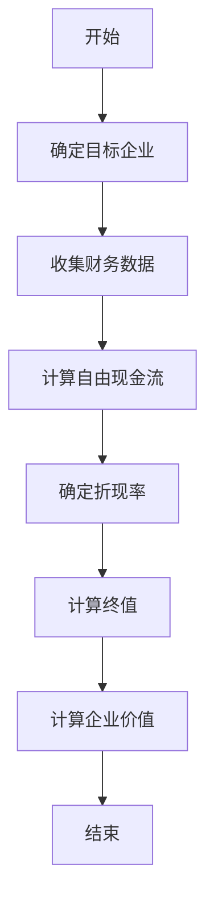
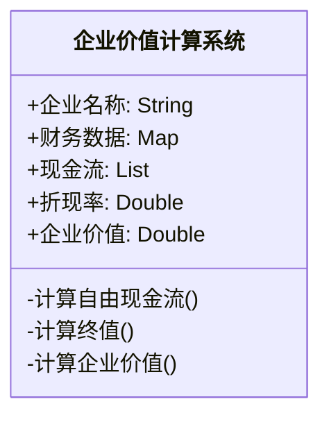
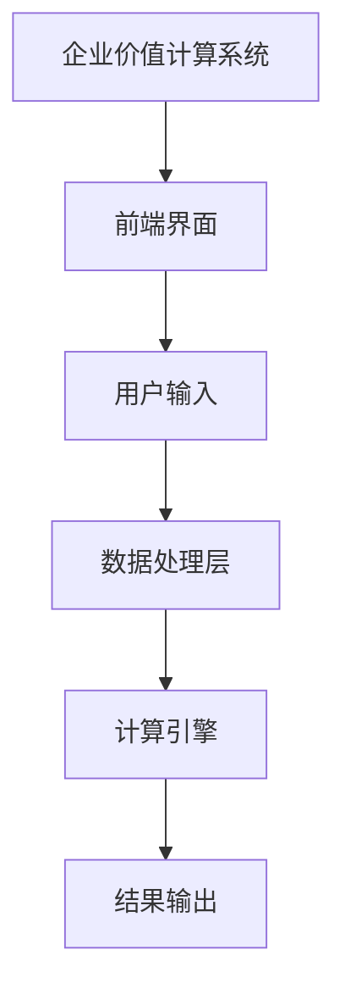
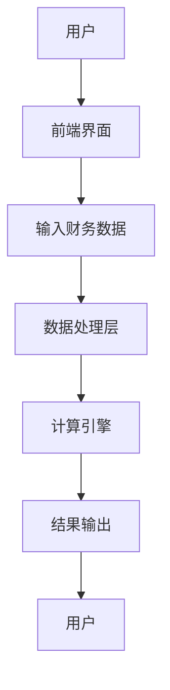

                 


# 实例演示：如何计算企业价值

## 关键词：企业价值、现金流折现模型、DCF模型、财务分析、投资决策

## 摘要

企业价值的计算是企业管理与投资决策中的核心问题之一。本文通过实例演示，详细讲解企业价值的计算方法，涵盖从基本概念到数学模型，再到系统架构设计的全过程。通过本文的学习，读者将能够掌握企业价值计算的核心原理和实际应用。

---

## 第1章：企业价值计算的背景与核心概念

### 1.1 企业价值计算的背景介绍

在商业领域，企业价值的准确评估对企业并购、融资和战略规划至关重要。企业价值不仅仅是账面资产的总和，还包括企业未来现金流的折现值。本文将通过实例演示，详细讲解企业价值的计算方法。

#### 1.1.1 什么是企业价值

企业价值（Enterprise Value, EV）是企业在市场上整体的经济价值，包括资产、负债和所有者权益。企业价值的计算考虑了企业的未来盈利能力，是企业估值的核心指标。

#### 1.1.2 企业价值计算的必要性

企业价值计算的必要性体现在以下几个方面：
1. 企业并购中的定价依据。
2. 投资决策中的价值评估。
3. 企业融资中的资本结构优化。

#### 1.1.3 企业价值计算的边界与外延

企业价值的计算需要明确企业的边界，包括企业的核心业务、资产范围和财务数据的完整性。外延部分则包括企业未来增长的潜力和市场环境的影响。

### 1.2 企业价值计算的核心要素

#### 1.2.1 企业价值的构成要素

企业价值的构成要素包括：
1. 资产：企业的有形资产和无形资产。
2. 负债：企业的债务和应付账款。
3. 所有者权益：企业的净资产。

#### 1.2.2 核心概念与联系

企业价值的计算涉及到多个核心概念，包括：
- 自由现金流（Free Cash Flow, FCF）：企业在扣除所有成本和税金后的现金流量。
- 折现率（Discount Rate, r）：用于将未来现金流折现到当前时点的利率。
- 终值（Terminal Value, TV）：企业在无限期后的价值。

#### 1.2.3 实体关系图（ER图）

以下是企业价值计算的核心要素ER图：

```mermaid
erd
    管理层
    投资者
    企业
    财务数据
    市场环境
    计算结果
```

### 1.3 企业价值计算的核心原理

#### 1.3.1 核心概念的数学模型

企业价值的计算基于现金流折现模型（DCF模型），公式如下：
$$ V = \frac{FCF}{(1 + r)^n} $$
其中，FCF代表自由现金流，r代表折现率，n代表时间。

#### 1.3.2 核心概念的属性特征对比表

以下是对核心概念的属性特征对比表：

| 概念       | 属性                     | 特征                     |
|------------|--------------------------|--------------------------|
| 自由现金流 | 时间价值                 | 未来各期的现金流         |
| 折现率     | 风险与收益               | 反映了资金的时间价值与风险 |
| 终值       | 永续增长                 | 企业未来现金流的终值     |

#### 1.3.3 实体关系图（ER图）

以下是企业价值计算的实体关系图：

```mermaid
erd
    企业
    财务数据
    计算结果
    投资者
    市场环境
```

---

## 第2章：企业价值计算的数学模型与公式

### 2.1 企业价值计算的数学模型

现金流折现模型（DCF模型）是企业价值计算的核心模型。以下是DCF模型的主要步骤：

#### 2.1.1 企业价值的公式表示

企业价值的计算公式为：
$$ V = \frac{FCF}{(1 + r)^n} $$

#### 2.1.2 现金流折现模型（DCF）的详细讲解

##### 2.1.2.1 自由现金流的计算

自由现金流的计算公式为：
$$ FCF = EBIT(1 - 税率) + 折旧 - 资本支出 $$

##### 2.1.2.2 折现率的确定

折现率通常使用加权平均资本成本（WACC）计算，公式为：
$$ WACC = (D/E) \times cost\_of\_debt \times (1 - 税率) + (E/(D+E)) \times cost\_of\_equity $$

##### 2.1.2.3 终值的计算

终值的计算公式为：
$$ TV = \frac{FCF \times (1 + g)}{r - g} $$

### 2.2 企业价值计算的算法流程图

以下是企业价值计算的算法流程图：



---

## 第3章：企业价值计算的系统分析与架构设计

### 3.1 系统功能设计

企业价值计算系统需要实现以下功能：

#### 3.1.1 领域模型（mermaid类图）

以下是系统功能设计的类图：



### 3.2 系统架构设计

#### 3.2.1 系统架构图（mermaid架构图）

以下是系统架构图：



### 3.3 系统接口设计

#### 3.3.1 接口描述

系统接口设计包括以下内容：

1. **输入接口**：用户输入财务数据。
2. **输出接口**：展示计算结果。
3. **交互流程图**：展示用户与系统之间的交互流程。

#### 3.3.2 接口交互流程图（mermaid）

以下是接口交互流程图：



---

## 总结与展望

通过本文的详细讲解，读者可以全面了解企业价值计算的核心原理和实际应用。从背景介绍到数学模型，再到系统架构设计，本文为企业价值计算提供了全面的指导。未来，随着企业环境的不断变化，企业价值计算的方法和工具也将不断创新，为企业决策提供更强大的支持。

---

## 作者

作者：AI天才研究院/AI Genius Institute & 禅与计算机程序设计艺术/Zen And The Art of Computer Programming

