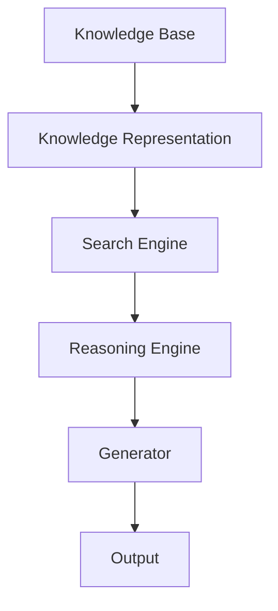

                 


# 实现AI Agent的动态知识检索与综合能力

> 关键词：AI Agent，动态知识检索，知识综合，多模态处理，智能系统架构，生成式AI

> 摘要：本文深入探讨了AI Agent的动态知识检索与综合能力的实现方法，结合理论分析和实践案例，详细讲解了知识表示、检索算法、系统架构设计以及实际应用中的关键技术。通过本文的阐述，读者可以全面了解AI Agent的核心能力，并掌握其实现的关键技术与方法。

---

## 第1章 AI Agent的基本概念与背景

### 1.1 AI Agent的定义与核心能力

AI Agent（人工智能代理）是指能够感知环境、自主决策并执行任务的智能实体。与传统AI不同，AI Agent具有更强的自主性和适应性，能够根据动态环境中的信息做出实时响应。

#### AI Agent的核心能力
- **感知能力**：通过多种模态（文本、图像、语音等）获取环境信息。
- **推理能力**：基于知识库进行逻辑推理，解决复杂问题。
- **决策能力**：根据推理结果做出最优决策。
- **学习能力**：通过反馈机制不断优化自身性能。

#### AI Agent与传统AI的区别
| 特性 | AI Agent | 传统AI |
|------|-----------|--------|
| 自主性 | 高 | 低 |
| 适应性 | 高 | 中 |
| 实时性 | 高 | 低 |

### 1.2 动态知识检索的背景与意义

#### 动态知识检索的背景
随着数据的快速增长，知识库的规模不断扩大，且内容实时更新。AI Agent需要在动态变化的环境中快速检索和处理信息。

#### 动态知识检索的意义
- **实时性**：确保AI Agent能够快速响应动态环境中的信息变化。
- **准确性**：在复杂场景中准确检索相关信息。
- **高效性**：优化检索算法，降低计算成本。

### 1.3 综合能力的实现目标

AI Agent的综合能力是指其在多种任务中协同工作的能力，包括知识检索、推理、生成等。其实现目标包括：
- **多模态处理**：整合文本、图像、语音等多种模态信息。
- **推理与决策**：基于知识库进行复杂推理，做出最优决策。
- **生成式能力**：生成符合上下文的自然语言文本或其他形式的输出。

---

## 第2章 AI Agent的动态知识检索机制

### 2.1 知识表示与存储

#### 知识图谱的构建
知识图谱是一种结构化的知识表示方法，通过实体和关系的网络表示知识。构建知识图谱的过程包括数据抽取、实体识别和关系抽取。

#### 知识库的动态更新
动态知识检索需要实时更新知识库，以应对环境的变化。动态更新可以通过增量式学习或在线更新实现。

#### 知识表示的多样性
知识可以表示为多种形式，包括符号表示、向量表示和图结构表示。不同的表示方法适用于不同的场景。

### 2.2 动态知识检索的算法原理

#### 基于向量的检索方法
向量检索是一种常用的方法，通过计算查询向量与知识库中向量的相似度进行检索。

- **向量空间模型**：将知识表示为向量，计算向量之间的相似度。
- **BM25算法**：基于统计的检索算法，常用于文本检索。

#### 基于图的检索方法
图检索方法通过图结构进行信息检索，适用于复杂关系的场景。

- **图遍历算法**：如BFS和DFS，用于在图中遍历节点。
- **图嵌入方法**：将图节点映射为低维向量，用于相似度计算。

#### 混合检索方法
混合检索方法结合了向量检索和图检索的优势，适用于复杂场景。

### 2.3 动态知识检索的优化策略

#### 索引优化
- **倒排索引**：提高检索效率。
- **分块存储**：将知识库分成多个块，提高并行处理能力。

#### 查询优化
- **语义理解**：基于上下文理解查询意图。
- **多轮对话**：通过多轮交互优化检索结果。

#### 结果排序优化
- **基于反馈的排序**：根据用户反馈调整结果排序。
- **基于相似度的排序**：根据相似度值排序。

---

## 第3章 AI Agent的综合能力实现

### 3.1 多模态知识处理

#### 文本、图像、语音的多模态处理
AI Agent需要处理多种模态的信息，如文本、图像和语音。

#### 多模态数据的融合方法
- **特征融合**：将不同模态的特征向量进行融合。
- **注意力机制**：根据上下文注意力权重进行融合。

#### 多模态知识的检索与综合
通过多模态检索算法，结合多种模态信息进行综合检索。

### 3.2 推理与决策能力

#### 基于知识图谱的推理
通过知识图谱进行推理，解决复杂问题。

#### 基于上下文的决策
根据当前上下文信息，做出最优决策。

#### 复杂场景下的推理与决策
在复杂场景中，结合推理和决策能力，实现智能决策。

### 3.3 生成式综合能力

#### 基于检索的生成方法
通过检索相关知识生成输出。

#### 基于生成模型的综合能力
使用生成模型（如GPT）生成自然语言文本。

#### 综合能力的评估与优化
通过评估指标（如BLEU、ROUGE）优化生成能力。

---

## 第4章 AI Agent的动态知识检索与综合能力的实现

### 4.1 系统架构设计

#### 系统功能设计
- **知识表示模块**：负责知识的表示和存储。
- **检索模块**：负责动态知识的检索。
- **推理模块**：负责基于知识的推理。
- **生成模块**：负责生成输出。

#### 系统架构图



### 4.2 算法实现

#### 知识表示与检索的实现

```python
class KnowledgeNode:
    def __init__(self, id, label):
        self.id = id
        self.label = label
        self.children = []
```

#### 推理算法实现

```python
def infer知识图谱中的关系：
    def infer知识图谱中的关系：
        # 假设知识图谱中的关系表示为边
        for edge in edges:
            if edge.source == 查询节点 and edge.rel == 关系：
                yield edge.target
```

### 4.3 项目实战

#### 环境安装
```bash
pip install numpy
pip install networkx
pip install spacy
```

#### 核心代码实现

```python
import networkx as nx
import spacy

# 知识图谱构建
def构建知识图谱():
    G = nx.Graph()
    G.add_edges_from([("A", "B"), ("B", "C"), ("A", "D")])
    return G

# 动态知识检索
def检索知识库(G, 查询节点):
    return [node for node in G.nodes() if 查询节点 in node]

# 推理与决策
def推理知识库(G, 查询节点, 关系):
    return [edge.target for edge in G.edges(查询节点)]
```

---

## 第5章 总结与展望

### 5.1 总结

本文详细探讨了AI Agent的动态知识检索与综合能力的实现方法，结合理论分析和实践案例，详细讲解了知识表示、检索算法、系统架构设计以及实际应用中的关键技术。

### 5.2 未来展望

未来，AI Agent的动态知识检索与综合能力将更加智能化和高效化，结合更多先进技术（如大语言模型）实现更强大的能力。

---

## 作者

作者：AI天才研究院 & 禅与计算机程序设计艺术

