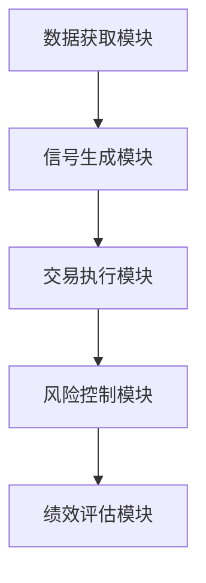

                 


# 对冲基金策略：专业投资者如何应对市场波动

> 关键词：对冲基金，市场波动，风险管理，套利机制，算法策略，量化投资

> 摘要：对冲基金是一种通过多种策略在不同市场条件下进行投资的金融工具，其核心在于利用市场波动性实现收益。本文将从对冲基金的基本概念、核心策略、数学模型、系统架构等多个维度进行深入分析，探讨专业投资者如何通过科学的策略和系统设计应对市场波动，实现稳健收益。

---

## 第一部分: 对冲基金策略基础

## 第1章: 对冲基金概述

### 1.1 对冲基金的基本概念

#### 1.1.1 对冲基金的定义
对冲基金是一种通过多种金融工具和策略进行投资的基金，其目标是在不同市场条件下实现稳健收益。对冲基金的核心理念是通过做多和做空相结合的方式，降低市场波动对投资组合的影响。

#### 1.1.2 对冲基金的起源与发展
对冲基金的起源可以追溯到20世纪50年代，由经济学家阿尔弗雷德·琼斯（Alfred Jones）首创。随着金融市场的不断发展，对冲基金逐渐演变为一种复杂的金融工具，广泛应用于机构投资和个人理财。

#### 1.1.3 对冲基金的核心目标
对冲基金的目标是在不同市场条件下实现超额收益，同时通过多样化策略降低风险。其核心目标包括：
1. 实现风险调整后的超额收益。
2. 通过套利和对冲机制降低市场波动的影响。
3. 在不同市场周期中保持稳定的收益表现。

### 1.2 市场波动与对冲基金的作用

#### 1.2.1 市场波动的定义与影响
市场波动是指市场价格的短期剧烈波动，通常由市场参与者的买卖行为、宏观经济因素或突发事件引发。市场波动对投资者的影响包括：
1. 短期内资产价格的大幅波动可能导致投资损失。
2. 波动性高的市场环境增加了投资决策的难度。

#### 1.2.2 对冲基金在市场波动中的角色
对冲基金通过多种策略在市场波动中寻找套利机会，例如：
1. 做空高估资产，做多低估资产。
2. 利用市场波动进行短期交易。
3. 通过期货和期权对冲市场风险。

#### 1.2.3 对冲基金的风险管理机制
对冲基金通过以下方式管理市场波动带来的风险：
1. 采用多空策略对冲市场风险。
2. 使用衍生工具（如期货、期权）进行套期保值。
3. 实施严格的风险控制和杠杆管理。

### 1.3 对冲基金的主要策略类型

#### 1.3.1 股票多空策略
股票多空策略是通过对多只股票的多头和空头头寸进行配对，以对冲市场风险并获取超额收益。

#### 1.3.2 债券套利策略
债券套利策略通过寻找债券市场的套利机会，利用不同债券之间的价格差异进行投资。

#### 1.3.3 商品期货套利策略
商品期货套利策略利用不同商品或不同交割月份的期货价格差异进行投资。

#### 1.3.4 股指期货对冲策略
股指期货对冲策略通过做空股指期货来对冲股票投资组合的系统性风险。

#### 1.3.5 事件驱动策略
事件驱动策略关注公司并购、重组等特定事件带来的投资机会。

---

## 第2章: 对冲基金的核心原理

### 2.1 对冲基金的套利机制

#### 2.1.1 套利的定义与原理
套利是指利用资产或市场之间的价格差异进行无风险或低风险的投资，以获取超额收益。

#### 2.1.2 套利的种类与应用场景
套利的种类包括：
1. 跨市场套利：利用不同市场之间的价格差异进行投资。
2. 跨期套利：利用同一资产在不同时间点的价格差异进行投资。
3. 股票套利：利用同一公司不同股票（如A股和H股）的价格差异进行投资。

#### 2.1.3 套利的风险与收益平衡
套利的风险主要包括市场风险、流动性风险和信用风险。套利的收益通常较低，但风险也相对可控。

### 2.2 风险中性定价模型

#### 2.2.1 风险中性定价的定义
风险中性定价是指在无套利的情况下，资产的期望收益率等于其无风险利率加一个风险溢价。

#### 2.2.2 风险中性定价的应用
风险中性定价模型广泛应用于衍生品定价，例如期权定价。

#### 2.2.3 风险中性定价的数学模型
风险中性定价模型的数学表达式如下：
$$ E[R] = r + \lambda \sigma $$
其中，$E[R]$ 是期望收益率，$r$ 是无风险利率，$\lambda$ 是风险溢价系数，$\sigma$ 是资产收益率的标准差。

### 2.3 对冲基金的运作模式

#### 2.3.1 对冲基金的运作流程
对冲基金的运作流程包括：
1. 确定投资策略。
2. 进行市场分析。
3. 构建投资组合。
4. 实施风险控制。

#### 2.3.2 对冲基金的组织结构
对冲基金的组织结构通常包括：
1. 投资委员会。
2. 风险管理团队。
3. 交易执行团队。
4. 后台支持团队。

#### 2.3.3 对冲基金的收益分配机制
对冲基金的收益通常按照一定比例分配给投资者和管理人，例如“2:20”分成模式，即投资者获得80%，管理人获得20%。

---

## 第3章: 对冲基金的数学模型与算法

### 3.1 常见对冲策略的数学模型

#### 3.1.1 均值回归策略
均值回归策略基于资产价格回归均值的假设，通过买入低估资产、卖出高估资产来实现收益。

#### 3.1.2 动量策略
动量策略基于资产价格的动量效应，即近期价格走势会对未来价格产生影响。

#### 3.1.3 股票筛选模型
股票筛选模型通过多个因子（如市盈率、市净率、收益增长率等）筛选出具有投资价值的股票。

### 3.2 风险管理模型

#### 3.2.1 风险价值（VaR）模型
风险价值（VaR）模型用于度量资产在一定置信水平下的最大可能损失。

#### 3.2.2 凸性风险（CVaR）模型
凸性风险（CVaR）模型用于度量资产在置信水平下的平均损失。

#### 3.2.3 风险调整后的收益模型
风险调整后的收益模型通过调整资产的期望收益率，使其反映其承担的风险。

### 3.3 对冲基金的算法实现

#### 3.3.1 算法的输入与输出
对冲基金算法的输入包括历史价格数据、市场因子等，输出包括交易信号、投资组合配置等。

#### 3.3.2 算法的实现步骤
1. 数据获取与预处理。
2. 模型训练与参数优化。
3. 交易信号生成。
4. 投资组合调整。

#### 3.3.3 算法的优化与改进
对冲基金算法的优化与改进包括：
1. 参数优化。
2. 模型迭代。
3. 风险控制。

---

## 第4章: 对冲基金的系统架构设计

### 4.1 对冲基金交易系统的组成

#### 4.1.1 数据获取模块
数据获取模块负责从金融市场获取实时或历史数据。

#### 4.1.2 信号生成模块
信号生成模块基于算法模型生成交易信号。

#### 4.1.3 交易执行模块
交易执行模块负责根据交易信号执行交易指令。

#### 4.1.4 风险控制模块
风险控制模块实时监控和管理交易风险。

#### 4.1.5 绩效评估模块
绩效评估模块对投资组合的收益和风险进行评估。

### 4.2 系统架构设计

#### 4.2.1 系统架构的总体设计
对冲基金交易系统的总体架构包括数据获取、信号生成、交易执行、风险控制和绩效评估五大模块。

#### 4.2.2 系统架构的模块划分
对冲基金交易系统的模块划分如图所示：



#### 4.2.3 系统架构的交互流程
对冲基金交易系统的交互流程如下：
1. 数据获取模块获取市场数据。
2. 信号生成模块生成交易信号。
3. 交易执行模块执行交易指令。
4. 风险控制模块监控和管理风险。
5. 绩效评估模块评估投资组合的绩效。

### 4.3 系统接口设计

#### 4.3.1 数据接口的设计
对冲基金交易系统需要与多个数据源（如交易所、数据供应商）进行接口对接。

---

## 第5章: 对冲基金的项目实战

### 5.1 项目背景
本项目旨在开发一个基于量化策略的对冲基金交易系统，帮助投资者在市场波动中实现稳健收益。

### 5.2 项目核心实现

#### 5.2.1 环境安装
需要安装的环境包括：
1. Python编程语言。
2. 数据分析库（如Pandas、NumPy）。
3. 交易执行接口（如Interactive Brokers）。

#### 5.2.2 核心代码实现
以下是均值回归策略的Python代码示例：

```python
import pandas as pd
import numpy as np

# 获取历史价格数据
prices = pd.read_csv('prices.csv')

# 计算均值回归信号
prices['zscore'] = (prices['close'] - prices['close'].mean()) / prices['close'].std()

# 生成交易信号
prices['signal'] = np.where(prices['zscore'] > 1, -1, np.where(prices['zscore'] < -1, 1, 0))

# 执行交易
positions = 0
profit = 0
for i in range(len(prices)):
    if prices['signal'][i] == 1:
        positions += 1
        profit += prices['close'][i]
    elif prices['signal'][i] == -1:
        positions -= 1
        profit -= prices['close'][i]

print('总利润:', profit)
```

#### 5.2.3 代码应用解读与分析
上述代码实现了均值回归策略，通过计算资产价格的Z得分生成交易信号，并根据信号执行交易。

### 5.3 实际案例分析
以某只股票为例，分析均值回归策略在实际市场中的表现。

### 5.4 项目小结
通过对冲基金交易系统的开发和实现，投资者可以在市场波动中捕捉套利机会，实现稳健收益。

---

## 第6章: 对冲基金的最佳实践

### 6.1 小结
对冲基金是一种复杂的金融工具，其核心在于通过套利和对冲机制实现稳健收益。

### 6.2 注意事项
1. 风险管理是关键。
2. 交易执行必须严格遵守纪律。
3. 系统设计需要考虑可扩展性和可维护性。

### 6.3 拓展阅读
推荐阅读以下书籍：
1. 《对冲基金风云录》。
2. 《量化投资：机构是如何运作的》。

---

## 作者信息

作者：AI天才研究院/AI Genius Institute & 禅与计算机程序设计艺术/Zen And The Art of Computer Programming

