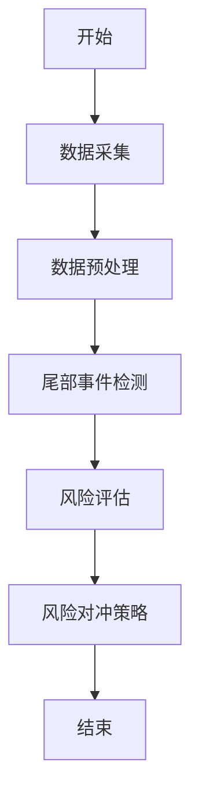
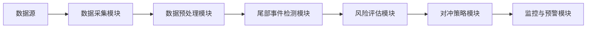
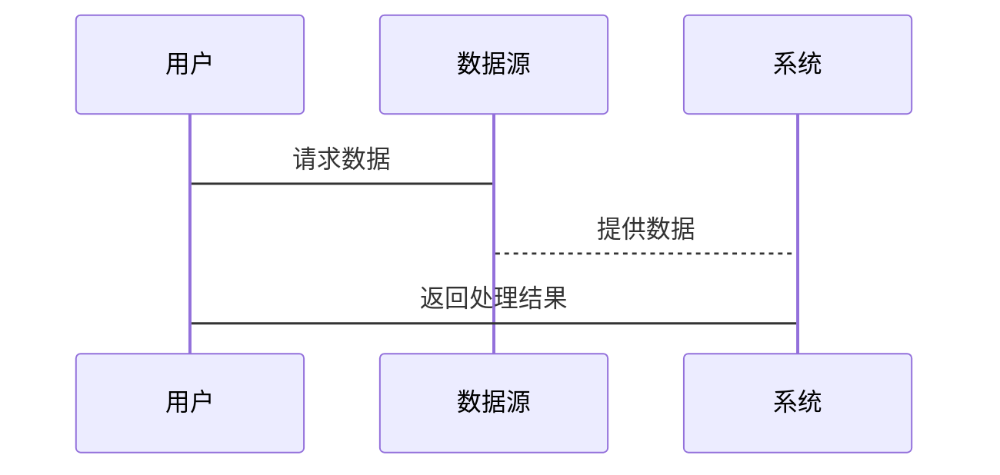

                 


# 尾部风险管理：防范极端市场事件的策略

## 关键词：尾部风险、风险管理、极端市场事件、金融稳定、系统性风险

## 摘要：  
尾部风险管理是防范极端市场事件的重要策略，旨在识别和应对低概率但高影响的事件。本文从理论、方法、系统架构和实战案例等方面，深入探讨尾部风险管理的核心概念、算法原理和实际应用，帮助读者掌握防范极端市场事件的有效策略。

---

# 第1章 尾部风险管理的概述

## 1.1 尾部风险的定义与特征

### 1.1.1 尾部风险的定义  
尾部风险是指在概率分布的“尾部”区域发生的低概率、高影响的极端事件。这些事件可能引发市场崩盘、资产贬值或系统性危机。

### 1.1.2 尾部风险的特征  
- **低概率性**：尾部事件发生的概率极低，但影响巨大。  
- **高破坏性**：尾部事件可能导致市场或经济的崩溃。  
- **不可预测性**：尾部事件通常难以预测，具有“黑天鹅”特性。  
- **系统性**：尾部事件可能引发连锁反应，影响整个金融系统。  

### 1.1.3 尾部风险的分类  
尾部风险可以分为：  
1. **市场风险**：如市场崩盘或剧烈波动。  
2. **信用风险**：如大规模违约事件。  
3. **操作风险**：如系统故障或人为失误。  
4. **流动性风险**：如市场流动性枯竭。  

---

## 1.2 尾部风险管理的重要性

### 1.2.1 尾部风险对市场的潜在影响  
尾部事件可能引发市场恐慌、资产价格暴跌和信任危机，甚至导致金融危机。  

### 1.2.2 尾部风险管理对机构和投资者的价值  
- 保护机构和投资者的资产安全。  
- 提高市场稳定性，降低系统性风险。  
- 帮助机构制定更稳健的投资策略。  

### 1.2.3 尾部风险管理的边界与外延  
尾部风险管理不仅关注单个资产，还涉及整个金融系统的稳定性。  

---

## 1.3 尾部风险管理的核心概念

### 1.3.1 尾部风险管理的理论基础  
尾部风险管理基于概率论、统计学和金融学理论，强调对极端事件的识别和应对。  

### 1.3.2 尾部风险管理的关键要素  
- 数据采集与分析。  
- 风险识别与量化。  
- 对冲与监控策略。  

### 1.3.3 尾部风险管理的系统性特征  
尾部风险管理需要从系统性角度出发，考虑市场的相互关联和潜在的连锁反应。  

---

## 1.4 尾部风险管理的背景与现状

### 1.4.1 金融危机中的尾部风险管理  
2008年金融危机就是一个典型的尾部风险事件，暴露了金融机构在风险管理上的不足。  

### 1.4.2 当前市场环境下的尾部风险管理  
随着金融市场的复杂化，尾部风险管理变得更加重要，尤其是在算法交易和高频交易中。  

### 1.4.3 尾部风险管理的未来趋势  
未来，尾部风险管理将更加依赖于技术手段，如人工智能和大数据分析。  

---

## 1.5 本章小结  
尾部风险管理是防范极端市场事件的关键策略，其重要性在于保护资产安全、维护市场稳定并降低系统性风险。  

---

# 第2章 尾部风险管理的核心原理

## 2.1 尾部风险的统计学分析

### 2.1.1 尾部事件的统计特征  
尾部事件通常服从“肥尾”分布，意味着极端事件的发生概率高于正态分布的假设。  

### 2.1.2 尾部事件的概率分布模型  
常用的概率分布模型包括：  
- 正态分布：假设极端事件概率极低。  
- 威布尔分布：适用于建模尾部事件的影响。  
- 帕累托分布：适用于描述极端事件的规模。  

### 2.1.3 尾部事件的检测方法  
- 基于统计的方法：如Grubbs检验和Z-score方法。  
- 基于机器学习的方法：如异常检测算法（Isolation Forest）。  

---

## 2.2 尾部风险管理的数学模型

### 2.2.1 尾部风险的度量公式  
尾部风险可以通过VaR（在险价值）和CVaR（条件在险价值）来度量：  
$$ VaR = \alpha \cdot \sigma $$  
$$ CVaR = \frac{1}{1-\alpha} \int_{\alpha}^{1} VaR d\alpha $$  

### 2.2.2 尾部风险的数学模型构建  
尾部风险管理模型通常包括：  
1. 数据预处理：去除异常值和填补缺失值。  
2. 风险识别：通过统计方法或机器学习算法检测尾部事件。  
3. 风险量化：计算VaR、CVaR等指标。  

### 2.2.3 尾部风险的优化算法  
- 遗传算法：用于优化风险对冲策略。  
- 粒子群优化算法：用于寻找最优风险控制方案。  

---

## 2.3 尾部风险管理的实体关系图

### 2.3.1 实体关系图的定义  
尾部风险管理的实体关系图展示了参与者、事件和风险管理过程之间的关系。  

### 2.3.2 尾部风险管理的ER图设计  
```mermaid
erd
    客户
    机构
    市场
    尾部事件
    风险管理过程
    风险指标
```

---

## 2.4 尾部风险管理的算法流程图



---

## 2.5 本章小结  
尾部风险管理的核心在于通过统计学分析和数学模型，识别和量化极端事件，并制定有效的对冲策略。  

---

# 第3章 尾部风险管理的系统架构与实现

## 3.1 尾部风险管理的系统架构设计

### 3.1.1 系统功能设计  
尾部风险管理系统的功能模块包括：  
1. 数据采集与处理。  
2. 尾部事件检测。  
3. 风险量化与评估。  
4. 对冲策略制定。  
5. 监控与预警。  

### 3.1.2 系统架构图  


---

## 3.2 尾部风险管理的接口设计

### 3.2.1 API接口  
- 数据接口：用于数据采集和传输。  
- 风险评估接口：用于调用VaR和CVaR计算。  
- 对冲策略接口：用于制定和执行风险对冲方案。  

---

## 3.3 尾部风险管理的交互流程



---

## 3.4 本章小结  
尾部风险管理系统的架构设计和实现是保障风险管理效果的关键，需要数据采集、处理和分析的无缝衔接。  

---

# 第4章 尾部风险管理的项目实战

## 4.1 项目背景与目标

### 4.1.1 项目背景  
本项目旨在开发一个尾部风险管理系统，帮助金融机构识别和应对极端市场事件。  

### 4.1.2 项目目标  
- 实现尾部事件的实时检测。  
- 计算VaR和CVaR等风险指标。  
- 制定和执行风险对冲策略。  

---

## 4.2 系统核心实现

### 4.2.1 数据采集与预处理  
- 数据采集：从金融数据源获取市场数据。  
- 数据预处理：清洗数据，填补缺失值。  

### 4.2.2 尾部事件检测  
- 使用机器学习算法（如Isolation Forest）检测异常事件。  

### 4.2.3 风险量化与评估  
- 计算VaR和CVaR，评估尾部事件的影响。  

### 4.2.4 对冲策略制定  
- 根据风险评估结果，制定相应的对冲策略（如买入期权对冲下行风险）。  

---

## 4.3 项目小结  
通过实际案例分析，尾部风险管理系统的实现能够有效识别和应对极端市场事件，保护资产安全。  

---

# 第5章 尾部风险管理的总结与展望

## 5.1 本章总结  
尾部风险管理是防范极端市场事件的重要策略，其核心在于识别、量化和应对尾部风险，保障市场的稳定运行。  

## 5.2 未来展望  
随着技术的进步，尾部风险管理将更加依赖人工智能和大数据分析，未来的研究方向包括：  
1. 更精确的尾部事件预测模型。  
2. 更高效的实时风险管理系统。  
3. 更智能化的对冲策略制定。  

---

# 作者：AI天才研究院/AI Genius Institute & 禅与计算机程序设计艺术 /Zen And The Art of Computer Programming

