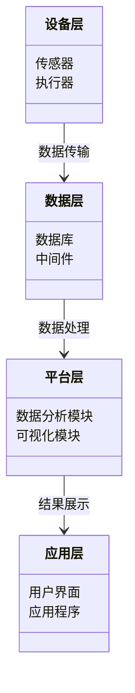
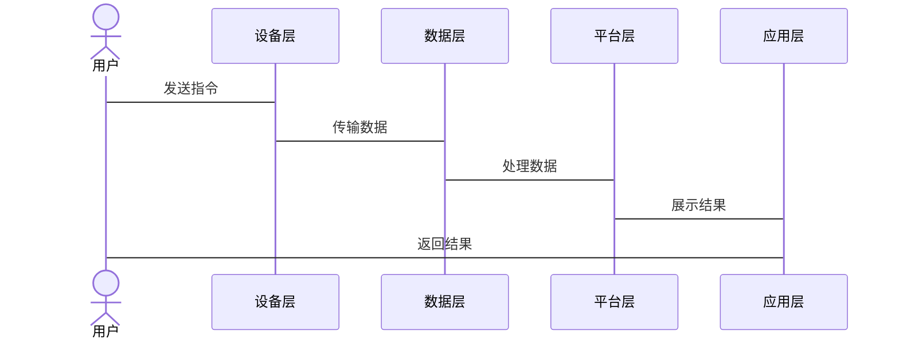

                 


# 工业互联网的发展前景与投资机会

> 关键词：工业互联网，发展前景，投资机会，技术分析，系统架构

> 摘要：工业互联网作为新一代信息技术与制造业深度融合的产物，正在推动全球工业体系的智能化转型。本文将深入分析工业互联网的核心概念、技术原理、系统架构，探讨其在不同应用场景中的实际案例，并为投资者提供详细的投资策略和风险评估。通过系统性的分析和解读，本文旨在为读者提供关于工业互联网的全面视角，帮助其抓住这一领域的投资机遇。

---

## 第一部分：工业互联网的背景与概念

### 第1章：工业互联网的背景与概念

#### 1.1 工业互联网的起源与现状
- **1.1.1 工业互联网的定义与背景**
  工业互联网是指通过互联网技术将工业设备、生产线、工厂、供应商、产品和客户连接起来，形成一种高度智能化、自动化的工业生产模式。它起源于工业革命的需求与信息技术的进步的结合。
  
- **1.1.2 工业互联网的现状与发展趋势**
  当前，工业互联网正在全球范围内快速发展，各国政府和企业都在积极推动其应用。其发展趋势包括智能化、数字化、网络化和全球化。

- **1.1.3 工业互联网对工业革命的影响**
  工业互联网被认为是工业革命的第四次浪潮，它通过数据驱动的方式，将传统的制造业转变为智能化、服务化的现代制造业。

#### 1.2 工业互联网的核心概念
- **1.2.1 工业互联网的定义与特点**
  工业互联网不仅仅是将互联网技术应用于工业领域，更是一种全新的生产方式和商业模式。其特点包括实时性、智能化、灵活性和全局性。

- **1.2.2 工业互联网的核心要素与组成**
  工业互联网的核心要素包括设备、数据、平台、网络、安全和应用。这些要素共同构成了一个完整的工业互联网生态系统。

- **1.2.3 工业互联网的边界与外延**
  工业互联网的边界涵盖了从单个设备到整个产业链的全生命周期管理。其外延包括工业大数据、工业物联网、工业机器人等领域。

---

## 第二部分：工业互联网的核心概念与联系

### 第2章：工业互联网的核心原理

#### 2.1 工业互联网的核心原理
- **2.1.1 工业互联网的架构与功能**
  工业互联网的架构通常包括设备层、数据层、平台层和应用层。每一层都有其特定的功能，例如数据采集、数据存储、数据分析和应用展示。

- **2.1.2 工业互联网的核心技术与应用场景**
  核心技术包括物联网技术、大数据分析、人工智能和区块链。应用场景涵盖智能制造、供应链管理、设备维护和能源管理。

#### 2.2 工业互联网与相关技术的对比
- **2.2.1 工业互联网与工业4.0的对比**
  工业4.0强调智能化生产，而工业互联网更注重网络化和数据驱动的生产方式。

- **2.2.2 工业互联网与物联网的区别**
  物联网侧重于设备的连接与数据采集，而工业互联网更注重数据的分析与应用。

- **2.2.3 工业互联网与云计算的联系**
  云计算为工业互联网提供了强大的数据存储和计算能力支持。

#### 2.3 工业互联网的ER实体关系图
```mermaid
erDiagram
    actor 工厂 : 实体
    actor 设备 : 实体
    actor 数据 : 实体
    actor 分析 : 实体
    actor 决策 : 实体
    工厂 --> 设备 : 连接
    设备 --> 数据 : 采集
    数据 --> 分析 : 处理
    分析 --> 决策 : 输出
```

---

## 第三部分：工业互联网的技术原理

### 第3章：工业互联网的技术原理

#### 3.1 工业互联网的架构分析
- **3.1.1 工业互联网的整体架构**
  工业互联网的整体架构包括设备层、数据层、平台层和应用层。每一层都具有特定的功能模块。

- **3.1.2 工业互联网的分层结构**
  分层结构包括感知层、网络层、平台层和应用层。感知层负责数据采集，网络层负责数据传输，平台层负责数据存储和处理，应用层负责结果展示和应用。

- **3.1.3 工业互联网的通信协议**
  常见的通信协议包括HTTP、MQTT、CoAP和WebSocket。这些协议在不同的应用场景中具有不同的特点和优势。

#### 3.2 工业互联网的通信协议
- **3.2.1 工业互联网中的主流通信协议**
  MQTT协议适用于低带宽、高延迟的网络环境，而HTTP协议适用于稳定的网络环境。

- **3.2.2 工业互联网通信协议的优缺点**
  MQTT协议的优点是轻量级、低延迟，缺点是安全性较低。HTTP协议的优点是通用性强，缺点是资源消耗较大。

- **3.2.3 工业互联网通信协议的实现流程**
  通信协议的实现流程包括数据采集、数据传输、数据处理和结果展示。

#### 3.3 工业互联网的数据采集技术
- **3.3.1 工业互联网数据采集的定义**
  数据采集是通过各种传感器和设备，将工业现场的数据采集到系统中。

- **3.3.2 工业互联网数据采集的主要方法**
  主要方法包括有线采集和无线采集。有线采集适用于固定的设备，无线采集适用于移动的设备。

- **3.3.3 工业互联网数据采集的实现流程**
  数据采集的实现流程包括传感器采集、数据预处理、数据传输和数据存储。

---

## 第四部分：工业互联网的数据分析与应用

### 第4章：工业互联网的数据分析与应用

#### 4.1 工业互联网的数据分析方法
- **4.1.1 工业互联网数据分析的定义**
  数据分析是通过对采集到的数据进行处理、分析和建模，提取有价值的信息。

- **4.1.2 工业互联网数据分析的主要方法**
  主要方法包括统计分析、机器学习和深度学习。统计分析适用于简单的数据分析，机器学习适用于复杂的数据模式识别。

- **4.1.3 工业互联网数据分析的实现流程**
  数据分析的实现流程包括数据预处理、数据建模、模型训练和结果分析。

#### 4.2 工业互联网中的工业大数据
- **4.2.1 工业大数据的定义与特点**
  工业大数据是指在工业生产过程中产生的海量数据，具有数据量大、类型多、价值密度低的特点。

- **4.2.2 工业大数据的处理与应用**
  工业大数据的处理包括数据清洗、数据整合和数据分析。其应用包括设备预测维护、生产优化和质量控制。

#### 4.3 工业互联网的数据分析案例
- **4.3.1 案例一：设备预测维护**
  通过数据分析，可以预测设备的故障时间，从而减少停机时间。

- **4.3.2 案例二：生产优化**
  通过数据分析，可以优化生产流程，提高生产效率。

- **4.3.3 案例三：质量控制**
  通过数据分析，可以提高产品质量，降低缺陷率。

---

## 第五部分：工业互联网的系统架构设计

### 第5章：工业互联网的系统架构设计

#### 5.1 工业互联网的系统架构设计
- **5.1.1 工业互联网系统架构的介绍**
  工业互联网系统架构包括设备层、数据层、平台层和应用层。每一层都有其特定的功能模块。

- **5.1.2 工业互联网系统架构的类图**


- **5.1.3 工业互联网系统的接口设计**
  系统接口设计包括设备接口、数据接口和应用接口。每个接口都有其特定的功能和协议。

#### 5.2 工业互联网系统的交互设计
- **5.2.1 工业互联网系统的交互流程**
  交互流程包括数据采集、数据传输、数据处理和结果展示。

- **5.2.2 工业互联网系统的交互序列图**


---

## 第六部分：工业互联网的项目实战

### 第6章：工业互联网的项目实战

#### 6.1 工业互联网项目实战
- **6.1.1 项目介绍**
  本项目旨在通过工业互联网技术，实现对工厂生产线的智能化管理。

- **6.1.2 项目环境搭建**
  环境搭建包括硬件设备的安装、网络的配置和平台的搭建。

- **6.1.3 项目核心代码实现**
  核心代码实现包括数据采集模块、数据处理模块和数据分析模块。

#### 6.2 工业互联网项目的核心代码
- **6.2.1 数据采集模块**
  ```python
  import serial
  ser = serial.Serial('COM1', 9600)
  data = ser.readline().decode()
  ```

- **6.2.2 数据处理模块**
  ```python
  import pandas as pd
  df = pd.read_csv('data.csv')
  processed_data = df.dropna()
  ```

- **6.2.3 数据分析模块**
  ```python
  from sklearn import linear_model
  model = linear_model.LinearRegression()
  model.fit(X, y)
  ```

#### 6.3 工业互联网项目的案例分析
- **6.3.1 案例分析一：设备预测维护**
  通过数据分析，预测设备的故障时间，从而减少停机时间。

- **6.3.2 案例分析二：生产优化**
  通过数据分析，优化生产流程，提高生产效率。

- **6.3.3 案例分析三：质量控制**
  通过数据分析，提高产品质量，降低缺陷率。

---

## 第七部分：工业互联网的投资机会

### 第7章：工业互联网的投资机会

#### 7.1 工业互联网的投资策略
- **7.1.1 工业互联网的投资市场分析**
  工业互联网市场具有巨大的潜力，预计未来几年将保持快速增长。

- **7.1.2 工业互联网的投资策略**
  投资者应关注工业互联网的核心技术、应用场景和龙头企业。

- **7.1.3 工业互联网的投资风险评估**
  工业互联网的投资风险包括技术风险、市场风险和竞争风险。

#### 7.2 工业互联网的投资建议
- **7.2.1 投资者应关注的技术领域**
  包括人工智能、大数据、物联网和区块链。

- **7.2.2 投资者应关注的行业应用**
  包括智能制造、供应链管理、设备维护和能源管理。

- **7.2.3 投资者应关注的龙头企业**
  包括西门子、通用电气、PTC和华为。

---

## 第八部分：总结与展望

### 第8章：总结与展望

#### 8.1 工业互联网的核心总结
- 工业互联网是一种全新的生产方式和商业模式，具有巨大的发展潜力。

#### 8.2 工业互联网的未来展望
- 随着技术的进步和应用的深入，工业互联网将在更多领域发挥重要作用。

---

## 作者信息

作者：AI天才研究院/AI Genius Institute & 禅与计算机程序设计艺术 /Zen And The Art of Computer Programming

---

通过以上目录大纲，您可以逐步展开每一章的内容，深入分析工业互联网的发展前景与投资机会。每一章都详细讲解了相关知识点，并提供了丰富的案例和图表，帮助读者更好地理解和应用工业互联网技术。

