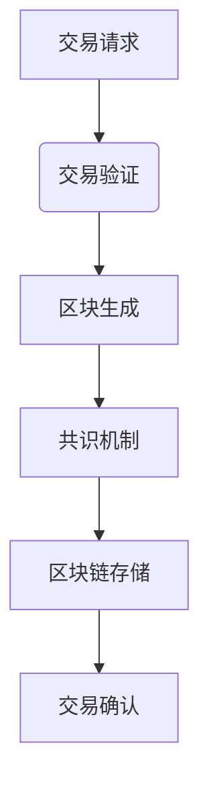
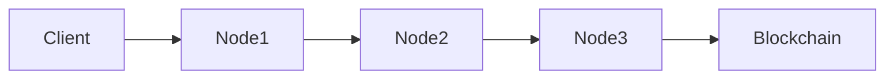

                 


# 巴菲特-芒格对加密货币的看法：保持谨慎态度

## 关键词：巴菲特，芒格，加密货币，投资理念，谨慎态度，区块链，价值投资

## 摘要：巴菲特和芒格作为世界著名投资者，对加密货币持有谨慎态度。本文从加密货币的基本概念、技术原理、投资策略等方面，分析巴菲特和芒格对加密货币的看法，并结合实际案例，探讨加密货币的未来发展趋势。

---

# 引言

加密货币近年来引发了广泛讨论，尤其是比特币、以太坊等数字资产的兴起。然而，著名投资者巴菲特和查理·芒格对加密货币的态度却截然不同。他们认为加密货币存在泡沫和风险，主张价值投资，而非盲目跟风。本文将从多个角度分析巴菲特和芒格对加密货币的看法，并探讨加密货币的技术、投资和未来发展。

---

## 第一部分：背景介绍

### 第1章：加密货币的基本概念

#### 1.1 加密货币的定义与特点
加密货币是一种基于密码学的虚拟货币，具有去中心化、匿名性和不可篡改的特点。它通过区块链技术实现交易的安全性和透明性。加密货币与传统货币的主要区别在于其去中心化特性。

#### 1.2 巴菲特与芒格的背景介绍
沃伦·巴菲特是全球著名投资者，以其价值投资理念闻名。他强调投资于具有长期稳定收益的公司，而非短期波动的资产。查理·芒格是巴菲特的长期合作伙伴，以其智慧和理性著称，两人共同创立了伯克希尔哈撒韦公司。

#### 1.3 巴菲特-芒格对加密货币的态度
巴菲特和芒格对加密货币持谨慎态度，认为其缺乏实际价值，更多是一种投机性资产。他们认为加密货币没有内在价值，且容易被操纵，因此不建议大规模投资。

---

### 第2章：加密货币的核心原理

#### 2.1 加密货币的技术基础
加密货币的核心技术是区块链，它通过分布式账本记录交易，确保数据不可篡改。区块链的共识机制（如比特币的POW和以太坊的POS）保证了网络的安全性和去中心化。

#### 2.2 巴菲特-芒格的价值投资理念
巴菲特和芒格的价值投资理念强调长期稳定收益，注重企业的基本面和内在价值。他们认为投资应基于企业的实际价值，而非市场的短期波动。

#### 2.3 加密货币与传统金融体系的对比
加密货币试图颠覆传统金融体系，但其波动性和监管不确定性使其难以被广泛接受。巴菲特和芒格认为，传统金融体系的稳定性是其长期存在的关键。

---

## 第二部分：算法原理讲解

### 第3章：加密货币的共识机制

#### 3.1 共识机制的定义与分类
共识机制是区块链的核心技术，用于确保网络中的交易达成一致。常见的共识机制包括工作量证明（POW）、权益证明（POS）、 delegated proof of stake（DPoS）等。

#### 3.2 巴菲特-芒格对共识机制的看法
巴菲特和芒格认为，加密货币的去中心化机制虽然创新，但缺乏监管和稳定性保障。他们更倾向于中心化的金融体系，认为去中心化机制可能带来市场波动和不稳定性。

#### 3.3 加密货币共识机制的数学模型
共识机制的核心是通过数学算法确保交易的合法性。例如，比特币的POW机制通过复杂的哈希计算确保矿工的权益。以下是比特币哈希函数的示例：

$$
\text{比特币哈希函数} = \text{SHA-256}(\text{区块头} + \text{随机数} + \text{非cesame数})
$$

---

## 第三部分：系统分析与架构设计

### 第4章：加密货币的系统架构

#### 4.1 系统功能设计
加密货币系统包括交易验证、区块生成、节点通信等功能。以下是加密货币系统的功能模块图：



#### 4.2 系统架构设计
加密货币的系统架构通常采用分布式架构，节点之间通过P2P网络通信。以下是加密货币系统的架构图：



---

## 第四部分：项目实战

### 第5章：加密货币的实现与分析

#### 5.1 环境安装
要实现一个简单的加密货币系统，需要安装Python和区块链开发库。以下是Python环境安装示例：

```bash
pip install bitcoinlib
```

#### 5.2 核心代码实现
以下是基于Python的简单加密货币实现代码：

```python
import hashlib

def compute_hash(input_string):
    return hashlib.sha256(input_string.encode()).hexdigest()

# 示例交易
transaction = "Alice -> Bob: 1 BTC"
hash_value = compute_hash(transaction)
print(f"Transaction hash: {hash_value}")
```

#### 5.3 案例分析
通过实际案例分析加密货币的交易流程和系统运行。例如，比特币的交易确认流程涉及多个节点的验证和共识机制的执行。

---

## 结论

### 第6章：结论与展望

#### 6.1 巴菲特-芒格观点总结
巴菲特和芒格认为加密货币存在过度炒作和风险，强调投资应基于长期价值而非短期波动。

#### 6.2 对加密货币的展望
尽管加密货币面临监管和市场波动的挑战，但其技术创新和去中心化理念可能在未来金融体系中发挥重要作用。

#### 6.3 投资建议
投资者应理性看待加密货币，避免盲目跟风。长期来看，价值投资仍然是最可靠的投资策略。

---

## 附录

### 附录A：术语表
- 加密货币：基于区块链技术的虚拟货币。
- 区块链：分布式账本技术。
- 共识机制：确保区块链交易一致性的机制。

### 附录B：监管动态
- 加密货币的监管政策正在逐步完善，投资者需关注相关法规变化。

### 附录C：进一步阅读
- 《区块链技术与应用》
- 《巴菲特投资哲学》

---

## 作者：AI天才研究院/AI Genius Institute & 禅与计算机程序设计艺术/Zen And The Art of Computer Programming

---

以上是《巴菲特-芒格对加密货币的看法：保持谨慎态度》的完整目录大纲和文章内容。

