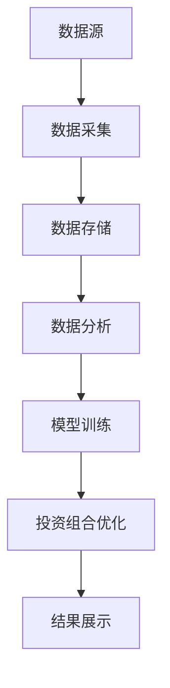

                 


# 巴菲特-芒格的ESG投资策略：平衡社会责任和财务回报

---

## 关键词：
巴菲特, 芒格, ESG投资, 环境, 社会责任, 公司治理, 投资策略, 可持续发展

---

## 摘要：
本文深入探讨了巴菲特和芒格的ESG投资策略，分析了如何在追求财务回报的同时，平衡社会责任。文章从ESG投资的背景、核心概念、算法原理、系统架构到项目实战，全面解析了ESG投资策略的理论与实践。通过具体案例分析和数学模型构建，展示了如何将ESG因素融入投资决策，实现长期价值最大化。文章最后总结了最佳实践和未来展望，为投资者提供了宝贵的参考。

---

# 第一部分: 巴菲特-芒格的ESG投资策略概述

## 第1章: ESG投资策略的背景与定义

### 1.1 ESG投资的核心概念

#### 1.1.1 环境（Environmental）的定义与内涵
环境因素关注企业在环境保护方面的表现，包括资源消耗、碳排放、污染治理等方面。巴菲特曾表示，企业对环境的管理能力是衡量其长期价值的重要标准。

#### 1.1.2 社会责任（Social）的定义与内涵
社会责任强调企业在社会中的角色，包括员工权益、社区贡献、公平就业等方面。芒格认为，企业的社会责任感是其声誉和长期发展的基石。

#### 1.1.3 公司治理（Governance）的定义与内涵
公司治理涉及董事会结构、高管薪酬、股东权益等方面。巴菲特和芒格都强调了良好的公司治理对投资决策的重要性。

---

### 1.2 巴菲特与芒格的投资理念

#### 1.2.1 巴菲特的价值投资理论
巴菲特的价值投资理论强调长期持有优质资产，关注企业的内在价值。他认为，企业应具备稳定的盈利能力、强大的竞争优势和良好的管理团队。

#### 1.2.2 芒格的多元思维模型
芒格的多元思维模型强调跨学科思考，将物理学、心理学、经济学等学科的原理应用于投资决策。他主张从多个角度分析企业的价值。

#### 1.2.3 巴菲特与芒格投资理念的共同点
两人均强调长期投资、价值发现和风险管理。ESG投资策略将这些理念与社会责任相结合，形成了独特的投资方法。

---

### 1.3 ESG投资策略的起源与发展

#### 1.3.1 ESG投资的起源
ESG投资起源于20世纪60年代的社会责任投资运动，随着全球环境问题和社会问题的加剧，ESG投资逐渐受到更多关注。

#### 1.3.2 ESG投资的发展历程
从早期的宗教机构投资到现代的机构投资者广泛应用，ESG投资经历了从 niche 投资策略到主流策略的转变。

#### 1.3.3 ESG投资与传统投资策略的对比
与传统投资策略相比，ESG投资更注重企业的长期可持续发展，而非短期财务表现。

---

## 第2章: ESG投资策略的核心要素

### 2.1 环境因素在投资中的作用

#### 2.1.1 环境因素对企业价值的影响
环境因素直接影响企业的运营成本和风险。例如，高碳排放企业可能面临更高的监管风险和市场风险。

#### 2.1.2 环境风险的量化与评估
通过环境影响评估模型，投资者可以量化环境风险对企业价值的影响。例如，可以使用碳足迹模型来评估企业的环境表现。

#### 2.1.3 巴菲特对环境因素的关注
巴菲特曾投资于环保企业，如特斯拉，体现了他对环境因素的重视。

---

### 2.2 社会责任在投资中的作用

#### 2.2.1 社会责任对企业声誉的影响
良好的社会责任表现可以提升企业的品牌形象和市场声誉，吸引更多消费者和投资者。

#### 2.2.2 社会责任与企业长期价值的关系
社会责任是企业可持续发展的基础，直接影响企业的长期盈利能力。

#### 2.2.3 芒格对社会责任的重视
芒格认为，企业的社会责任感是其长期价值的重要组成部分。

---

### 2.3 公司治理在投资中的作用

#### 2.3.1 公司治理对企业管理的影响
良好的公司治理可以提高企业的管理效率和决策质量，降低企业风险。

#### 2.3.2 公司治理与企业财务表现的关系
公司治理是影响企业财务表现的重要因素，良好的治理结构可以提升企业的财务透明度和投资者信心。

#### 2.3.3 巴菲特对公司治理的关注
巴菲特曾多次强调，公司治理是投资决策的重要因素，他倾向于投资治理结构良好的企业。

---

# 第三部分: ESG投资策略的数学模型与算法

## 第3章: ESG评分模型的构建

### 3.1 ESG评分模型的原理

#### 3.1.1 ESG评分的定义与计算方法
ESG评分是基于环境、社会和治理三个维度对企业进行综合评估的指标。评分通常采用标准化方法，将各维度的评分加权求和，得到最终评分。

#### 3.1.2 ESG评分的影响因素
影响ESG评分的主要因素包括企业的环境表现、社会责任履行情况和公司治理结构。

#### 3.1.3 巴菲特对ESG评分的关注
巴菲特认为，ESG评分可以作为投资决策的重要参考，但不应作为唯一的决策依据。

---

### 3.2 ESG评分模型的数学公式

#### 3.2.1 环境维度的评分公式
$$ E = \frac{1}{n} \sum_{i=1}^{n} e_i $$
其中，$e_i$ 表示企业在环境方面的表现指标，$n$ 表示环境维度的指标数量。

#### 3.2.2 社会维度的评分公式
$$ S = \frac{1}{m} \sum_{j=1}^{m} s_j $$
其中，$s_j$ 表示企业在社会方面的表现指标，$m$ 表示社会维度的指标数量。

#### 3.2.3 治理维度的评分公式
$$ G = \frac{1}{k} \sum_{l=1}^{k} g_l $$
其中，$g_l$ 表示企业在治理方面的表现指标，$k$ 表示治理维度的指标数量。

#### 3.2.4 综合评分公式
$$ ESG = \alpha E + \beta S + \gamma G $$
其中，$\alpha, \beta, \gamma$ 表示各维度的权重系数。

---

## 第4章: ESG投资策略的算法实现

### 4.1 ESG投资策略的算法原理

#### 4.1.1 数据预处理
数据预处理包括清洗、标准化和特征选择。例如，可以使用Z-score标准化方法对数据进行标准化处理。

#### 4.1.2 模型训练
模型训练可以采用机器学习方法，如支持向量机（SVM）或随机森林（Random Forest）进行分类或回归分析。

#### 4.1.3 投资组合优化
投资组合优化可以通过数学规划方法，如线性规划或二次规划，最大化投资回报率，同时最小化风险。

---

### 4.2 ESG投资策略的代码实现

#### 4.2.1 数据加载与预处理
```python
import pandas as pd
import numpy as np

# 加载数据
data = pd.read_csv('esg_data.csv')

# 数据清洗
data = data.dropna()
data = data.drop_duplicates()

# 特征选择
features = ['E', 'S', 'G']
target = 'return'

X = data[features]
y = data[target]
```

#### 4.2.2 模型训练
```python
from sklearn.ensemble import RandomForestRegressor
from sklearn.metrics import mean_squared_error

# 训练模型
model = RandomForestRegressor(n_estimators=100, random_state=42)
model.fit(X, y)

# 预测结果
y_pred = model.predict(X)
print('均方误差:', mean_squared_error(y, y_pred))
```

#### 4.2.3 投资组合优化
```python
import numpy as np

# 定义目标函数
def objective(x):
    return -x[0] * x[1] + x[2]

# 定义约束条件
def constraint(x):
    return x[0] + x[1] - 1 <= 0

# 使用优化算法
from scipy.optimize import minimize

# 初始猜测值
x0 = [0.5, 0.5, 0]

# 求解优化问题
result = minimize(objective, x0, constraints={'type': 'ineq', 'fun': constraint})

# 输出结果
print('最优解:', result.x)
```

---

## 第5章: ESG投资策略的系统架构设计

### 5.1 系统功能设计

#### 5.1.1 系统功能模块
系统功能模块包括数据采集、数据分析、模型训练、投资组合优化和结果展示。

#### 5.1.2 系统功能流程
1. 数据采集：从数据源获取企业的ESG相关数据。
2. 数据分析：对数据进行清洗和特征选择。
3. 模型训练：使用机器学习算法训练ESG评分模型。
4. 投资组合优化：基于模型结果优化投资组合。
5. 结果展示：可视化展示投资结果和分析报告。

---

### 5.2 系统架构设计

#### 5.2.1 系统架构图


#### 5.2.2 系统接口设计
系统接口包括数据接口、模型接口和用户界面接口。数据接口用于与外部数据源交互，模型接口用于与机器学习模型交互，用户界面接口用于与用户交互。

---

## 第6章: ESG投资策略的项目实战

### 6.1 项目背景

#### 6.1.1 项目目标
本项目旨在构建一个基于ESG投资策略的投资管理系统，实现对企业ESG评分的计算和投资组合的优化。

#### 6.1.2 项目需求
项目需求包括数据采集、模型训练、投资组合优化和结果展示。

---

### 6.2 项目实施

#### 6.2.1 数据采集与预处理
```python
import pandas as pd

# 数据采集
data = pd.read_csv('esg_data.csv')

# 数据清洗
data.dropna(inplace=True)
data.drop_duplicates(inplace=True)
```

#### 6.2.2 模型训练与评估
```python
from sklearn.ensemble import RandomForestRegressor
from sklearn.metrics import mean_squared_error

# 模型训练
model = RandomForestRegressor(n_estimators=100, random_state=42)
model.fit(X, y)

# 模型评估
y_pred = model.predict(X)
print('均方误差:', mean_squared_error(y, y_pred))
```

#### 6.2.3 投资组合优化与结果展示
```python
import numpy as np

# 投资组合优化
def objective(x):
    return -x[0] * x[1] + x[2]

def constraint(x):
    return x[0] + x[1] - 1 <= 0

x0 = [0.5, 0.5, 0]
result = minimize(objective, x0, constraints={'type': 'ineq', 'fun': constraint})

print('最优解:', result.x)
```

---

## 第7章: 最佳实践与未来展望

### 7.1 最佳实践

#### 7.1.1 数据质量的重要性
数据质量是ESG投资策略成功的关键，建议投资者重视数据的准确性和完整性。

#### 7.1.2 模型优化的建议
建议投资者根据实际需求不断优化模型，例如引入更多的特征或改进算法。

#### 7.1.3 风险管理的重要性
投资者应注重风险管理，合理配置资产，降低投资风险。

---

### 7.2 未来展望

#### 7.2.1 ESG投资的未来发展
随着全球可持续发展的重要性增加，ESG投资将成为更多投资者的首选策略。

#### 7.2.2 技术进步对ESG投资的影响
人工智能和大数据技术的进步将为ESG投资提供更多的可能性，例如实时监控和动态调整投资组合。

---

## 小结

本文全面分析了巴菲特和芒格的ESG投资策略，从理论到实践，详细探讨了ESG投资的核心概念、算法实现和系统架构设计。通过具体案例分析和数学模型构建，展示了如何将ESG因素融入投资决策，实现长期价值最大化。未来，随着技术的进步和社会责任意识的增强，ESG投资将发挥更重要的作用。

---

## 作者：AI天才研究院/AI Genius Institute & 禅与计算机程序设计艺术 /Zen And The Art of Computer Programming

