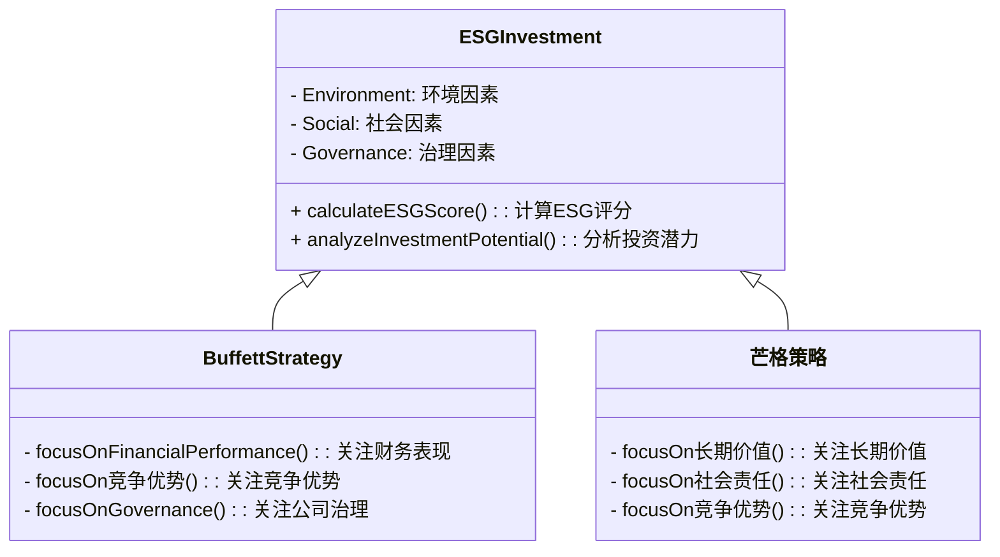
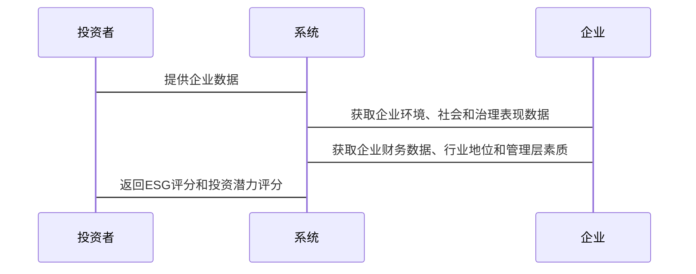

                 


# 巴菲特-芒格的ESG投资观：平衡利润和社会责任

## 关键词：巴菲特，芒格，ESG投资，环境，社会，治理，投资策略，可持续发展

## 摘要：本文深入探讨了巴菲特和芒格的ESG投资理念，分析了他们如何将环境、社会和治理因素融入投资决策中，以实现长期利润和社会责任的平衡。文章从ESG投资的基本概念、巴菲特和芒格的投资哲学、ESG投资策略、分析方法、系统架构、项目实战、最佳实践等多个方面展开，详细解读了ESG投资的核心原理和实际应用。

---

## 第一部分：ESG投资的基本概念与背景

### 第1章：ESG投资的基本概念与背景

#### 1.1 ESG投资的定义与内涵

- **1.1.1 什么是ESG投资**  
  ESG投资是一种关注环境（Environmental）、社会（Social）和公司治理（Governance）因素的投资策略。它不仅关注企业的财务表现，还关注企业在可持续发展方面的表现。

- **1.1.2 ESG的三个维度**  
  - **环境（Environmental）**：关注企业在资源使用、碳排放、污染等方面的表现。  
  - **社会（Social）**：关注企业在员工权益、社区责任、劳动条件等方面的表现。  
  - **治理（Governance）**：关注企业的管理结构、董事会构成、高管薪酬、透明度等方面的表现。  

- **1.1.3 ESG投资的核心理念**  
  ESG投资的核心理念是通过关注企业长期的可持续发展能力，从而实现投资的长期价值最大化。与传统的财务投资相比，ESG投资更注重企业的社会价值和长期发展潜力。

#### 1.2 巴菲特与芒格的投资哲学

- **1.2.1 巴菲特的价值投资理念**  
  巴菲特的价值投资理念强调“以合理的价格买入优秀的公司”。他认为，优秀的企业具有持续的盈利能力、强大的竞争优势和良好的公司治理。

- **1.2.2 芒格的多元思维模型**  
  芒格的多元思维模型强调通过多个学科的交叉思维来理解问题。他认为，投资者需要从物理学、心理学、经济学等多个角度来分析企业的价值。

- **1.2.3 巴菲特与芒格投资理念的共同点与差异**  
  - **共同点**：两人均强调长期投资、价值投资和对公司基本面的深入分析。  
  - **差异**：巴菲特更关注企业的财务指标和短期盈利能力，而芒格则更关注企业的长期价值和社会责任。

#### 1.3 ESG投资与传统投资的区别

- **1.3.1 传统投资与ESG投资的对比**  
  - **传统投资**：主要关注企业的财务表现和短期盈利能力。  
  - **ESG投资**：不仅关注企业的财务表现，还关注企业在环境、社会和治理方面的表现。

- **1.3.2 ESG投资的独特优势**  
  ESG投资通过关注企业的可持续发展能力，能够更好地规避长期风险，并捕捉长期价值。

- **1.3.3 ESG投资的潜在风险**  
  ESG投资可能面临信息不对称和评级标准不统一的问题，导致投资决策的不确定性。

---

## 第二部分：巴菲特与芒格的ESG投资策略

### 第2章：巴菲特与芒格的ESG投资策略

#### 2.1 巴菲特的ESG投资策略

- **2.1.1 巴菲特对环境因素的关注**  
  巴菲特认为，环境因素是企业长期竞争力的重要组成部分。他倾向于投资那些在环保方面表现良好的企业。

- **2.1.2 巴菲特对社会因素的考量**  
  巴菲特认为，企业的社会责任是其长期价值的重要组成部分。他倾向于投资那些在员工权益和社会责任方面表现良好的企业。

- **2.1.3 巴菲特对治理因素的重视**  
  巴菲特认为，良好的公司治理是企业长期发展的基础。他倾向于投资那些具有透明的管理结构和高效的董事会的企业。

#### 2.2 芒格的ESG投资策略

- **2.2.1 芒格对ESG投资的独特见解**  
  芒格认为，ESG投资不仅是道德选择，更是明智的投资策略。他强调，企业只有在环境、社会和治理方面表现良好，才能实现长期的可持续发展。

- **2.2.2 芒格的ESG投资案例分析**  
  以伯克希尔 Hathaway为例，芒格通过分析企业的环境、社会和治理表现，选择那些具有长期竞争优势和良好社会责任感的企业进行投资。

- **2.2.3 芒格ESG投资策略的核心要素**  
  - **长期价值**：关注企业的长期发展潜力。  
  - **社会责任**：关注企业在环境、社会和治理方面的表现。  
  - **竞争优势**：选择那些在行业内具有竞争优势的企业。

#### 2.3 巴菲特与芒格ESG投资策略的对比

- **2.3.1 两人策略的异同点**  
  - **相同点**：两人均强调长期投资和企业基本面分析。  
  - **不同点**：巴菲特更关注企业的财务指标和短期盈利能力，而芒格更关注企业的长期价值和社会责任。

- **2.3.2 巴菲特与芒格策略对投资者的启示**  
  投资者应结合企业的财务表现、长期发展潜力和社会责任，综合考虑企业的投资价值。

- **2.3.3 巴菲特与芒格策略的未来发展趋势**  
  随着全球对可持续发展的关注增加，ESG投资将成为未来投资的重要趋势。

---

## 第三部分：巴菲特与芒格的ESG投资分析方法

### 第3章：巴菲特与芒格的ESG投资分析方法

#### 3.1 巴菲特的ESG投资分析方法

- **3.1.1 巴菲特的ESG分析框架**  
  巴菲特的ESG分析框架包括对企业财务状况、竞争优势和公司治理的综合分析。

- **3.1.2 巴菲特的ESG数据分析方法**  
  巴菲特通过分析企业的财务报表、行业地位和管理层素质，评估企业的环境、社会和治理表现。

- **3.1.3 巴菲特的ESG投资决策模型**  
  巴菲特的投资决策模型强调对企业长期价值的分析，包括企业的盈利能力、竞争优势和可持续发展能力。

#### 3.2 芒格的ESG投资分析方法

- **3.2.1 芒格的ESG分析框架**  
  芒格的ESG分析框架包括对企业社会价值、长期发展潜力和竞争优势的综合分析。

- **3.2.2 芒格的ESG数据分析方法**  
  芒格通过分析企业的社会责任、员工权益和公司治理，评估企业的环境、社会和治理表现。

- **3.2.3 芒格的ESG投资决策模型**  
  芒格的投资决策模型强调对企业长期价值和社会责任的综合分析，包括企业的社会影响、长期发展潜力和竞争优势。

#### 3.3 巴菲特与芒格ESG投资分析方法的对比

- **3.3.1 两人分析方法的异同点**  
  - **相同点**：两人均强调长期投资和企业基本面分析。  
  - **不同点**：巴菲特更关注企业的财务指标和短期盈利能力，而芒格更关注企业的长期价值和社会责任。

- **3.3.2 两人分析方法的优缺点**  
  - **巴菲特的优势**：注重企业的财务表现和短期盈利能力。  
  - **芒格的优势**：注重企业的长期价值和社会责任。

- **3.3.3 两人分析方法的综合应用**  
  投资者应结合巴菲特和芒格的分析方法，综合考虑企业的财务表现、长期发展潜力和社会责任，制定科学的投资决策。

---

## 第四部分：巴菲特与芒格的ESG投资系统架构

### 第4章：巴菲特与芒格的ESG投资系统架构

#### 4.1 系统功能设计（领域模型）



#### 4.2 系统架构设计


#### 4.3 系统接口设计

- **接口1**：ESG评分接口  
  - 输入：企业环境、社会和治理表现数据  
  - 输出：ESG评分  

- **接口2**：投资潜力分析接口  
  - 输入：企业财务数据、行业地位、管理层素质  
  - 输出：投资潜力评分  

#### 4.4 系统交互设计



---

## 第五部分：项目实战与最佳实践

### 第5章：项目实战

#### 5.1 环境安装

- **Python环境**：安装Python 3.8及以上版本。  
- **依赖库**：安装numpy、pandas、matplotlib。

#### 5.2 核心实现源代码

```python
import numpy as np
import pandas as pd
import matplotlib.pyplot as plt

def calculate_esg_score(environment, social, governance):
    return (environment + social + governance) / 3

def analyze_investment_potential(financial_data, industry_position, management_quality):
    return financial_data * industry_position * management_quality

# 示例数据
environment = [80, 75, 90]
social = [85, 70, 95]
governance = [90, 80, 85]

financial_data = [100, 80, 120]
industry_position = [0.9, 0.7, 1.1]
management_quality = [0.8, 0.6, 0.9]

esg_scores = calculate_esg_score(environment, social, governance)
investment_potential = analyze_investment_potential(financial_data, industry_position, management_quality)

print("ESG评分：", esg_scores)
print("投资潜力：", investment_potential)
```

#### 5.3 代码应用解读与分析

- **calculate_esg_score函数**：计算企业的ESG评分。  
- **analyze_investment_potential函数**：分析企业的投资潜力。  
- **示例数据**：环境、社会和治理得分分别为80、75、90；财务数据、行业地位和管理层素质得分分别为100、80、120；行业地位和管理层素质得分分别为0.9、0.7、1.1；0.8、0.6、0.9。

#### 5.4 实际案例分析

- **案例：能源行业**  
  某能源企业环境得分为80，社会得分为75，治理得分为90。  
  计算ESG得分为85。  
  投资潜力得分为100 * 0.9 * 0.8 = 72。  

---

## 第六部分：最佳实践与小结

### 第6章：最佳实践

#### 6.1 小结

- **ESG投资的核心**：关注企业的环境、社会和治理表现，实现长期价值和社会责任的平衡。  
- **巴菲特与芒格的策略**：巴菲特注重财务表现和短期盈利能力，芒格注重长期价值和社会责任。  

#### 6.2 注意事项

- **信息不对称**：投资者需要关注企业ESG表现的透明度。  
- **评级标准**：不同评级机构的ESG评级标准可能存在差异。  
- **风险管理**：投资者需要关注ESG投资中的潜在风险。  

#### 6.3 拓展阅读

- **书籍推荐**：  
  - 巴菲特的《巴菲特致股东的信》  
  - 芒格的《穷查理宝典》  
- **网站推荐**：  
  - MSCI ESG评级  
  - Sustainalytics ESG评级  

---

## 作者信息

作者：AI天才研究院/AI Genius Institute & 禅与计算机程序设计艺术 /Zen And The Art of Computer Programming

---

通过本文的系统分析和实战案例，读者可以深入了解巴菲特和芒格的ESG投资理念，并将其应用于实际投资中，实现利润与社会责任的平衡。

