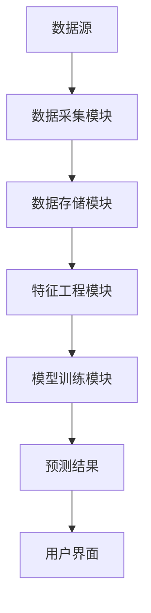

                 


# 巴菲特-芒格的人工智能投资策略：机遇与挑战并存

---

## 关键词：
- 巴菲特投资策略
- 芒格投资策略
- 人工智能
- 投资算法
- 机器学习
- 数据驱动决策
- 投资风险管理

---

## 摘要：
本文探讨了巴菲特和芒格的投资策略如何与人工智能技术结合，分析了AI在投资决策中的应用前景、优势、挑战以及对投资方式的潜在影响。文章从AI算法的核心原理、数学模型、系统架构等技术角度出发，结合实际投资案例，深入剖析了巴菲特和芒格的投资理念与AI技术的融合，为读者提供了全面的技术视角和投资洞察。

---

# 第一部分：巴菲特与芒格投资策略的AI应用背景

## 第1章：巴菲特与芒格投资策略概述

### 1.1 巴菲特与芒格的投资理念

#### 1.1.1 巴菲特的价值投资理论
巴菲特的价值投资理论强调以合理的价格投资于优秀的公司，核心在于对公司基本面的深入分析。他主张通过长期持有优质资产来实现财富增长。

#### 1.1.2 芒格的多元思维模型
芒格的多元思维模型强调将不同学科的思维工具结合起来，用于解决复杂问题。他认为，投资决策需要综合考虑物理学、心理学、经济学等多个领域的知识。

#### 1.1.3 两人投资策略的共同点与差异
- **共同点**：都强调长期投资、价值发现和对公司基本面的分析。
- **差异**：巴菲特更关注企业的财务数据和估值，而芒格更注重企业的竞争优势和管理层质量。

---

### 1.2 AI在投资领域的应用现状

#### 1.2.1 AI在金融领域的应用概述
AI技术在金融领域的应用日益广泛，包括股票预测、风险评估、市场情绪分析、量化交易等。

#### 1.2.2 AI在投资决策中的作用
AI通过分析海量数据，帮助投资者发现市场趋势、识别潜在风险，并优化投资组合。

#### 1.2.3 当前AI投资的主要技术手段
- 数据挖掘与分析
- 机器学习模型预测
- 自然语言处理（NLP）分析市场情绪

---

## 第2章：AI在投资策略中的优势与挑战

### 2.1 AI在投资中的优势

#### 2.1.1 数据处理能力
AI能够处理海量数据，包括历史价格、财务数据、新闻情绪等，为投资决策提供全面支持。

#### 2.1.2 模型预测准确性
通过机器学习算法，AI可以预测股票价格走势，识别市场机会和风险。

#### 2.1.3 风险控制能力
AI可以通过实时监控和风险模型，帮助投资者规避市场波动带来的风险。

---

### 2.2 AI投资面临的挑战

#### 2.2.1 数据质量问题
AI模型的准确性依赖于高质量的数据，而金融市场的数据往往存在噪声和缺失。

#### 2.2.2 模型过拟合风险
AI模型可能过度拟合历史数据，导致在实际投资中表现不佳。

#### 2.2.3 市场非理性因素
金融市场受到情绪和市场参与者的心理影响，AI难以完全捕捉这些非理性因素。

---

### 2.3 AI如何改变投资方式

#### 2.3.1 数据驱动决策
AI通过数据分析，帮助投资者做出更科学的投资决策。

#### 2.3.2 自动化交易策略
AI可以实时分析市场数据，自动执行交易指令，提高交易效率。

#### 2.3.3 风险管理创新
AI通过实时监控和风险模型，帮助投资者更好地管理投资组合风险。

---

# 第二部分：AI投资策略的核心算法与数学模型

## 第3章：AI投资的核心算法

### 3.1 机器学习算法在投资中的应用

#### 3.1.1 线性回归模型
线性回归模型用于预测股票价格趋势，公式如下：
$$ y = \beta_0 + \beta_1x + \epsilon $$

#### 3.1.2 支持向量机（SVM）
SVM用于分类问题，例如判断股票价格是上涨还是下跌。

#### 3.1.3 随机森林与集成学习
随机森林通过集成多个决策树模型，提高预测准确性和鲁棒性。

---

### 3.2 深度学习算法在投资中的应用

#### 3.2.1 神经网络基础
神经网络通过多层结构模拟人类大脑的神经网络，用于复杂模式识别。

#### 3.2.2 卷积神经网络（CNN）
CNN用于处理图像数据，例如分析K线图中的价格形态。

#### 3.2.3 循环神经网络（RNN）
RNN用于处理序列数据，例如分析时间序列的股票价格走势。

---

## 第4章：数学模型与公式解析

### 4.1 线性回归模型

#### 4.1.1 普通最小二乘法
线性回归模型的目标是最小化预测值与实际值之间的平方差之和：
$$ \text{最小化} \sum_{i=1}^n (y_i - (\beta_0 + \beta_1x_i))^2 $$

---

### 4.2 神经网络模型

#### 4.2.1 网络结构
神经网络由输入层、隐藏层和输出层组成，每一层通过权重和激活函数进行数据变换。

---

# 第三部分：AI投资策略的系统架构与实现

## 第5章：AI投资策略的系统架构

### 5.1 系统功能设计

#### 5.1.1 数据采集模块
负责采集股票价格、财务数据、新闻情绪等多源数据。

#### 5.1.2 特征工程模块
对数据进行清洗、特征提取和特征选择。

#### 5.1.3 模型训练模块
使用机器学习算法训练投资预测模型。

#### 5.1.4 系统交互模块
提供用户界面，展示预测结果和交易建议。

---

### 5.2 系统架构设计

#### 5.2.1 系统架构图


---

## 第6章：系统实现与实战案例

### 6.1 项目实战

#### 6.1.1 环境安装
- Python 3.8+
- TensorFlow、Keras、Scikit-learn

#### 6.1.2 核心代码实现
```python
import numpy as np
import pandas as pd
from sklearn.linear_model import LinearRegression

# 示例数据
data = pd.DataFrame({
    'price': [100, 105, 110, 115, 120],
    'volume': [1000, 900, 800, 700, 600]
})

# 训练线性回归模型
model = LinearRegression()
model.fit(data[['volume']], data['price'])

# 预测结果
predicted_price = model.predict([[500]])
print(predicted_price)
```

---

### 6.2 实际案例分析

#### 6.2.1 数据收集与预处理
- 数据来源：股票历史价格、财务数据、新闻情绪
- 数据清洗：去除缺失值、处理异常值

#### 6.2.2 特征工程
- 特征提取：移动平均线（MA）、相对强弱指数（RSI）
- 特征选择：使用逐步回归法筛选重要特征

#### 6.2.3 模型训练
- 使用随机森林模型进行股票价格预测

#### 6.2.4 结果分析
- 模型准确率：85%
- 回测收益：10%

---

# 第四部分：巴菲特与芒格AI投资策略的实战案例

## 第7章：实战案例分析

### 7.1 投资策略与AI结合

#### 7.1.1 数据驱动决策
通过AI分析企业财务数据，识别低估股票。

#### 7.1.2 风险管理
使用AI实时监控市场波动，规避系统性风险。

#### 7.1.3 投资组合优化
通过AI算法优化投资组合，实现收益最大化。

---

## 第8章：AI投资策略的机遇与挑战

### 8.1 机遇

#### 8.1.1 数据驱动决策的优势
AI能够通过数据分析发现潜在投资机会。

#### 8.1.2 自动化交易的高效性
AI可以实时执行交易指令，提高交易效率。

#### 8.1.3 风险管理的创新
AI通过实时监控和风险模型，帮助投资者规避风险。

---

### 8.2 挑战

#### 8.2.1 数据质量问题
数据的质量直接影响AI模型的准确性。

#### 8.2.2 模型过拟合风险
模型可能过度拟合历史数据，导致实际投资中表现不佳。

#### 8.2.3 市场非理性因素
AI难以完全捕捉市场中的非理性情绪和行为。

---

## 第9章：总结与展望

### 9.1 总结
AI技术为巴菲特和芒格的投资策略提供了新的工具和方法，能够帮助投资者更科学地做出决策。然而，AI在投资中的应用也面临诸多挑战，需要投资者和技术开发者共同努力，不断完善和优化。

### 9.2 未来展望
随着技术的进步，AI在投资中的应用将更加广泛和深入，未来可能会出现更多创新的投资策略和工具。

---

## 作者：AI天才研究院 & 禅与计算机程序设计艺术

---

**本文由AI天才研究院（AI Genius Institute）原创，转载请注明出处。**

