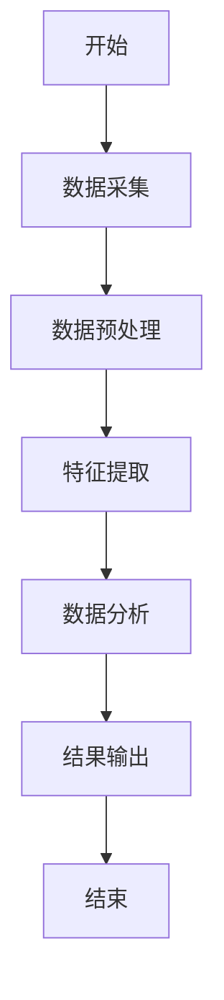

                 


# 巴菲特-芒格的仿生量子传感器投资：下一代物联网的核心

## 关键词：巴菲特、芒格、仿生量子传感器、物联网、投资策略、系统架构

## 摘要：本文探讨巴菲特和芒格的投资理念与仿生量子传感器在物联网中的应用，分析其结合如何成为下一代投资的核心。通过背景介绍、核心概念、算法原理、系统架构和项目实战，揭示其在投资决策中的潜力和应用。

---

## 第1章：巴菲特与芒格投资理念概述

### 1.1 巴菲特的价值投资理论

#### 1.1.1 巴菲特的价值投资理论
巴菲特的价值投资理论强调长期投资、安全边际和内在价值。他主张投资于具有强大护城河和良好管理的公司，关注企业的长期盈利能力，而非短期市场波动。

#### 1.1.2 芒格的多元思维模型
芒格提倡多元思维模型，认为投资者应该构建多个学科的知识框架，以避免认知偏差和单一视角的局限性。他强调通过跨学科思考来做出更明智的决策。

#### 1.1.3 两人投资理念的结合
巴菲特和芒格的投资理念结合了长期价值和多元思维，注重基本面分析和风险控制。他们通过深入研究和多元视角，寻找具有长期竞争优势的公司进行投资。

---

## 第2章：物联网与量子传感器的背景

### 2.1 物联网的基本概念

#### 2.1.1 物联网的定义与特点
物联网（IoT）是指通过各种信息传感设备，如传感器、射频识别（RFID）、全球定位系统（GPS）、红外感应器等，按约定的协议，把任何物品与互联网连接起来，进行信息交换和通信，以实现智能化识别、定位、跟踪、监控和管理。

#### 2.1.2 物联网的发展历程
物联网的概念最早可以追溯到20世纪90年代，随着技术的发展，物联网逐渐从概念走向实际应用，涵盖了智能家居、智慧城市、工业物联网等多个领域。

#### 2.1.3 物联网的核心技术
物联网的核心技术包括传感器技术、通信技术、数据存储与处理技术以及应用服务技术。其中，传感器技术是物联网数据采集的基础。

### 2.2 量子传感器的原理与应用

#### 2.2.1 量子传感器的基本原理
量子传感器利用量子效应来感知环境变化，具有高灵敏度和高精度的特点。它们基于量子力学的基本原理，通过测量量子系统的状态变化来感知外部环境。

#### 2.2.2 量子传感器在物联网中的应用
量子传感器在物联网中的应用包括高精度测量、环境监测、医疗设备、自动驾驶等领域。它们能够提供更精确的数据，提升物联网系统的性能和可靠性。

#### 2.2.3 量子传感器的优势与挑战
量子传感器的优势在于高灵敏度和高精度，能够检测传统传感器无法察觉的微小变化。然而，其高成本和复杂性也是当前应用的主要挑战。

---

## 第3章：仿生量子传感器的核心原理

### 3.1 仿生量子传感器的定义

#### 3.1.1 仿生学的基本概念
仿生学是模仿生物系统和自然现象的科学，旨在通过模拟生物功能和结构，设计出更高效的技术和系统。

#### 3.1.2 量子传感器的仿生特性
仿生量子传感器结合了仿生学和量子传感器技术，通过模拟生物感知系统，设计出更高效、更灵敏的传感器。

### 3.2 仿生量子传感器的属性对比

#### 3.2.1 与传统传感器的对比分析
| 属性        | 传统传感器                  | 仿生量子传感器              |
|-------------|----------------------------|-----------------------------|
| 灵敏度       | 较低                        | 高                          |
| 精度         | 中等                        | 极高                        |
| 适用场景     | 一般环境                    | 高精度要求的环境            |
| 成本         | 较低                        | 较高                        |
| 维护复杂度   | 简单                        | 较复杂                      |

#### 3.2.2 在物联网中的性能优势
仿生量子传感器在物联网中具有更高的灵敏度和精度，能够检测更细微的变化，提升系统的整体性能和数据准确性。

---

## 第4章：物联网系统中的实体关系图

### 4.1 实体关系图的构建

```mermaid
erDiagram
    actor 投资者
    actor 物联网系统
    actor 传感器网络
    actor 数据分析模块
    actor 投资决策模块
    actor 风险评估模块
    actor 市场反馈模块
    actor 财务分析模块

    投资者 --> 物联网系统 : 使用
    物联网系统 --> 传感器网络 : 集成
    传感器网络 --> 数据分析模块 : 提供数据
    数据分析模块 --> 投资决策模块 : 分析结果
    投资决策模块 --> 风险评估模块 : 评估
    风险评估模块 --> 市场反馈模块 : 反馈
    市场反馈模块 --> 财务分析模块 : 分析
    财务分析模块 --> 投资者 : 提供报告
```

---

## 第5章：仿生量子传感器的数据处理算法

### 5.1 数据处理流程



#### 5.1.1 数据采集阶段
数据采集是数据处理的第一步，通过传感器网络收集环境数据。

#### 5.1.2 数据预处理方法
数据预处理包括数据清洗、归一化和格式转换，确保数据的准确性和一致性。

#### 5.1.3 数据分析与特征提取
通过特征提取和机器学习算法，识别数据中的关键特征，为投资决策提供支持。

---

## 第6章：投资决策算法

### 6.1 投资决策模型

#### 6.1.1 模型的构建与训练
投资决策模型基于历史数据和实时数据，通过机器学习算法进行训练，构建预测模型。

#### 6.1.2 算法的实现步骤
1. 数据预处理：清洗和标准化数据。
2. 特征选择：提取关键特征。
3. 模型训练：使用训练数据训练预测模型。
4. 模型评估：通过测试数据评估模型性能。
5. 模型优化：调整参数，提升预测精度。

#### 6.1.3 算法的优化与调整
通过交叉验证和超参数优化，提升模型的预测准确性和稳定性。

---

## 第7章：系统架构设计

### 7.1 系统功能模块划分

#### 7.1.1 数据采集模块
负责从传感器网络中采集数据，并进行初步处理。

#### 7.1.2 数据处理模块
对采集的数据进行预处理、特征提取和分析，生成投资决策所需的信息。

#### 7.1.3 投资决策模块
基于分析结果，生成投资建议，评估风险并提供反馈。

---

## 第8章：接口与交互设计

### 8.1 系统接口定义

#### 8.1.1 数据接口规范
定义数据格式、传输协议和接口调用方式，确保系统各模块之间的数据交互顺畅。

#### 8.1.2 用户接口设计
设计直观的用户界面，方便投资者查看数据和投资建议。

#### 8.1.3 接口的安全性考虑
采取身份验证、数据加密等措施，确保系统接口的安全性和数据的机密性。

---

## 第9章：项目实战

### 9.1 环境安装

#### 9.1.1 系统环境要求
确保操作系统、Python版本和相关库的兼容性。

#### 9.1.2 安装必要的软件包
安装Python、NumPy、Pandas、Scikit-learn等库，为后续的数据处理和分析提供支持。

### 9.2 系统核心实现源代码

```python
import numpy as np
import pandas as pd
from sklearn.model_selection import train_test_split
from sklearn.linear_model import LinearRegression

# 数据加载
data = pd.read_csv('sensor_data.csv')

# 数据预处理
data = data.dropna()
data['target'] = data['target'].astype(int)

# 特征选择
features = data.drop('target', axis=1)
target = data['target']

# 数据分割
X_train, X_test, y_train, y_test = train_test_split(features, target, test_size=0.2, random_state=42)

# 模型训练
model = LinearRegression()
model.fit(X_train, y_train)

# 模型预测
predictions = model.predict(X_test)
print("Predictions:", predictions)
```

### 9.3 代码解读与分析

#### 9.3.1 数据加载与预处理
使用Pandas加载数据，并删除缺失值，确保数据的完整性。

#### 9.3.2 特征选择与数据分割
选择相关特征，并将数据分割为训练集和测试集，用于模型训练和评估。

#### 9.3.3 模型训练与预测
使用线性回归模型进行训练，并对测试数据进行预测，评估模型的性能。

### 9.4 案例分析与详细讲解

#### 9.4.1 数据分析结果
展示模型的预测结果，并分析其在投资决策中的应用。

#### 9.4.2 投资策略优化
根据模型预测结果，优化投资策略，降低风险，提升收益。

### 9.5 项目小结

通过实际案例的分析和代码实现，展示了仿生量子传感器在物联网中的应用潜力，及其在投资决策中的重要性。

---

## 第10章：最佳实践

### 10.1 小结

本文详细探讨了巴菲特和芒格的投资理念，结合仿生量子传感器在物联网中的应用，揭示了其在投资决策中的核心作用。

### 10.2 注意事项

在实际应用中，需要注意数据的准确性和模型的可解释性，避免过拟合和数据泄漏等问题。

### 10.3 拓展阅读

建议读者深入学习量子传感器的技术细节、物联网系统的架构设计以及机器学习在金融投资中的应用。

---

## 作者：AI天才研究院/AI Genius Institute & 禅与计算机程序设计艺术 /Zen And The Art of Computer Programming

---

以上是根据您的要求撰写的完整技术博客文章，涵盖了从背景介绍到项目实战的各个方面，结构清晰，内容详实，希望对您有所帮助。

