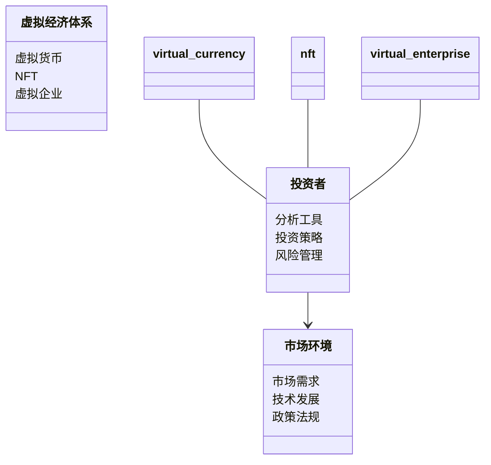
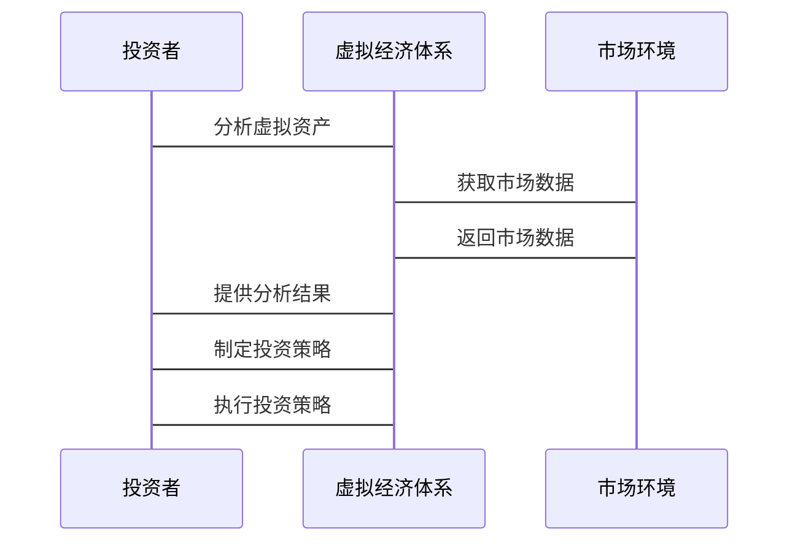

                 


# 巴菲特-芒格的元宇宙经济投资策略：虚拟与现实的融合

> 关键词：巴菲特,芒格,元宇宙,虚拟经济,投资策略,经济融合

> 摘要：本文深入探讨了巴菲特和芒格的投资理念在元宇宙经济中的应用，分析了虚拟经济体系的特点，并提出了融合虚拟与现实经济的投资策略。通过系统分析和实战案例，展示了如何将传统投资策略创新应用于元宇宙环境，为投资者提供了全新的视角和方法。

---

# 第一部分: 巴菲特与芒格的投资理念

## 第1章: 巴菲特与芒格的投资哲学

### 1.1 巴菲特的价值投资理念

#### 1.1.1 价值投资的核心原则

- **核心原则**：巴菲特的价值投资理念强调以低于内在价值的价格买入优质资产，关注企业的长期盈利能力，而非短期市场波动。
- **安全边际**：通过购买价格远低于内在价值的资产，确保在市场波动中仍能获得超额收益。
- **长期视角**：投资不是赌博，而是通过研究和理解企业基本面，寻找那些能够持续创造价值的企业。

#### 1.1.2 芒格的多元思维模型

- **多元思维模型**：芒格强调通过多个学科的交叉应用，形成一个立体的思考框架，帮助投资者避免单一视角的局限性。
- **跨学科思维**：从心理学、经济学、物理学等多个角度分析问题，寻找投资中的“普世真理”。
- **逆向思维**：通过反向思考，寻找市场忽视的机会，避免从众心理带来的错误决策。

#### 1.1.3 投资中的安全边际

- **安全边际的重要性**：安全边际是巴菲特投资策略的核心，通过低估价格买入资产，降低投资风险。
- **安全边际的计算**：通过对企业未来现金流的折现，评估其内在价值，并与当前市场价格进行对比，确保买入价格具有足够的安全空间。

### 1.2 巴菲特与芒格的成功案例分析

#### 1.2.1 巴菲特的可口可乐投资

- **案例背景**：可口可乐在20世纪80年代面临市场挑战，股价低迷。
- **投资逻辑**：巴菲特看好可口可乐的品牌价值和市场领导地位，认为其具备强大的竞争优势。
- **投资结果**：可口可乐股价长期上涨，巴菲特的投资收益巨大。

#### 1.2.2 芒格的 berkshire Hathaway 投资策略

- **公司背景**：伯克希尔哈撒韦最初是一家保险公司，芒格将其转变为一个多元化的投资平台。
- **投资策略**：芒格通过购买优质企业股权，长期持有，实现价值增长。
- **成功因素**：芒格注重企业的管理团队、商业模式和财务状况，选择那些能够持续创造价值的企业。

#### 1.2.3 巴菲特与芒格的合作模式

- **分工合作**：巴菲特负责投资决策，芒格负责企业管理和战略规划。
- **互补优势**：芒格的多元思维模型为巴菲特的投资决策提供了支持，而巴菲特的长期视角则为芒格的策略提供了时间维度的保障。

---

## 第2章: 元宇宙的经济体系

### 2.1 元宇宙的定义与特征

#### 2.1.1 元宇宙的概念

- **定义**：元宇宙是一个虚拟的、持续的、可扩展的数字世界，通过区块链、虚拟现实、人工智能等技术构建，用户可以在其中进行社交、交易、娱乐等活动。
- **特征**：元宇宙具有开放性、去中心化、沉浸式体验和经济系统等特点。

#### 2.1.2 元宇宙的虚拟经济

- **虚拟经济的定义**：虚拟经济是指在元宇宙中通过虚拟货币、NFT、虚拟资产等进行的经济活动。
- **虚拟经济的参与者**：包括用户、开发者、虚拟货币发行方、NFT创作者等。
- **虚拟经济的运作机制**：通过区块链技术实现去中心化的价值转移和交易，确保经济活动的安全性和透明性。

#### 2.1.3 元宇宙的经济体系与传统经济的异同

- **相同点**：元宇宙经济体系与传统经济体系一样，都具有价值交换、市场供需、价格波动等特点。
- **不同点**：元宇宙经济体系更加依赖技术支撑，具有去中心化、数字化、虚拟化的特点。

---

### 2.2 元宇宙中的虚拟货币与NFT

#### 2.2.1 虚拟货币的种类与特点

- **虚拟货币的种类**：包括比特币、以太坊、稳定币等，不同类型的虚拟货币具有不同的功能和特点。
- **虚拟货币的特点**：去中心化、匿名性、可分割性、易于交易等。
- **虚拟货币的经济作用**：作为元宇宙中的流通货币，支持虚拟资产的交易和价值转移。

#### 2.2.2 NFT的定义与价值

- **NFT的定义**：NFT（Non-Fungible Token）是非同质化代币，具有唯一性和不可分割性，用于表示虚拟资产的所有权。
- **NFT的价值**：NFT可以代表数字艺术品、虚拟土地、虚拟物品等，具有稀缺性和独特性，因此具有较高的价值。
- **NFT的经济作用**：在元宇宙中，NFT可以用于虚拟资产的交易、收藏和投资。

#### 2.2.3 元宇宙中的虚拟货币与NFT的经济作用

- **虚拟货币与NFT的关系**：虚拟货币作为元宇宙中的流通货币，支持NFT的交易和价值转移，而NFT作为虚拟资产的代表，为虚拟货币提供了应用场景。
- **虚拟货币与NFT的协同效应**：通过虚拟货币和NFT的结合，元宇宙经济体系更加完善，用户可以在虚拟世界中进行多样化的经济活动。

---

## 第3章: 巴菲特与芒格投资策略在元宇宙中的应用

### 3.1 价值投资理念在虚拟经济中的应用

#### 3.1.1 虚拟资产的价值评估

- **虚拟资产的定义**：虚拟资产包括虚拟货币、NFT、虚拟物品等，具有一定的市场价值。
- **虚拟资产的价值评估方法**：通过分析市场需求、技术支撑、经济模型等因素，评估虚拟资产的内在价值。
- **虚拟资产的价值驱动因素**：包括技术发展、市场需求、政策法规等。

#### 3.1.2 虚拟资产的长期投资策略

- **长期投资的定义**：长期投资是指持有虚拟资产较长时间，通过资产增值实现收益。
- **长期投资的优势**：通过长期持有，规避短期市场波动的风险，实现资产的稳步增长。
- **长期投资的策略**：选择具有强大技术支撑和市场需求的虚拟资产，长期持有，实现价值增长。

#### 3.1.3 虚拟资产的风险管理

- **风险管理的定义**：风险管理是指通过识别、评估和应对风险，降低投资损失的可能性。
- **虚拟资产的主要风险**：包括市场波动风险、技术风险、政策风险等。
- **风险管理的策略**：通过分散投资、设置止损、选择优质资产等方式，降低投资风险。

### 3.2 芒格的多元思维模型在元宇宙中的实践

#### 3.2.1 元宇宙中的跨学科思维

- **跨学科思维的定义**：跨学科思维是指通过多个学科的交叉应用，寻找投资机会和解决方案。
- **跨学科思维的应用**：在元宇宙中，需要结合区块链技术、经济学、市场营销等多个领域的知识，制定有效的投资策略。
- **跨学科思维的优势**：通过多维度的分析，避免单一视角的局限性，提高投资决策的科学性。

#### 3.2.2 元宇宙中的系统性思维

- **系统性思维的定义**：系统性思维是指从整体出发，分析系统的各个组成部分及其相互关系。
- **系统性思维的应用**：在元宇宙中，需要分析虚拟经济体系的各个部分，包括虚拟货币、NFT、虚拟资产等，理解其相互作用和影响。
- **系统性思维的优势**：通过整体分析，找到投资机会和风险点，制定系统的投资策略。

#### 3.2.3 元宇宙中的逆向思维

- **逆向思维的定义**：逆向思维是指从相反的方向思考问题，寻找市场忽视的机会。
- **逆向思维的应用**：在元宇宙中，通过分析市场主流观点，寻找被低估的虚拟资产，制定逆向投资策略。
- **逆向思维的优势**：通过逆向思维，发现市场中的价值洼地，实现超额收益。

### 3.3 元宇宙经济中的投资策略

#### 3.3.1 元宇宙中的虚拟货币投资

- **虚拟货币投资的定义**：虚拟货币投资是指通过购买虚拟货币，期待其价格上涨实现收益。
- **虚拟货币投资的优势**：虚拟货币具有较高的流动性，市场波动较大，存在较大的投资机会。
- **虚拟货币投资的风险**：市场波动风险、技术风险、政策风险等。

#### 3.3.2 元宇宙中的NFT投资

- **NFT投资的定义**：NFT投资是指通过购买NFT，期待其价格上涨实现收益。
- **NFT投资的优势**：NFT具有稀缺性和独特性，市场需求大，存在较大的投资潜力。
- **NFT投资的风险**：市场波动风险、技术风险、政策风险等。

#### 3.3.3 元宇宙中的虚拟企业投资

- **虚拟企业投资的定义**：虚拟企业投资是指通过投资虚拟企业，期待其价值增长实现收益。
- **虚拟企业投资的优势**：虚拟企业具有较高的增长潜力，市场需求大，存在较大的投资机会。
- **虚拟企业投资的风险**：市场波动风险、技术风险、政策风险等。

---

## 第4章: 元宇宙经济中的投资策略

### 4.1 元宇宙中的投资机会分析

#### 4.1.1 元宇宙中的虚拟货币投资

- **投资机会分析**：通过分析虚拟货币的市场供需、技术发展、政策环境等因素，寻找投资机会。
- **投资机会的评估**：评估虚拟货币的内在价值和市场前景，选择具有较大增长潜力的虚拟货币进行投资。

#### 4.1.2 元宇宙中的NFT投资

- **投资机会分析**：通过分析NFT的市场需求、技术支撑、经济模型等因素，寻找投资机会。
- **投资机会的评估**：评估NFT的内在价值和市场前景，选择具有较高收藏价值和投资潜力的NFT进行投资。

#### 4.1.3 元宇宙中的虚拟企业投资

- **投资机会分析**：通过分析虚拟企业的商业模式、管理团队、市场前景等因素，寻找投资机会。
- **投资机会的评估**：评估虚拟企业的内在价值和市场前景，选择具有较高增长潜力的虚拟企业进行投资。

### 4.2 元宇宙投资中的风险管理

#### 4.2.1 元宇宙投资的主要风险

- **市场波动风险**：虚拟货币和NFT的价格波动较大，存在市场风险。
- **技术风险**：元宇宙的技术支撑包括区块链、人工智能等，技术风险较高。
- **政策风险**：政策法规的不确定性可能对元宇宙经济产生重大影响。

#### 4.2.2 风险管理的策略与方法

- **分散投资**：通过投资多种虚拟资产，分散风险，降低投资损失。
- **设置止损**：通过设定止损点，控制投资损失，避免重大亏损。
- **选择优质资产**：通过选择具有强大技术支撑和市场需求的虚拟资产，降低投资风险。

#### 4.2.3 元宇宙投资中的分散投资策略

- **分散投资的定义**：分散投资是指通过投资多种不同的资产，降低投资风险。
- **分散投资的优势**：通过分散投资，降低单一资产的价格波动对整体投资组合的影响。
- **分散投资的策略**：根据市场情况和个人风险承受能力，合理配置虚拟货币、NFT、虚拟企业等多种资产，实现风险分散。

---

## 第5章: 巴菲特与芒格投资策略的融合与创新

### 5.1 巴菲特与芒格投资策略的结合

#### 5.1.1 价值投资与多元思维的结合

- **结合的定义**：通过结合价值投资和多元思维模型，制定更加科学的投资策略。
- **结合的优势**：通过多维度分析，避免单一视角的局限性，提高投资决策的科学性。
- **结合的应用**：在元宇宙中，通过结合价值投资和多元思维模型，制定更加全面的投资策略。

#### 5.1.2 长期投资与风险管理的结合

- **结合的定义**：通过结合长期投资和风险管理，制定更加稳健的投资策略。
- **结合的优势**：通过长期持有和风险管理，实现资产的稳步增长。
- **结合的应用**：在元宇宙中，通过结合长期投资和风险管理，制定更加稳健的投资策略。

#### 5.1.3 巴菲特与芒格策略在元宇宙中的融合

- **融合的定义**：通过融合巴菲特和芒格的投资策略，制定更加全面的投资策略。
- **融合的优势**：通过融合两种策略，充分利用两种策略的优势，制定更加科学的投资策略。
- **融合的应用**：在元宇宙中，通过融合巴菲特和芒格的投资策略，制定更加全面的投资策略。

### 5.2 元宇宙经济中的创新投资策略

#### 5.2.1 元宇宙中的指数投资策略

- **指数投资的定义**：指数投资是指通过投资指数基金，实现与市场指数同步增长的投资策略。
- **指数投资的优势**：通过分散投资，降低投资风险，实现稳健增长。
- **指数投资的应用**：在元宇宙中，通过投资虚拟资产指数基金，实现与市场指数同步增长。

#### 5.2.2 元宇宙中的主动投资策略

- **主动投资的定义**：主动投资是指通过主动选择投资标的，实现超额收益的投资策略。
- **主动投资的优势**：通过主动选择优质资产，实现超额收益。
- **主动投资的应用**：在元宇宙中，通过主动选择优质虚拟资产，实现超额收益。

#### 5.2.3 元宇宙中的量化投资策略

- **量化投资的定义**：量化投资是指通过使用数学模型和算法，进行投资决策的投资策略。
- **量化投资的优势**：通过量化分析，提高投资决策的科学性和准确性。
- **量化投资的应用**：在元宇宙中，通过量化分析，制定更加科学的投资策略。

---

## 第6章: 实战案例分析

### 6.1 元宇宙中的虚拟货币投资案例

#### 6.1.1 某虚拟货币的投资分析

- **案例背景**：假设某虚拟货币在市场中具有较高的增长潜力。
- **投资逻辑**：通过分析虚拟货币的市场需求、技术支撑、经济模型等因素，评估其内在价值。
- **投资结果**：通过长期持有，实现虚拟货币的价值增长。

#### 6.1.2 投资决策的过程

- **市场分析**：通过市场分析，评估虚拟货币的市场需求和价格走势。
- **技术分析**：通过技术分析，评估虚拟货币的价格支撑位和阻力位。
- **风险管理**：通过设置止损点，控制投资风险。

#### 6.1.3 投资结果与

---

# 第二部分: 系统分析与架构设计

## 第7章: 系统分析与架构设计方案

### 7.1 问题场景介绍

- **问题背景**：在元宇宙中，虚拟经济体系的复杂性要求投资者具备系统的分析和决策能力。
- **问题描述**：投资者需要通过系统的分析和决策，制定有效的投资策略。
- **问题解决**：通过系统分析和架构设计，制定有效的投资策略，实现虚拟资产的增值。

### 7.2 项目介绍

- **项目目标**：通过系统分析和架构设计，制定有效的投资策略，实现虚拟资产的增值。
- **项目范围**：包括虚拟货币、NFT、虚拟企业等多种虚拟资产的投资策略制定。
- **项目需求**：通过系统分析和架构设计，制定有效的投资策略，实现虚拟资产的增值。

### 7.3 系统功能设计（领域模型 mermaid 类图）



### 7.4 系统架构设计（mermaid 架构图）

```mermaid
architecturalDiagram
    虚拟经济体系
    [
        虚拟货币
        NFT
        虚拟企业
    ]
    投资者
    [
        分析工具
        投资策略
        风险管理
    ]
    市场环境
    [
        市场需求
        技术发展
        政策法规
    ]
    虚拟经济体系 -- 投资者
    虚拟经济体系 -- 市场环境
    投资者 -- 市场环境
```

### 7.5 系统接口设计

- **投资者与虚拟经济体系的接口**：投资者通过分析工具和投资策略，与虚拟经济体系进行交互，实现虚拟资产的投资和管理。
- **投资者与市场环境的接口**：投资者通过市场环境分析，了解市场需求、技术发展和政策法规，制定投资策略。

### 7.6 系统交互设计（mermaid 序列图）



---

## 第8章: 项目实战

### 8.1 环境搭建

- **开发环境**：建议使用虚拟货币钱包、NFT交易平台、区块链浏览器等工具，搭建虚拟经济体系的开发环境。
- **开发工具**：包括虚拟货币钱包、NFT创作工具、区块链开发框架等。

### 8.2 核心代码实现

#### 8.2.1 虚拟货币交易模块

```python
class VirtualCurrency:
    def __init__(self, name, symbol, value):
        self.name = name
        self.symbol = symbol
        self.value = value

    def buy(self, amount):
        return f"购买了{amount}个{self.symbol}，总价值{amount * self.value}美元"

    def sell(self, amount):
        return f"出售了{amount}个{self.symbol}，总价值{amount * self.value}美元"

# 示例代码
btc = VirtualCurrency("Bitcoin", "BTC", 50000)
print(btc.buy(0.1))
print(btc.sell(0.05))
```

#### 8.2.2 NFT 创建与交易模块

```python
class NFT:
    def __init__(self, name, description, value):
        self.name = name
        self.description = description
        self.value = value

    def create(self):
        return f"创建了NFT：{self.name}，描述：{self.description}，价值：{self.value}美元"

    def sell(self, buyer):
        return f"{buyer}购买了NFT：{self.name}，描述：{self.description}，价值：{self.value}美元"

# 示例代码
nft = NFT("Digital Art", "一幅数字艺术作品", 10000)
print(nft.create())
print(nft.sell("Alice"))
```

### 8.3 案例分析与代码解读

#### 8.3.1 虚拟货币交易案例

- **代码解读**：通过创建虚拟货币类，实现虚拟货币的购买和出售功能，模拟虚拟货币的交易过程。
- **案例分析**：通过购买和出售虚拟货币，实现虚拟资产的增值，展示虚拟货币交易的基本流程。

#### 8.3.2 NFT 创建与交易案例

- **代码解读**：通过创建NFT类，实现NFT的创建和交易功能，模拟NFT的创建和交易过程。
- **案例分析**：通过创建和出售NFT，实现NFT的市场流通和价值转移，展示NFT交易的基本流程。

### 8.4 项目小结

- **项目总结**：通过虚拟货币和NFT的创建与交易，展示了元宇宙经济体系的基本运作方式，帮助投资者理解虚拟资产的交易过程。
- **项目收获**：通过实践项目，掌握了虚拟货币和NFT的基本操作，为后续的虚拟资产投资奠定了基础。

---

## 第9章: 总结与展望

### 9.1 总结

- **核心内容回顾**：本文深入探讨了巴菲特和芒格的投资理念在元宇宙经济中的应用，分析了虚拟经济体系的特点，并提出了融合虚拟与现实经济的投资策略。
- **主要结论**：通过系统分析和实战案例，展示了如何将传统投资策略创新应用于元宇宙环境，为投资者提供了全新的视角和方法。

### 9.2 展望

- **未来发展趋势**：随着元宇宙技术的不断发展，虚拟经济体系将更加完善，虚拟资产的投资机会也将更加丰富。
- **未来研究方向**：未来的研究可以进一步探讨元宇宙经济体系的复杂性，分析虚拟资产的长期发展趋势，制定更加科学的投资策略。

---

# 结语

元宇宙经济的投资策略是一个复杂的系统工程，需要结合传统投资理念与新兴技术特点，制定科学的投资策略。通过本文的分析和实践，投资者可以更好地理解虚拟经济体系的运作方式，掌握虚拟资产的投资技巧，实现虚拟与现实经济的融合与共赢。

---

# 作者：AI天才研究院/AI Genius Institute & 禅与计算机程序设计艺术/Zen And The Art of Computer Programming

