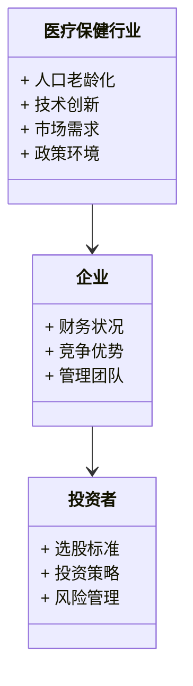
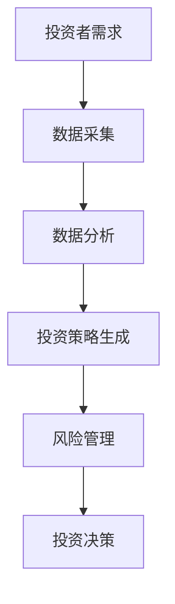

                 


# 巴菲特-芒格的医疗保健行业投资：长期增长潜力

---

## 关键词：巴菲特, 芒格, 医疗保健, 投资策略, 长期增长, 行业分析

---

## 摘要：  
本文深入分析了巴菲特和芒格在医疗保健行业的投资策略和长期增长潜力。通过探讨他们的投资哲学、选股标准、风险管理以及实际案例，揭示了医疗保健行业的核心驱动力和投资机会。结合技术分析和系统架构设计，本文为投资者提供了科学的投资决策框架，帮助他们在复杂多变的市场中把握长期增长机遇。

---

## 第一部分：巴菲特-芒格的投资哲学

### 第1章：巴菲特-芒格的投资理念概述

#### 1.1 巴菲特的价值投资原则  
巴菲特的价值投资理念强调“以合理的价格买入优秀的公司”。他注重企业的财务健康状况、竞争优势和长期盈利能力。芒格的多元思维模型则强调跨学科思考，通过物理学、心理学和经济学等多个角度分析问题。

#### 1.2 医疗保健行业的基本特征  
医疗保健行业是一个与人类健康密切相关的重要领域，具有刚需属性和长期增长潜力。行业涵盖药品研发、医疗服务、医疗器械等多个子领域，市场规模庞大且持续增长。

#### 1.3 巴菲特-芒格对医疗保健行业的关注点  
巴菲特和芒格关注医疗保健行业的长期增长潜力，尤其是在人口老龄化和技术创新的驱动下，医疗服务和药品需求将大幅增加。他们倾向于投资具有强大竞争优势和稳定现金流的公司。

---

## 第二部分：医疗保健行业的长期增长驱动因素

### 第2章：人口老龄化与医疗需求增长  
#### 2.1 人口老龄化对医疗需求的影响  
随着全球人口老龄化的加剧，医疗需求将显著增加。老年人群体对医疗服务、药品和医疗器械的需求将推动行业增长。

#### 2.2 技术进步与创新  
医疗技术的创新（如基因编辑、人工智能辅助诊断）正在改变行业的格局，提高了医疗效率和治疗效果，同时也创造了新的投资机会。

---

## 第三部分：巴菲特-芒格的投资策略与风险管理

### 第3章：选股标准与投资策略  
#### 3.1 选股标准  
- **财务健康状况**：关注企业的盈利能力、资产负债表健康状况和现金流稳定性。
- **竞争优势**：寻找具有强大护城河的公司，如品牌优势、技术壁垒和成本优势。
- **管理团队**：管理层的诚信和能力是企业长期成功的关键因素。

#### 3.2 投资策略  
- **长期持有**：巴菲特和芒格倾向于长期持有优质资产，避免频繁交易。
- **安全边际**：在投资决策中，注重安全边际，即买入价格低于内在价值。

---

## 第四部分：医疗保健行业的系统性分析与架构设计

### 第4章：系统功能设计  
#### 4.1 领域模型Mermaid类图  


#### 4.2 投资决策系统架构  


---

## 第五部分：项目实战与案例分析

### 第5章：项目实战  
#### 5.1 环境安装与数据准备  
- 安装必要的数据分析工具（如Python、Pandas、Matplotlib）。
- 收集医疗保健行业的历史数据，包括股价、财务指标和行业趋势。

#### 5.2 核心实现与代码  
```python
import pandas as pd
import matplotlib.pyplot as plt

# 数据加载与预处理
df = pd.read_csv('healthcare_stocks.csv')
df['return'] = df['close'].pct_change()

# 计算平均回报率
average_return = df['return'].mean()

# 绘制股价趋势图
plt.figure(figsize=(10, 6))
plt.plot(df['date'], df['close'], label='Stock Price')
plt.title('Medical Sector Stock Price Trend')
plt.xlabel('Date')
plt.ylabel('Price')
plt.legend()
plt.show()
```

#### 5.3 实际案例分析  
以某知名制药企业为例，分析其财务状况、竞争优势和市场表现。通过模型预测其未来股价走势，并评估投资风险。

---

## 第六部分：最佳实践与小结

### 第6章：总结与展望  
巴菲特和芒格的投资策略为医疗保健行业的投资提供了宝贵的启示。通过长期持有优质资产、注重安全边际和风险管理，投资者可以在医疗保健行业的长期增长中获得稳定收益。

### 第7章：注意事项与拓展阅读  
- **注意事项**：医疗保健行业受政策影响较大，投资者需密切关注行业动态和政策变化。
- **拓展阅读**：建议深入阅读巴菲特和芒格的经典著作，如《巴菲特致股东的信》和《芒格的投资心理术》。

---

## 作者：AI天才研究院 & 禅与计算机程序设计艺术  
本文作者为AI天才研究院（AI Genius Institute）和“禅与计算机程序设计艺术”（Zen And The Art of Computer Programming）的联合团队，致力于将技术与投资分析相结合，为读者提供深度洞察。

