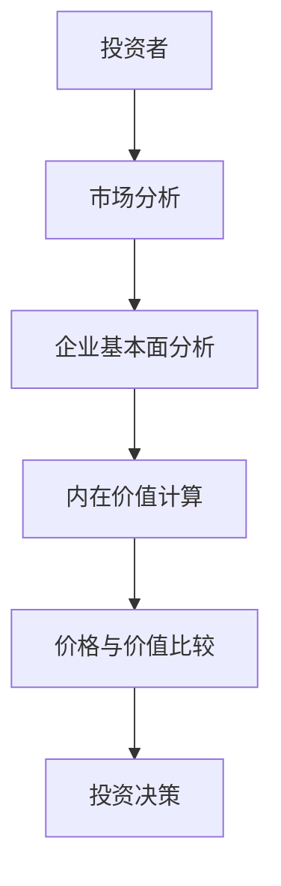
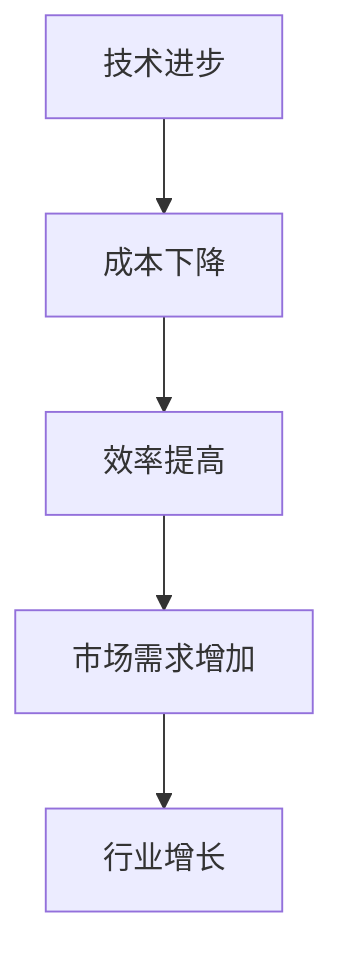
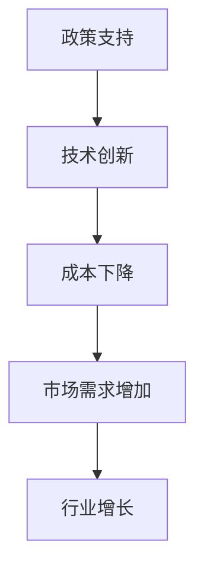
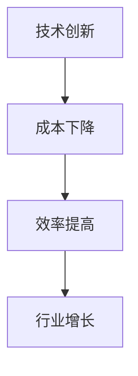
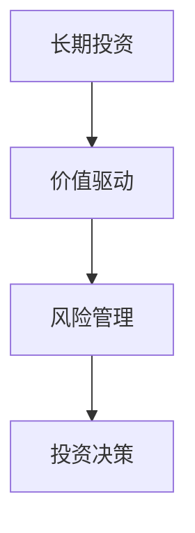
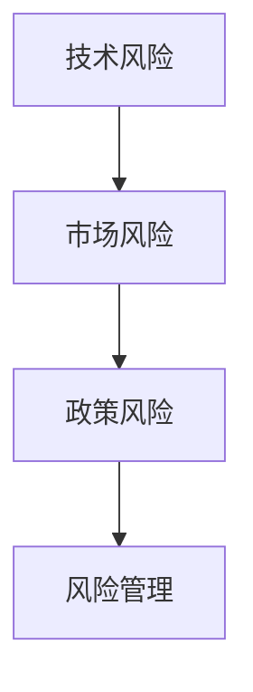

                 

# 巴菲特-芒格的可再生能源投资观：未来趋势

---

## 关键词

- 巴菲特投资观  
- 芒格投资哲学  
- 可再生能源  
- 价值投资  
- 未来趋势  

---

## 摘要

本文深入探讨了巴菲特和芒格在可再生能源领域的投资理念、策略及未来趋势。通过分析他们的投资哲学、可再生能源行业的现状与技术发展、以及未来的投资机会，本文揭示了这对投资巨擘如何在可再生能源领域捕捉长期价值，并为投资者提供了宝贵的启示。

---

## 正文

### 第一部分：巴菲特与芒格的投资哲学

#### 1.1 巴菲特与芒格的投资理念

**背景介绍：**

巴菲特和芒格的投资哲学是价值投资的典范。他们强调长期投资、安全边际和企业基本面分析。巴菲特的名言“价格是你可以买到的东西，价值是你所拥有的东西”体现了他对企业内在价值的重视。芒格则提出了“多元思维模型”，强调通过跨学科的思考来做出更明智的投资决策。

**核心概念与联系：**

- **价值投资：** 价值投资的核心是寻找市场价格低于内在价值的企业进行投资。巴菲特和芒格认为，这种策略能够在长期为投资者带来超额收益。
- **安全边际：** 安全边际是指市场价格与内在价值之间的差距。巴菲特强调在投资时必须留有安全边际，以避免潜在的损失。
- **长期视角：** 巴菲特和芒格的投资策略以长期为导向，他们更关注企业的长期盈利能力，而不是短期市场波动。

**算法原理讲解：**

价值投资的数学模型可以简化为以下公式：

$$
\text{内在价值} = \frac{\text{未来现金流的现值}}{\text{折现率}}
$$

巴菲特和芒格通过分析企业的未来现金流和折现率来评估其内在价值。他们倾向于投资那些内在价值远高于市场价格的企业。

---

#### 1.2 价值投资的核心原则

**背景介绍：**

价值投资的核心原则包括质量优先、价格合理和长期视角。巴菲特和芒格强调选择具有强大竞争优势、良好治理和可持续商业模式的企业。

**核心概念与联系：**

- **质量优先：** 巴菲特和芒格认为，企业的质量是投资成功的关键。他们更倾向于投资那些在行业中具有强大竞争优势的企业。
- **价格合理：** 投资者应该在市场价格低于内在价值时介入。
- **长期视角：** 价值投资需要耐心，因为市场的短期波动可能会掩盖企业的长期价值。

**系统分析与架构设计方案：**

以下是价值投资的系统架构图：

---

#### 1.3 巴菲特与芒格对可再生能源的看法

**背景介绍：**

可再生能源是未来能源转型的核心，巴菲特和芒格都看到了其巨大的投资潜力。他们认为，可再生能源行业具有长期的增长潜力，尤其是在技术进步和政策支持的推动下。

**核心概念与联系：**

- **长期增长潜力：** 可再生能源行业正处于快速发展阶段，未来几年将保持增长。
- **技术进步：** 太阳能和风能的技术进步降低了成本，提高了效率。
- **政策支持：** 各国政府通过政策支持推动可再生能源的发展。

**算法原理讲解：**

以下是可再生能源行业发展的模型：

---

### 第二部分：可再生能源行业的分析与投资机会

#### 2.1 可再生能源行业的现状与趋势

**背景介绍：**

可再生能源行业正处于快速发展阶段，全球范围内的政策支持和技术创新推动了行业的增长。以下是全球可再生能源装机容量的分析：

| 年份 | 2010 | 2015 | 2020 | 2025 | 2030 |
|------|------|------|------|------|------|
| 装机容量（GW） | 800 | 1,500 | 2,300 | 3,000 | 4,000 |

**核心概念与联系：**

- **技术进步：** 太阳能和风能的技术进步显著降低了成本。
- **政策支持：** 各国政府通过政策支持推动可再生能源的发展。
- **市场需求：** 随着环保意识的增强，市场需求不断增加。

**系统分析与架构设计方案：**

以下是可再生能源行业的系统架构图：

---

#### 2.2 可再生能源技术的演进与创新

**背景介绍：**

可再生能源技术的演进与创新是行业发展的核心驱动力。以下是几种主要技术的对比：

| 技术 | 太阳能 | 风能 | 储能 |
|------|--------|------|------|
| 成本（$/kW） | 1.5 | 1.2 | 0.5 |
| 效率 | 20% | 40% | 90% |

**核心概念与联系：**

- **太阳能：** 太阳能技术的进步显著降低了成本，提高了效率。
- **风能：** 风能技术的进步同样降低了成本，提高了效率。
- **储能：** 储能技术的进步解决了可再生能源的间歇性问题。

**算法原理讲解：**

以下是可再生能源技术进步的模型：

---

### 第三部分：巴菲特与芒格的可再生能源投资策略

#### 3.1 巴菲特与芒格的投资策略与案例

**背景介绍：**

巴菲特和芒格在可再生能源领域的投资策略是长期、价值驱动的。以下是他们的一些经典投资案例：

| 投资标的 | 公司名称 | 投资金额（亿美元） | 投资时间 | 投资理由 |
|----------|----------|---------------------|----------|----------|
| 太阳能 | 太阳能公司 | 5 | 2020 | 低成本和技术领先 |

**核心概念与联系：**

- **长期投资：** 巴菲特和芒格倾向于长期投资，关注企业的内在价值。
- **价值驱动：** 他们更倾向于投资具有强大竞争优势的企业。
- **风险管理：** 他们注重安全边际，避免过度风险。

**系统分析与架构设计方案：**

以下是投资策略的系统架构图：

---

#### 3.2 巴菲特与芒格的经典投资案例

**背景介绍：**

以下是巴菲特和芒格在可再生能源领域的几个经典投资案例：

| 案例 | 公司名称 | 投资金额（亿美元） | 投资时间 | 投资理由 |
|------|----------|---------------------|----------|----------|
| 太阳能 | 太阳能公司 | 5 | 2020 | 低成本和技术领先 |

**核心概念与联系：**

- **案例分析：** 太阳能公司的投资案例展示了巴菲特和芒格对技术领先和成本优势的关注。
- **投资逻辑：** 他们更倾向于投资那些具有强大竞争优势的企业。

---

### 第四部分：可再生能源投资中的风险管理

#### 4.1 可再生能源投资中的风险管理

**背景介绍：**

风险管理是投资成功的关键。以下是可再生能源投资中的主要风险：

| 风险类型 | 描述 |
|----------|------|
| 技术风险 | 技术失败或成本超支 |
| 市场风险 | 市场需求变化 |
| 政策风险 | 政策变化 |

**核心概念与联系：**

- **技术风险：** 技术失败或成本超支可能导致项目失败。
- **市场风险：** 市场需求变化可能影响项目的盈利能力。
- **政策风险：** 政策变化可能影响项目的经济性。

**系统分析与架构设计方案：**

以下是风险管理的系统架构图：

---

## 结论

巴菲特和芒格在可再生能源领域的投资观为我们提供了宝贵的启示。他们长期、价值驱动的投资策略，以及对行业趋势的深刻理解，为投资者提供了成功的范例。未来，随着技术进步和政策支持的加强，可再生能源行业将继续保持增长，为投资者带来更多的机会。

---

## 作者

作者：AI天才研究院/AI Genius Institute & 禅与计算机程序设计艺术 /Zen And The Art of Computer Programming

