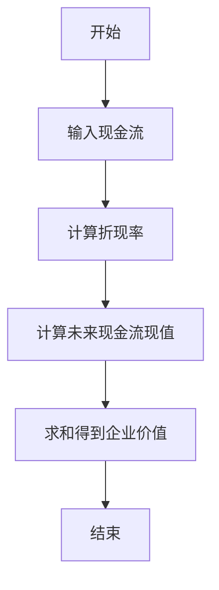
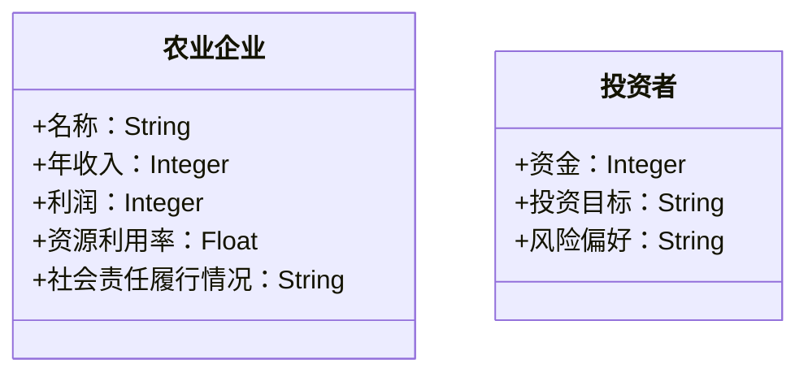
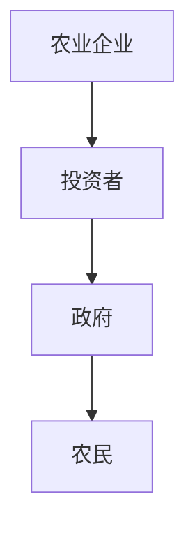

                 


```markdown
# 巴菲特-芒格的可持续农业投资：粮食安全与环境保护

> 关键词：巴菲特，芒格，可持续农业，粮食安全，环境保护，投资策略，价值投资，多元思维模型，系统分析，算法模型

> 摘要：本文探讨了巴菲特和芒格在可持续农业投资领域的理念和策略，分析了他们如何通过价值投资和多元思维模型，将可持续农业与粮食安全和环境保护相结合，实现长期投资目标。文章详细介绍了可持续农业的核心概念、投资模型、系统架构，以及实际案例分析，并给出了最佳实践建议。

---

## 第一部分: 可持续农业投资的背景与重要性

### 第1章: 可持续农业与粮食安全的全球挑战

#### 1.1 可持续农业的定义与核心要素
- **1.1.1 可持续农业的定义**  
  可持续农业是一种能够在不破坏环境的前提下，满足当前及未来人类对食物需求的农业生产方式。

- **1.1.2 可持续农业的核心要素**  
  - 农业生产效率  
  - 环境保护与资源节约  
  - 社会公平与经济可持续性  

- **1.1.3 可持续农业与粮食安全的关系**  
  可持续农业通过提高生产效率、减少资源浪费和保护环境，确保粮食供应的长期稳定性。

#### 1.2 巴菲特与芒格的背景
- **1.2.1 巴菲特的价值投资理念**  
  巴菲特强调长期投资和企业内在价值，注重企业的财务健康和竞争优势。

- **1.2.2 芒格的多元思维模型**  
  芒格强调通过跨学科思考，将复杂问题简化为简单模型，找到最优解决方案。

- **1.2.3 投资与社会责任的结合**  
  巴菲特和芒格将社会责任融入投资决策，关注企业的可持续发展能力。

#### 1.3 可持续农业投资的动机与目标
- **1.3.1 投资动机**  
  - 保护环境  
  - 提高粮食安全  
  - 获得长期稳定收益  

- **1.3.2 可持续农业投资的目标**  
  - 支持高效农业技术  
  - 优化资源配置  
  - 促进农民增收  

- **1.3.3 可持续农业投资的边界与外延**  
  - 边界：农业生产的全过程，从种植到销售。  
  - 外延：与农业相关的供应链、技术创新和政策支持。

---

### 第2章: 巴菲特与芒格的可持续农业投资策略

#### 2.1 巴菲特与芒格的投资理念与可持续农业的结合
- **2.1.1 巴菲特的长期价值投资观**  
  巴菲特关注企业的内在价值，注重企业的长期盈利能力。

- **2.1.2 芒格的多元思维模型在农业投资中的应用**  
  芒格通过跨学科思考，识别农业投资中的潜在风险和机会。

- **2.1.3 可持续农业投资的核心要素**  
  - 企业盈利能力  
  - 环境保护措施  
  - 社会责任履行  

#### 2.2 可持续农业投资的核心概念与联系
- **2.2.1 可持续农业的核心概念**  
  - 农业生产效率  
  - 环境保护  
  - 社会公平  

- **2.2.2 核心概念的属性特征对比表格**  

| 核心概念 | 属性特征 |
|----------|-----------|
| 农业生产效率 | 高效、资源节约 |
| 环境保护 | 减少污染、可持续 |
| 社会公平 | 公平分配、促进农民增收 |

- **2.2.3 ER实体关系图的 Mermaid 流程图**  

```mermaid
erd
actor 投资者;
actor 农民;
actor 政府;
group 可持续农业 {
  entity 农业企业 {
    plays 农业生产
  }
  entity 农业技术 {
    plays 技术支持
  }
  entity 农业政策 {
    plays 政策支持
  }
}
```

---

## 第3章: 可持续农业投资的数学模型与算法原理

### 3.1 可持续农业投资的数学模型
#### 3.1.1 现金流折现模型（DCF模型）
- **定义**  
  将未来现金流折现，计算企业内在价值。

- **公式**  
  $$ V = \sum_{t=1}^{n} \frac{CF_t}{(1+r)^t} $$  
  其中，$V$ 是企业价值，$CF_t$ 是第 $t$ 年的现金流，$r$ 是折现率。

- **流程图**  



#### 3.1.2 农业企业的内在价值计算
- **步骤**  
  1. 估算未来现金流。  
  2. 确定合适的折现率。  
  3. 计算未来现金流的现值。  
  4. 求和得到企业价值。

---

## 第4章: 可持续农业投资的系统分析与架构设计

### 4.1 系统分析
#### 4.1.1 问题场景介绍
- **目标**  
  优化农业资源利用，提高粮食产量。

#### 4.1.2 领域模型 mermaid 类图



### 4.2 系统架构设计
#### 4.2.1 系统架构 mermaid 图



---

## 第5章: 项目实战

### 5.1 环境安装
- **工具**  
  - Python 3.8+  
  - Mermaid 绘图工具

### 5.2 核心代码实现
#### 5.2.1 农业企业的现金流计算
```python
def calculate_intrinsic_value(cash_flows, discount_rate):
    present_value = 0
    for t, cf in enumerate(cash_flows):
        if t == 0:
            present_value += cf
        else:
            present_value += cf / (1 + discount_rate) ** t
    return present_value

cash_flows = [100, 200, 300, 400]
discount_rate = 0.05
iv = calculate_intrinsic_value(cash_flows, discount_rate)
print(f"企业内在价值：{iv}")
```

---

## 第6章: 最佳实践、小结与注意事项

### 6.1 最佳实践
- **投资建议**  
  - 关注农业企业的长期盈利能力。  
  - 考虑环境和社会责任因素。  

### 6.2 小结
巴菲特和芒格通过价值投资和多元思维模型，成功将可持续农业投资与粮食安全和环境保护相结合，为投资者和社会创造了双重价值。

### 6.3 注意事项
- **风险提示**  
  农业投资受天气和政策影响较大，需谨慎评估。

### 6.4 拓展阅读
- 巴菲特投资哲学  
- 芒格的多元思维模型  

---

## 作者

作者：AI天才研究院/AI Genius Institute & 禅与计算机程序设计艺术 /Zen And The Art of Computer Programming
```

