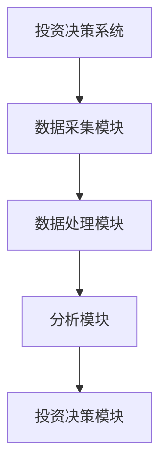

                 


# 巴菲特-芒格的可持续发展投资：长期价值创造

## 关键词：巴菲特，芒格，可持续发展，投资策略，价值投资，长期价值，投资模型

## 摘要：本文探讨巴菲特和芒格的价值投资理念，分析其如何应用于可持续发展投资，并揭示长期价值创造的策略。通过数学模型、系统设计和实际案例，文章详细阐述如何通过价值投资实现可持续发展，创造长期价值。

---

## 第一章：巴菲特与芒格的投资理念

### 1.1 投资理念的背景

#### 1.1.1 巴菲特和芒格的合伙关系

#### 1.1.2 价值投资的哲学基础

### 1.2 可持续发展投资的背景

#### 1.2.1 可持续发展的定义

#### 1.2.2 传统投资与可持续投资的差异

---

## 第二章：价值投资的核心概念

### 2.1 价值投资的核心要素

#### 2.1.1 安全边际的定义与作用

#### 2.1.2 内在价值的计算方法

### 2.2 ESG投资的核心要素

#### 2.2.1 ESG评分的计算方法

#### 2.2.2 ESG投资与传统投资的对比

---

## 第三章：价值投资的数学模型

### 3.1 内在价值计算模型

#### 3.1.1 现金流贴现法（DCF）的公式

$$\text{内在价值} = \sum_{t=1}^{n} \frac{\text{现金流}_t}{(1 + r)^t}$$

#### 3.1.2 现金流贴现法的步骤

1. 估计未来现金流
2. 确定合适的贴现率
3. 计算现值
4. 比较现值与当前股价

### 3.2 决策树模型的应用

#### 3.2.1 决策树的构建

1. 确定初始决策节点
2. 分析可能的市场反应
3. 评估每种情况的内在价值

---

## 第四章：可持续发展投资的系统设计

### 4.1 系统功能设计

#### 4.1.1 数据采集模块

- 数据来源：公司财报、ESG评级
- 数据处理：清洗和预处理

#### 4.1.2 分析模块

- 计算内在价值
- 评估ESG表现

### 4.2 系统架构设计



### 4.3 接口设计

- 输入：公司数据
- 输出：投资建议

---

## 第五章：项目实战：案例分析

### 5.1 案例背景

#### 5.1.1 公司简介

- 选取一家公司，分析其财务状况和ESG评分

### 5.2 数据分析

#### 5.2.1 内在价值计算

```python
def calculate_intrinsic_value(cash_flows, discount_rate):
    return sum(cash_flows / (1 + discount_rate)**t for t in range(len(cash_flows)))
```

#### 5.2.2 ESG评分分析

- 使用第三方评分机构的数据

### 5.3 投资决策

#### 5.3.1 决策过程

1. 计算内在价值
2. 比较当前股价与内在价值
3. 结合ESG评分做出投资决策

---

## 第六章：最佳实践与总结

### 6.1 投资策略的优化

#### 6.1.1 长期投资的重要性

- 避免短期波动的干扰

### 6.2 小结

- 总结巴菲特和芒格的投资理念
- 强调可持续发展的重要性

---

## 结语

通过系统的分析和实际案例，我们展示了如何将巴菲特和芒格的价值投资理念应用于可持续发展投资，实现长期价值创造。投资者应注重内在价值和ESG表现，做出明智的投资决策。

---

## 作者：AI天才研究院/AI Genius Institute & 禅与计算机程序设计艺术/Zen And The Art of Computer Programming

