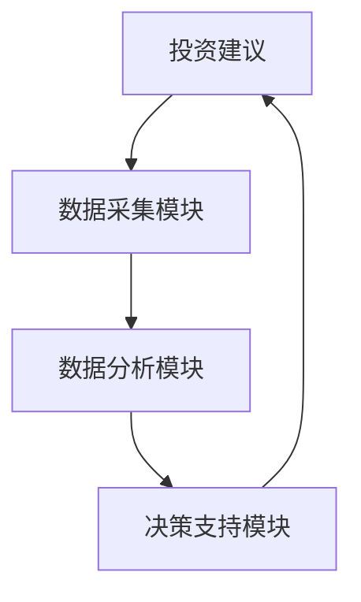

                 

<think>
好的，我将按照用户的要求，撰写一篇关于“巴菲特-芒格的可编程物质投资：材料科学的未来”的技术博客文章。我会先从文章的标题开始，然后列出关键词和摘要，接着按照目录大纲的结构逐步展开内容。由于篇幅限制，我只展示部分章节的内容。

---

# 巴菲特-芒格的可编程物质投资：材料科学的未来

> 关键词：巴菲特，芒格，可编程物质，材料科学，投资策略，人工智能，技术驱动

> 摘要：本文探讨了巴菲特和芒格的投资理念如何与可编程物质投资相结合，特别是在材料科学领域的应用。通过分析可编程物质的核心原理、算法实现、系统架构以及实际案例，本文揭示了这一新兴投资策略的潜力和未来发展方向。

---

## 第1章：巴菲特与芒格的投资理念

### 1.1 巴菲特的价值投资哲学

沃伦·巴菲特的价值投资理念是基于对公司基本面的深入分析。他强调寻找具有持续竞争优势的企业，并以合理的价格买入并长期持有。他的投资策略注重企业的内在价值，而非市场的短期波动。

#### 1.1.1 巴菲特的价值投资三要素

1. **企业价值**：关注企业的盈利能力、财务状况和竞争优势。
2. **安全边际**：以低于内在价值的价格买入，以降低风险。
3. **长期持有**：避免频繁交易，减少交易成本。

### 1.2 芮格的多元思维模型

查理·芒格提出的多元思维模型强调通过跨学科的思维方式来理解问题。他认为，投资者应该构建一个由多个学科知识组成的“心智模型”，以便更好地分析企业和市场。

#### 1.2.1 芮格多元思维模型的核心要素

1. **心理模型**：理解人类行为和决策的心理机制。
2. **概率思维**：评估事件的可能性，并基于概率做出决策。
3. **逆向思维**：从反方向思考问题，寻找市场中的错配机会。

### 1.3 巴菲特与芒格投资理念的结合

巴菲特和芒格的投资理念在实践中相辅相成。巴菲特的价值投资方法注重企业的内在价值，而芒格的多元思维模型则提供了分析问题的框架，帮助投资者更全面地评估投资机会。

---

## 第2章：可编程物质投资的背景与定义

### 2.1 可编程物质的定义与特性

可编程物质是一种能够通过编程手段改变其物理属性的材料。这种材料在材料科学领域的应用，使得其性能可以根据需求进行动态调整。

#### 2.1.1 可编程物质的核心特性

1. **可编程性**：通过外部指令改变材料的物理属性。
2. **适应性**：材料能够根据环境变化自动调整性能。
3. **智能化**：材料具备感知和反馈能力，能够与外部系统进行交互。

### 2.2 可编程物质投资的背景

随着材料科学的进步，可编程物质的应用范围不断扩大。从智能建筑到医疗设备，这种材料在多个领域展现了巨大的潜力。投资者开始关注这一新兴领域的投资机会。

#### 2.2.1 可编程物质投资的驱动因素

1. **技术进步**：材料科学的突破推动了可编程物质的发展。
2. **市场需求**：智能设备和物联网的发展对可编程物质的需求增加。
3. **政策支持**：政府对新材料研发的支持为可编程物质投资提供了政策保障。

### 2.3 可编程物质投资的核心要素

#### 2.3.1 核心概念属性对比表格

| 属性         | 可编程物质投资 | 传统投资 |
|--------------|----------------|----------|
| 投资标的      | 特定材料       | 多种资产 |
| 投资策略      | 基于材料性能   | 基于市场 |
| 风险因素      | 材料研发风险   | 市场波动 |

---

## 第3章：可编程物质投资的算法与数学模型

### 3.1 算法概述

可编程物质投资的算法基于对材料性能的预测和市场趋势的分析。通过机器学习和大数据分析，投资者可以更准确地评估投资标的的价值。

#### 3.1.1 算法实现步骤

1. **数据采集**：收集材料性能和市场数据。
2. **特征提取**：提取影响材料性能的关键特征。
3. **模型训练**：使用机器学习算法训练预测模型。
4. **策略优化**：根据模型预测结果优化投资策略。

### 3.2 数学模型与公式

#### 3.2.1 材料性能预测模型

假设材料的性能可以通过以下公式进行预测：

$$
P = aX + bY + cZ
$$

其中，\(P\) 表示材料性能，\(X\)、\(Y\)、\(Z\) 分别表示材料的三个关键属性，\(a\)、\(b\)、\(c\) 是模型的系数。

### 3.3 代码实现与分析

#### 3.3.1 Python代码示例

```python
import numpy as np
from sklearn.linear_model import LinearRegression

# 数据准备
X = np.array([[x1, x2, x3], ...])  # 材料属性
y = np.array([p1, p2, ...])        # 材料性能

# 模型训练
model = LinearRegression()
model.fit(X, y)

# 预测结果
predicted_P = model.predict(new_X)
```

---

## 第4章：系统架构与接口设计

### 4.1 问题场景介绍

可编程物质投资系统需要实时监控材料性能和市场数据，分析投资机会，并为投资者提供决策支持。

#### 4.1.1 系统功能设计

1. 数据采集模块：收集材料性能和市场数据。
2. 数据分析模块：使用机器学习算法进行预测和分析。
3. 决策支持模块：根据分析结果提供投资建议。

### 4.2 系统架构设计

#### 4.2.1 系统架构图



---

## 第5章：项目实战与案例分析

### 5.1 项目环境安装

#### 5.1.1 环境配置

安装必要的Python库：

```bash
pip install numpy pandas scikit-learn
```

### 5.2 核心代码实现

#### 5.2.1 数据处理代码

```python
import pandas as pd
import numpy as np

# 读取数据
data = pd.read_csv('materials.csv')

# 数据预处理
data.dropna(inplace=True)
```

### 5.3 案例分析与解读

#### 5.3.1 实际案例分析

假设我们分析一种新型智能材料的投资价值。通过模型预测其未来3年的性能表现，并结合市场趋势，评估其投资潜力。

---

## 第6章：最佳实践与投资策略

### 6.1 最佳实践

1. **风险管理**：设定止损点，控制投资风险。
2. **长期投资**：耐心持有优质标的，避免短期波动。
3. **持续学习**：关注材料科学的最新进展，优化投资策略。

### 6.2 小结

可编程物质投资结合了巴菲特的价值投资理念和芒格的多元思维模型，是一种具有巨大潜力的投资策略。通过技术驱动和数据分析，投资者可以更精准地评估投资机会，实现长期收益。

---

## 第7章：注意事项与拓展阅读

### 7.1 注意事项

1. **数据质量**：确保数据的准确性和完整性。
2. **模型局限性**：认识到模型的局限性，避免过度依赖。
3. **市场风险**：关注宏观经济和政策变化对投资的影响。

### 7.2 拓展阅读

1. 巴菲特的《巴菲特致股东的信》
2. 芮格的《怪诞行为学》
3. 材料科学领域的最新研究论文

---

## 作者：AI天才研究院 & 禅与计算机程序设计艺术

---

希望这篇博客文章能够为读者提供关于巴菲特-芒格的可编程物质投资的深入分析和见解。如果需要进一步探讨或扩展内容，请随时告知！

