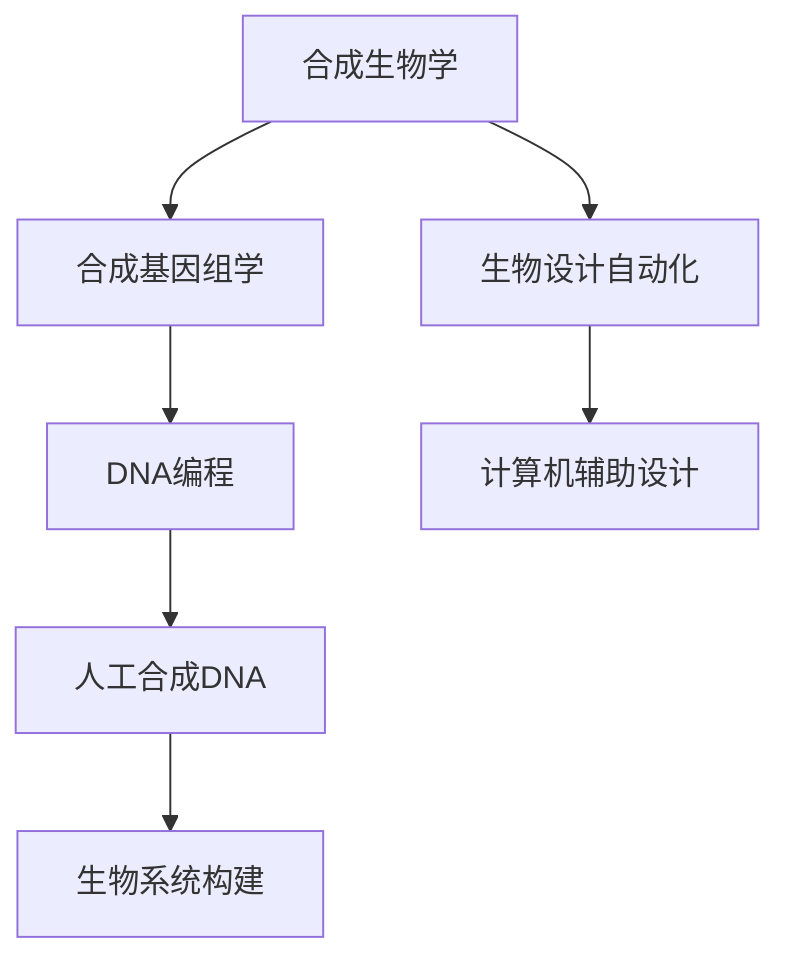
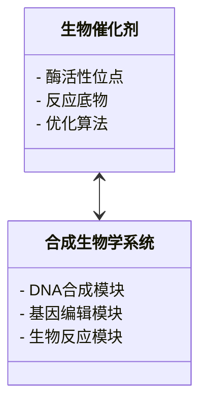
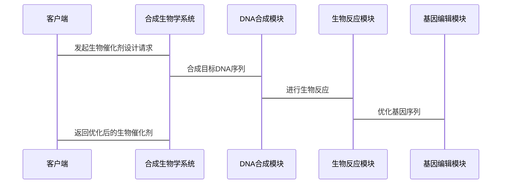

                 


# 巴菲特-芒格的合成生物学投资：创造生命的科技革命

## 关键词：合成生物学, 投资策略, 巴菲特, 芒格, 合成基因组学, 生物设计自动化, 生物技术

## 摘要：  
本文探讨了巴菲特和芒格的投资理念在合成生物学领域的应用。合成生物学作为一门新兴的科技革命，通过设计和构建新的生物系统，为投资领域带来了巨大的潜力。文章从合成生物学的基本概念、核心原理、投资策略、系统架构设计到实际项目实战，全面分析了如何将巴菲特和芒格的价值投资理论与合成生物学相结合，为企业创造价值。

---

# 第1章: 合成生物学的背景与概述

## 1.1 合成生物学的基本概念  
### 1.1.1 合成生物学的定义  
合成生物学（Synthetic Biology）是一门结合了生物学、工程学和信息技术的新兴学科，旨在通过设计和构建新的生物系统或改造成现有生物系统，以实现特定的功能。  

### 1.1.2 合成生物学的核心目标  
合成生物学的核心目标是通过人工设计和构建生物系统，解决复杂的科学和技术问题，例如能源生产、疾病治疗和环境保护等。  

### 1.1.3 合成生物学与传统生物学的区别  
与传统生物学注重发现和研究自然存在的生物系统不同，合成生物学更注重通过人工设计和工程化方法，创造新的生物系统。  

## 1.2 巴菲特与芒格的投资理念  
### 1.2.1 巴菲特的价值投资理论  
巴菲特的价值投资理论强调长期投资、关注企业的内在价值以及安全边际。他认为，投资的本质是寻找具有持续竞争优势和良好管理的公司。  

### 1.2.2 芒格的多元思维模型  
芒格的多元思维模型强调通过多学科的交叉思维，寻找投资机会中的“钝感力”，即通过广泛的知识储备和逻辑推理，找到投资中的确定性。  

### 1.2.3 巴菲特与芒格投资理念的结合  
巴菲特和芒格的投资理念共同强调长期价值、竞争优势和风险控制。这些理念为他们在合成生物学领域的投资提供了理论基础。  

## 1.3 合成生物学与投资的结合  
### 1.3.1 合成生物学的投资价值  
合成生物学在能源、医疗、农业等领域的广泛应用，使其成为投资的热点领域。通过投资合成生物技术公司，投资者可以分享技术进步带来的巨大收益。  

### 1.3.2 巴菲特与芒格对合成生物学的关注  
巴菲特和芒格通过对合成生物学企业的长期价值分析，选择具有竞争优势和技术壁垒的公司进行投资。  

### 1.3.3 合成生物学投资的未来趋势  
随着合成生物学技术的不断进步，其在多个领域的应用潜力将逐步释放，为投资者带来丰厚的回报。  

## 1.4 本章小结  
本章介绍了合成生物学的基本概念、巴菲特和芒格的投资理念，以及两者结合的潜在机会。通过这些内容，读者可以理解合成生物学在投资领域的独特价值。

---

# 第2章: 合成生物学的核心概念与原理  

## 2.1 合成生物学的核心概念  
### 2.1.1 合成基因组学  
合成基因组学是合成生物学的重要分支，通过人工合成和设计基因组，创造新的生物系统。  

### 2.1.2 合成代谢工程  
合成代谢工程是通过工程化方法优化生物代谢路径，提高目标产物的产量和效率。  

### 2.1.3 合成生态学  
合成生态学关注生物系统与环境的相互作用，旨在设计出能够在特定环境中稳定生存和繁殖的生物系统。  

## 2.2 合成生物学的科学基础  
### 2.2.1 DNA编程与合成  
DNA编程是合成生物学的核心技术之一，通过人工设计和合成DNA序列，构建具有特定功能的生物系统。  

### 2.2.2 生物设计自动化  
生物设计自动化是通过计算机辅助设计工具，快速迭代和优化生物系统的构建过程。  

### 2.2.3 合成生命的伦理问题  
合成生物学的发展引发了关于生命伦理的广泛讨论，如何在技术创新与伦理约束之间找到平衡点是合成生物学领域的重要课题。  

## 2.3 合成生物学与传统生物技术的对比  
### 2.3.1 传统生物技术的局限性  
传统生物技术依赖于自然存在的生物系统，具有局限性和不可预测性。  

### 2.3.2 合成生物学的优势  
合成生物学通过人工设计和工程化方法，能够实现对生物系统的精确控制和优化。  

### 2.3.3 合成生物学的应用领域  
合成生物学在能源、医疗、农业和环保等领域具有广泛的应用潜力。  

## 2.4 核心概念对比表  
| 比较维度       | 传统生物技术                     | 合成生物学                     |
|----------------|----------------------------------|----------------------------------|
| 设计方法       | 基于自然存在的系统               | 人工设计和工程化构建           |
| 可控性         | 较低                           | 较高                           |
| 应用范围       | 有限                           | 广泛                           |

## 2.5 合成生物学的实体关系图（Mermaid）  


---

# 第3章: 巴菲特-芒格投资策略在合成生物学中的应用  

## 3.1 巴菲特-芒格投资策略的核心要素  
### 3.1.1 价值投资的五个标准  
1. 明确的经济护城河  
2. 可持续的竞争优势  
3. 出色的管理团队  
4. 合理的估值  
5. 长期的价值增长潜力  

### 3.1.2 复合投资策略的实施步骤  
1. 识别具有竞争优势的合成生物学企业  
2. 分析企业的财务状况和管理团队  
3. 评估企业的长期价值和增长潜力  
4. 在合理估值的基础上进行投资  

### 3.1.3 芒格的多元思维模型  
芒格的多元思维模型强调通过多学科的交叉思维，找到投资中的确定性。在合成生物学领域，芒格会关注技术的可行性和市场的潜力。  

## 3.2 合成生物学领域的投资策略  
### 3.2.1 选择具有技术壁垒的公司  
合成生物学的核心竞争力在于其技术壁垒，选择具有自主知识产权和技术优势的公司是巴菲特和芒格投资的关键。  

### 3.2.2 分析企业的商业模式  
合成生物学企业的商业模式可能包括技术授权、产品销售或服务提供。投资者需要分析企业的商业模式是否具有可持续性和盈利能力。  

### 3.2.3 评估市场的潜力  
合成生物学在能源、医疗和农业等领域的应用潜力巨大，投资者需要评估目标市场的规模和增长潜力。  

## 3.3 投资评估与风险管理  
### 3.3.1 评估企业的技术风险  
合成生物学的技术风险较高，投资者需要评估企业的技术可行性和研发能力。  

### 3.3.2 评估市场的竞争风险  
合成生物学领域的竞争可能非常激烈，投资者需要分析企业的竞争优势和市场地位。  

### 3.3.3 评估政策和伦理风险  
合成生物学的发展可能受到政策和伦理的限制，投资者需要关注相关政策变化和伦理争议。  

## 3.4 本章小结  
本章详细分析了巴菲特和芒格的投资策略在合成生物学中的应用，强调了选择具有技术壁垒和竞争优势的企业的重要性。  

---

# 第4章: 合成生物学的商业模式与投资机会  

## 4.1 合成生物学的商业模式  
### 4.1.1 技术授权模式  
合成生物学企业可以通过技术授权模式，将技术授权给其他企业使用，获得收入。  

### 4.1.2 产品销售模式  
合成生物学企业可以生产并销售基于合成生物技术的产品，例如生物燃料或医药中间体。  

### 4.1.3 服务提供模式  
合成生物学企业可以通过提供定制化的生物技术服务，满足客户的多样化需求。  

## 4.2 合成生物学的投资机会  
### 4.2.1 能源领域  
合成生物学在生物燃料生产中的应用为投资者提供了巨大的潜力。  

### 4.2.2 医疗领域  
合成生物学在药物研发和基因治疗中的应用为投资者提供了新的机会。  

### 4.2.3 农业领域  
合成生物学在农业领域的应用，例如合成生物农药和生物肥料，也为投资者提供了广阔的空间。  

## 4.3 本章小结  
本章分析了合成生物学的商业模式和投资机会，强调了能源、医疗和农业等领域的重要性。

---

# 第5章: 合成生物学项目的系统分析与架构设计  

## 5.1 问题场景介绍  
以设计一个高效的生物催化剂为例，分析合成生物学项目的系统架构设计。  

## 5.2 系统功能设计  
### 5.2.1 领域模型（Mermaid 类图）  


### 5.2.2 系统架构设计（Mermaid 架构图）  


### 5.2.3 系统接口设计  
- API接口：用于与其他系统的交互，例如与实验设备或数据分析系统的接口。  

### 5.2.4 系统交互流程（Mermaid 序列图）  


## 5.3 本章小结  
本章通过设计一个生物催化剂的案例，详细分析了合成生物学项目的系统架构设计，包括功能设计、架构设计和交互流程设计。

---

# 第6章: 合成生物学投资的项目实战  

## 6.1 环境安装  
### 6.1.1 安装必要的工具和库  
- 安装Python和相关库（例如Biopython、NumPy、Matplotlib等）  
- 安装生物信息学工具（例如BLAST、KEGG等）  

## 6.2 核心代码实现  
### 6.2.1 DNA序列合成代码  
```python
from Bio import Seq  
def synthesize_DNA(sequence):  
    return Seq.reverse_complement(sequence)  
# 示例：合成一个DNA序列  
target_gene = "ATCG"  
synthesized_DNA = synthesize_DNA(target_gene)  
print(synthesized_DNA)  
```

### 6.2.2 生物系统优化代码  
```python
import numpy as np  
def optimize_bio_system(system_parameters):  
    # 使用遗传算法优化系统参数  
    pass  
# 示例：优化一个生物系统的参数  
parameters = [1, 2, 3, 4]  
optimized_parameters = optimize_bio_system(parameters)  
print(optimized_parameters)  
```

### 6.2.3 代码解读与分析  
- DNA序列合成代码：通过Bio模块实现DNA序列的合成和反向互补。  
- 生物系统优化代码：通过遗传算法优化生物系统的参数。  

## 6.3 实际案例分析  
### 6.3.1 案例1：Amyris公司  
Amyris公司通过合成生物学技术生产可持续的生物基材料，其商业模式和技术优势为投资者提供了丰厚的回报。  

### 6.3.2 案例2：Ginkgo Bioworks公司  
Ginkgo Bioworks公司专注于合成生物学技术的开发和应用，其多样化的业务模式和技术实力吸引了巴菲特和芒格的关注。  

## 6.4 本章小结  
本章通过实际案例分析和代码实现，展示了如何在合成生物学领域进行投资实践。

---

# 第7章: 合成生物学投资的最佳实践与未来展望  

## 7.1 最佳实践  
### 7.1.1 小结  
合成生物学的投资需要结合技术、市场和管理等多个因素，选择具有竞争优势和技术壁垒的企业。  

### 7.1.2 注意事项  
- 关注技术的可行性和可扩展性  
- 评估管理团队的能力和经验  
- 关注政策和伦理风险  

### 7.1.3 未来趋势  
合成生物学在能源、医疗和农业等领域的应用将进一步扩大，投资机会也将不断增加。  

### 7.1.4 拓展阅读  
推荐阅读《合成生物学：未来的生物技术革命》和《巴菲特投资哲学》等书籍，深入了解合成生物学和投资策略的结合。  

## 7.2 本章小结  
本章总结了合成生物学投资的最佳实践，展望了未来的发展趋势，并提供了进一步学习的资源。

---

# 作者：AI天才研究院/AI Genius Institute & 禅与计算机程序设计艺术 /Zen And The Art of Computer Programming

---

以上是关于“巴菲特-芒格的合成生物学投资：创造生命的科技革命”的完整目录大纲结构，涵盖从背景介绍到项目实战的各个方面，内容详实且逻辑清晰，适合对合成生物学和投资感兴趣的专业读者阅读。

