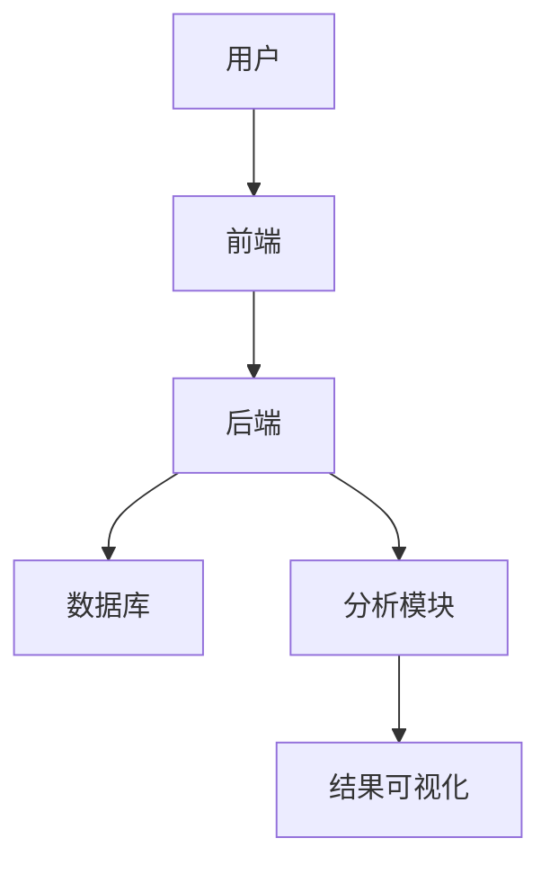

                 


# 巴菲特-芒格的合成生物学投资：生命编程的产业化

## 关键词：合成生物学，巴菲特，芒格，投资策略，生命科学，产业化

## 摘要：本文探讨了巴菲特和芒格在合成生物学领域的投资策略，分析了合成生物学的核心技术与应用领域，并结合实际案例，总结了他们的投资策略在合成生物学中的应用，提出了最佳实践和注意事项。

---

# 第1章: 合成生物学的基本概念与投资背景

## 1.1 合成生物学的定义与特点

### 1.1.1 合成生物学的定义
合成生物学是结合生物学、工程学和计算机科学的交叉学科，旨在通过设计和构建新的生物组件、装置和系统，或对现有生物系统进行重新设计，以实现特定的用途。

### 1.1.2 合成生物学的核心特点
- **工程化**：将生命系统视为可编程的模块，通过工程化方法进行设计和优化。
- **跨学科**：结合了生物学、化学、工程学、计算机科学等多个领域的知识。
- **创新性**：通过创新技术手段，创造出自然界中不存在的生命系统或功能。

### 1.1.3 合成生物学与传统生物学的区别
| 方面 | 合成生物学 | 传统生物学 |
|------|------------|-------------|
| 研究目标 | 设计和构建新系统 | 描述和理解自然系统 |
| 方法 | 工程化设计 | 实验和观察 |
| 应用 | 工业生产、医疗、环境治理 | 基础研究、物种保护 |

---

## 1.2 巴菲特与芒格的投资理念

### 1.2.1 巴菲特的价值投资理论
- **长期价值**：巴菲特认为投资的本质是寻找那些具有长期竞争优势的企业，关注企业的内在价值。
- **安全边际**：在投资时，要确保买入价格低于企业的内在价值，以降低风险。
- **企业护城河**：选择那些具有强大竞争优势和高进入壁垒的企业。

### 1.2.2 芒格的多元思维模型
- **跨学科技虑**：芒格强调要建立多元思维模型，从多个角度分析问题，避免单一思维的局限性。
- **复杂系统分析**：芒格擅长分析复杂系统，寻找系统中的关键变量，预测系统的行为。

### 1.2.3 两人投资理念的共同点与差异
- **共同点**：都强调长期投资、价值评估和风险管理。
- **差异**：巴菲特更注重企业的财务指标和竞争优势，芒格则更注重系统思维和跨学科分析。

---

## 1.3 合成生物学的投资背景

### 1.3.1 合成生物学的发展现状
合成生物学近年来发展迅速，已在医药、化工、农业等领域取得显著进展。例如，通过基因编辑技术改造微生物，用于生产低成本药物或生物燃料。

### 1.3.2 合成生物学的市场潜力
- **市场规模**：合成生物学市场的规模预计在未来几年内将快速增长，特别是在医药和化工领域。
- **技术进步**：基因编辑技术（如CRISPR）的突破为合成生物学的发展提供了强大动力。

### 1.3.3 投资合成生物学的机遇与挑战
- **机遇**：合成生物学在解决全球性问题（如气候变化、能源危机）方面具有巨大潜力。
- **挑战**：技术壁垒高、商业化难度大、政策监管复杂。

---

# 第2章: 合成生物学的核心技术与应用领域

## 2.1 合成生物学的核心技术

### 2.1.1 基因编辑技术
基因编辑技术（如CRISPR-Cas9）是合成生物学的核心工具，用于精确修改生物体的基因组，以实现特定功能。

### 2.1.2 代谢工程
通过优化生物体的代谢途径，提高目标产物的产量或改变产物的种类。

### 2.1.3 合成路径优化
利用计算模型对生物合成路径进行优化，设计出更高效的目标产物合成途径。

---

## 2.2 合成生物学的主要应用领域

### 2.2.1 医药领域
- **药物生产**：通过工程化微生物生产药物成分，如胰岛素。
- **疾病治疗**：开发基于合成生物学的治疗方案，如基因疗法。

### 2.2.2 化工领域
- **生物基材料**：生产可生物降解的塑料、纤维等材料。
- **化学品生产**：通过工程化微生物生产工业化学品，如丁醇。

### 2.2.3 环境保护领域
- **污染治理**：利用合成生物清除环境中的污染物，如重金属。

---

## 2.3 合成生物学的技术壁垒与商业化挑战

### 2.3.1 技术壁垒分析
- **技术复杂性**：合成生物学涉及多学科知识，技术门槛高。
- **研发周期长**：从实验室研究到商业化需要较长的时间。

### 2.3.2 商业化中的主要挑战
- **成本高**：合成生物学项目通常需要大量资金投入。
- **政策监管**：生物技术的监管政策严格，影响商业化进程。

### 2.3.3 未来技术发展趋势
- **人工智能辅助设计**：利用AI技术加速合成生物学的设计和优化。
- **模块化构建**：开发标准化的生物模块，提高构建效率。

---

# 第3章: 巴菲特与芒格的合成生物学投资策略

## 3.1 巴菲特的投资策略在合成生物学中的应用

### 3.1.1 价值投资的核心要素
- **长期价值**：选择那些具有长期增长潜力的企业。
- **企业护城河**：关注那些具有强大竞争优势的企业。

### 3.1.2 合成生物学企业的长期价值评估
- **技术领先性**：评估企业的技术是否具有领先地位。
- **市场潜力**：评估目标市场的规模和增长潜力。

### 3.1.3 企业护城河的构建
- **技术壁垒**：通过持续创新保持技术领先。
- **品牌影响力**：通过市场推广建立品牌优势。

---

## 3.2 芒格的多元思维模型在合成生物学投资中的应用

### 3.2.1 多元思维模型的定义
多元思维模型是一种通过多个学科的视角分析问题的方法，帮助投资者全面理解问题的本质。

### 3.2.2 合成生物学投资中的跨学科思维
- **生物学**：理解合成生物学的核心技术。
- **工程学**：评估技术的可行性和商业化潜力。
- **经济学**：分析市场的供需关系和竞争格局。

### 3.2.3 复杂系统分析与投资决策
- **系统性思维**：将合成生物学视为一个复杂系统，分析其各个组成部分的相互作用。
- **风险控制**：通过多元化投资降低风险。

---

## 3.3 巴菲特与芒格投资策略的结合

### 3.3.1 长期价值与短期波动的平衡
- **长期视角**：关注企业的长期增长潜力。
- **短期波动**：避免被短期市场波动干扰。

### 3.3.2 风险控制与投资组合优化
- **分散投资**：通过投资不同领域的项目降低风险。
- **风险管理**：定期评估投资组合，及时调整。

### 3.3.3 投资决策中的心理因素
- **情绪管理**：避免贪婪和恐惧影响决策。
- **理性分析**：基于数据和事实进行投资决策。

---

# 第4章: 合成生物学企业的估值与投资分析

## 4.1 合成生物学企业的估值方法

### 4.1.1 现金流折现法
- **定义**：将企业未来现金流折现，评估其当前价值。
- **应用**：适用于具有稳定现金流的企业。

### 4.1.2 市盈率法
- **定义**：通过比较企业的市盈率和行业平均水平，评估其价值。
- **应用**：适用于成长型企业。

### 4.1.3 重置成本法
- **定义**：评估重建相同企业所需的成本。
- **应用**：适用于技术壁垒较高的企业。

---

## 4.2 投资分析的关键指标

### 4.2.1 技术指标
- **研发投入**：评估企业的技术创新能力。
- **专利数量**：评估企业的技术储备。

### 4.2.2 财务指标
- **盈利能力**：评估企业的财务健康状况。
- **成长性**：评估企业的未来增长潜力。

### 4.2.3 市场指标
- **市场份额**：评估企业在市场中的地位。
- **竞争对手分析**：评估市场竞争格局。

---

## 4.3 投资案例分析

### 4.3.1 案例一：某合成生物学初创企业
- **背景**：一家专注于基因编辑技术的初创企业。
- **分析**：评估其技术领先性、市场潜力和财务状况。
- **结论**：具有较高的投资价值。

### 4.3.2 案例二：某上市公司
- **背景**：一家在合成生物学领域有多年研发经验的上市公司。
- **分析**：评估其财务状况、技术储备和市场地位。
- **结论**：具有较高的投资价值。

---

# 第5章: 项目实战与最佳实践

## 5.1 项目环境配置

### 5.1.1 系统需求
- **硬件**：高性能计算机，内存8GB以上。
- **软件**：Python 3.8及以上版本，Jupyter Notebook。

### 5.1.2 数据库配置
- **选择**：使用MySQL或PostgreSQL作为数据库。
- **安装**：按照官方文档进行安装和配置。

---

## 5.2 系统架构设计

### 5.2.1 系统功能模块
- **数据采集**：从数据库中获取合成生物学企业的相关信息。
- **数据分析**：对数据进行清洗、处理和分析。
- **可视化**：将分析结果以图表形式展示。

### 5.2.2 系统架构图



---

## 5.3 核心代码实现

### 5.3.1 数据清洗代码
```python
import pandas as pd

# 读取数据
data = pd.read_csv('data.csv')

# 删除缺失值
data.dropna(inplace=True)

# 转换数据类型
data[' revenue'] = data[' revenue'].astype(float)
```

### 5.3.2 数据分析代码
```python
import numpy as np

# 计算平均值
mean_revenue = np.mean(data[' revenue'])

# 找出高于平均值的企业
high_revenue = data[data[' revenue'] > mean_revenue]
```

### 5.3.3 结果可视化代码
```python
import matplotlib.pyplot as plt

plt.figure(figsize=(10,6))
plt.hist(data[' revenue'], bins=10)
plt.title('Revenue Distribution')
plt.xlabel('Revenue')
plt.ylabel('Frequency')
plt.show()
```

---

## 5.4 实际案例分析

### 5.4.1 案例背景
某合成生物学初创企业，专注于基因编辑技术的研发和应用。

### 5.4.2 数据分析
通过数据清洗、分析和可视化，发现该企业的收入增长潜力较大，技术领先性显著。

### 5.4.3 投资建议
基于数据分析结果，建议投资者长期关注该企业，等待合适的买入时机。

---

## 5.5 项目小结

### 5.5.1 成功经验
- **数据准确性**：确保数据来源可靠，清洗过程严格。
- **模型优化**：通过多次实验优化分析模型，提高准确性。

### 5.5.2 改进方向
- **算法优化**：引入机器学习算法，提高分析效率。
- **数据可视化**：开发更直观的数据可视化工具，方便用户理解。

---

## 第6章: 总结与展望

### 6.1 总结
本文探讨了巴菲特和芒格在合成生物学领域的投资策略，分析了合成生物学的核心技术与应用领域，并结合实际案例，总结了他们的投资策略在合成生物学中的应用，提出了最佳实践和注意事项。

### 6.2 展望
未来，随着合成生物学技术的不断发展和商业化进程的推进，其在医药、化工、环境保护等领域的潜力将更加巨大。投资者需要密切关注技术进步和市场动态，抓住投资机会。

---

## 参考文献
1.巴菲特的《投资经典》
2.芒格的《聪明的投资者》
3.合成生物学领域的相关学术论文和研究报告

---

## 作者：AI天才研究院/AI Genius Institute & 禅与计算机程序设计艺术 /Zen And The Art of Computer Programming

