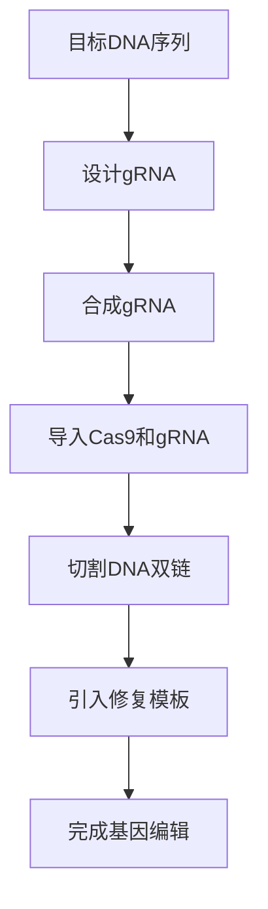
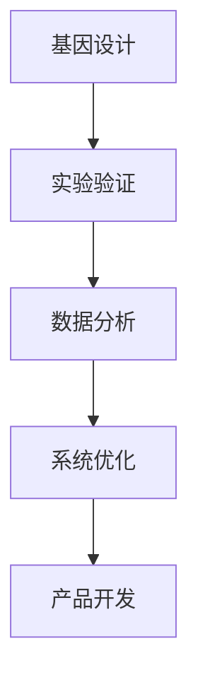

                 


# 巴菲特-芒格的合成生物学投资：重新定义生命科学

## 关键词：巴菲特，芒格，合成生物学，投资策略，生命科学

## 摘要：
本文探讨了巴菲特和芒格在合成生物学领域的投资策略及其对生命科学的影响。通过分析合成生物学的核心概念、算法原理和系统架构，结合实际案例，揭示了如何将传统投资哲学应用于新兴科技领域，重新定义生命科学的未来发展方向。

---

## 第一章：合成生物学的背景与概念

### 1.1 合成生物学的定义与核心概念

#### 1.1.1 合成生物学的定义
合成生物学（Synthetic Biology）是生物学与工程学的交叉学科，旨在通过设计和构建新的生物系统，或对现有生物系统进行改造，以实现特定的功能。其核心目标是将生命科学转化为一种可编程的科学。

#### 1.1.2 合成生物学的核心概念
- **生物模块化**：将生物系统分解为可重复使用的模块，如基因、蛋白质、代谢途径等。
- **系统级设计**：从整个系统的角度出发，设计和优化生物系统。
- **工程化方法**：采用工程化的方法（如设计-构建-测试循环）来构建和优化生物系统。

#### 1.1.3 合成生物学与传统生物学的区别
| 属性 | 合成生物学 | 传统生物学 |
|------|------------|------------|
| 研究目标 | 设计和构建新的生物系统 | 描述和理解自然生物系统的运作 |
| 方法论 | 工程化、模块化 | 基础研究、实验验证 |
| 应用领域 | 医疗、能源、工业 | 科学研究、生态保护 |

### 1.2 合成生物学的技术基础

#### 1.2.1 基因编辑技术（CRISPR）
CRISPR-Cas9是一种革命性的基因编辑工具，通过引导RNA（gRNA）与目标DNA序列配对，Cas9蛋白可以切割DNA双链，从而实现基因的定点编辑。

**CRISPR基因编辑流程图：**



#### 1.2.2 合成基因组学
合成基因组学是指通过化学合成方法构建人工基因组。例如，Craig Venter团队在2010年成功合成第一个完全人工合成的细菌基因组——支原体。

#### 1.2.3 生物信息学与人工智能的结合
人工智能在合成生物学中的应用包括：
- **序列优化**：利用AI算法优化基因序列，提高表达效率。
- **系统设计**：通过机器学习模型预测基因回路的行为，优化系统设计。
- **数据分析**：处理高通量数据，发现新的生物标记物或代谢途径。

### 1.3 合成生物学的应用领域

#### 1.3.1 医疗健康
- **药物开发**：通过合成生物系统生产复杂药物分子。
- **疾病治疗**：利用基因编辑技术治疗遗传性疾病。
- **生物诊断**：开发能够检测病原体的合成生物传感器。

#### 1.3.2 能源与环保
- **生物燃料**：通过工程化微生物生产乙醇、生物柴油等可再生能源。
- **环境修复**：利用合成生物降解污染物，修复受污染的土壤和水体。

#### 1.3.3 工业生产
- **化学品生产**：通过合成生物系统生产塑料、纤维等工业原料。
- **食品生产**：利用工程化微生物生产新型食品成分。

## 第二章：巴菲特与芒格的投资哲学

### 2.1 巴菲特的投资理念

#### 2.1.1 价值投资的核心原则
巴菲特的价值投资理念强调以下几点：
- **长期投资**：关注企业的长期价值，而非短期股价波动。
- **安全边际**：以低于内在价值的价格买入优质资产。
- **企业竞争优势**：投资具有持续竞争优势的企业。

#### 2.1.2 股价与内在价值的评估方法
巴菲特认为，股价最终会回归其内在价值。内在价值的计算公式为：

$$
\text{内在价值} = \frac{\text{未来现金流的现值}}{\text{折现率}}
$$

### 2.2 芒格的多元思维模型

#### 2.2.1 多元思维模型的定义
芒格提倡建立一个多学科的知识框架，将不同领域的知识相互连接，从而更好地理解复杂问题。

#### 2.2.2 多元思维模型的应用
- **跨学科分析**：将物理学、化学、生物学等学科的知识结合起来，分析企业的技术优势。
- **风险控制**：通过多角度分析，识别潜在风险并制定应对策略。

### 2.3 巴菲特与芒格的共同点与差异

| 方面 | 巴菲特 | 芒格 |
|------|--------|------|
| 投资理念 | 价值投资、安全边际 | 多元思维模型、跨学科分析 |
| 风险管理 | 通过安全边际降低风险 | 通过多角度分析降低风险 |

## 第三章：合成生物学的投资策略

### 3.1 合成生物学投资的背景分析

#### 3.1.1 合成生物学行业的现状与未来趋势
- **现状**：合成生物学技术快速发展，应用领域不断扩展。
- **未来趋势**：随着技术进步，合成生物学将在医疗、能源等领域发挥更大作用。

#### 3.1.2 投资者为何关注合成生物学
- **高增长潜力**：合成生物学技术的商业化应用具有巨大市场潜力。
- **技术壁垒高**：技术领先的企业具有较强的竞争优势。

### 3.2 巴菲特与芒格的投资逻辑

#### 3.2.1 从长期视角看合成生物学的价值
巴菲特和芒格都强调长期投资，认为合成生物学技术的长期价值将远远超过短期波动。

#### 3.2.2 股东价值与企业竞争优势的评估
- **股东价值**：关注企业的未来现金流和内在价值。
- **竞争优势**：分析企业的技术壁垒、市场地位和创新能力。

#### 3.2.3 投资决策中的风险管理
- **分散投资**：通过投资组合分散风险。
- **深度分析**：对目标企业进行深入研究，识别潜在风险。

### 3.3 合成生物学企业的估值方法

#### 3.3.1 企业的核心竞争力分析
- **技术优势**：评估企业的技术领先地位。
- **市场前景**：分析目标市场的潜力和竞争格局。

#### 3.3.2 财务指标与市场前景的结合
- **财务指标**：关注企业的盈利能力、成长性和财务健康状况。
- **市场前景**：评估目标市场的增长潜力和企业竞争优势。

#### 3.3.3 投资回报周期的预测
- **短期回报**：关注企业的近期盈利能力和股价波动。
- **长期回报**：评估企业的长期价值和市场地位。

## 第四章：合成生物学的算法与数学模型

### 4.1 合成生物学中的算法应用

#### 4.1.1 基因编辑的算法模型
- **序列优化算法**：通过遗传算法优化基因序列，提高表达效率。
- **路径优化算法**：利用图论算法优化代谢途径，提高产物产量。

#### 4.1.2 生物网络的模拟与优化
- **网络流模型**：将生物网络建模为流网络，分析节点之间的流量和瓶颈。
- **反馈环检测**：通过图论算法检测生物网络中的反馈环，优化系统设计。

#### 4.1.3 合成基因组设计的算法流程
- **模块化设计**：将基因组分解为多个模块，分别设计和优化。
- **组合优化**：通过组合优化算法，找到最优的模块组合。

### 4.2 合成生物学的数学模型

#### 4.2.1 基因表达的数学模型
- **模型建立**：将基因表达过程建模为动态系统，考虑转录、翻译等过程。
- **参数估计**：通过实验数据估计模型参数，验证模型的准确性。

#### 4.2.2 生物系统的稳定性分析
- **稳定性分析**：通过数学模型分析生物系统的稳定性，预测系统的响应。
- **鲁棒性优化**：通过优化算法提高系统的鲁棒性，增强系统的稳定性。

## 第五章：合成生物学的系统架构与实现

### 5.1 系统架构设计

#### 5.1.1 系统功能设计
- **模块划分**：将系统划分为基因编辑模块、系统测试模块、数据处理模块等。
- **功能流程**：从基因设计、实验验证到数据处理，明确各模块的功能和接口。

#### 5.1.2 系统架构图


#### 5.1.3 系统接口设计
- **输入接口**：接收基因序列、实验数据等输入。
- **输出接口**：输出优化后的基因设计、数据分析结果等。

### 5.2 系统实现

#### 5.2.1 环境安装
- **软件环境**：安装必要的编程工具和生物信息学软件，如Python、R、BioPython等。
- **硬件环境**：配置高性能计算集群，支持大规模数据处理和计算。

#### 5.2.2 核心代码实现
```python
def optimize_gene_sequence(sequence):
    # 输入：基因序列
    # 输出：优化后的基因序列
    # 使用遗传算法进行优化
    import random
    population = [sequence] * 100  # 初始种群
    for _ in range(1000):
        # 选择
        selected = random.sample(population, 2)
        # 交叉
        child = ''.join([selected[0][i] if random.random() < 0.5 else selected[1][i] for i in range(len(selected[0]))])
        # 变异
        if random.random() < 0.01:
            index = random.randint(0, len(child)-1)
            child = child[:index] + 'A' + child[index+1:]
        population.append(child)
    # 选择最优解
    max_fitness = -float('inf')
    best_sequence = sequence
    for seq in population:
        fitness = calculate_fitness(seq)
        if fitness > max_fitness:
            max_fitness = fitness
            best_sequence = seq
    return best_sequence
```

#### 5.2.3 实验案例分析
- **实验设计**：设计基因编辑实验，验证算法的优化结果。
- **数据采集**：收集实验数据，评估优化效果。
- **结果分析**：通过数据分析，验证算法的有效性。

### 5.3 项目小结

#### 5.3.1 项目总结
- **项目目标**：通过算法优化基因序列，提高基因编辑的效率和准确性。
- **项目成果**：成功设计并实现了一种基于遗传算法的基因优化算法，显著提高了基因编辑的成功率。

#### 5.3.2 投资建议
- **技术壁垒**：关注具有技术壁垒的企业，尤其是那些能够将算法应用于实际生产的公司。
- **市场前景**：选择具有广阔市场前景的应用领域，如医疗、能源等。

#### 5.3.3 注意事项
- **风险管理**：投资前需进行充分的市场和风险分析。
- **技术评估**：对企业的技术实力进行深入评估，确保技术的可行性和创新性。

## 第六章：合成生物学的未来展望与投资策略

### 6.1 未来趋势分析

#### 6.1.1 技术进步
- **人工智能的应用**：AI技术将更加广泛地应用于合成生物学，提高设计和优化的效率。
- **新材料的开发**：新型生物材料的开发将推动合成生物学的进一步发展。

#### 6.1.2 市场需求
- **医疗健康**：合成生物学在医疗领域的应用将更加广泛，推动相关企业的发展。
- **可持续发展**：合成生物学在能源和环保领域的应用将推动可持续发展目标的实现。

### 6.2 投资策略建议

#### 6.2.1 研究驱动型投资
- **技术研究**：关注具有强大研发能力的企业，尤其是那些能够持续创新的企业。
- **长期投资**：合成生物学技术的商业化需要时间，投资者应保持耐心。

#### 6.2.2 价值投资与风险管理
- **安全边际**：以合理的价格买入具有竞争优势的企业。
- **分散投资**：通过投资组合分散风险，降低投资的波动性。

### 6.3 本章小结
合成生物学作为一门新兴的交叉学科，具有广阔的应用前景和巨大的市场潜力。投资者应结合巴菲特和芒格的投资哲学，以长期视角看待合成生物学的发展，选择具有技术优势和市场潜力的企业进行投资。

---

## 作者：AI天才研究院/AI Genius Institute & 禅与计算机程序设计艺术 /Zen And The Art of Computer Programming

