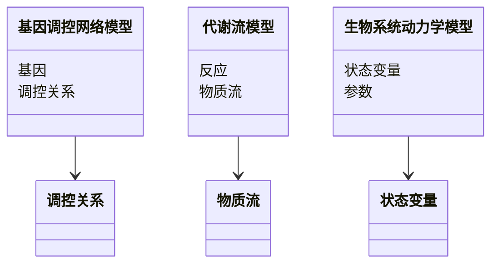
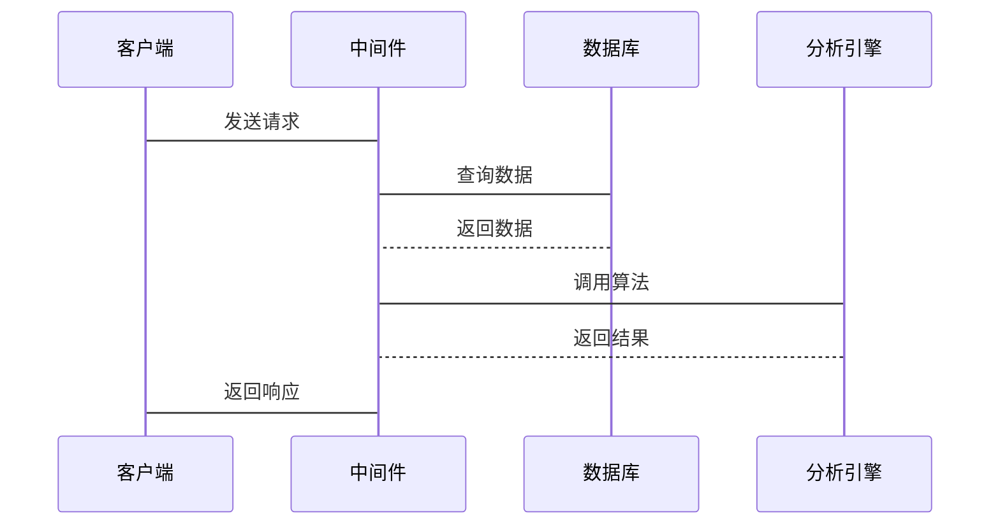

                 


# 巴菲特-芒格的合成生物学计算平台投资：生命科学的数字化转型

## 关键词：巴菲特，芒格，合成生物学，计算平台，数字化转型

## 摘要：
本文探讨了巴菲特和芒格的投资理念在合成生物学计算平台中的应用，分析了生命科学数字化转型的趋势和机遇，详细阐述了合成生物学的数学模型与算法，以及计算平台在投资决策中的作用，结合实际案例展示了如何通过数字化手段优化投资策略。

---

## 第1章: 巴菲特-芒格投资理念与数字化转型

### 1.1 巴菲特-芒格投资理念概述

#### 1.1.1 巴菲特的价值投资理论
巴菲特的价值投资理论强调长期投资、基本面分析和安全边际。他主张投资那些具有持续竞争优势和良好管理的公司，并注重公司内在价值的评估。

#### 1.1.2 芒格的多元思维模型
芒格的多元思维模型强调广泛涉猎各个学科的知识，并通过跨学科的思考来解决问题。他认为，只有通过多维度的思考，才能更好地理解事物的本质。

#### 1.1.3 投资理念与数字化转型的结合
在数字化转型的背景下，巴菲特和芒格的投资理念需要与时俱进。他们主张将传统投资策略与现代技术相结合，利用数字化工具和技术手段来优化投资决策。

### 1.2 合成生物学与计算平台的背景

#### 1.2.1 合成生物学的定义与特点
合成生物学是通过设计和构建新的生物系统，或对现有生物系统进行改造，以实现特定功能的学科。其特点是高度定制化、复杂性和系统性。

#### 1.2.2 计算平台在合成生物学中的作用
计算平台在合成生物学中起到关键作用，可以帮助研究人员预测和优化生物系统的性能，从而提高实验效率和降低成本。

#### 1.2.3 生命科学的数字化转型趋势
随着技术的进步，生命科学领域的数字化转型正在加速。计算平台的应用使得生命科学研究更加高效和精准。

### 1.3 巴菲特-芒格投资策略的数字化应用

#### 1.3.1 投资策略的数字化转型
将传统的投资策略数字化，利用数据分析和人工智能技术来优化投资决策。

#### 1.3.2 合成生物学领域的投资机会
合成生物学领域的快速发展为投资者提供了新的机会，特别是在医疗、能源和环境保护等领域。

#### 1.3.3 计算平台在投资决策中的作用
计算平台可以帮助投资者评估合成生物学项目的可行性和潜在收益，从而做出更明智的投资决策。

### 1.4 本章小结
本章介绍了巴菲特和芒格的投资理念，探讨了合成生物学和计算平台的基本概念，分析了生命科学数字化转型的趋势，并讨论了数字化投资策略在合成生物学中的应用。

---

## 第2章: 合成生物学与计算平台的核心概念

### 2.1 合成生物学的基本原理

#### 2.1.1 合成生物学的定义
合成生物学是通过设计和构建新的生物系统，或对现有生物系统进行改造，以实现特定功能的学科。

#### 2.1.2 合成生物学的核心要素
合成生物学的核心要素包括基因编辑、代谢工程和生物信息学。

#### 2.1.3 合成生物学与传统生物学的区别
合成生物学与传统生物学的区别在于其注重设计和构建生物系统，而不仅仅是研究自然存在的生物系统。

### 2.2 计算平台在合成生物学中的应用

#### 2.2.1 计算平台的定义与特点
计算平台是指用于合成生物学研究的软件工具和平台，具有高效性、可扩展性和智能化的特点。

#### 2.2.2 计算平台的功能
计算平台的功能包括数据分析、模型构建、优化设计和模拟预测。

#### 2.2.3 计算平台与实验的结合
计算平台与实验相结合，可以提高实验效率，降低成本，并加速研究进程。

### 2.3 合成生物学与计算平台的联系

#### 2.3.1 合成生物学的计算模型
合成生物学的计算模型包括基因调控网络模型、代谢流模型和生物系统动力学模型。

#### 2.3.2 计算平台对合成生物学的推动作用
计算平台通过提供高效的工具和方法，推动了合成生物学的发展。

#### 2.3.3 合成生物学与计算平台的协同效应
合成生物学与计算平台的协同效应体现在数据共享、知识整合和技术创新等方面。

### 2.4 本章小结
本章详细介绍了合成生物学的基本原理和计算平台的核心概念，探讨了计算平台在合成生物学中的应用及其与实验的结合，分析了合成生物学与计算平台的联系。

---

## 第3章: 合成生物学计算平台的数学模型与算法原理

### 3.1 合成生物学计算平台的数学模型

#### 3.1.1 合成生物学的基本数学模型
合成生物学的基本数学模型包括基因调控网络模型和代谢流模型。

#### 3.1.2 计算平台的数学建模方法
计算平台的数学建模方法包括系统动力学建模、网络流分析和优化建模。

#### 3.1.3 数学模型在合成生物学中的应用
数学模型在合成生物学中的应用包括预测生物系统的性能、优化设计和模拟实验。

### 3.2 算法原理与流程

#### 3.2.1 合成生物学计算平台的算法概述
合成生物学计算平台的算法包括基因编辑算法、代谢优化算法和系统设计算法。

#### 3.2.2 基于图论的合成路径优化算法
基于图论的合成路径优化算法通过构建基因调控网络的图模型，找到最优的合成路径。

#### 3.2.3 机器学习在合成生物学中的应用
机器学习在合成生物学中的应用包括基因表达预测、代谢通路优化和生物系统设计。

### 3.3 算法实现与案例分析

#### 3.3.1 算法实现的步骤
算法实现的步骤包括数据预处理、模型构建、算法优化和结果分析。

#### 3.3.2 机器学习算法的数学模型
机器学习算法的数学模型包括线性回归模型、支持向量机模型和神经网络模型。

#### 3.3.3 算法的优化与调优
算法的优化与调优包括参数调整、模型选择和性能评估。

### 3.4 本章小结
本章详细介绍了合成生物学计算平台的数学模型与算法原理，探讨了基于图论和机器学习的算法设计，并通过案例分析展示了算法的实现与优化过程。

---

## 第4章: 系统分析与架构设计方案

### 4.1 问题场景介绍
合成生物学计算平台需要解决的问题包括数据管理、模型构建和优化设计。

### 4.2 项目介绍
本项目旨在开发一个高效的合成生物学计算平台，支持研究人员进行基因编辑、代谢优化和生物系统设计。

### 4.3 系统功能设计

#### 4.3.1 领域模型设计
领域模型设计包括基因调控网络模型、代谢流模型和生物系统动力学模型。

#### 4.3.2 领域模型的mermaid类图


### 4.4 系统架构设计

#### 4.4.1 系统架构的mermaid架构图


### 4.5 系统接口设计

#### 4.5.1 系统接口的mermaid序列图


### 4.6 本章小结
本章分析了合成生物学计算平台的系统架构，设计了领域模型和系统架构图，展示了系统的接口设计和交互流程。

---

## 第5章: 项目实战

### 5.1 环境安装

#### 5.1.1 安装Python
使用Python 3.8及以上版本，可以通过以下命令安装：
```bash
python --version
```

#### 5.1.2 安装必要的库
安装numpy、pandas、scikit-learn等库：
```bash
pip install numpy pandas scikit-learn
```

### 5.2 系统核心实现源代码

#### 5.2.1 基于图论的合成路径优化算法
```python
import numpy as np
from scipy.optimize import minimize

def optimize_synthetic_pathway(objective_function, constraints):
    result = minimize(objective_function, np.zeros(len(objective_function)), constraints)
    return result.x
```

#### 5.2.2 机器学习模型的实现
```python
from sklearn.model_selection import train_test_split
from sklearn.ensemble import RandomForestRegressor

def train_machine_learning_model(X, y):
    X_train, X_test, y_train, y_test = train_test_split(X, y, test_size=0.2)
    model = RandomForestRegressor()
    model.fit(X_train, y_train)
    return model
```

### 5.3 代码应用解读与分析

#### 5.3.1 代码的功能
上述代码实现了基于图论的合成路径优化算法和机器学习模型的训练。

#### 5.3.2 代码的优化
代码优化包括参数调整、模型选择和性能评估。

### 5.4 实际案例分析

#### 5.4.1 案例背景
假设我们有一个基因编辑项目，目标是优化某种代谢通路。

#### 5.4.2 案例分析
通过计算平台进行基因调控网络的优化设计，找到最优的合成路径。

#### 5.4.3 案例结果
通过优化算法和机器学习模型，成功找到了最优的基因编辑方案。

### 5.5 本章小结
本章通过实际案例展示了合成生物学计算平台的应用，详细讲解了环境安装、代码实现和案例分析的过程。

---

## 第6章: 最佳实践、小结、注意事项与拓展阅读

### 6.1 最佳实践 tips
- 注重理论与实践的结合
- 加强跨学科的知识储备
- 重视数据质量和模型的可解释性

### 6.2 小结
本文详细探讨了巴菲特和芒格的投资理念在合成生物学计算平台中的应用，分析了生命科学数字化转型的趋势，详细阐述了合成生物学的数学模型与算法，并通过实际案例展示了计算平台的应用。

### 6.3 注意事项
- 数据隐私和安全问题
- 模型的准确性和可解释性
- 技术的持续更新与创新

### 6.4 拓展阅读
推荐阅读相关领域的书籍和论文，关注合成生物学和数字化转型的最新研究进展。

---

## 作者：AI天才研究院/AI Genius Institute & 禅与计算机程序设计艺术 /Zen And The Art of Computer Programming

---

**本文通过详细分析巴菲特和芒格的投资理念，探讨了合成生物学计算平台的核心概念与算法原理，结合实际案例展示了数字化转型在生命科学领域的应用。**

