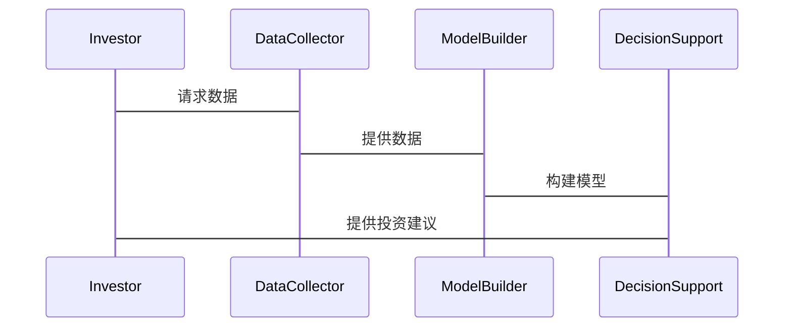

                 


# 《巴菲特-芒格的合成食品投资：解决全球粮食安全的新途径》

---

## 关键词：
合成食品、巴菲特、芒格、投资策略、粮食安全、技术分析、风险管理

---

## 摘要：
本文探讨了合成食品投资如何成为解决全球粮食安全问题的新途径，分析了巴菲特和芒格的投资哲学在合成食品领域的应用。通过技术分析、系统设计和项目实战，详细阐述了合成食品的投资潜力和风险管理策略，为读者提供了深入的技术与投资见解。

---

# 第一部分：合成食品投资的背景与核心概念

## 第1章：合成食品投资的背景与问题背景

### 1.1 全球粮食安全问题的现状与挑战

#### 1.1.1 全球粮食安全问题的定义与现状
全球粮食安全问题是指在满足人口需求的同时，确保粮食供应的稳定性和可及性。随着全球人口增长、气候变化和资源短缺，粮食安全面临严峻挑战。

#### 1.1.2 粮食危机的多维度表现：人口增长、资源短缺、气候变化
- **人口增长**：预计到2050年，全球人口将超过90亿，粮食需求将增加50%。
- **资源短缺**：土地、水和化肥的有限性导致传统农业难以满足需求。
- **气候变化**：极端天气和温度变化影响农作物产量。

#### 1.1.3 粮食安全对全球经济与社会的影响
粮食不安全可能导致贫困、社会稳定问题和经济波动。

### 1.2 合成食品的概念与定义

#### 1.2.1 合成食品的定义与核心特征
合成食品是通过生物工程技术生产的食品，不依赖传统农业，例如细胞培养肉和实验室培养的食品。

#### 1.2.2 合成食品与传统食品的对比分析
| 特性         | 合成食品         | 传统食品       |
|--------------|------------------|----------------|
| 生产方式     | 生物工程生产     | 农业种植       |
| 资源消耗     | 低               | 高             |
| 环境影响     | 小               | 大             |
| 生产效率     | 高               | 低             |

#### 1.2.3 合成食品的生产技术与应用领域
合成食品主要采用细胞培养和生物工程技术，应用于肉类、乳制品和蛋类生产。

### 1.3 巴菲特与芒格投资哲学的核心要素

#### 1.3.1 巴菲特的价值投资理念
巴菲特注重企业的内在价值和长期盈利能力，寻找具有持续竞争优势的企业。

#### 1.3.2 芒格的多元思维模型
芒格强调多学科思维，通过分析问题的多维度因素做出决策。

#### 1.3.3 两人投资决策的共同特点与差异
- **共同点**：长期价值、基本面分析。
- **差异**：巴菲特更关注企业本身，芒格注重跨学科分析。

### 1.4 合成食品投资的创新性与可行性

#### 1.4.1 合成食品投资的创新性
合成食品投资结合了生物技术和投资学，是一种创新的解决方案。

#### 1.4.2 合成食品投资的可行性分析
- **市场需求**：消费者对健康食品的需求增加。
- **技术进步**：生物工程技术的发展降低了生产成本。

#### 1.4.3 投资合成食品的潜在风险与回报
- **风险**：技术不确定性、市场竞争。
- **回报**：高增长潜力，满足未来需求。

---

## 第2章：合成食品的核心概念与联系

### 2.1 合成食品的核心概念

#### 2.1.1 合成食品的生产过程
合成食品通过细胞培养、生物工程等技术生产，不依赖传统农业。

#### 2.1.2 合成食品的关键技术
- **细胞培养肉**：从动物细胞培养肉类产品。
- **实验室培养食品**：通过微生物发酵生产食品成分。

#### 2.1.3 合成食品的营养价值与安全性
合成食品富含营养，生产过程可控，安全性高。

### 2.2 合成食品与传统食品的对比分析

#### 2.2.1 生产效率对比
合成食品生产效率高，资源消耗少。

#### 2.2.2 技术与市场的联系
合成食品技术的进步推动市场扩展，市场需求反过来促进技术改进。

---

## 第3章：合成食品投资的算法原理

### 3.1 合成食品生产中的优化算法

#### 3.1.1 资源分配优化
- **线性规划模型**：
  - 目标函数：最大化利润。
  - 约束条件：资源限制。

  $$ \text{最大化} \quad \sum c_i x_i $$
  $$ \text{约束} \quad \sum a_i x_i \leq b $$

#### 3.1.2 投资组合优化
- **马科维茨均值-方差模型**：
  - 最小化投资组合风险。
  - 给定收益目标。

  $$ \text{最小化} \quad \sigma^2 $$
  $$ \text{满足} \quad \sum w_i r_i = R $$

### 3.2 合成食品投资的数学模型

#### 3.2.1 产量预测模型
- **时间序列分析**：预测合成食品产量。

  $$ y_t = \alpha + \beta t + \epsilon_t $$

#### 3.2.2 市场需求模型
- **回归分析**：分析市场需求与价格的关系。

  $$ Q = a - bP + \epsilon $$

### 3.3 合成食品投资的算法实现

#### 3.3.1 Python代码示例
```python
import numpy as np
from sklearn.linear_model import LinearRegression

# 数据准备
X = np.array([[1], [2], [3], [4], [5]])
y = np.array([2, 4, 5, 4, 6])

# 模型训练
model = LinearRegression()
model.fit(X, y)

# 预测
new_X = np.array([[6]])
print(model.predict(new_X))
```

#### 3.3.2 算法流程图
```mermaid
graph LR
    A[开始]
    B[数据准备]
    C[模型训练]
    D[预测]
    E[结束]
    A -> B
    B -> C
    C -> D
    D -> E
```

---

## 第4章：合成食品投资的系统分析与架构设计

### 4.1 系统分析

#### 4.1.1 问题场景介绍
合成食品投资需要考虑生产效率、市场需求和成本因素。

#### 4.1.2 系统功能设计
- **数据收集**：市场、技术和生产数据。
- **模型构建**：预测产量和需求。
- **决策支持**：提供投资建议。

#### 4.1.3 系统架构设计


### 4.2 系统架构设计

#### 4.2.1 系统架构图
```mermaid
aws
    subsystem InvestmentSystem {
        actor Investor
        component DataCollector
        component ModelBuilder
        component DecisionSupport
    }
```

#### 4.2.2 系统接口设计
- 数据接口：与数据源对接。
- 模型接口：调用预测模型。

#### 4.2.3 系统交互流程


---

## 第5章：合成食品投资的项目实战

### 5.1 项目背景与目标

#### 5.1.1 项目背景
投资合成食品公司，分析其市场潜力和技术可行性。

### 5.1.2 项目目标
评估公司的投资价值，制定投资策略。

### 5.2 项目实施步骤

#### 5.2.1 数据收集
收集公司的财务数据和市场信息。

#### 5.2.2 模型构建
使用回归模型预测市场需求。

#### 5.2.3 投资决策
基于模型结果制定投资策略。

### 5.3 项目小结

#### 5.3.1 经验总结
- 数据质量关键。
- 模型选择影响结果。

#### 5.3.2 问题与改进
- 数据不足时，需补充数据。
- 模型复杂度需平衡。

---

## 第6章：合成食品投资的最佳实践

### 6.1 投资策略

#### 6.1.1 风险管理
- 多样化投资组合。
- 设置止损点。

#### 6.1.2 技术趋势
- 关注技术进步。
- 选择有技术优势的企业。

### 6.2 小结

#### 6.2.1 总结
合成食品投资潜力大，需谨慎评估。

#### 6.2.2 展望
技术进步和市场扩大将推动合成食品投资。

---

## 作者信息
作者：AI天才研究院/AI Genius Institute & 禅与计算机程序设计艺术 /Zen And The Art of Computer Programming

---

通过以上结构，文章详细探讨了合成食品投资的背景、技术、系统设计和实际应用，为读者提供了全面的见解。

