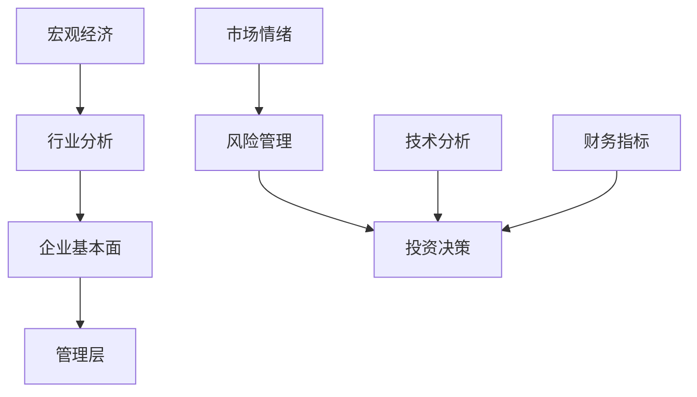
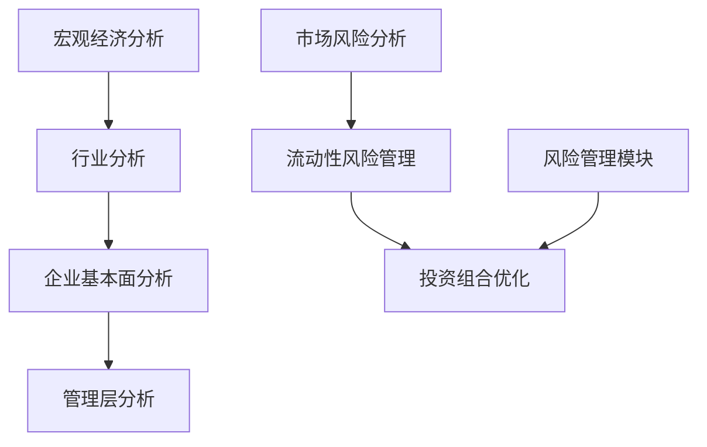

                 

# 巴菲特-芒格的后疫情时代投资策略：适应新常态

## 关键词：巴菲特, 芒格, 投资策略, 后疫情时代, 价值投资, 多元思维模型, 经济新常态

## 摘要：  
在后疫情时代，全球经济面临前所未有的挑战和变革。巴菲特和芒格的投资策略以其独特的价值投资理念和多元思维模型，为我们提供了适应新常态的重要启示。本文将详细分析疫情对全球经济的影响，探讨巴菲特和芒格的投资理念在后疫情时代的演变，构建投资策略的数学模型，并通过实战案例分析和系统设计，为投资者提供优化的投资策略。

---

## 第1章: 后疫情时代的全球经济与投资环境

### 1.1 疫情对全球经济的深远影响

#### 1.1.1 疫情对全球经济的冲击  
疫情的爆发导致全球经济活动几乎停滞，供应链中断，企业利润下降，失业率上升。根据国际货币基金组织（IMF）的数据，2020年全球经济萎缩了约3.3%，为二战以来最严重的衰退。疫情的影响不仅限于经济层面，还深刻改变了人们的消费习惯、工作方式和企业运营模式。

#### 1.1.2 后疫情时代的经济新常态  
后疫情时代，全球经济逐渐复苏，但面临通胀压力、供应链不稳定和地缘政治风险等新的挑战。数字化转型加速，远程办公成为新常态，绿色经济和可持续发展成为全球关注的焦点。

#### 1.1.3 投资者面临的机遇与挑战  
投资者在后疫情时代面临新的机遇，例如数字经济、生物科技和绿色能源等领域。然而，高通胀、利率上升和地缘政治风险也增加了投资的不确定性。投资者需要调整策略，注重风险管理和长期价值。

### 1.2 巴菲特与芒格的投资理念概述

#### 1.2.1 巴菲特的价值投资理论  
巴菲特的价值投资理论强调以合理的价格买入具有强大竞争优势的企业。他关注企业的长期盈利能力、管理团队和财务状况，认为市场短期波动不可预测，但长期趋势由企业内在价值决定。

#### 1.2.2 芒格的多元思维模型  
芒格提倡多元思维模型，即通过多个学科的知识框架来分析问题，避免单一视角的局限性。他认为投资不仅是对企业的分析，更是对人性、市场和经济规律的理解。

#### 1.2.3 两人投资理念的结合与互补  
巴菲特和芒格的投资理念互补性强。巴菲特注重企业基本面分析，芒格注重宏观视角和系统思维。两人共同强调长期投资、风险管理和社会责任。

### 1.3 本章小结  
本章分析了疫情对全球经济的深远影响，探讨了后疫情时代的经济新常态，并介绍了巴菲特和芒格的投资理念及其结合。这些理念为后疫情时代的投资策略提供了理论基础。

---

## 第2章: 巴菲特与芒格的核心投资策略

### 2.1 巴菲特的价值投资策略

#### 2.1.1 企业基本面分析  
巴菲特强调对企业基本面的深入分析，包括盈利能力、财务状况、管理团队和竞争优势。他倾向于投资那些具有持续盈利能力的企业。

#### 2.1.2 安全边际的概念  
安全边际是指企业内在价值与其市场价格之间的差距。巴菲特认为，以低于内在价值的价格买入企业可以降低投资风险。

#### 2.1.3 长期持有的投资哲学  
巴菲特倡导长期投资，避免频繁交易。他认为市场短期波动不可预测，但长期趋势由企业内在价值决定。

### 2.2 芒格的多元思维模型

#### 2.2.1 多元思维模型的定义  
多元思维模型是指通过多个学科的视角分析问题，形成全面的理解。芒格认为，投资不仅是对企业的分析，更是对人性、市场和经济规律的理解。

#### 2.2.2 各个学科的交叉应用  
芒格的多元思维模型包括心理学、经济学、物理学和生物学等多个学科。他通过这些学科的交叉应用，发现投资机会和风险。

#### 2.2.3 思维模型在投资中的具体应用  
芒格通过多元思维模型，分析企业的竞争优势、市场地位和潜在风险。他强调对企业的长期前景和管理层的判断。

### 2.3 两人策略的结合与优化

#### 2.3.1 价值投资与多元思维的结合  
巴菲特的价值投资和芒格的多元思维模型相结合，形成了一种综合性的投资策略。这种策略既注重企业基本面，又注重宏观视角和系统思维。

#### 2.3.2 疫情时代策略的调整  
在疫情时代，巴菲特和芒格调整了投资策略，更加注重企业的财务健康和现金流稳定性。他们倾向于投资那些在经济衰退中表现稳定的行业。

#### 2.3.3 未来投资策略的展望  
未来，巴菲特和芒格的投资策略将更加注重可持续发展和绿色经济。他们将关注那些在技术创新和环保方面具有竞争优势的企业。

### 2.4 本章小结  
本章详细分析了巴菲特的价值投资策略和芒格的多元思维模型，并探讨了两人策略在疫情时代的调整和未来展望。这种策略的结合为投资者提供了全面的投资框架。

---

## 第3章: 投资策略的数学模型与系统分析

### 3.1 投资回报的数学公式

#### 3.1.1 投资回报的计算公式  
投资回报率（ROI）= (最终价值 - 初始投资) / 初始投资 × 100%  
$$ ROI = \frac{(V_f - V_i)}{V_i} \times 100\% $$  

#### 3.1.2 复利计算公式  
复利计算公式为：$$ A = P(1 + r)^n $$  
其中，A是最终金额，P是本金，r是年利率，n是年数。

#### 3.1.3 风险调整后的回报模型  
风险调整后的回报模型考虑了投资的风险。常用的模型是夏普比率：$$ \text{夏普比率} = \frac{E[r - r_f]}{\sigma} $$  
其中，E[r - r_f]是投资回报的超额期望值，σ是投资回报的标准差。

### 3.2 价值投资的量化分析

#### 3.2.1 企业估值的数学模型  
企业价值（EV）= 净收益 + 非经营性资产价值 - 现金净额  
$$ EV = EBIT(1 - t) \times (1 - \delta) $$  
其中，EBIT是息税前利润，t是税率，δ是资本支出率。

#### 3.2.2 股价与内在价值的偏离度分析  
股价与内在价值的偏离度可以用以下公式表示：$$ \text{偏离度} = \frac{\text{股价}}{\text{内在价值}} - 1 $$  

#### 3.2.3 安全边际的量化计算  
安全边际 = 内在价值 - 市场价格  
$$ \text{安全边际} = V_{\text{intrinsic}} - V_{\text{market}} $$  

### 3.3 多元思维模型的系统架构

#### 3.3.1 系统架构图  
以下是多元思维模型的系统架构图：

#### 3.3.2 各个模块的相互关系  
宏观经济和市场情绪影响整体投资环境，行业分析和企业基本面分析是投资决策的基础，技术分析和财务指标是辅助工具，风险管理是投资决策的核心。

#### 3.3.3 系统的动态调整机制  
系统通过实时监控市场变化和企业动态，调整各个模块的权重，优化投资决策。

### 3.4 本章小结  
本章构建了投资策略的数学模型，并通过系统架构图展示了多元思维模型的系统架构。这些模型为投资者提供了量化分析和系统化的投资决策支持。

---

## 第4章: 疫情时代投资策略的实战案例

### 4.1 巴菲特与芒格的经典投资案例

#### 4.1.1 巴菲特投资可口可乐的案例  
巴菲特在2005年买入可口可乐的股票，因为他认为可口可乐具有强大的品牌优势和稳定的现金流。尽管在疫情期间可口可乐的股价一度下跌，但巴菲特长期持有，最终获得丰厚的回报。

#### 4.1.2 芒格投资某公司的案例  
芒格在疫情期间投资某生物科技公司，因为他认为该公司在疫苗研发方面具有竞争优势，并且管理层具备高度的专业性和道德标准。

#### 4.1.3 疫情期间的投资决策分析  
在疫情期间，巴菲特和芒格的投资决策主要集中在具有强大现金流和财务稳定性的企业，避免高风险的投资。

### 4.2 疫情时代投资策略的优化

#### 4.2.1 疫情期间策略的调整  
在疫情期间，巴菲特和芒格调整了投资策略，更加注重企业的财务健康和现金流稳定性。他们倾向于投资那些在经济衰退中表现稳定的行业。

#### 4.2.2 疫情后策略的优化  
疫情后，巴菲特和芒格的投资策略更加注重可持续发展和绿色经济。他们将关注那些在技术创新和环保方面具有竞争优势的企业。

#### 4.2.3 疫情时代策略的总结与展望  
总结疫情时代的投资策略，巴菲特和芒格的成功在于他们对长期价值的坚持和对风险的严格控制。展望未来，他们将继续关注那些具有强大竞争优势和社会责任的企业。

### 4.3 本章小结  
本章通过实战案例分析了巴菲特和芒格在疫情时代的投资策略，总结了他们在疫情期间的投资决策，并展望了未来投资策略的优化方向。

---

## 第5章: 投资策略的系统设计与实现

### 5.1 系统功能设计

#### 5.1.1 投资策略分析模块  
投资策略分析模块包括宏观经济分析、行业分析和企业基本面分析。

#### 5.1.2 企业基本面分析模块  
企业基本面分析模块包括盈利能力分析、财务状况分析和管理层分析。

#### 5.1.3 风险管理模块  
风险管理模块包括市场风险分析、流动性风险管理和投资组合优化。

### 5.2 系统架构图

### 5.3 系统接口设计

#### 5.3.1 各模块接口定义  
- 宏观经济分析模块接口：提供宏观经济数据和趋势分析。
- 行业分析模块接口：提供行业动态和竞争分析。
- 企业基本面分析模块接口：提供企业财务数据和盈利能力分析。

#### 5.3.2 接口之间的数据流设计  
宏观经济分析模块的数据流向行业分析模块，行业分析模块的数据流向企业基本面分析模块，风险管理模块的数据流向投资组合优化模块。

#### 5.3.3 接口的兼容性设计  
系统设计了统一的接口标准，确保各个模块之间的兼容性和可扩展性。

### 5.4 本章小结  
本章设计了投资策略的系统架构，并通过系统架构图展示了各个模块之间的关系。系统接口设计确保了各个模块的数据流和兼容性。

---

## 第6章: 投资策略的数学模型与算法实现

### 6.1 投资回报的数学模型

#### 6.1.1 投资回报的计算公式  
$$ ROI = \frac{(V_f - V_i)}{V_i} \times 100\% $$  

#### 6.1.2 复利计算公式  
$$ A = P(1 + r)^n $$  

#### 6.1.3 风险调整后的回报模型  
$$ \text{夏普比率} = \frac{E[r - r_f]}{\sigma} $$  

### 6.2 价值投资的量化分析

#### 6.2.1 企业估值的数学模型  
$$ EV = EBIT(1 - t) \times (1 - \delta) $$  

#### 6.2.2 股价与内在价值的偏离度分析  
$$ \text{偏离度} = \frac{\text{股价}}{\text{内在价值}} - 1 $$  

#### 6.2.3 安全边际的量化计算  
$$ \text{安全边际} = V_{\text{intrinsic}} - V_{\text{market}} $$  

### 6.3 多元思维模型的系统架构

#### 6.3.1 系统架构图  
以下是多元思维模型的系统架构图：

### 6.4 本章小结  
本章通过数学模型和算法实现，量化了巴菲特和芒格的投资策略。这些模型为投资者提供了科学的投资决策支持。

---

## 作者：AI天才研究院 & 禅与计算机程序设计艺术

---

# 结语

巴菲特和芒格的投资策略在后疫情时代展现出了强大的适应性和前瞻性。通过价值投资和多元思维模型的结合，他们成功地应对了疫情带来的挑战，并为投资者提供了重要的启示。未来，投资者需要更加注重长期价值和风险管理，以适应不断变化的经济环境。

