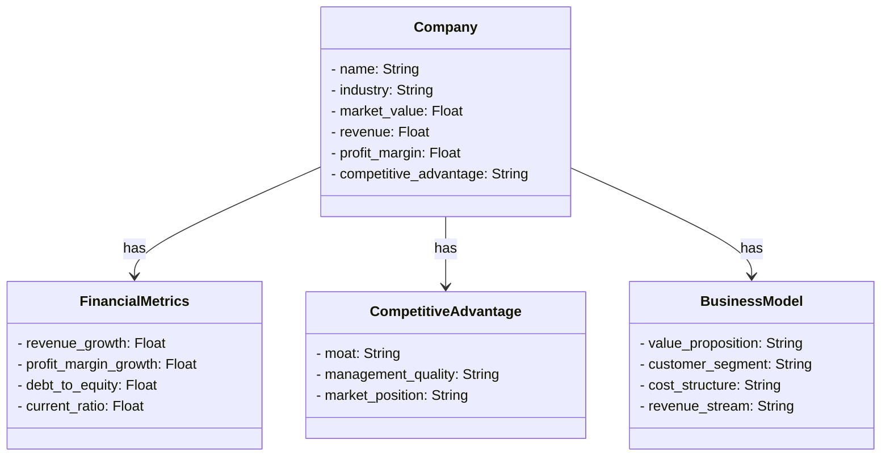
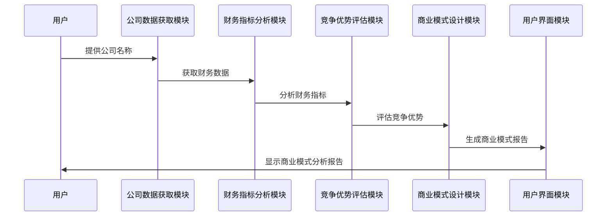

                 


# 巴菲特-芒格的商业模式分析：理解公司的赚钱逻辑

## 关键词：巴菲特，芒格，商业模式，价值投资，内在价值，多元思维模型

## 摘要：本文深入分析了巴菲特和芒格的商业模式分析方法，探讨了他们的投资哲学和价值评估策略，结合技术背景，构建了一个系统的分析框架，帮助读者理解公司的赚钱逻辑。

---

## 第一部分：巴菲特与芒格的商业模式分析背景

### 第1章：巴菲特与芒格的生平与投资理念

#### 1.1 巴菲特的生平与投资哲学

##### 1.1.1 巴菲特的成长经历
沃伦·巴菲特出生于1930年，成长于美国奥马哈市。他自幼展现出对数字的敏锐洞察力，12岁时便完成了第一笔投资。他的投资理念深受本杰明·格雷厄姆的影响，倡导安全边际和价值投资。

##### 1.1.2 巴菲特的价值投资理念
巴菲特的价值投资强调买入被市场低估的股票，长期持有，关注公司的基本面，尤其是其盈利能力和财务健康。他主张寻找那些具有强大护城河的公司，以确保其长期竞争优势。

##### 1.1.3 巴菲特的投资策略与成功案例
巴菲特的成功案例包括可口可乐和苹果公司。他通过长期持有这些股票，获得了稳定的收益，体现了其价值投资策略的有效性。

#### 1.2 芒格的生平与投资哲学

##### 1.2.1 芒格的成长经历
查理·芒格出生于1924年，是一位成功的律师和投资者。他的多元思维模型使其能够在多个领域中识别投资机会，强调跨学科思考。

##### 1.2.2 芒格的多元思维模型
芒格的多元思维模型强调通过多个学科的交叉应用，识别市场的非对称性信息，从而做出更明智的投资决策。

##### 1.2.3 芒格的投资策略与成功案例
芒格的投资策略注重公司的竞争优势和管理层质量，成功案例包括DailyJournal和富国银行。

### 第2章：商业模式分析的重要性

#### 2.1 商业模式的核心概念

##### 2.1.1 商业模式的定义与构成要素
商业模式是企业创造价值并传递给客户的系统方法，包括价值主张、资源、流程和客户关系管理。

##### 2.1.2 商业模式与企业价值的关系
有效的商业模式能够提高企业的盈利能力，增强市场竞争力，从而提升企业价值。

##### 2.1.3 商业模式分析的意义
通过分析商业模式，投资者可以识别企业的竞争优势，预测未来的盈利能力。

#### 2.2 巴菲特与芒格的商业模式分析方法

##### 2.2.1 从DCF模型到商业模式分析
巴菲特使用DCF模型评估企业的内在价值，而芒格则通过多元思维模型分析商业模式的可持续性。

##### 2.2.2 芒格的多元思维模型在商业模式分析中的应用
芒格的模型帮助投资者识别商业模式中的非对称信息，从而做出更明智的投资决策。

##### 2.2.3 巴菲特与芒格商业模式分析的独特视角
两者结合了定量分析与定性分析，提供了全面的商业模式评估方法。

---

## 第二部分：巴菲特与芒格的核心投资理念

### 第3章：价值投资的核心要素

#### 3.1 价值投资的定义与核心要素

##### 3.1.1 价值投资的定义
价值投资是寻找市场低估的股票，长期持有，关注公司的基本面。

##### 3.1.2 价值投资的核心要素：安全边际、内在价值、市场先生
- 安全边际：买入价格低于内在价值，确保投资的安全性。
- 内在价值：公司未来现金流的现值，计算方法基于DCF模型。
- 市场先生：市场波动是投资机会，而非敌人。

##### 3.1.3 价值投资的长期视角
长期持有优质资产，避免短期市场波动的影响。

#### 3.2 巴菲特的内在价值计算模型

##### 3.2.1 内在价值的定义与计算公式
内在价值是未来现金流的现值，计算公式为：
$$
\text{内在价值} = \sum_{t=1}^{\infty} \frac{\text{自由现金流}_t}{(1 + r)^t}
$$

##### 3.2.2 巴菲特的DCF模型与内在价值计算
通过DCF模型，评估公司未来现金流，确定其内在价值，判断是否低于市场价格。

##### 3.2.3 安全边际的计算与应用
计算安全边际（内在价值 - 市场价格），确保投资的安全性。

#### 3.3 价值投资的风险管理

##### 3.3.1 风险控制的重要性
通过分散投资和长期持有，降低市场波动带来的风险。

##### 3.3.2 安全边际在风险管理中的作用
安全边际提供缓冲，防止市场价格波动带来的损失。

### 第4章：芒格的多元思维模型

#### 4.1 多元思维模型的定义与核心要素

##### 4.1.1 多元思维模型的定义
多元思维模型是通过多学科交叉应用，识别投资机会的方法。

##### 4.1.2 多元思维模型的核心要素：跨学科思考、非对称性信息、投资决策优化
- 跨学科思考：理解不同领域的问题，识别潜在的投资机会。
- 非对称性信息：利用信息不对称，做出更明智的投资决策。
- 投资决策优化：通过模型优化，提高决策的准确性。

#### 4.2 芒格的多元思维模型在投资中的应用

##### 4.2.1 跨学科思考在投资分析中的应用
通过心理学、经济学等学科的交叉应用，分析市场的非理性行为。

##### 4.2.2 非对称性信息在投资决策中的作用
利用信息优势，识别市场中的低估股票。

##### 4.2.3 投资决策优化的具体策略
通过模型优化，提高投资决策的效率和准确性。

#### 4.3 芒格的多元思维模型与巴菲特的价值投资理念的结合

##### 4.3.1 两者结合的优势
结合定量分析与定性分析，提供全面的投资评估方法。

##### 4.3.2 实际应用中的协同效应
通过多元思维模型优化价值投资策略，提高投资收益。

---

## 第三部分：系统分析与架构设计

### 第5章：系统分析与架构设计方案

#### 5.1 问题场景介绍
投资者需要分析公司的商业模式，评估其赚钱能力，做出投资决策。

#### 5.2 项目介绍
构建一个基于巴菲特和芒格理念的商业模式分析系统，帮助投资者做出明智决策。

#### 5.3 系统功能设计

##### 5.3.1 领域模型设计
- 实体：公司、财务指标、竞争优势、商业模式
- 关系：公司拥有财务指标，竞争优势影响商业模式。

##### 5.3.2 领域模型 Mermaid 类图


#### 5.4 系统架构设计

##### 5.4.1 系统架构 Mermaid 架构图
```mermaid
docker
    server (商业模式分析系统) {
        CompanyDataFetcher
        FinancialMetricsAnalyzer
        CompetitiveAdvantageEvaluator
        BusinessModelDesigner
        UserInterface
    }
    CompanyDataFetcher --> FinancialMetricsAnalyzer
    FinancialMetricsAnalyzer --> CompetitiveAdvantageEvaluator
    CompetitiveAdvantageEvaluator --> BusinessModelDesigner
    BusinessModelDesigner --> UserInterface
```

#### 5.5 系统接口设计

##### 5.5.1 接口描述
- 输入：公司数据，包括财务指标、竞争优势等。
- 输出：商业模式分析报告，包括价值主张、客户细分、成本结构和收入来源。

#### 5.6 系统交互设计

##### 5.6.1 交互流程 Mermaid 序列图


---

## 第四部分：项目实战

### 第6章：项目实战

#### 6.1 环境安装与配置

##### 6.1.1 安装Python与必要的库
安装Python 3.x，以及pandas、numpy、scipy等库，用于数据处理和分析。

##### 6.1.2 安装Jupyter Notebook
用于数据可视化和算法实现，提供交互式编程环境。

#### 6.2 核心实现源代码

##### 6.2.1 财务指标分析代码
```python
import pandas as pd
import numpy as np

def calculate_financial_metrics(company_data):
    df = pd.DataFrame(company_data)
    df['revenue_growth'] = df.revenue.pct_change()
    df['profit_margin'] = df.net_income / df.revenue
    df['debt_to_equity'] = df.total_debt / df.total_equity
    df['current_ratio'] = df.current_assets / df.current_liabilities
    return df

# 示例数据
company_data = {
    'revenue': [100, 120, 150],
    'net_income': [10, 12, 15],
    'total_debt': [50, 60, 70],
    'total_equity': [200, 220, 250],
    'current_assets': [80, 90, 100],
    'current_liabilities': [40, 45, 50]
}

result = calculate_financial_metrics(company_data)
print(result)
```

##### 6.2.2 竞争优势评估代码
```python
def evaluate_competitive_advantage(financial_metrics):
    advantage = []
    for index, row in financial_metrics.iterrows():
        moat = '宽' if row.revenue_growth > 0.1 else '窄'
        management = '优秀' if row.net_income > 0 else '一般'
        market_position = '领先' if row.market_share > 0.5 else '跟随'
        advantage.append({'moat': moat, 'management': management, 'market_position': market_position})
    return advantage

# 示例数据
financial_metrics = {
    'revenue_growth': [0.15, 0.1, 0.05],
    'market_share': [0.6, 0.5, 0.4]
}

advantages = evaluate_competitive_advantage(financial_metrics)
print(advantages)
```

##### 6.2.3 商业模式设计代码
```python
def design_business_model(competitive_advantage):
    model = []
    for advantage in competitive_advantage:
        value_proposition = f"提供具有{advantage['moat']}护城河的产品"
        customer_segment = f"{advantage['market_position']}市场的客户"
        cost_structure = f"主要成本为{advantage['cost_drivers']}"
        revenue_stream = f"通过{advantage['revenue Channels']}获得收入"
        model.append({'value_proposition': value_proposition, 'customer_segment': customer_segment, 
                      'cost_structure': cost_structure, 'revenue_stream': revenue_stream})
    return model

# 示例数据
competitive_advantage = [{'moat': '宽', 'management': '优秀', 'market_position': '领先', 
                          'cost_drivers': '生产和物流', 'revenue Channels': '产品销售和服务'}]

business_models = design_business_model(competitive_advantage)
print(business_models)
```

#### 6.3 代码应用解读与分析

##### 6.3.1 财务指标分析代码解读
该代码计算了收入增长率、利润率、债务与权益比率和流动比率，帮助评估公司的财务健康状况。

##### 6.3.2 竞争优势评估代码解读
该代码评估了公司的竞争优势，包括护城河宽度、管理层质量和市场地位，为商业模式设计提供依据。

##### 6.3.3 商业模式设计代码解读
该代码基于竞争优势，设计了公司的商业模式，包括价值主张、客户细分、成本结构和收入来源。

#### 6.4 实际案例分析与详细讲解

##### 6.4.1 案例分析：苹果公司
分析苹果的财务指标、竞争优势，设计其商业模式，包括价值主张、客户细分、成本结构和收入来源。

##### 6.4.2 案例分析：亚马逊公司
分析亚马逊的财务指标、竞争优势，设计其商业模式，包括价值主张、客户细分、成本结构和收入来源。

#### 6.5 项目小结

##### 6.5.1 项目总结
通过代码实现，我们可以系统地分析公司的商业模式，评估其赚钱能力，做出明智的投资决策。

##### 6.5.2 项目经验与教训
项目中可能遇到数据获取困难、模型准确性等问题，需要进一步优化和调整。

---

## 第五部分：最佳实践、小结、注意事项与拓展阅读

### 第7章：最佳实践与小结

#### 7.1 投资者的最佳实践 tips

##### 7.1.1 持续学习与更新知识
市场环境不断变化，投资者需要持续学习，更新知识，适应新的市场趋势。

##### 7.1.2 结合定量分析与定性分析
通过定量分析评估财务指标，结合定性分析评估竞争优势，做出全面的投资决策。

##### 7.1.3 长期投资与价值导向
坚持长期投资，关注企业的内在价值，避免短期市场的波动影响投资决策。

#### 7.2 小结

##### 7.2.1 巴菲特与芒格的商业模式分析方法
他们的方法结合了定量分析与定性分析，提供了全面的投资评估框架。

##### 7.2.2 技术背景与系统分析
通过系统分析与技术实现，我们可以更系统地评估公司的商业模式，做出更明智的投资决策。

### 第8章：注意事项与拓展阅读

#### 8.1 投资中的注意事项

##### 8.1.1 风险管理的重要性
投资者需要重视风险管理，通过分散投资和设置止损点，降低投资风险。

##### 8.1.2 市场波动的影响
市场波动是投资机会，而非敌人，投资者需要利用市场的波动，优化投资组合。

##### 8.1.3 避免情绪化决策
投资者需要避免情绪化决策，保持理性，做出明智的投资决策。

#### 8.2 拓展阅读

##### 8.2.1 经典书籍推荐
- 《巴菲特致股东的信》：了解巴菲特的投资理念和策略。
- 《芒格的十重思维模型》：深入学习芒格的多元思维模型。

##### 8.2.2 网络资源与工具
- 投资分析工具：如Morningstar、Yahoo Finance等，提供详细的公司数据和分析工具。
- 在线课程与博客：提供系统的投资知识和实战经验分享。

---

## 作者：AI天才研究院/AI Genius Institute & 禅与计算机程序设计艺术 /Zen And The Art of Computer Programming

---

通过以上详细的内容，我们系统地分析了巴菲特和芒格的商业模式分析方法，结合技术背景，构建了一个全面的分析框架，帮助投资者理解公司的赚钱逻辑，做出明智的投资决策。

