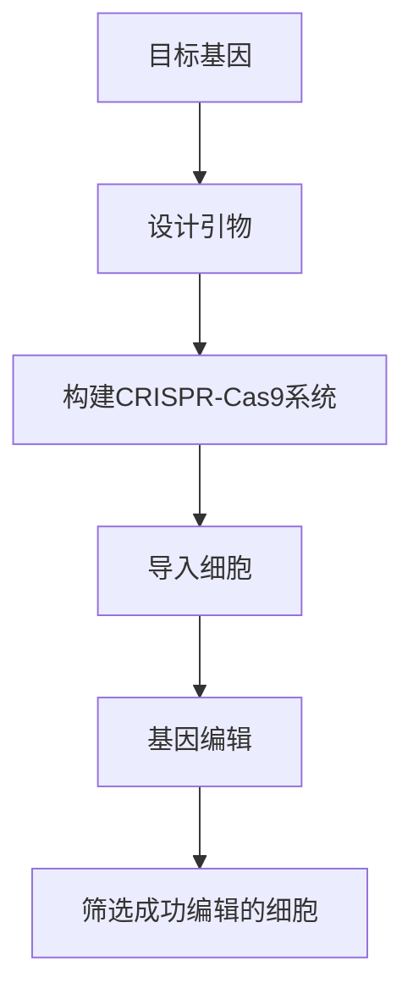

                 

# 巴菲特-芒格的基因编辑技术投资：伦理与收益的平衡

> **关键词**：巴菲特、芒格、基因编辑技术、投资策略、伦理平衡、收益分析、风险管理  
>
> **摘要**：本文探讨了巴菲特和芒格在基因编辑技术投资中的伦理与收益平衡问题。通过分析基因编辑技术的核心原理、行业发展现状、伦理争议以及投资收益预测，结合巴菲特和芒格的投资理念，提出了在技术快速发展的背景下，如何在追求投资收益的同时，兼顾伦理和社会责任的策略。文章还结合实际案例，分析了基因编辑技术的投资机会和风险管理方法，为投资者提供了有益的参考。

---

## 第一部分: 基因编辑技术的基本概念

### 第1章: 基因编辑技术的定义与原理

#### 1.1 基因编辑技术的定义与原理

基因编辑技术是一种通过人工干预，精准修改生物体基因组的技术。其核心原理是利用特定的酶（如CRISPR-Cas9系统）或化学物质，将目标基因的特定序列进行剪切、插入或替换。基因编辑技术广泛应用于医学、农业和工业等领域，具有革命性的潜力。

图1：基因编辑技术的基本流程  

基因编辑技术的关键要素包括：
- **目标基因**：需要编辑的特定基因。
- **编辑工具**：如CRISPR-Cas9系统。
- **宿主细胞**：进行基因编辑的细胞或生物体。
- **筛选与验证**：确保编辑成功的细胞或生物体被筛选出来。

#### 1.2 巴菲特与芒格的投资理念

巴菲特和芒格的投资理念以“价值投资”为核心，强调长期投资、安全边际和企业基本面分析。芒格的“多元思维模型”则强调跨学科思考，关注技术、经济、法律和伦理等多方面的因素。

**巴菲特的价值投资理论**  
巴菲特认为，投资的本质是寻找具有持续竞争优势的企业，关注企业的内在价值，而非短期市场波动。他注重企业的财务健康、管理团队和行业地位。

**芒格的多元思维模型**  
芒格强调将多个学科的原理交叉应用于投资决策中，尤其是在面对新兴技术领域时，芒格的多元思维模型帮助他更好地理解技术的潜力和风险。

**巴菲特与芒格投资风格的异同**  
巴菲特更倾向于寻找具有稳定现金流和高ROE的企业，而芒格则更关注企业的长期创新潜力和技术壁垒。两者的共同点在于，他们都强调长期投资和对企业基本面的深入分析。

---

### 第2章: 基因编辑技术的投资背景

#### 2.1 基因编辑技术的市场现状与未来趋势

基因编辑技术目前处于快速发展阶段，尤其是在医学领域，基因编辑技术已被用于治疗遗传性疾病和癌症。农业领域，基因编辑技术也被广泛用于改良作物品种。然而，基因编辑技术的市场仍存在较大的不确定性，主要来自技术本身的成熟度和政策监管。

图2：基因编辑技术的应用领域  

#### 2.2 巴菲特与芒格投资基因编辑技术的动机

巴菲特和芒格投资基因编辑技术的动机主要基于以下几点：
- **技术的长期潜力**：基因编辑技术在医学和农业领域的应用前景广阔。
- **企业的竞争优势**：基因编辑技术可以帮助企业开发出具有差异化的产品。
- **政策与伦理的平衡**：巴菲特和芒格关注基因编辑技术的政策风险和伦理问题，试图通过投资推动技术的合规发展。

---

## 第二部分: 基因编辑技术的伦理与收益平衡

### 第3章: 基因编辑技术的伦理问题

#### 3.1 基因编辑技术的伦理争议

基因编辑技术的伦理争议主要集中在以下几个方面：
- **人类基因编辑的伦理问题**：基因编辑技术可能导致人类基因的“设计婴儿”，引发伦理争议。
- **动物基因编辑的伦理问题**：基因编辑技术在动物实验中可能引发动物福利问题。
- **植物基因编辑的伦理问题**：基因编辑技术在农业中的应用可能引发生态风险。

#### 3.2 巴菲特与芒格对伦理问题的看法

- **巴菲特对伦理问题的重视**  
  巴菲特认为，企业在追求利润的同时，必须关注社会责任。他反对那些忽视伦理和道德的短期行为。

- **芒格对伦理问题的思考**  
  芒格强调，技术的发展必须以人类的整体利益为出发点，基因编辑技术的伦理问题需要得到充分的重视。

- **巴菲特与芒格的伦理平衡**  
  巴菲特和芒格在投资基因编辑技术时，注重技术的合规性和社会接受度，试图在追求收益的同时，避免引发伦理争议。

---

### 第4章: 基因编辑技术的收益分析

#### 4.1 基因编辑技术的经济效益

基因编辑技术的经济效益主要体现在以下几个方面：
- **医疗领域**：基因编辑技术可以用于治疗遗传性疾病和癌症，带来巨大的医疗价值。
- **农业领域**：基因编辑技术可以用于改良作物品种，提高产量和抗病能力。
- **工业领域**：基因编辑技术可以用于生产高附加值的工业产品。

#### 4.2 巴菲特与芒格的投资收益预测

- **巴菲特对收益的判断**  
  巴菲特认为，基因编辑技术在医疗领域的应用潜力巨大，但需要长期的技术积累和政策支持。

- **芒格对收益的预测**  
  芒格预测，基因编辑技术在农业和工业领域的应用将推动企业的长期收益。

---

## 第三部分: 基因编辑技术的投资策略与风险管理

### 第5章: 基因编辑技术的投资策略

#### 5.1 巴菲特与芒格的投资策略

- **巴菲特的价值投资策略**  
  巴菲特注重企业的基本面分析，寻找具有持续竞争优势的企业。

- **芒格的多元思维模型**  
  芒格关注技术的长期潜力和企业的创新能力。

- **策略的结合**  
  巴菲特和芒格在投资基因编辑技术时，结合了价值投资和多元思维模型，注重技术的长期潜力和企业的竞争优势。

### 第6章: 基因编辑技术的风险管理

#### 6.1 基因编辑技术的主要风险

- **技术风险**  
  基因编辑技术的不成熟可能导致投资失败。

- **市场风险**  
  基因编辑技术的市场需求可能低于预期。

- **政策风险**  
  基因编辑技术的政策监管可能对企业的发展产生重大影响。

#### 6.2 巴菲特与芒格的风险管理策略

- **巴菲特的风险管理策略**  
  巴菲特注重分散投资，降低单一技术的风险。

- **芒格的风险管理策略**  
  芒格关注技术的合规性和政策风险，避免投资于存在重大政策风险的领域。

---

## 第四部分: 总结与展望

### 结论

巴菲特和芒格在基因编辑技术投资中，注重技术的长期潜力和企业的竞争优势，同时也关注技术的伦理问题和社会责任。他们通过价值投资和多元思维模型，平衡了技术的收益与风险。

### 未来展望

随着基因编辑技术的不断发展，其在医疗、农业和工业领域的应用潜力将逐步释放。投资者需要在追求收益的同时，关注技术的伦理问题和社会责任，避免因技术滥用引发的重大风险。

---

## 作者信息

作者：AI天才研究院/AI Genius Institute & 禅与计算机程序设计艺术 /Zen And The Art of Computer Programming

